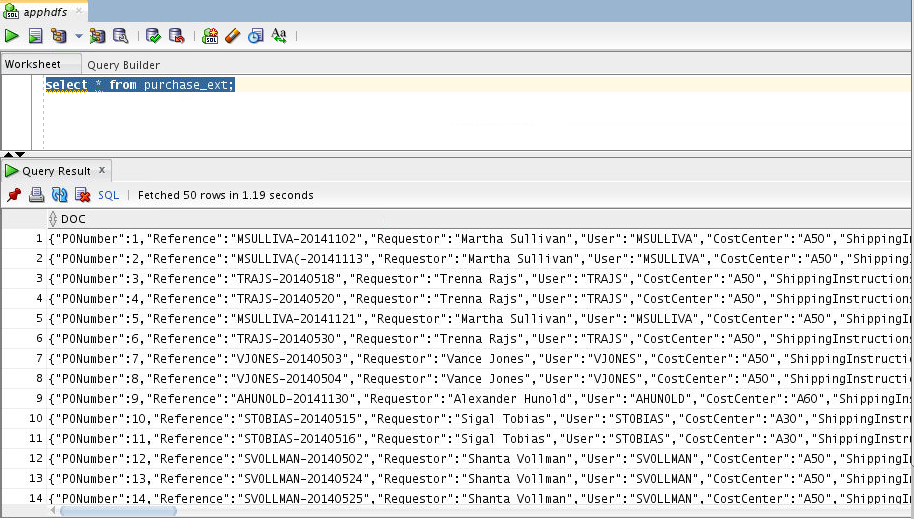

# Oracle BigDataSQL-HIVE

## Introduction

We have already placed the dump files in the Hadoop file system for creating hive external tables. Please run below commands for listing the dump files in Hadoop file system.
````
<copy>
hdfs dfs -ls /data/customer/dump/
hdfs dfs -ls /data/orders
hdfs dfs -ls /data/stores
hdfs dfs -ls /data/products
hdfs dfs -ls /data/order_items
hive
</copy>
````
You can leverage Hive metadata when creating your Oracle Big Data SQL external tables.

To enable Oracle Big Data SQL to query Hive data, you must first define an Oracle external table for your Hive data. There are several tools available to help you create the Oracle external table definition. These tools leverage the underlying hive metadata, making it easier to create the tables.

The external table provides a level of abstraction. The underlying partitions or file type may change, but the Oracle external table definition can remain the same. It automatically picks up these changes when you query the table.
As part of an external table definition, you specify the table columns and their data types as well as a pointer to the source table in Hive. The rest of the metadata is derived at query execution time, including the data location, the file type and partitioning information.

## Step 1: Enter a title

1. Use Retail 
   
    ````
    <copy>
    use retail;
    </copy>
    ````
2. Create external table customers ext hive 
    ````
    <copy>
    CREATE EXTERNAL TABLE customers_ext_hive
      ROW FORMAT SERDE 'oracle.hadoop.hive.datapump.DPSerDe'
      STORED AS
          INPUTFORMAT  'oracle.hadoop.hive.datapump.DPInputFormat'
          OUTPUTFORMAT 'org.apache.hadoop.hive.ql.io.HiveIgnoreKeyTextOutputFormat'
      LOCATION '/data/customer/dump';
    </copy>
    ````
    

3. Create external table orders ext hive
   
    ````
    <copy>
    CREATE EXTERNAL TABLE orders_ext_hive
      ROW FORMAT SERDE 'oracle.hadoop.hive.datapump.DPSerDe'
      STORED AS
          INPUTFORMAT  'oracle.hadoop.hive.datapump.DPInputFormat'
          OUTPUTFORMAT 'org.apache.hadoop.hive.ql.io.HiveIgnoreKeyTextOutputFormat'
      LOCATION '/data/orders';
    </copy>
    ````
4. Create external table stored ext hive
   
    ````
    <copy>
    CREATE EXTERNAL TABLE stores_ext_hive
      ROW FORMAT SERDE 'oracle.hadoop.hive.datapump.DPSerDe'
      STORED AS
          INPUTFORMAT  'oracle.hadoop.hive.datapump.DPInputFormat'
          OUTPUTFORMAT 'org.apache.hadoop.hive.ql.io.HiveIgnoreKeyTextOutputFormat'
      LOCATION '/data/stores';
    </copy>
    ````
5. Create external table products ext hive
   
    ````
    <copy>
    CREATE EXTERNAL TABLE products_ext_hive
      ROW FORMAT SERDE 'oracle.hadoop.hive.datapump.DPSerDe'
      STORED AS
          INPUTFORMAT  'oracle.hadoop.hive.datapump.DPInputFormat'
          OUTPUTFORMAT 'org.apache.hadoop.hive.ql.io.HiveIgnoreKeyTextOutputFormat'
      LOCATION '/data/products';
    </copy>
    ````

6. Create external table orders item ext hive
   
    ````
    <copy>
    CREATE EXTERNAL TABLE order_items_ext_hive
      ROW FORMAT SERDE 'oracle.hadoop.hive.datapump.DPSerDe'
      STORED AS
          INPUTFORMAT  'oracle.hadoop.hive.datapump.DPInputFormat'
          OUTPUTFORMAT 'org.apache.hadoop.hive.ql.io.HiveIgnoreKeyTextOutputFormat'
      LOCATION '/data/order_items';
    </copy>
    ````
7. List customers where name=Victor Morris
   
    ````
    <copy>
    select * from customers_ext_hive where FULL_NAME='Victor Morris';
    </copy>
    ````
8. List orders
   
    ````
    <copy>
    select * from orders_ext_hive;
    </copy>
    ````
    


## Step 2: Using ORACLE_HIVE driver

The ACCESS PARAMETERS clause provides information that the access driver needs to load the data correctly into the external table.

1. Connect to database as the apphdfs user
   
    ````
    <copy>
    . oraenv
    </copy>
    ````
    ````
    <copy>
    sqlplus apphdfs/apphdfs@orclpdb
    </copy>
    ````
2. Create table 
   
    ````
    <copy>
    CREATE TABLE apphdfs.customer_hive_ext 
    (
      CUSTOMER_ID number,
      EMAIL_ADDRESS VARCHAR2(255 CHAR),
      FULL_NAME VARCHAR2(255 CHAR)
    )  
      ORGANIZATION EXTERNAL 
        ( TYPE ORACLE_HIVE
          DEFAULT DIRECTORY DEFAULT_DIR
          ACCESS PARAMETERS
          (     
            com.oracle.bigdata.tablename = retail.customers_ext_hive
          )
        );
    </copy>
    ````
3. List from table where name is Zavert Zimmer 
   
    ````
    <copy>
    Select * from customer_hive_ext where FULL_NAME=’Zavert Zimmer’;
    </copy>
    ````
    

4. Create product ext table 
   
    ````
    <copy>
    CREATE TABLE apphdfs.products_ext_hive
    (
      PRODUCT_ID NUMBER(38),
    PRODUCT_NAME VARCHAR2(255 CHAR),
    UNIT_PRICE NUMBER(10,2),
    PRODUCT_DETAILS BLOB,
    PRODUCT_IMAGE BLOB,
    IMAGE_MIME_TYPE VARCHAR2(512 CHAR),
    IMAGE_FILENAME VARCHAR2(512 CHAR),
    IMAGE_CHARSET VARCHAR2(512 CHAR),
    IMAGE_LAST_UPDATED DATE
    )
      ORGANIZATION EXTERNAL
        ( TYPE ORACLE_HIVE
          DEFAULT DIRECTORY DEFAULT_DIR
          ACCESS PARAMETERS
          (
            com.oracle.bigdata.tablename = retail.products_ext_hive
          )
        );
    </copy>
    ````
5. Create stores ext table 
   
    ````
    <copy>
    CREATE TABLE apphdfs.stores_ext_hive
    (
    STORE_ID NUMBER(38),
    STORE_NAME VARCHAR2(255 CHAR),
    WEB_ADDRESS VARCHAR2(100 CHAR),
    PHYSICAL_ADDRESS VARCHAR2(512 CHAR),
    LATITUDE NUMBER,
    LONGITUDE NUMBER,
    LOGO BLOB,
    LOGO_MIME_TYPE VARCHAR2(512 CHAR),
    LOGO_FILENAME VARCHAR2(512 CHAR),
    LOGO_CHARSET VARCHAR2(512 CHAR),
    LOGO_LAST_UPDATED DATE
    )
      ORGANIZATION EXTERNAL
        ( TYPE ORACLE_HIVE
          DEFAULT DIRECTORY DEFAULT_DIR
          ACCESS PARAMETERS
          (
            com.oracle.bigdata.tablename = retail.stores_ext_hive
          )
        );
    </copy>
    ````
6. Create orders ext table 
   
    ````
    <copy>
    CREATE TABLE apphdfs.orders_ext_hive
    (
    ORDER_ID NUMBER(38),
      2  ORDER_DATETIME TIMESTAMP(6),
    CUSTOMER_ID NUMBER(38),
    ORDER_STATUS VARCHAR2(10 CHAR),
    STORE_ID NUMBER(38)
      )
      ORGANIZATION EXTERNAL
          ( TYPE ORACLE_HIVE
          DEFAULT DIRECTORY DEFAULT_DIR
            ACCESS PARAMETERS
            (
            com.oracle.bigdata.tablename = retail.orders_ext_hive
          )
        );
    </copy>
    ````

This is the end of the lab.

## Acknowledgements

- **Authors/Contributors** - Enter author  name
- **Last Updated By/Date** - Kay Malcolm, Director, Database Product Management, May 2020

### Issues?
Please submit an issue on our [issues](https://github.com/oracle/learning-library/issues) page. We review it regularly.