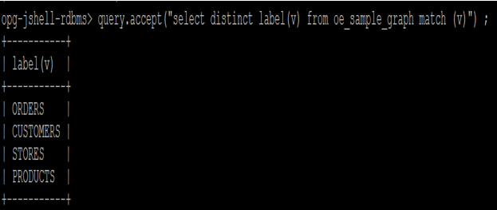
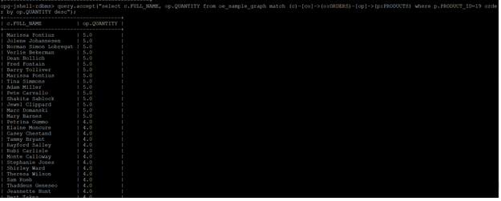

# Oracle Graph 

## Introduction

The [pgql-lang.org](pgql-lang.org) site and specification [pgql-land.org/spec/1.2](pgql-land.org/spec/1.2) are the best reference for details and examples. For the purposes of this lab, however, here are minimal basics. 

The general structure of a PGQL query is

SELECT (select list) FROM (graph name) MATCH (graph pattern) WHERE (condition)


PGQL provides a specific construct known as the MATCH clause for matching graph patterns. A graph pattern matches vertices and edges that satisfy the given conditions and constraints. 
() indicates a vertex variable

  -an undirected edge, as in (source)-(dest)

-> an outgoing edge from source to destination

<- an incoming edge from destination to source

[]  indicates an edge variable


## Before You Begin

This lab assumes you have completed the following labs:
- Lab 1:  Login to Oracle Cloud
- Lab 2:  Generate SSH Key
- Lab 3:  Create Compute instance 
- Lab 4:  Environment setup


## Step 1: Querying graph using PGQL

Below are some of the examples where we can query against the graph we created using PGQL:

1. Find the edge labels. We used labels here to tag an edge with a relationship type

````
<copy>
query.accept("select distinct label(e) from oe_sample_graph match ()-[e]->(m)");
</copy>
````

 

2. Finding vertex label using PGQL
Find the vertex labels. We used labels here to tag a vertex as an entity type.
````
<copy>
query.accept("select distinct label(v) from oe_sample_graph match (v)") ;
</copy>
````
 

## Step-2: Examples about customers and their orders using PGQL
Lets look at some of the examples about customers and their orders. 

**Scenario 1 : Getting count from customer table**

````
<copy>
query.accept("select count(v) from oe_sample_graph match (v:CUSTOMERS)");
</copy>
````

 


**Scenario 2 : Identifying the store using PGQL**

 ````
 <copy>
 query.accept("select s.STORE_NAME from oe_sample_graph match (c:CUSTOMERS)->(o:ORDERS)->(s:STORES) where c.CUSTOMER_ID=202");
 </copy>
 ````
  
 


**Scenario 3 : Identifying customer's purchases using PGQL**

````
<copy>
query.accept(
"select o.ORDER_STATUS, op.QUANTITY, p.UNIT_PRICE, p.PRODUCT_NAME from oe_sample_graph match (c)-[co]->(o:ORDERS)-[op]->(p:PRODUCTS) where c.FULL_NAME='Dale Hughes'");
</copy>
````
 


**Scenario 4 : What did people buy from the Online Store. Return first 50 results.**

 ````
 <copy>
 query.accept(
"select c.FULL_NAME, p.PRODUCT_NAME from oe_sample_graph match (o)-[os:ORDERED_FROM_STORE]->(s:STORES),(c)-[co]->(o:ORDERS)-[op]->(p:PRODUCTS) where s.STORE_ID=1 limit 50");
 </copy>
 ````
  
 


**Scenario 5 : Who bought how much of product  with id 19**

````
<copy>
query.accept("select c.FULL_NAME, op.QUANTITY from oe_sample_graph match (c)-[co]->(o:ORDERS)-[op]->(p:PRODUCTS) where p.PRODUCT_ID=19 order by op.QUANTITY desc");
</copy>
````
 



**Scenario 6 : Which customers bought products that customer 202 bought? Return the first 10 results  that had the most products in common with 202**

````
<copy>
var qStr = 
"select c1.FULL_NAME " + 
"FROM oe_sample_graph " + 
"MATCH (c:CUSTOMERS)->(:ORDERS)-[:ORDER_HAS_PRODUCT]->(p:PRODUCTS)," +
"(c1:CUSTOMERS)->(:ORDERS)-[:ORDER_HAS_PRODUCT]->(p:PRODUCTS) " +
"WHERE c.CUSTOMER_ID=202 " + 
"AND c.CUSTOMER_ID <> c1.CUSTOMER_ID " +
"GROUP BY c1 " + 
"ORDER BY count(DISTINCT p) DESC " + 
"LIMIT 10";

query.accept(qStr);
</copy>
````
 


- Note : All of the above 5  queries are run against the database tables. Let’s load the graph into memory and perform that same set of PGQL queries against the in-memory graph.

## Acknowledgements
- **Authors** - Balasubramanian Ramamoorthy, Arvind Bhope
- **Contributors** - Laxmi Amarappanavar, Kanika Sharma, Venkata Bandaru, Ashish Kumar, Priya Dhuriya, Maniselvan K.
- **Team** - North America Database Specialists
- **Last Updated By** - Kay Malcolm, Director, Database Product Management, June 2020
- **Expiration Date** - June 2021

**Issues-**
Please submit an issue on our [issues](https://github.com/oracle/learning-library/issues) page. We review it regularly.