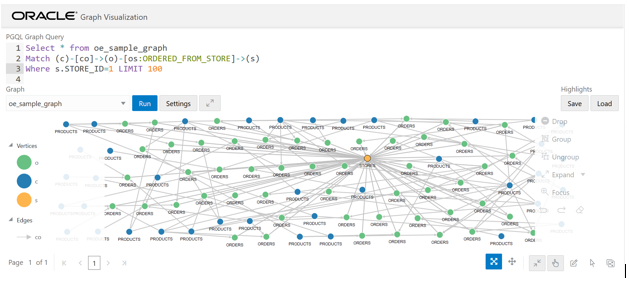
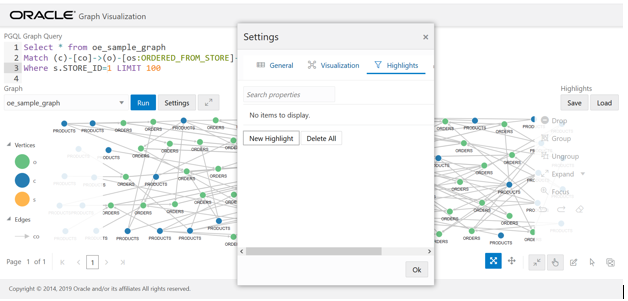
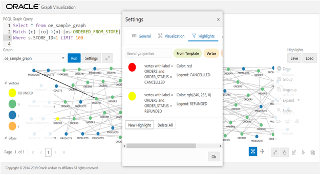
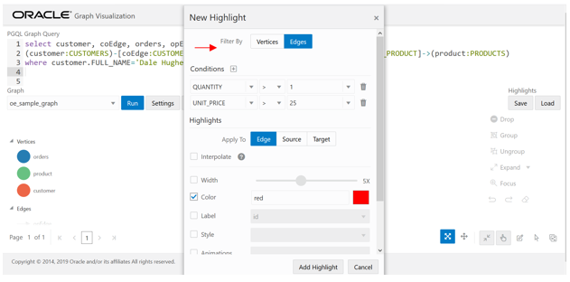
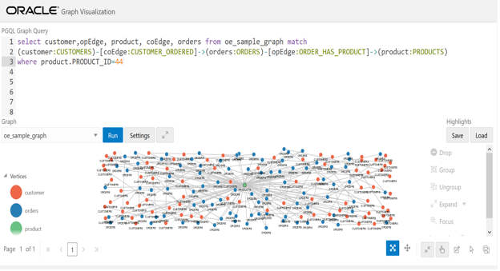

# Oracle Graph 

## Introduction

This lab will use the Graph Visualization component to run some PGQL queries and visualize the results as a graph instead of a tabular result.

GraphViz should be accessible at http://<\instance\_ip\_address>:7007/ui

The principal points of entry for the GraphViz application are the query editor and the graph lists.
When you start GraphViz, the graph list will be populated with the graphs loaded in the graph server. To run queries against a graph, select that graph. The query lets you write PGQL queries that can be visualized. (PGQL is the SQL-like query language supported by GraphViz.)


## Before You Begin

This lab assumes you have completed the following labs:
- Lab 1:  Login to Oracle Cloud
- Lab 2:  Generate SSH Key
- Lab 3:  Create Compute instance 
- Lab 4:  Environment setup
  
## **Step 1:** Visualize the Graph

**Scenario 1 : What products did customer 202 buy from which store(s)?**

````
<copy>
select * from oe_sample_graph 
match (c:CUSTOMERS)-[co]->(o:ORDERS)-[os]->(s:STORES), (o:ORDERS)-[e:ORDER_HAS_PRODUCT]->(p:PRODUCTS) 
where c.CUSTOMER_ID=202;
</copy>
````
 


**Add some labels to the vertices**

Click on Settings -> Then choose the Visualization tab 


Select label as the vertex label and then click OK


**The result should look like as below**


**Scenario 2 : Which customers placed orders from store with id 1 (the Online store)? Show the first 100 results**

````
<copy>
Select * from oe_sample_graph 
Match (c)-[co]->(o)-[os:ORDERED_FROM_STORE]->(s)
Where s.STORE_ID=1 LIMIT 100;
</copy>
````
 


Let’s add some highlights to indicate Cancelled or Refunded orders.

Click on Settings-> Highlights-> New Highlight 



We will add two conditions that match cancelled or refunded orders.

Select Apply To Vertices (i.e. the conditions apply to Vertices)

Click on the +  sign to add a condition

Choose label = ORDERS

Again, Click + sign  to add another condition

Choose ORDER_STATUS = CANCELLED

Click the checkbox for Color (vertex color) and choose a red color from the color-picker


Scroll down and enter Cancelled as the Legend Title and then Click Add Highlight.


Repeat the above process to add one more highlight for Refunded Orders.

Select Apply To Vertices (i.e. the conditions apply to Vertices)

Click on the +  sign to add a condition

Choose label = ORDERS

Click + to add another condition

Choose ORDER_STATUS = REFUNDED

Click the checkbox for Color (vertex color) and choose a yellow color from the color-picker

Set the Legend Title to Refunded

Then Click Add Highlight.


There should now be two highlights. Click OK




The resulting viz should look like


**Scenario 3 :What products did customer buy?**

````
<copy>
select customer, coEdge, orders, opEdge, product from oe_sample_graph match 
(customer:CUSTOMERS)-[coEdge:CUSTOMER_ORDERED]->(orders:ORDERS)-[opEdge:ORDER_HAS_PRODUCT]->(product:PRODUCTS)
where customer.FULL_NAME='Dale Hughes';
</copy>
````
 


Add highlights on edges for Order items that had Quantity > 1 and unit_Price > 25

Click on settings-> Highlights-> New Highlights -> Select Apply To Edge

Add two conditions

Click on the +  sign to add conditions

1.	One for QUANTITY > 1
2.	Another for UNIT_PRICE > 25
3.	Choose a red color for the Edge ,Click on Add Highlight and then OK.




**Scenario 4 : Which customers bought product with id 44? Show 100 results per page**

````
<copy>
select customer, coEdge, orders, opEdge, product from oe_sample_graph match 
(orders)-[os:ORDERED_FROM_STORE]->(store:STORES),
(customer:CUSTOMERS)-[coEdge:CUSTOMER_ORDERED]->(orders:ORDERS)-[opEdge:ORDER_HAS_PRODUCT]->(product:PRODUCTS)
where store.STORE_ID=1;
</copy>
````
 


**Scenario 5 : Which customers bought product with id 44? Show 100 results per page**

````
<copy>
select customer,opEdge, product, coEdge, orders from oe_sample_graph match 
(customer:CUSTOMERS)-[coEdge:CUSTOMER_ORDERED]->(orders:ORDERS)-[opEdge:ORDER_HAS_PRODUCT]->(product:PRODUCTS)
where product.PRODUCT_ID=44;
</copy>
````
 



## **Step 2:** Deleting the Graph

Once you are done using PGViz at host:7007/ui and trying some other PGQL queries then execute the following statements to delete the in-memory graph 

````
<copy>
graph.destroy();
</copy>
````

## Acknowledgements
- **Authors** - Balasubramanian Ramamoorthy, Arvind Bhope
- **Contributors** - Laxmi Amarappanavar, Kanika Sharma, Venkata Bandaru, Ashish Kumar, Priya Dhuriya, Maniselvan K.
- **Team** - North America Database Specialists
- **Last Updated By** - Kay Malcolm, Director, Database Product Management, June 2020
- **Expiration Date** - June 2021

## See an issue?
Please submit feedback using this [form](https://apexapps.oracle.com/pls/apex/f?p=133:1:::::P1_FEEDBACK:1). Please include the *workshop name*, *lab* and *step* in your request.  If you don't see the workshop name listed, please enter it manually. If you would like us to follow up with you, enter your email in the *Feedback Comments* section. 
