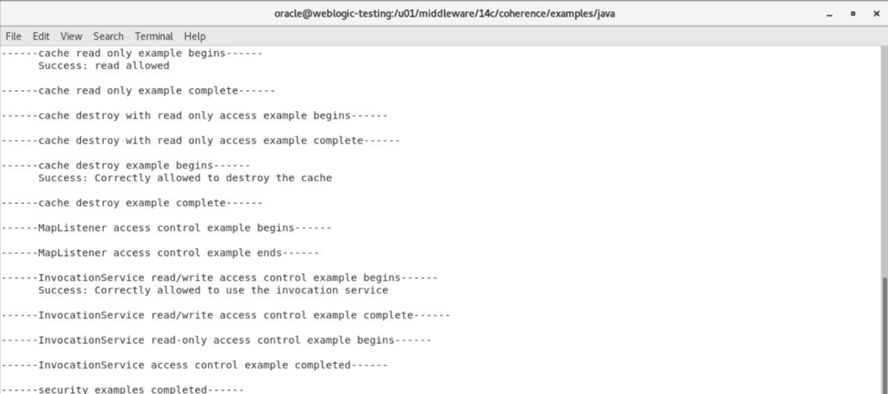
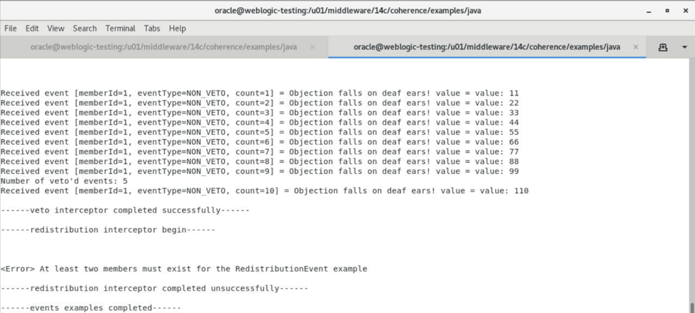

# Coherence Features

## Introduction
These Coherence Labs are exercises to visuslaize the different features of Coherence as a distributed in-memory data-grid.

Estimated Lab Time: n minutes

### Objectives
This lab assumes you have completed the following labs:
- Lab 1:  Login to Oracle Cloud
- Lab 2:  Generate SSH Key
- Lab 3:  Create Compute instance 
- Lab 4:  Environment setup
  
    
## Prerequisites for Java
 
  Make sure that the $COHERENCE_HOME environment variable points to the location of the unpacked Coherence directory.


  Make sure that the $JAVA_HOME environment variable points to the location of a supported JDK before building the examples.
 
## Directory Structure for Java

java/bin	Scripts for building and executing examples. There are two sets of scripts. Scripts with no file extension are bash scripts. Scripts with a .cmd file extension are Windows command scripts. The following description refers to the script names without specifying any file extension.
- run  
    Runs an example collection
- run-cache-server
  
    Runs the cache server used for the examples. The command is also used to start a proxy service that is required for extend clients.

- java/classes	
    The class files output from a build. This directory will not exist until the build script is executed.
- java/resource/config	
    The common Coherence configuration files required by the examples.
- java/resource/<example name>	
    If an example has configuration that is required instead of the common configuration, it will have its own directory. The security example uses configuration files from java/resource/security.

- $COHERENCE_HOME/lib	
    Coherence libraries used for compiling and running the examples.
- resource	
    The data file used for the contacts LoaderExample: contacts.csv.
 
 

## **STEP 1**: Verify Environment

1. Open Two Terminal windows 

2. Set and verify the JAVA_HOME for both terminal windows by typing the commands below
        ````
        <copy>
        export JAVA_HOME="/u01/oas/javaln/jdk1.8.0_261"
        export PATH=$JAVA_HOME/bin:$PATH
        echo $JAVA_HOME
        </copy>
        ````
        
        

3. Set and verify COHERENCE_HOME for both terminal windows

        export COHERENCE_HOME="/u01/middleware/14c/coherence"
        export PATH=$COHERENCE_HOME/bin:$PATH

        echo $COHERENCE_HOME

 

## **STEP 2**: Build JAVA Labs

1. Change Directory to Java Samples in both Terminal Windows ((/u01/middleware/14c/coherence/examples/java)

    cd $COHERENCE_HOME/examples/java

2. Build all the java Labs as needed and execute the build script with the name of the example collection:
        ````
        <copy>
        bin/build contacts
        bin/build security
        bin/build events
        bin/build java8
        bin/build async
        </copy>
        ````


3. Now Run the following Labs from the following folder in both Terminal Windows

        cd $COHERENCE_HOME/examples/java
    
## **Lab 1: Contacts**

### Introduction
This Lab shows the most basic data access features of Coherence including getting, putting and removing data from a provided contacts.csv file.

### Objective: 
To start a Coherence Cache and then put and get Contacts to/from the Cache.

### Estimated Time: 5 - 10 mins

### Pre-requisites:  Verify Environment has been Completed.

### Lab Steps:

## Step 1:

1. Start a cache server 

2. Type the following command in the first Terminal window 
    
        bin/run-cache-server

3. Wait for the Cache Server to start in a few seconds as each execution starts a cache server cluster node. 

         

## Step 2:      

1. Open a second terminal window:

2. Run the terminal with the name of the example: 

        bin/run contacts

The Driver.main method runs through the features of the example with output going to the command window (stdout)

          

**Proceed to Next Lab**

## **Lab 2: Security**

## Introduction:
 This Lab shows the security feature of accessing Cache securely using role and password

Estimated Lab Time: 10 minutes

### Objectives: 
The Coherence security Lab set receives a cache reference that requires a password an attempts cache and invocation service operations that require different roles.

### Pre-requisites:  
* Verify that the environment has been Completed.

## Lab Steps:

 
## Step 1.	Start a cache server

First Terminal window: 

        bin/run-cache-server security 

The cache server also runs a proxy service which allows connections from Coherence*Extend clients.

Wait for the Cache Server to start in a few seconds

 

## Step 2.	In the second Terminal window, run with the name of the example: 

Second Terminal window:

        bin/run security

The Driver.main method runs through the features of the example with output going to the command window (stdout)

  

### Proceed to Next Lab 

## Lab 3:  Live events 

### Introduction: This Lab shows the Events feature of inserting into Cache

### Objective: How to measure the elapsed time between pre- and post-events which are inserted into a results cache; the semantics of throwing exceptions in pre- and post-commit events, and how partition redistribution events can be logged.

### Estimated Time: 5 - 10 mins

### Pre-requisites:  Verify Environment has been Completed.

### Lab Steps:
 

### Step 1.	Start one or more cache servers in First Terminal Window

First Terminal window: 

        bin/run-cache-server events 

Each execution starts a cache server cluster node. 
    
Wait for the Cache Server to start in a few seconds


### Step 2.	In the second Terminal window, run with the name of the example: 

Second Terminal Window:

        bin/run events

The Driver.main method runs through the features of the example with output going to the command window (stdout).

 

### Proceed to Next Lab 

## Lab 4: Java 8 features 

### Introduction: The Coherence Java 8 features Lab illustrates how to use the Java streams when querying and processing cache entries. how Lambda features can be used to simplify common Coherence tasks and how to query and process cache entries 

### Objective: How Lambda features can be used in a Cache to simplify common Coherence tasks and how to query and process cache entries 

### Estimated Time: 5 - 10 mins

### Pre-requisites:  Verify Environment has been Completed.

### Lab Steps:


### Step 1.	Start a cache server First Terminal window: 

First Terminal Window:

        bin/run-cache-server

Wait for the Cache Server to start in a few seconds

 

### Step 2.	In the second Terminal window, run with the name of the example: 

Second Terminal Window:

        bin/run java8

The Driver.main method runs through the features of the example with output going to the command window (stdout). Inspect the output and refer to the code at src/com/tangosol/examples/java8.

    
 

### Proceed to Next Lab 

## Lab 5: Asynchronous features 

### Introduction: TThe Coherence asynchronous features lab illustrates: how to asynchronously get and put data in a cache

### Objective: How to asynchronously process cache entries in Coherence and  how to asynchronously aggregate cache entries.

### Estimated Time: 5 - 10 mins

### Pre-requisites:  Verify Environment has been Completed.

### Lab Steps:
 
### Step 1.	Start a cache server First Terminal window: 

First terminal Window:

        bin/run-cache-server

Wait for the Cache Server to start in a few seconds

 

### Step 2.	In the second Terminal window, run with the name of the example: 

Second terminal Window:

        bin/run async

The Driver.main method runs through the features of the example with output going to the command window (stdout). Inspect the output and refer to the code at src/com/tangosol/examples/async


 


## Acknowledgements

- **Authors** - Srinivas Pothukuchi, Pradeep Chandramouli, Chethan BR
- **Contributors** - Srinivas Pothukuchi, Pradeep Chandramouli, Chethan BR, Laxmi Amarappanavar
- **Team** - North America SE Specialists.
- **Last Updated By** -  
- **Expiration Date** -    

## See an issue?
Please submit feedback using this [form](https://apexapps.oracle.com/pls/apex/f?p=133:1:::::P1_FEEDBACK:1). Please include the *workshop name*, *lab* and *step* in your request.  If you don't see the workshop name listed, please enter it manually. If you would like for us to follow up with you, enter your email in the *Feedback Comments* section.
      
      

