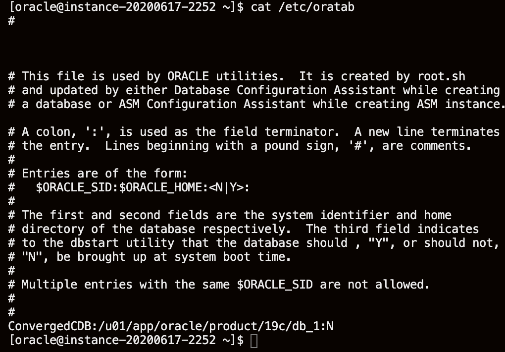
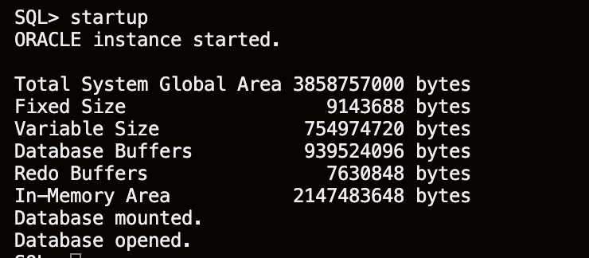
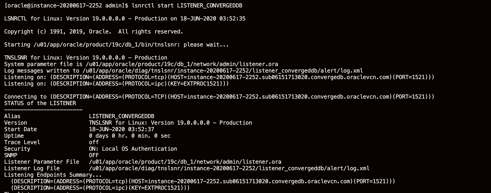
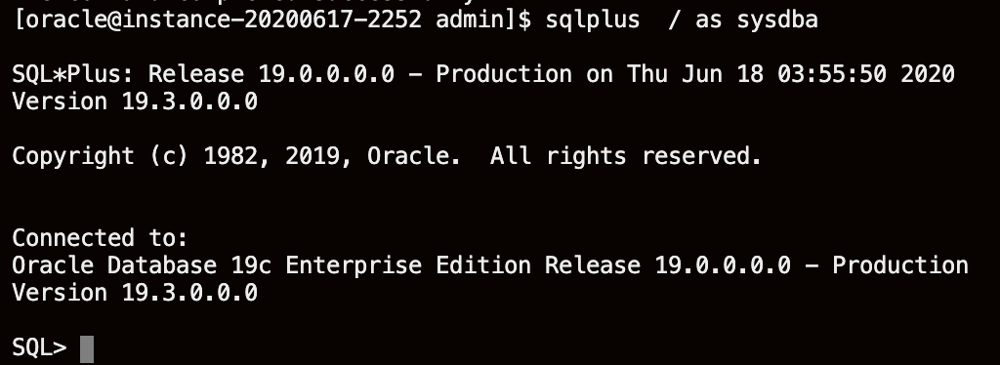
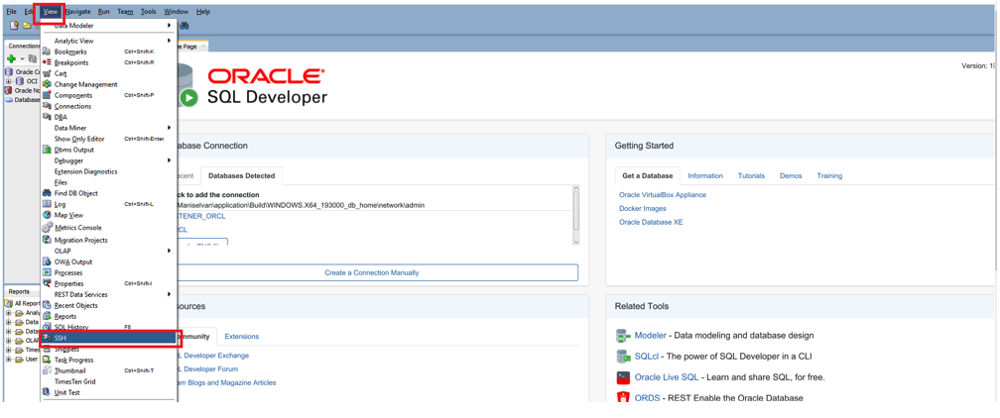
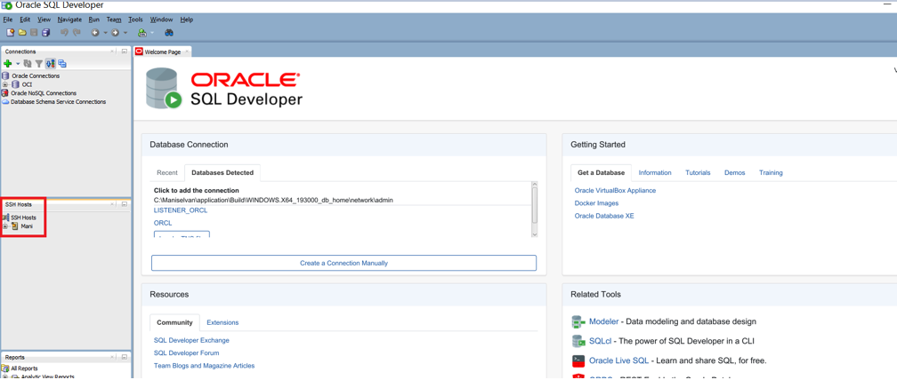
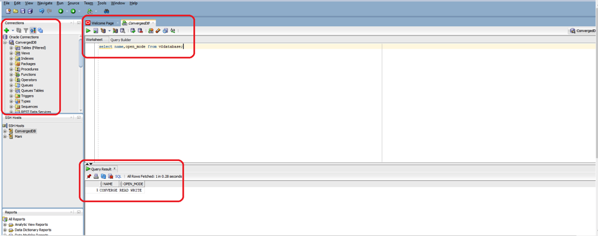

# Environment Setup 

## Introduction

This lab will show you that how to start database instance and listener from putty window,also this covers how to setup vncserver and sqldeveloper etc. 

Estimated time: 1 hour

### Objectives
- Start the Oracle Database and Listener
- Download and Setup SQL Developer Client

### Lab Prerequisites

- Lab 1: Login to Oracle Cloud
- Lab 2: Generate SSH Key
- Lab 3: Create Compute Instance

## Step 1: Start the Database

1. Click the Hamburger Menu in the top left corner. Then hover over Compute > Instances. Find the instance you created in the previous lab. 

   

2. Click on your instance and copy your Public IP address to a notepad. 

   


3. In Oracle CloudShell (*recommended*) or the terminal of your choice, login via ssh as the **opc** user.  
 
      ````
      ssh -i <<sshkeylocation>> opc@<<your address>>
      ````

      - sshkeylocation - Full path of your SSH key
      - your address - Your Public IP Address
  
4. Switch to the oracle user
      ````
      <copy>
      sudo su - oracle
      </copy>
      ````

   

5.  Check for the oratab file and get the SID  and the oracle home details for the DB to start.

      ````
      <copy>
      cat /etc/oratab 
      </copy>
      ````

   


7. Start the database by first sourcing the environment.
 
       ````
      <copy>
      . oraenv
      </copy>
      ````
      

       ````
      <copy>
      ConvergedCDB
      </copy>
      ````
      

8. Use sqlplus to startup the database
 
      ````
      <copy>
      sqlplus / as sysdba
      </copy>
      ````
      

      ````
      <copy>
      startup 
      </copy>
      ````
      

9. Start up all the pluggable databases (pdbs) and open them up for access
  
      ````
      <copy>
      show pdbs
      </copy>
      ````
      

      ````
      <copy>
      alter pluggable database all open;
      </copy>
      ````

      ````
      <copy>
      show pdbs 
      </copy>
      ````
      

9.	Exit out of sqlplus
 
      ````
      <copy>
      exit
      </copy>
      ````

## Step 2: Start the Listener

1. Get the complete hostname of the server.

      ````
      <copy>
      cat /etc/hosts
      </copy>
      ````
      

  **Note:**In above screenshot red highlighted one is the full qualified hostname. Gather similar details from your respective instance.

2.	Open tnsnames.ora in nano and replace the LISTENER_CONVERGEDCDB lab with the old hostname with the new hostname from Step 
1.
      ````
      <copy>
      cd $ORACLE_HOME/network/admin
      </copy>
      ````

      ````
      <copy>
      nano tnsnames.ora
      </copy>
      ````

3. Replace the existing hostname with **your fully qualified hostname**

      

4.  Save the file using the command **^O** and **^X** to exit

5.	Repeat the same steps for listener.ora using nano

      ````
      <copy>
      nano listener.ora
      </copy>
      ````

6. Replace the fully qualified hostname and save the file

      

7.	Check for the listener name. 
      ````
      <copy>
      cat listener.ora
      </copy>
      ````

      

8.	Start the listener
      ````
      <copy>
      lsnrctl start LISTENER_CONVERGEDDB
      </copy>
      ````
      

15.	Check the listener status
      ````
      <copy>
      lsnrctl status LISTENER_CONVERGEDDB
      </copy>
      ````
      

16.	Register the service into database. Login via sqlplus as sysdba. 
      ````
      <copy>
      sqlplus  / as sysdba
      </copy>
      ````
      

1.  Set the local listener by replacing the **hostname** with the hostname you identified in earlier.
      ````
      alter system set local_listener='(ADDRESS = (PROTOCOL=TCP)(HOST=hostname)(PORT=1521))';
      ````
      

2.   Register the listener and exit sqlplus.

      ````
      <copy>
      alter system register;
      </copy>
      ````
      

      ````
      <copy>
      exit
      </copy>
      ````

17.	Check the listener status.
      ````
      <copy>
      lsnrctl status LISTENER_CONVERGEDDB
      </copy>
      ````
      

18.	Ensure the database, **ConvergedCDB**, and the listener, **LISTENER_CONVERGEDDB** is up and running
      ````
      <copy>
      ps -ef|grep pmon
      </copy>
      ````
      
      ````
      <copy>
      ps -ef|grep tns

      </copy>
      ````

      

## Step 3: Download SQL Developer

Certain workshops require SQL Developer.  To setup SQL Developer, follow the steps below.

1. Download [SQL Developer](https://www.oracle.com/tools/downloads/sqldev-downloads.html) from the Oracle.com site and install on your local system.

2. Once installed, open up the SQL Developer console.

      

## Step 4:  Setup SSH Tunnel to the OCI Instance

1.  Click **View** -> **SSH**

      

2.  Notice the SSH Hosts window opened on the left panel

3. Right click to create a **New SSH Host**

   - Names - Any name which is meaningful 
   - Host - Must be the OCI instance public address 
   - User name - OPC Pass the private key through browse 

      


4. Right click and click **Test** to test that the connection can clearly connect
   
## Step 5:  Test a connection

1.  In the connections page click the green plus arrow to create a new connection

2.  Enter the following connection information to test your connection

3.  Once your connection is successful in the SQL Developer panel execute the query below
      ````
      <copy>
      select name, open_mode from v$database;
      </copy>
      ````

      


You may proceed to the next workshop.

## Converged Database Workshop Collection

- [Node.js](?lab=node.js-lab-1-intro-setup) - Use Rest API to add products to the eShop Application
- [Json](?lab=json-lab-1-intro-setup) - Store and read JSON documents from the Oracle Database
- [XML](?lab=xml-lab-1-setup)- Manage XML content in the Oracle Database
- [Spatial](?lab=spatial-lab-1-setup) - Work with Spatial Data in the Oracle Database
- [Graph](?lab=graph-lab-1-intro-setup) - Work with Graph Data in the Oracle Database
- [Cross Datatype](?lab=cross-lab-1-intro-usage) - Work with Cross Data Types

## Acknowledgements

- **Authors** - Balasubramanian Ramamoorthy, Arvind Bhope
- **Contributors** - Laxmi Amarappanavar, Kanika Sharma, Venkata Bandaru, Ashish Kumar, Priya Dhuriya, Maniselvan K., Robbie Ruppel
- **Team** - North America Database Specialists
- **Last Updated By** - Kay Malcolm, Director, Database Product Management, June 2020
- **Expiration Date** - June 2021   

**Issues**
Please submit an issue on our [issues](https://github.com/oracle/learning-library/issues) page. We review it regularly.
  


