# SPATIAL

## Introduction

In this lab we will walk through the SQL queries containing the built-in functions for SPATIAL data. 
Will create a test database table to store SPATIAL data and insert sample data. 
Will modify the code, re-build and re-deploy the code the observe the SPATIAL data type with its built-in functions and also create REST end-point to access SPATIAL data. 

*Estimated Lab Time:* 30 Minutes

### Objectives
- Create a database table to store Oracle Spatial data
- Use Spatial data type built-in functions
- Create REST end-point to access SPATIAL data


### Prerequisites
This lab assumes you have:
- A Free Tier, Paid or LiveLabs Oracle Cloud account
- SSH Private Key to access the host via SSH
- You have completed:
    - Lab: Generate SSH Keys
    - Lab: Setup Compute Instance
    - Lab: Start Services
    - Lab: eSHOP Application
    - Lab: Data Type Demonstrator Tool

### About Oracle Spatial
Spatial data types stores geometry and multi-dimensional data.  It is used to process geo-spatial data.

Oracle Spatial consists of the following:
- Schema (MDSYS)
- A spatial indexing mechanism
- Operators, functions, and procedures
- Native data type for vector data called SDO\_GEOMETRY (An Oracle table can contain one or more SDO_GEOMETRY columns).

## **STEP 1**: Connect JDeveloper to database

1. Open JDeveloper in Studio Mode, if not open already.
2. Click on **Window** select **Database** and then **Databases** to open the databases navigation tab on the left-hand side of the JDeveloper editor.

    


3. Click on the green **+** icon under the **Databases** tab on left-hand side navigation to **Create Database Connection**.

    - **Connection Name**: spatial
    - **Connection Type**: Oracle(JDBC)
    - **Username**: appspat
    - **Password**: Oracle_4U
    - **Hostname**: localhost
    - **Service Name**: SGRPDB


    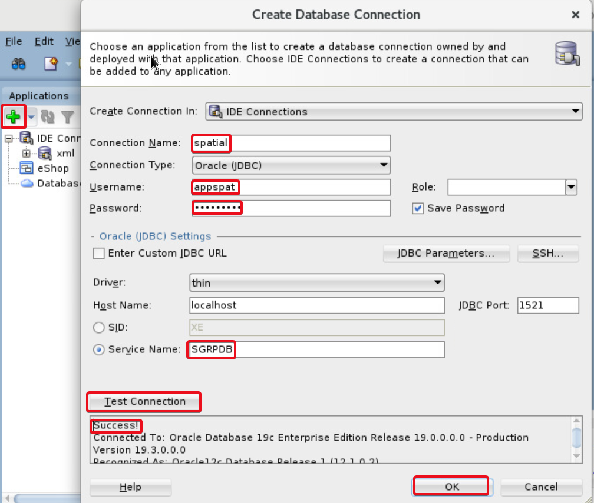


4. Click on **Test Connection** and upon **Success!** message, Click **OK**.


## **STEP 2**: Create SPATIAL Data

1. In the Menu bar, click on **SQL** dropdown and select **spatial**.

    


2. A worksheet for connection **spatial** opens.  Execute your query commands here.

3. Key in or copy paste the statement below in worksheet to create a table to hold spatial data.

    ````
    <copy>
        create table city_points(city_id number primary key, city_name varchar2(25), latitude number, longitude number);
    </copy>
    ````
4. Select the text and click on the green **Play** icon, look for **Table Created** confirmation message in the **Script Output** tab.


    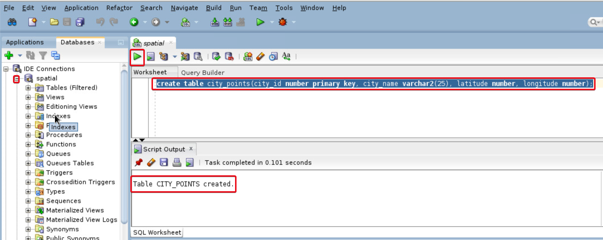


5. Key in the statements below in worksheet to insert data in the spatial table **city_points**.

    ````
    <copy>
    INSERT INTO city_points (city_id, city_name, latitude, longitude)VALUES (1, 'Boston', 42.207905, -71.015625);
    INSERT INTO city_points (city_id, city_name, latitude, longitude)VALUES (2, 'Raleigh', 35.634679, -78.618164);
    INSERT INTO city_points (city_id, city_name, latitude, longitude)VALUES (3, 'San Francisco', 37.661791,-122.453613);
    INSERT INTO city_points (city_id, city_name, latitude, longitude)VALUES (4, 'Memphis', 35.097140, -90.065918);
    </copy>
    ````

6. Select the text and click on the Green **Play** icon, **Script Output** tab will show **1 Row Inserted** message 4 times.


    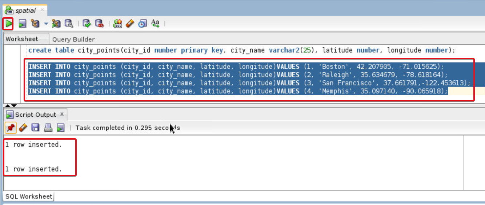

7. Right Click on **Tables (Filtered)** on Left-Hand side and click **Refresh** to see the table created.


    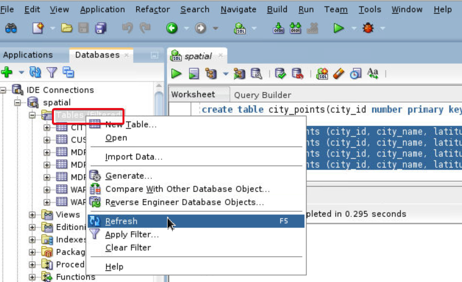


8. Once you see the table **city_points** on the left-hand side, In a new line of the worksheet key in below query.

    ````
    <copy>

        select * from city_points;
    </copy>
    ````

9. Select the query line again and click the green Play button to execute the query.


    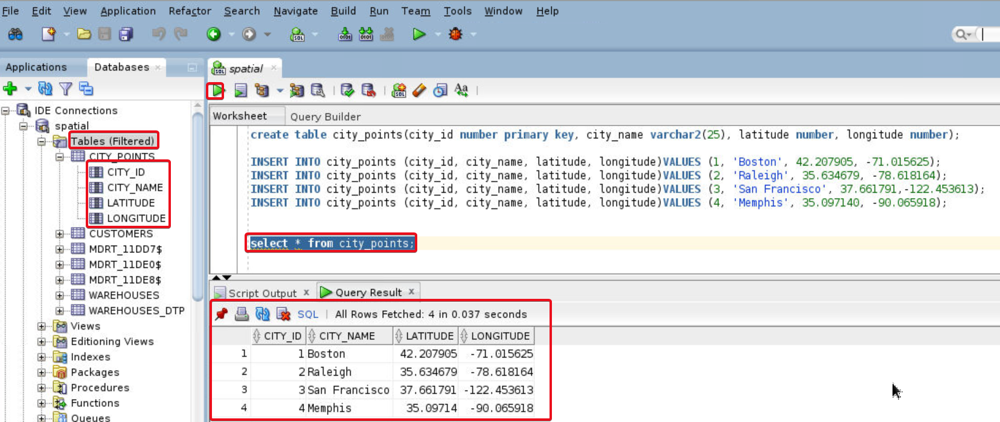


10. In the worksheet, execute the alter statement to add the SDO_Geometry column to store the spatial data, also add the geometry values to the 4 rows already present.

    ````
    <copy>

    ALTER TABLE city_points ADD (shape SDO_GEOMETRY);
    </copy>
    ````
    ````
    <copy>        
    UPDATE city_points SET shape = SDO_GEOMETRY(2001,8307,SDO_POINT_TYPE(LONGITUDE, LATITUDE, NULL), NULL, NULL);
    </copy>
    ````

11.	Select the statements and click on the green **Play** icon to execute the alter and update statements.

    
    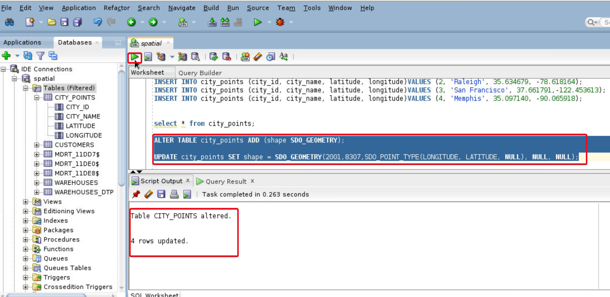


12.	Execute the statement below to see the column and data for city_points table.

    ````
    <copy>

        select * from city_points;
    </copy>
    ````

    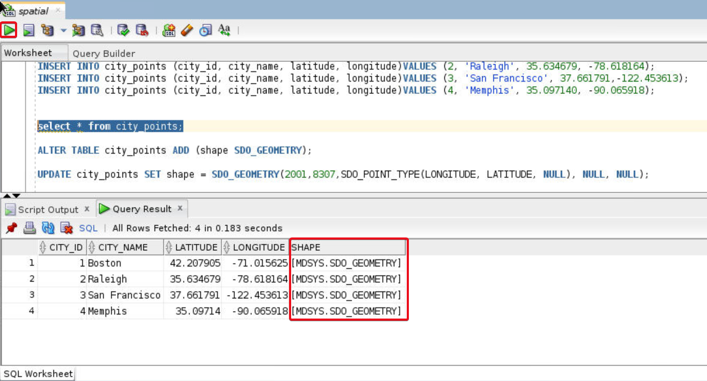


## **STEP 3**: Modify JEE code for SPATIAL

1. Under the Projects in **Applications** tab on left Navigation, expand **converge** then **Resources** and double click on **applicationContext.xml** to open the configuration xml. To add the new datasource bean add the code below the < /bean> tag of convergejsonxmlds and before ending < /beans> tag.

    ````
    <copy>
    <bean id="spatialdsbean" class="org.springframework.jndi.JndiObjectFactoryBean">
	    <property name="jndiName" value="convergeddb.spatialds"/>
    </bean>
    </copy>
    ````


    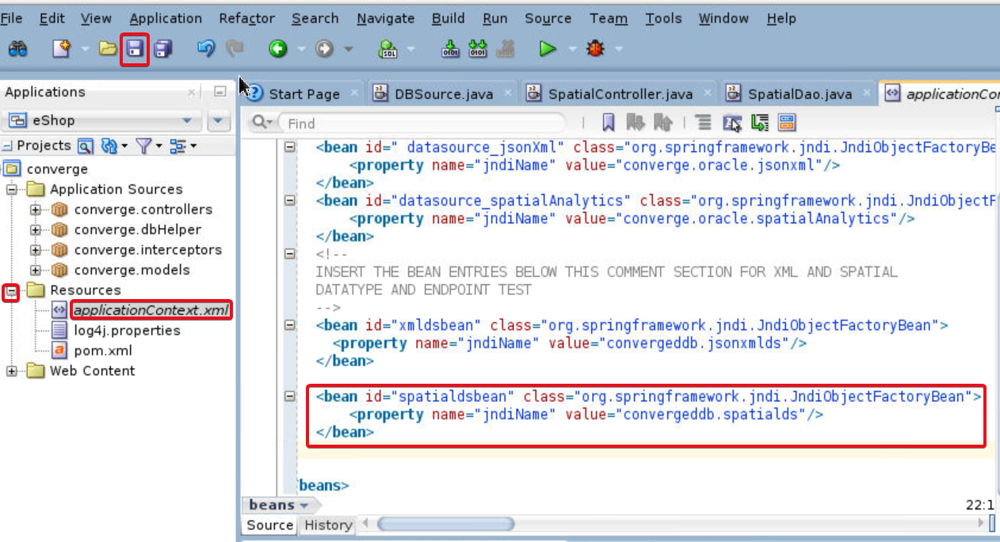


2. Click on **Save** Button.

3. Similarly, open the **DBSource.java** file under **Projects** &#8594; **converge** &#8594; **Application Sources** &#8594; **converge.dbHelper** by double clicking the file.

4. Search for getSpatialDS and navigate to the existing empty getSpatialDS function. Copy and Paste the function code in the code file.

    ````
    <copy>
    public Connection getSpatialDS() throws SQLException {
        Connection con = null;
        ApplicationContext context = new ClassPathXmlApplicationContext("applicationContext.xml");
        spatialds = (DataSource) context.getBean("spatialdsbean");
        try {
            con = spatialds.getConnection();
            con.setAutoCommit(false);
            LOG.info("Success connection");
        } catch (SQLException ex) {
            LOG.error(ex);
        } catch (Exception e) {
            LOG.error(e);
        }
        return con;
    }

    </copy>
    ````

    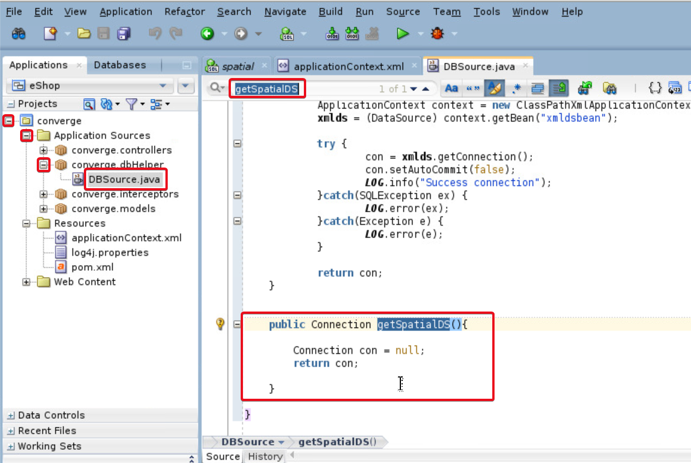

    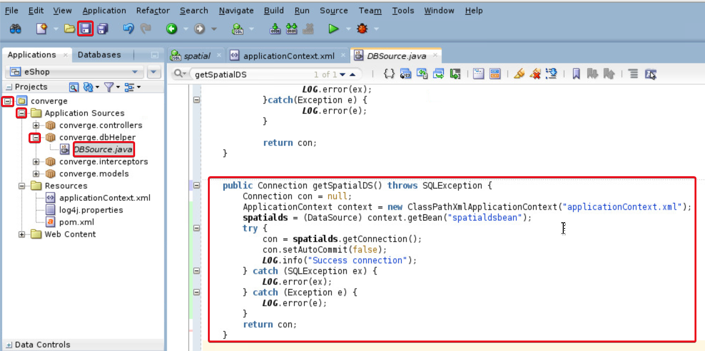

5. Click on **Save** button.

    It is assumed that the names of the DataSource parameters, function names and JNDI names are given same as mentioned in the workshop manual. SpatialController.java and the SpatialDao.java has the business logic to retrieve the spatial datatype from the city_points table from the Oracle Converged Database in the PDB SGRPDB.
    
    If you change any of it, the code may not compile and lead to errors.  Request you to stick to the naming conventions.

6. Right Click on **converge** under **Projects**.

7. Click on **Run Maven** and select **redeploy**.


    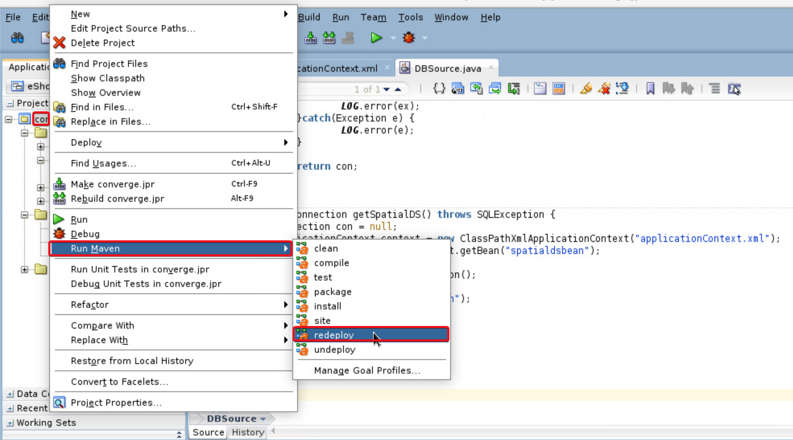

8. In the JDeveloper Log message area, you will see the **successful redeployment**.

    


## **STEP 4**: REST end-point for SPATIAL

1. In JDeveloper, open **SpatialController.java** under **converge** &#8594; **Application Sources** &#8594; **converge.controllers**. Search for **getAllCities** and check the function code.  The request mapping is done as **/allCities**.  The base rest end point being **/spatial** for the code declared at the class level.

    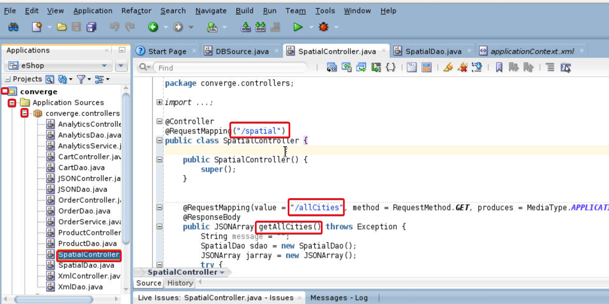


2. Open Firefox if not already open, in other browser tab, open the URL `http://localhost:7101/spatial/allCities`. Data is retrieved by the **getAllCities()** method in **SpatialController.java**.

    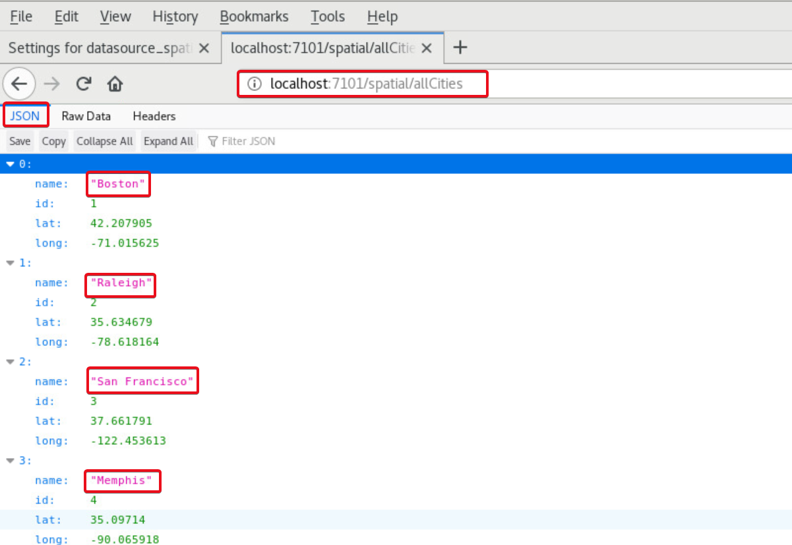


## **STEP 5**: Read SPATIAL data

1. Open the Firefox browser and navigate to `http://localhost:7101/resources/html/endPointChecker.html` OR  use the bookmark **DataType-End Point Check Utility** under **ConvergedDB-Workshp** in bookmark toolbar.
2. Click on the drop-down to see the list of datatypes shown in workshop.
3. Select **SPATIAL** datatype and click on change view button to change.
4. Click on blue fetch cities button.


    

    You should see the 4 CITIES listed on the map which we inserted In the CITY_POINTS table. Zoom out on the map to view the cities.


## **STEP 6**: Insert SPATIAL data

1. Navigate back to **endpointchecker** tool to try the insert a spatial record.

2. Put the Longitude and latitude values of a city and enter its name in the given text boxes and click on green color **Pin City** to add the spatial data of the city to the table.

    You can get the longitude and latitude of a place using sites like [https://www.latlong.net/](https://www.latlong.net/).

    Get the co-ordinates of any city and use it to insert in the **CITY_POINTS** table using the tool. Latitude and Longitude of Bangalore has been taken here for example.


    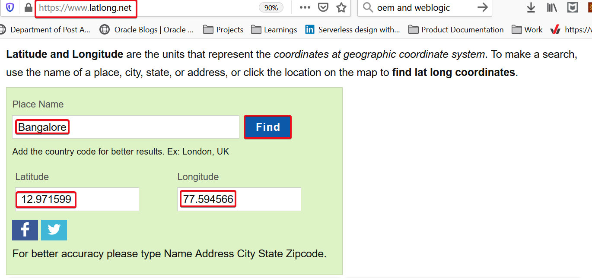


    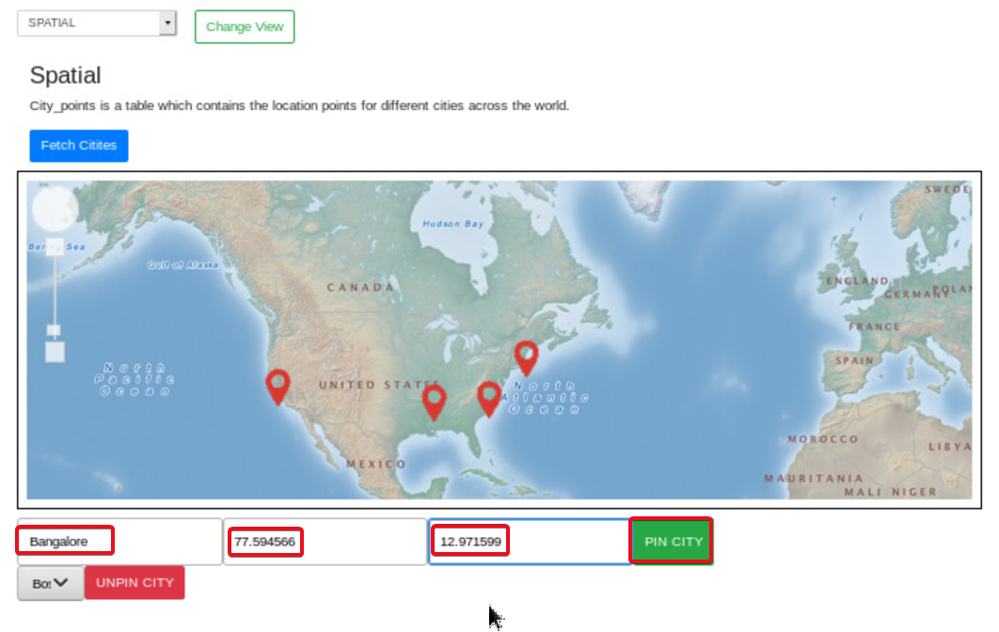


3. You will get the notification pop-up that the record was Inserted. Click Ok.  If you do not get notification check for pop-up blockers.
4. The map changes to point to newly added city. Zoom in/out if required to see all 5 cities.

    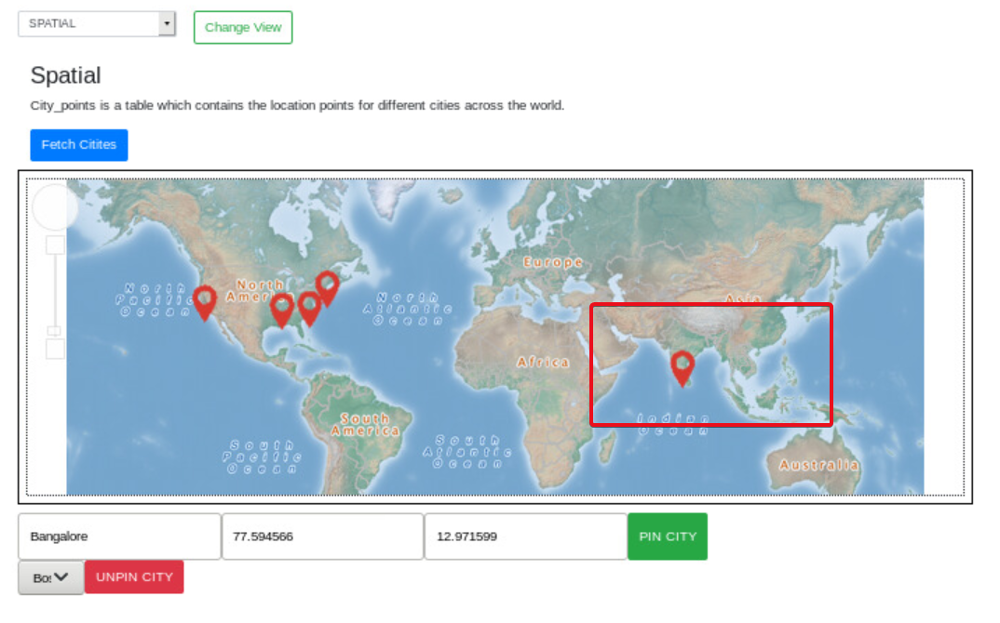


5. Navigate back to **SpatialDAO.java** and verify the insert query in string variable **INSERT\_NEW\_CITY**. Also check that the shape (Geometry) of the object is updated later after inserting the longitude and latitude in **UPDATE_SHAPE** string query.


    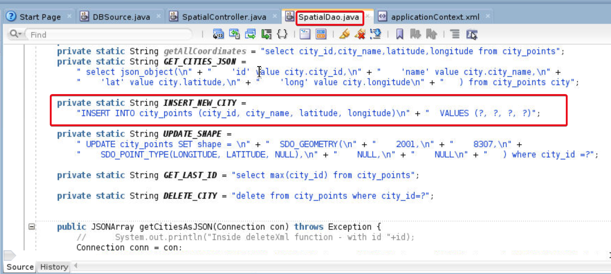


## **STEP 7**: Delete SPATIAL data

1. Open the Firefox browser and navigate to `http://localhost:7101/resources/html/endPointChecker.html` OR use the bookmark **DataType-End Point Check Utility** under **ConvergedDB-Workshp** in bookmark toolbar.

2. Click on the drop-down to see the list of datatypes shown in workshop.

3. Select **SPATIAL** datatype and click on **Change View** button to change the view.

4. Click on blue **Fetch Cities** button.


    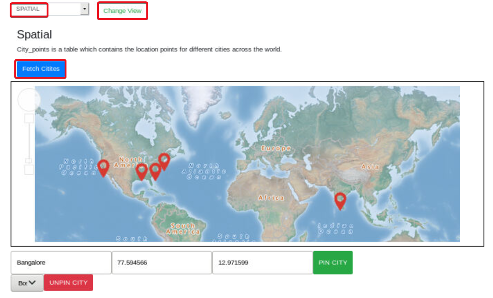

5. To delete a city from the table, select the required city from drop down and press red **Unpin City** button. You will see a pop-up notifying about the deletion, Click **OK**.
    SanFrancisco deleted/unpinned here for example.


    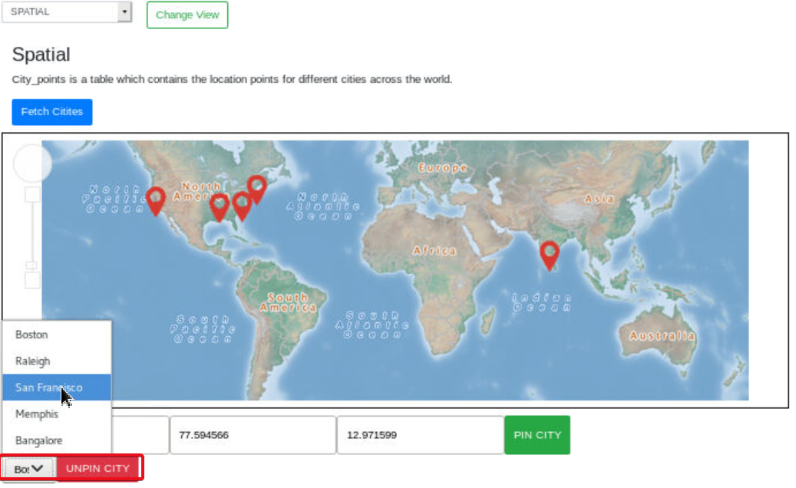


    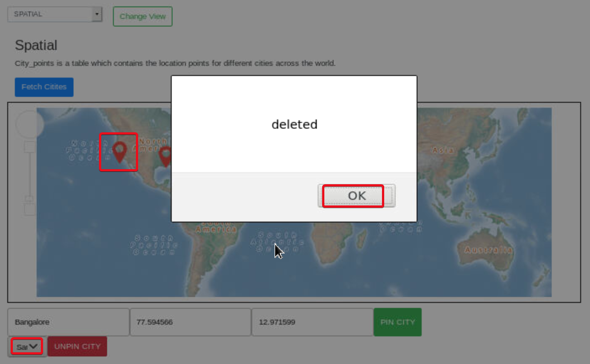


6. Again click on **Fetch Cities** button to see the deleted city missing on the map.


    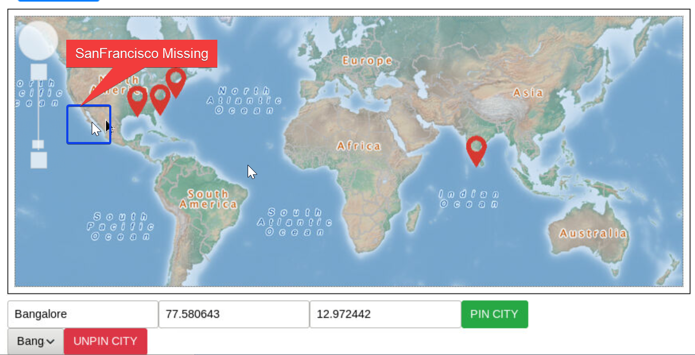


    This lab, we saw, how the complicated spatial data in a converged database is handled as easily as other datatypes using the buit-in functions and support for spatial data by Oracle Converged Database.

## Summary
In summary, you created a table to store Spatial data-type, performed CRUD operations on Spatial data-type stored in the converged database. You also got familiar with out of box functions provided by Oracle database to handle Spatial data-type, modified SQL queries in java code to access Spatial as data over REST.

You may now *proceed to the next lab*.

## Want to learn more
- [Spatial](https://docs.oracle.com/en/database/oracle/oracle-database/19/spatl/index.html)

## Acknowledgements
- **Authors** - Pradeep Chandramouli, Nishant Kaushik, Balasubramanian Ramamoorthy, Dhananjay Kumar, AppDev & Database Team, Oracle, October 2020
- **Contributors** - Robert Bates, Daniel Glasscock, Baba Shaik, Meghana Banka, Rene Fontcha
- **Last Updated By/Date** - Kanika Sharma, NA Technology, October 2020

## Need Help?
Please submit feedback or ask for help using our [LiveLabs Support Forum](https://community.oracle.com/tech/developers/categories/livelabsdiscussions). Please click the **Log In** button and login using your Oracle Account. Click the **Ask A Question** button to the left to start a *New Discussion* or *Ask a Question*.  Please include your workshop name and lab name.  You can also include screenshots and attach files.  Engage directly with the author of the workshop.

If you do not have an Oracle Account, click [here](https://profile.oracle.com/myprofile/account/create-account.jspx) to create one.


