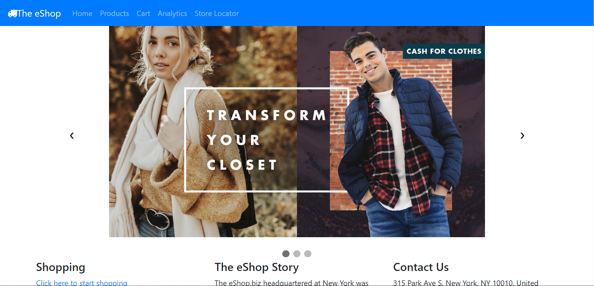

# Oracle Node.js 

## Introduction

This lab walks you through the steps to start the Docker as well as Node.js Retail application .
You can connect to an Node.js running in a Docker container on an Oracle Cloud Compute instance. You can connect the Oracle Database instance using any client you wish. In this lab, you will connect using Oracle SQLDeveloper

### Prerequisites

This lab assumes you have completed the following labs:
- Lab 1: Login to Oracle Cloud
- Lab 2: Generate SSH Key
- Lab 3: Create Compute Instance
- Lab 4: Environment Setup (Is this one needed for this lab - Kay)

### About Oracle Node.js 

Node.js is an open-source and cross-platform JavaScript runtime environment. It runs the V8 JavaScript engine, outside of the browser. This allows Node.js to be very performant.

A Node.js app is run in a single process, without creating a new thread for every request. Node.js provides a set of asynchronous I/O primitives in its standard library that prevent JavaScript code from blocking and generally, libraries in Node.js are written using non-blocking paradigms, making blocking behavior the exception rather than the norm. 

When Node.js needs to perform an I/O operation, like reading from the network, accessing a database or the filesystem, instead of blocking the thread and wasting CPU cycles waiting, Node.js will resume the operations when the response comes back.

 

**Why Node.js?**

  Node.js uses asynchronous programming!
-	A common task for a web server can be to open a file on the server and return the content to the client.
-	how Node.js handles a file request:
	     Sends the task to the computer's file system.
         Ready to handle the next request.
         When the file system has opened and read the file, the server returns the content to the client.
         
-	Node.js eliminates the waiting, and simply continues with the next request.
-	Node.js runs single-threaded, non-blocking, asynchronously programming, which is very memory efficient.

**What Node.js can do?**
-	Node.js can generate dynamic page content
-	Node.js can create, open, read, write, delete, and close files on the server
-	Node.js can collect form data
-	Node.js can add, delete, modify data in your database

**Download Node.js**

   The official Node.js website has installation instructions for Node.js: https://nodejs.org

**A Vast Number of Libraries**
   Npm with its simple structure helped the ecosystem of Node.js proliferate, and now the npm registry hosts over 1,000,000 open source packages you can freely use.  

## **Step 1:**  Verify Application 

1.  The script (env_setup_script.sh) which was run in Lab-4 has started the application. Also at the end of the script. you      will be presented with two URLs. 

   

2. Open up a web browser and visit the Application URL indicated in your terminal.   http://your address:3000/

      - your address - Your Public IP Address
  
3. Open up a web browser and visit the Application API indicated in your terminal.   http://your address:3000/
      - your address - Your Public IP Address

     

You may proceed to the next lab.

## Learn More

- [Node-js](https//nodejs.org/en/)
- [Node-js for oracle Linux](https//yum.oracle.com/oracle-linux-nodejs.html)  
- [Node-js Driver](https//oracle.github.io/node-oracledb/)
- [Oracle Instant Client](https//www.oracle.com/in/database/technologies/instant-client/downloads.html)
- [Docker](https//www.docker.com/)
- [Postman](https//www.postman.com/)

## Acknowledgements

- **Authors** - Balasubramanian Ramamoorthy, Arvind Bhope
- **Contributors** - Laxmi Amarappanavar, Kanika Sharma, Venkata Bandaru, Ashish Kumar, Priya Dhuriya, Maniselvan K.
- **Team** - North America Database Specialists.
- **Last Updated By** - Kay Malcolm, Director, Database Product Management, June 2020
- **Expiration Date** - June 2021   

## Need Help?
Please submit feedback or ask for help using our [LiveLabs Support Forum](https://community.oracle.com/tech/developers/categories/livelabsdiscussions). Please click the **Log In** button and login using your Oracle Account. Click the **Ask A Question** button to the left to start a *New Discussion* or *Ask a Question*.  Please include your workshop name and lab name.  You can also include screenshots and attach files.  Engage directly with the author of the workshop.

If you do not have an Oracle Account, click [here](https://profile.oracle.com/myprofile/account/create-account.jspx) to create one.
      
