# Predictive Analytics

## Introduction
Oracle Analytics Server offers extended Machine Learning design capabilities. You need simple, one-click actions along with powerful machine learning (ML) models to predict results and better understand your data. To help you deploy sophisticated analytics to everyone in your organization, Oracle Analytics is focused on embedding, consuming, and training ML models to enrich your data preparation, discovery, and collaboration.  

It covers the full cycle of ML processes, allows direct uptake of any custom algorithm scripts, addressing the need of both traditional data scientists, citizen data scientists, and data analysts.  Oracle Analytics includes algorithms to help you train predictive models for various purposes. Examples of algorithms are classification, regression trees (CART), logistic regression, k-means, clustering, sentimental analysis, random forest and decision tree.

*Estimated Lab Time:* 30 Minutes.

  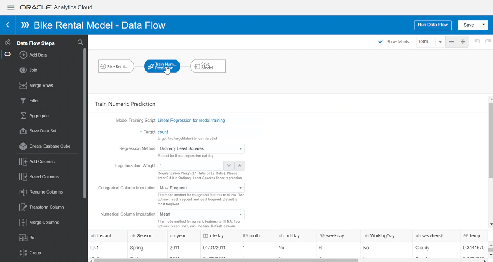

### Objectives
In this Lab, we are going to focus on how to predict attrition using binary classification algorithm and show how to use in-built algorithms for addressing a real-life, common question for any organization.  

To answer questions like, how can we identify the employees those are likely to quit the organization? Knowing who might be at risk of leaving, to alert HR for retaining the best talent.  
Here we are going to use “binary classification”. Binary classification is a technique of classifying records/elements of a given dataset into two groups on the basis of classification rules. For example: Whether the employee is going to quit or not. “Yes” and “No” are the two different groups of employees.

We will also use visualizations on the predicted data for ease of decision making.

### Prerequisites
This lab assumes you have:
- A Free Tier, Paid or LiveLabs Oracle Cloud account
- SSH Private Key to access the host via SSH
- You have completed:
    - Lab: Generate SSH Keys
    - Lab: Prepare Setup (Free Tier and Paid Tenants Only)
    - Lab: Environment Setup
    - Lab: Initialize Environment
    - Lab : Data Visualization  
    - Lab : Augmented Analytics

The below pre-loaded data objects are available in Converged Database.

| ObjectName  | ObjectType  | DataType  | Description  |
| ------------- | ------------- | ------------- |
| HR\_ATTRITION\_TRAINING | Table | Relational  | Data used to train the Machine Learning model |
| HR\_ATTRITION\_PREDICT | Table | Relational | Data used to test the model we create |

## **STEP 1**: Create Dataset

In this step, create a dataset to work on.

1. In the home page, click on create button and select dataset.
    
2. Select the connection "ConvergedDB_Retail".
    
3. Select the OASLABS schema.
    
4. Select the HR\_ATTRITION\_TRAINING table.
    
5. Add all the columns to the data set.
    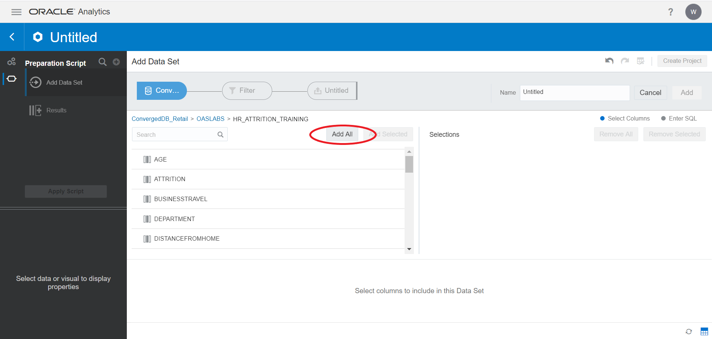
6. Perform required measure to attribute changes and add data set. For example  `(select “Age” and change to Attribute in bottom left corner)`

    
7. Finally click on “Add” to add the data set.
    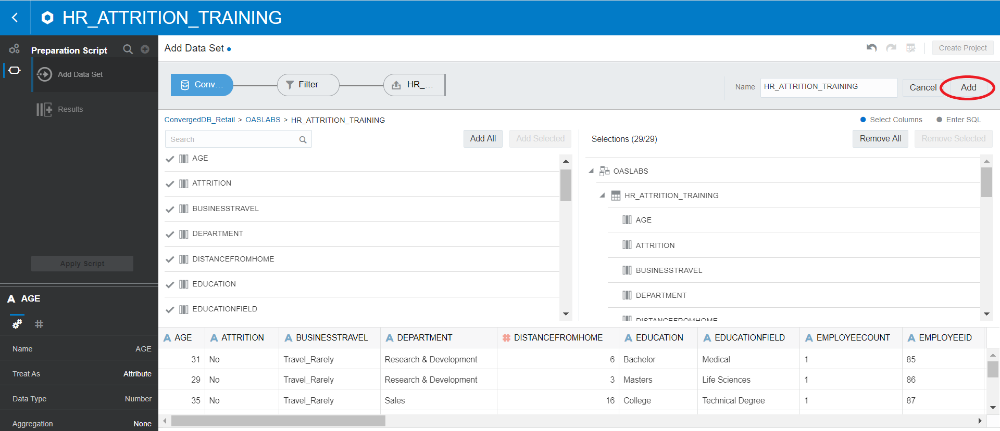

## **STEP 2**: Create Dataflow - ML Model

In this step, we will build a Machine learning model using OAS Dataflow capability to train our dataset.

1. Click on create and then select Data Flow.
    
2. Select the Data set created in the STEP 1 **Create Dataset** and click on Add.
    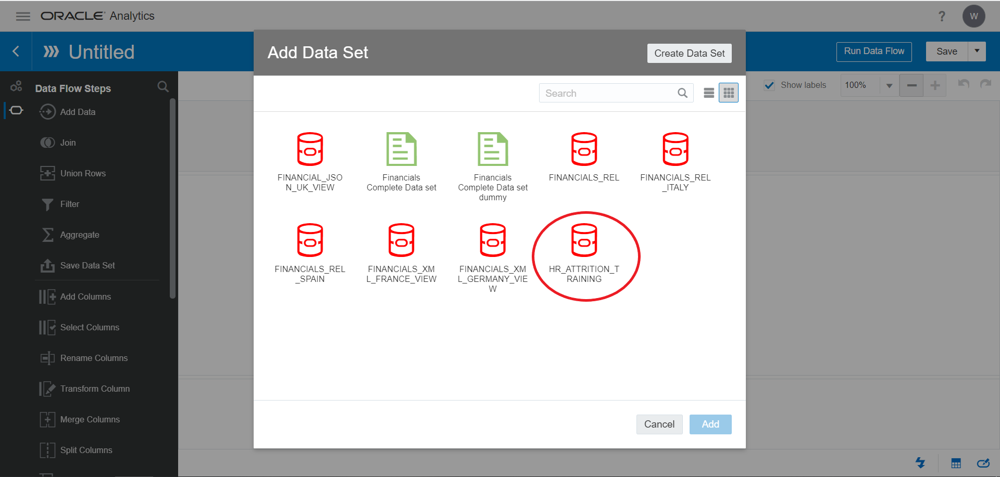
3. Click on “+” and select “Train Binary Classifier”.  
  We are using “Train Binary Classifier” because the predict values will only be “yes or no”.
    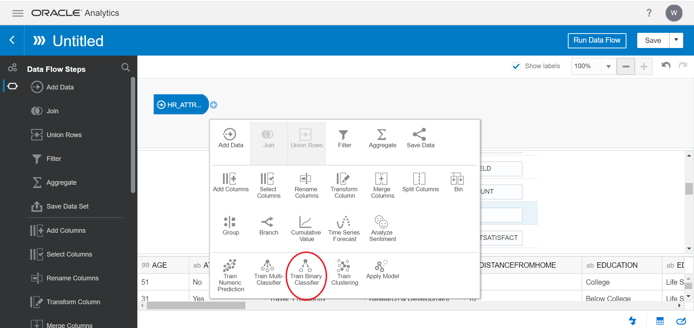
4. Select Naïve Bayes for Classification.
    
5. Fill out the input parameters:  
  **Target**: “Attrition”  
  **Positive Class in Target**: “yes”
    
6. Give appropriate name and save the model.
    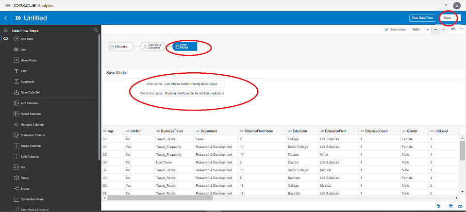
7. Save the Data flow
    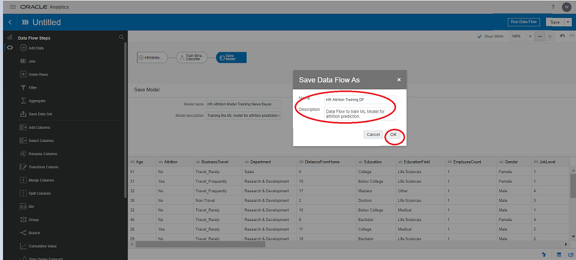
8. Now run the data flow to build the ML model on training dataset.
    

We now have an ML model to test our data.

## **STEP 3**: Check ML Model Quality

In this step , we will check the parameters which determines the credibility of a model.

1. Go to “Home”, select “Machine Learning”
    
2. Select the model created in previous step, right click on it and select "Inspect".
    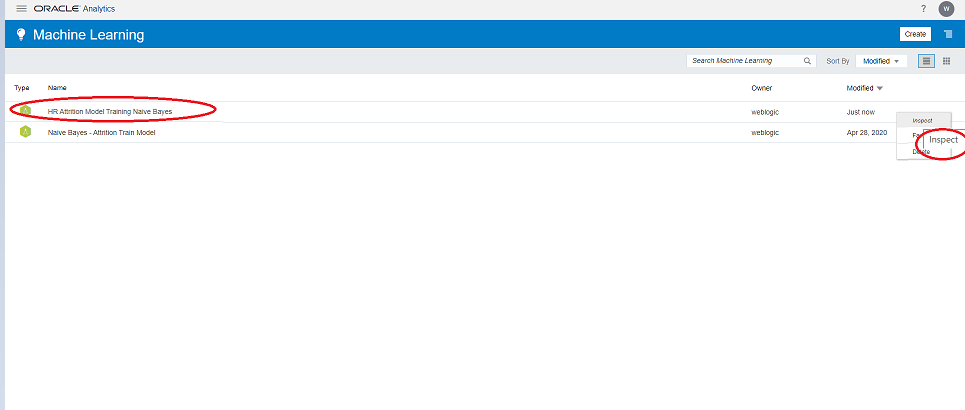
3. Go to the Quality parameters tab. We can check model accuracy, Confusion matrix and other parameters here.
    

 Based on the above shown parameters one can compare various algorithms and select the algorithm for best results of their data.

## **STEP 4**: Apply Training Model to Predict

In this step, we will apply the previously created ML model to the test data.

1. Create the test dataset, from the previously created database connection **`ConvergedDB_Retail`**
    
2. Select the OASLABS schema.
    
3. Select the HR\_ATTRITION\_PREDICT table , which has our test data.
    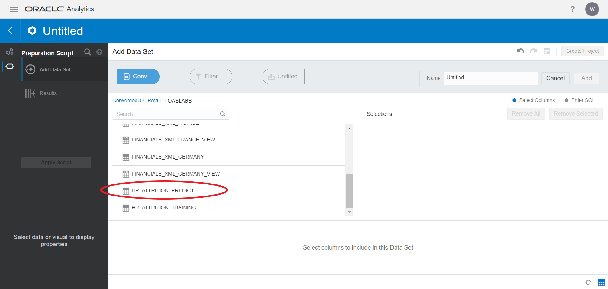
4. Add all the rows to the data set and perform required Measure to attribute changes and click on “Add".  
 For Example,  
       select “Age” and change to Attribute.  
       Check the data type of Employeecount to be Measure.
    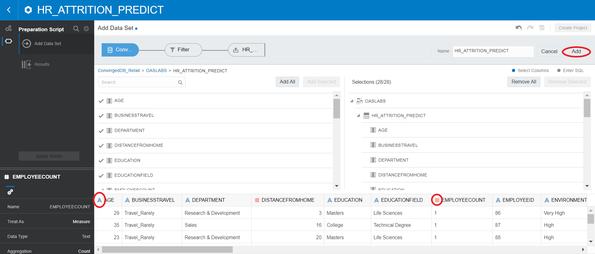
5. Click on "Create Project" to create visualizations.
    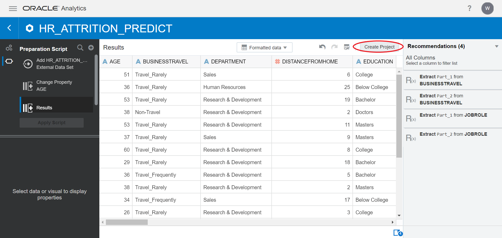
6. Click on “+” symbol  and click on Create Scenario , to apply the ML model on the test data.
    
7. Select the ML model created previously in STEP 2 **Create Dataflow - ML model**, click on Ok.
    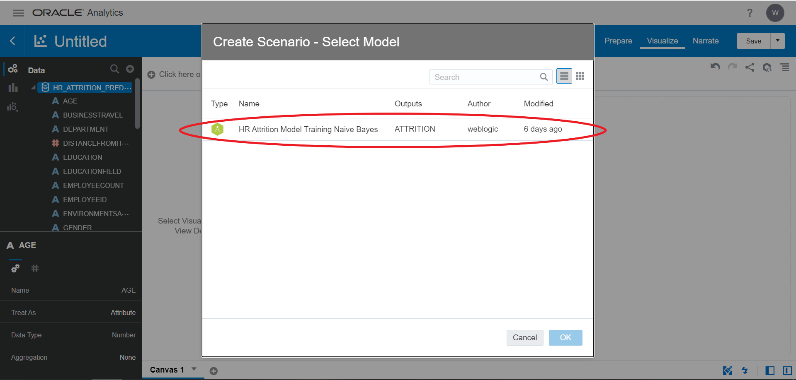
8. We can see that the model has successfully been added to the project.
    
9.  Right Click on model name and verify the column mapping, perform the changes in case of any missed mappings.
    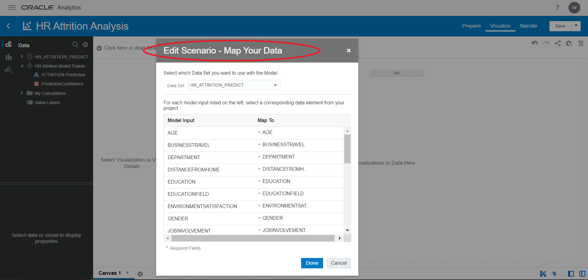

Now our training model is successfully mapped to the ML model.

## **STEP 5**: Create Visualizations

In this step we will enrich our insights with predictive analytics by creating some visuals on the prediction data.

1. Select "Employee Count" column from HR\_ATTRITION\_PREDICT table.  
Right click on the column and select Pick visualization.
    
2. Select the "Performance Tile" visualization.
    
3. Now we will analyze on employees based on job satisfaction and work-life balance.  
     Select Employee count, JobSatisfaction and Worklife balance from the prediction table and pick "Horizontal Stacked" visualization.
    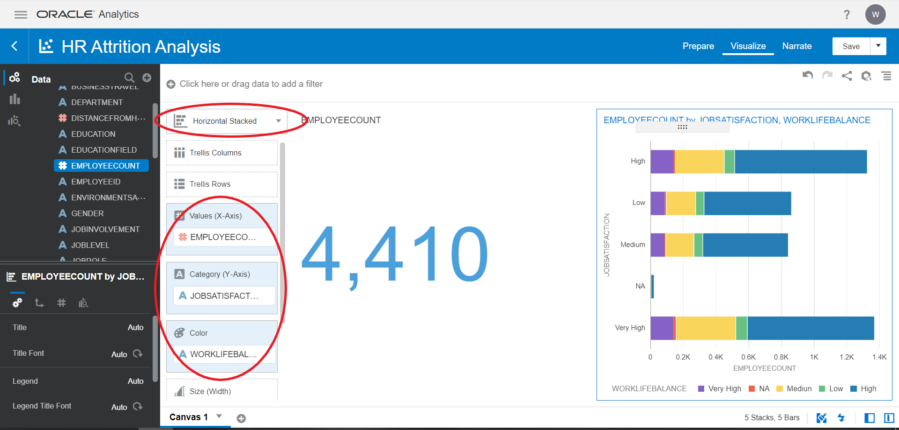
4. Similar to the above steps ,create Horizontal stacked graph with Employee count, JobInvolvement and Performance Rating columns.
    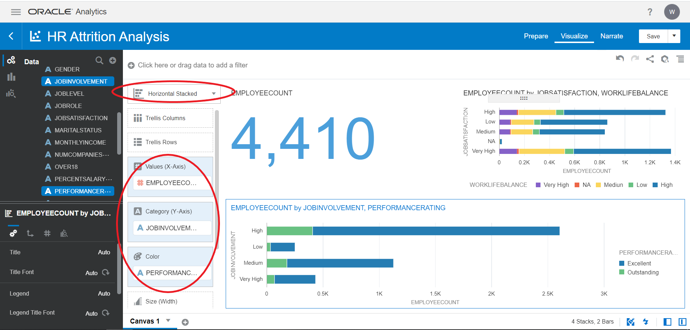
5. Now we will analyze further on “duration of employees with current company”.  Select "Employeecount" and "Yearsatcompany" from the prediction table and pick Line Graph.
    
6. We will now see Employees via Department and Job Role.  Select EmployeeCount, Job Role and Department. Pick Pivot as visualization.
    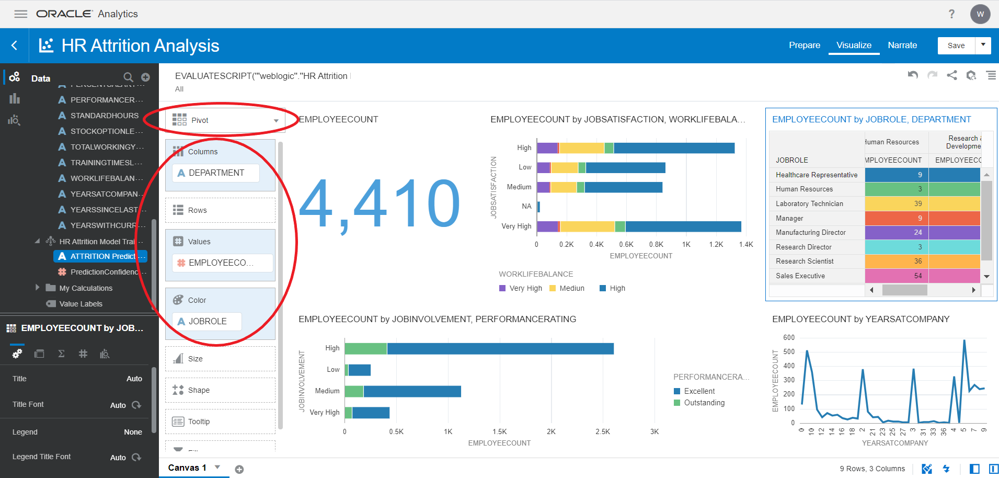
7. We can also hide the Employee count label that is being shown on the Pivot. Right click on the graph and select "Hide Value labels".
    
8. We can rearrange the visualizations by simple drag and drop , to make the canvas more appealing.
    
9. Now , we will enrich the visualization by adding “Attrition Predict” from the Model as below.  Select Employee Count, Department, Jobrole and Attrition Predict. Pick table as visualization
    
This way we can see how many employees are likely to leave by Department and Job Role.
10. Lets add, “Attrition Predict” as a global filter for it to reflect across the whole canvas.  Drag the column to the top.
    
11. When we set "Attrition Predict" to YES , the tool only filters data of employees predicted to quit the company and applies to the analysis we conducted previously as seen below.
    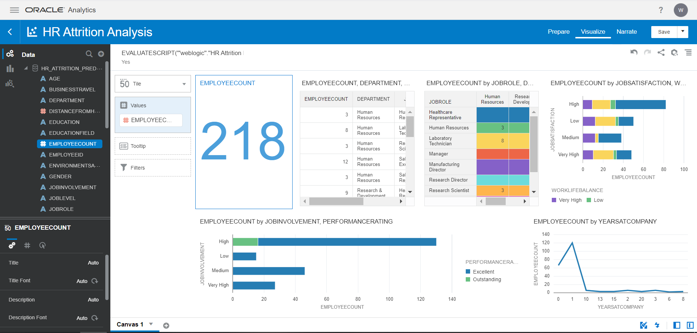

It is vital for a HR Department to identify the factors that keep employees and those which prompt them to leave, this way we can provide related insights as to how many employees are likely to quit and the probable reason behind it , so that Organizations could do more to prevent the loss of valuable resources to the company.

## Want To Learn More

- [A Blog on Forecast](https://blogs.oracle.com/analytics/is-your-forecasting-like-running-with-scissors-feature-friday)

## Acknowledgements

- **Authors** - Balasubramanian Ramamoorthy, Sudip Bandyopadhyay, Vishwanath Venkatachalaiah
- **Contributors** - Jyotsana Rawat, Satya Pranavi Manthena, Kowshik Nittala, Rene Fontcha
- **Last Updated By/Date** - Rene Fontcha, LiveLabs Platform Lead, NA Technology, December 2020

