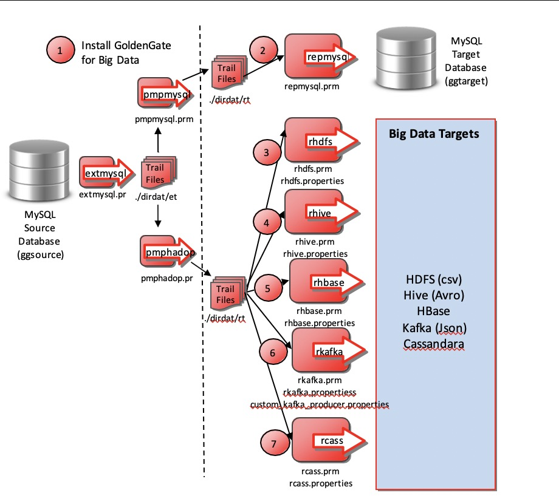

# Goldengate Classic Workshop

## How to Prepare for This Workshop 

- Once you are viewing the workshop's gitHub page's website, you can see a list of Lab Guides at any time by clicking on the **Menu Icon**

## Oracle Golgengate Classic Workshop

Welcome to the Golden Gate Classic Workshop. The content will give you a basic understanding of Golden Gate and replication real time.

## Introduction

The GoldenGate Workshop is designed to introduce replication capabilities from relational sources real time.  For more information, please discuss this with the workshop facilitator or the Data Integration Sales team.

## Workshop architecture

## Workshop Details

There are 6 hands-on labs in this workshop. GoldenGate software for MySQL are auto-installed as part of the initial setup. After running Lab 1 – GG setup, the rest of the labs can be run independently of each other, and in any order.

Lab 1 – GoldenGate Initial Setup 

Lab 2 – One way replication Oracle to MySQL

Lab 3  – One way replication mySQL to Oracle 

Lab 4 – Bidirectional / Active-Active replication 

Lab 5 – GG column conversions

