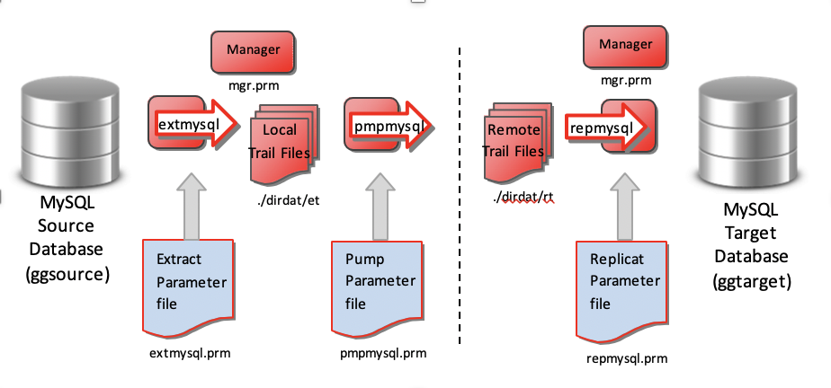

# Lab 1 -  GG initial setp 

## Want to learn more:

  [Oracle GoldenGate | Oracle](https://www.oracle.com/middleware/data-integration/goldengate/)

## Introduction

Lab1_OGG_Classic_Hands on_Prerequisites

Lab2_OGG_Env_Initial_Setup

Lab3_One_Way_Replication_Oracle_to_MySQL

Lab4_One_Way_Replication_MySQL_to_Oracle 

Lab5_Active_Active_Replication 

Lab6_Column_Conversions

### Objectives

KEY FEATURES

Non-invasive, real-time transactional data streaming

Secured, reliable and fault-tolerant data delivery 
Easy to install, configure and maintain 
Streams real-time changed data 
Easily extensible and flexible to stream changed data to other big data targets and message queues

KEY BENEFITS

Improve IT productivity in integrating with big data systems 
Use real-time data in big data analytics for more timely and reliable insight 
Improve operations and customer experience with enhanced business insight • Minimize overhead on source systems to maintain high performance

Oracle GoldenGate provides optimized and high performance delivery to relational and nonrealational targets to support customers with their real-time replication initiatives.

Time to complete -  60 mins

### Summary

Oracle GoldenGate offers high-performance, fault-tolerant, easy-to-use, and flexible real- time data streaming platform for enterprise environments. It easily extends customers’ real-time data integration architectures without impacting the performance of the source systems and enables timely business insight for better decision making and High Availability.

### Disclaimer

This workshop is only for learning and testing purposes. None of the files from the labs should be used in a production environment. 

## Prereqs (Completed by Oracle Team prior to Labs)

## Steps

In this lab, these repreqs will prepare GoldenGate for this Workshop. 

**Step1:** Open terminal from desktop by double clicking on the icon

Prereqs (Completed by Oracle Team prior to Labs)
•	mkdir /opt/Test_Software
•	Downloaded the following software zip files to the "Software" folder:
   		a) OGG Classic v19.1.0.0.3 for MySQL on Linux x64
   		b) OGG Classic v19.1.0.0.4 for Oracle on Linux x64
   		c) Oracle Database v19.3.0.0.0 for Linux x64
   		d) Oracle Instant Client Basic v19.3.0.0.0 for Linux x64

Create pdbs
•	PDBEAST
•	Source pdb
   cd /u02/oradata/ORCL/
mkdir PDBEAST
 alter system set db_create_file_dest='/u02/oradata/ORCL//PDBEAST';
sqlplus / as sysdba
alter pluggable database oggoow19 close immediate;
alter pluggable database oggoow19 open read only;
 create pluggable database PDBEAST from oggoow19;
 alter pluggable database PDBEAST open;
exit
•	PDBWEST
•	Source pdb
   cd /u02/oradata/ORCL/
mkdir PDBWEST
sqlplus / as sysdba
alter system set db_create_file_dest='/u02/oradata/ORCL//PDBWEST';
alter pluggable database oggoow191 close immediate;
alter pluggable database oggoow191 open read only;
 create pluggable database PDBWEST from oggoow191;
alter pluggable database PDBWEST open;
exit

•	Install Mysql Workbench
•	sudo yum install mysql-workbench-community
•	Start Mysql Workbench to test
•	/usr/bin/mysql-workbench –help

1. Change to the “/opt/TestSoftware/Oracle" directory.

2. Run the setup_database_for_ogg.sql script.
create user c##ggadmin identified by Oracle1 default tablespace oggtbls_pdbwest quota unlimited on        oggtbls_pdbwest profile ogg_profile;

    a) sqlplus / as sysdba @setup_database_for_ogg.sql
    b) The database will now contain two PDBs, PDBEAST and PDBWEST, and is configured for OGG replication.
    c) The common database user C##GGADMIN will be created, and the container user C##GGADMIN in PDBEAST and PDBWEST.

    mySQL
CREATE USER 'ggadmin'@'localhost' IDENTIFIED BY '@Oracle1@';
•	GRANT ALL PRIVILEGES ON * . * TO 'ggadmin'@'localhost';

## Done by Student:

Open a terminal session

STEPS -

1. Test connectivity for the OGG users:
	   a) sqlplus c##ggadmin
	       i. When prompted enter the password: Oracle1
	   b) sqlplus c##ggadmin@pdbeast
	       i. When prompted enter the password: Oracle1	
	   c) sqlplus ggadmin@pdbwest
	       i. When prompted enter the password: Oracle1
		   
2. Change to the "/opt/Test_Software/Scripts/Oracle/orderentry" directory
su – oracle
Password = Data1Integration!

3. Run the following commands:
  a) sqlplus / as sysdba
	b) alter session set container=pdbeast;
	sqlplus / as sysdba @create_user.sql
•	edit and chg to c##tpc
•	grant all priviledges to c##tpc;

	c) @create_user.sql
	d) sqlplus / as sysdba
	e) alter session set container=pdbwest;
	f) @create_user.sql
	g) sqlplus c##tpc@pdbeast
	   1) When prompted enter the password: Oracle1
	h) @database.sql
	i) sqlplus c##tpc@pdbwest
	   1) When prompted enter the password: Oracle1
	j) @database.sql
	k) Each PDB in the database (pdbeast and pdbwest) will now contain a TPC schema with seeded tables.

4. Enter "exit" to logout as the "oracle" user.

5. Test connectivity to MySQL by executing the commands:
sudo service mysqld start
sudo mysql -u ggadmin -p@Oracle1@
create database tpc;
create database ggadmin;
use tpc
	show tables;
	There should be 14 tables in the tpc database.
exit;

sudo mysql -u ggrep -p@Oracle1@
use tpc
	show tables;
	  There should be 14 tables in the tpc database.
 exit;

GoldenGate for Oracle
	
8.start a second session

6. Switch to the "oracle" user.
    a) sudo su – oracle
export OGG_HOME=/u01/app/oracle/product/19.1.0/gg

7. Go to the $OGG_HOME location
    a) cd $OGG_HOME

8. Start ggsci and execute the following commands:

a) ./ggsci
   	 b) create subdirs
	c) dblogin userid c##ggadmin@orcl, password Oracle1
	   i) This validates remote connectivity to the Oracle Database.
	d) exit

GoldenGate for mySQL

9. Mysql -uroot -pData1Integration!
CREATE USER 'ggrep'@'localhost' IDENTIFIED BY '@Oracle1@';
	GRANT ALL PRIVILEGES ON * . * TO 'ggrep'@'localhost';

>mysql\q

10. Go to the "oggmysql" directory.
    a) cd /u01/app/oracle/product/19.1.0/oggmysql

11. Set the environment variable OGG_HOME to this directory.
    a) export OGG_HOME=/u01/app/oracle/product/19.1.0/oggmysql

12. Start GGSCI and execute the following commands:
    a) create subdirs
	b) dblogin sourcedb tpc@localhost:3306, userid ggadmin, password @Oracle1@
	   1) This validates remote connectivity to the MySQL Database for capture.
	c) dblogin sourcedb tpc@localhost:3306, userid ggrep, password @Oracle1@
	   1) This validates remote connectivity to the MySQL Database for apply.
	d) exit
	
13. Enter "exit" twice to close the connection to the database machine.

14. Shutdown the MySQL database.

Sudo su -
    a) sudo service mysqld stop

Shutdown the Oracle database.

15. Switch to the oracle user.
    a) sudo su – oracle / Data1Integration!

16. Shutdown the Oracle database and listener.
    a) sqlplus / as sysdba
	   i) shutdown immediate
	   ii) exit

17. Enter "exit" twice to close the connection to the database machine.

**You have completed Lab 1 - You may proceed to the next Lab**

## Acknowledgements

  * Authors ** - Brian Elliott
  * Contributors ** - Brian Elliott
  * Team ** - Data Integration Team
  * Last Updated By - Brian Elliott, August 2020

## Please submit an issue on our issues page:
[issues](https://github.com/oracle/learning-library/issues) 

 We review it regularly.

