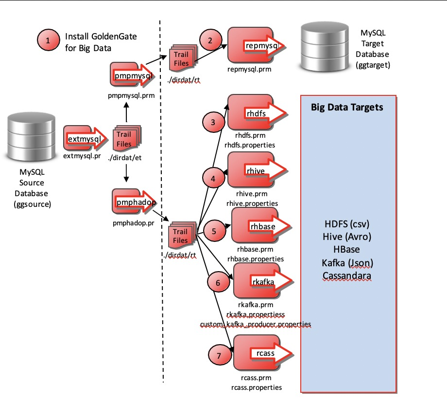

# Goldegate for Big Data Hands-On-Lab  #

## Workshop Overview ##

**GoldenGate for Big Data** Oracle GoldenGate for Big Data offers high-performance, fault-tolerant, easy-to-use, and flexible real- time data streaming platform for big data environments. It easily extends customers’ real-time data integration architectures to big data systems without impacting the performance of the source systems and enables timely business insight for better decision making. This hands-on workshop focuses on **GoldenGate Real Time Data Capture** demonstrating 4 scenarios that you can use (both on-premise and in the cloud) to capture real time data changes from your sources.

## Workshop Requirements

- Access to Live Labs
  
- Access to a laptop or a desktop
    - To log into Live Labs

## Agenda

- **Lab 1 :** Installation Of GoldenGate for Big Data

In this lab we will install GoldenGate for Big Data in the GG Target Home. Follow the steps below to install GG, or optionally you can select “I” from the Lab Menu below to auto-install GG.

- **Lab 2 :** Replication from Relational Database to Relational Database using GoldenGate

This lab is intended to give you familiarity with how to configure GG for database to database replication. If you are already familiar with GG, you can choose to skip this lab.

- **Lab 3 :** Replication from Relational to HDFS

This lab is intended to give you familiarity with how to configure GG for database to database replication. If you are already familiar with GG, you can choose to skip this lab.

- **Lab 4 :** Replication from Relational to Hive

In this lab we will load data in MySQL database ‘ggsource’, GG extract process ‘extmysql’ will capture the changes from MySQL’s binary logs and wrote them to the local trail file. The pump process ‘pmphadop’ will route the data from the local trail (on the source) to the remote trail (on the target). The replicat
process ‘rhive’ will read the trail file, create the Hive tables, write the data and the schema files (avsc) to the HDFS target directory for Hive: /user/ggtarget/hive/data/* and /user/ggtarget/hive/schema/*

- **Lab 5 :** Replication from Relational to HBase

In this lab we will load data in MySQL database ‘ggsource’, GG extract process ‘extmysql’ will In this lab we will load data in MySQL database ‘ggsource’, GG extract process ‘extmysql’ will capture the changes from MySQL’s binary logs and write them to the local trail file. The pump process ‘pmphadop’ will route the data from the local trail (on the source) to the remote trail (on the target). The replicat
process ‘rhbase’ will read the remote trail files, create the HBase tables and write the data to those tables.

- **Lab 6 :** Replication from Relational to Kafka

In this lab we will load data in MySQL database ‘ggsource’, GG extract process ‘extmysql’ will capture the changes from MySQL’s binary logs and write them to the local trail file. The pump process ‘pmphadop’ will route the data from the local trail (on the source) to the remote trail (on the target). The replicat
process ‘rkafka’ will read the remote trail files, act as a producer and write the messages to an auto- created topic for each table in the source database.

- **Lab 7 :** Replication from Relational to Cassandra

In this lab we will load data in MySQL database ‘ggsource’, GG extract process ‘extmysql’ will capture the changes from MySQL’s binary logs and write them to the local trail file. The pump process ‘pmphadop’ will route the data from the local trail (on the source) to the remote trail (on the target). The replicat
process ‘rcass’ will read the remote trail files, create the Cassandra tables and write the data to those tables.

## Access the labs

- Use **Lab Contents** menu on your right to access the labs.
    - If the menu is not displayed, click the menu button  on the top right  make it visible.

Below is an architectural diagram of our labs

- You may close the menu by clicking 

- **Author** - Brian Elliott - August 2020