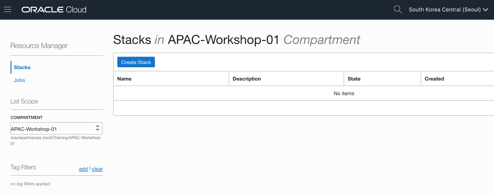
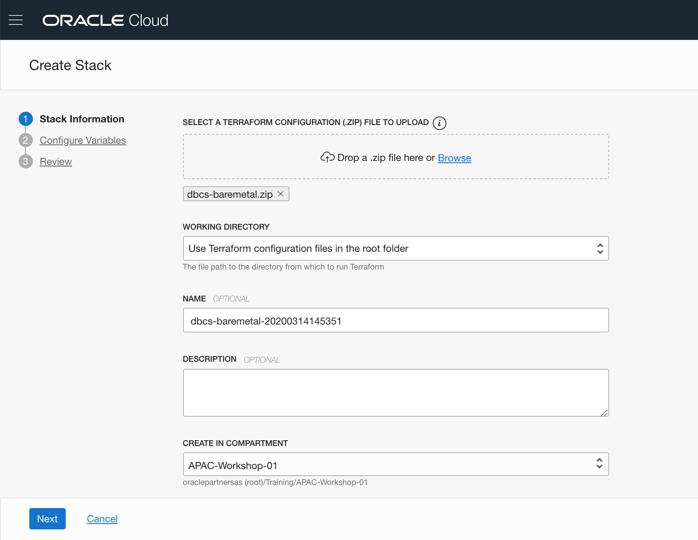
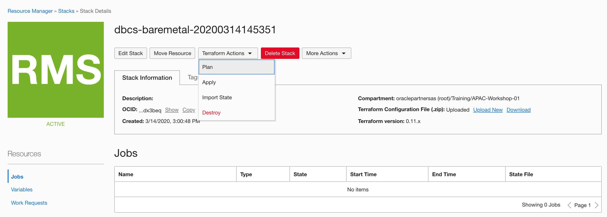
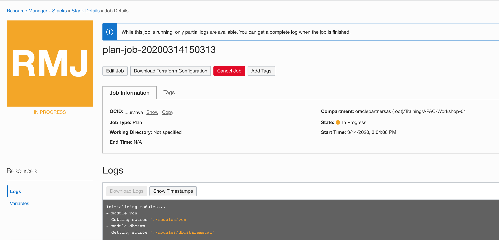
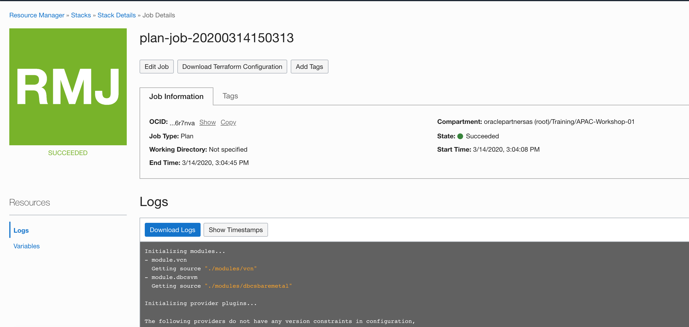
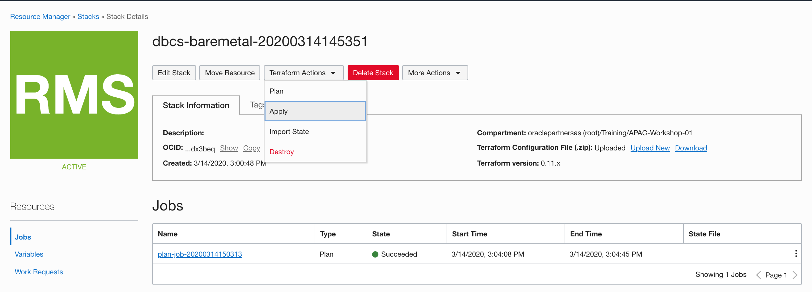
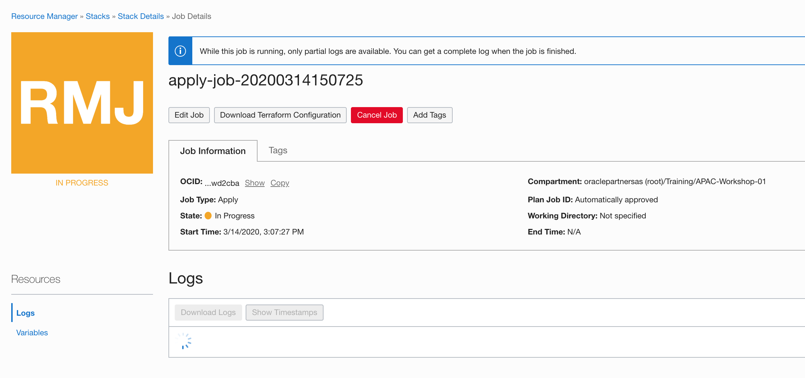
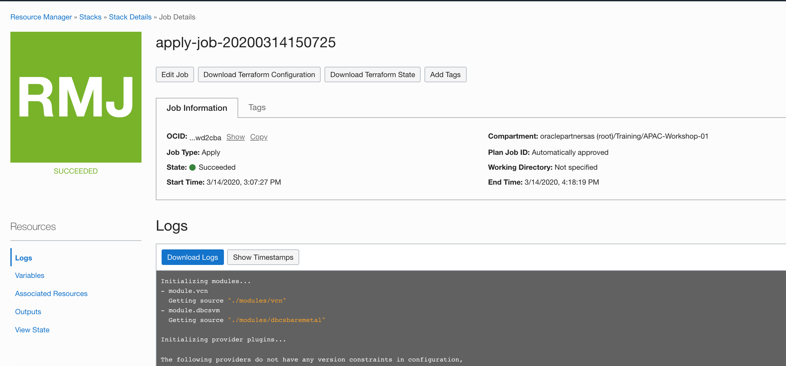

#Using Resource Manager to Provision Database Cloud Service on Bare Metal

Resource Manager is an Oracle Cloud Infrastructure service that allows you to automate the process of provisioning your Oracle Cloud Infrastructure resources. Using Terraform, Resource Manager helps you install, configure, and manage resources through the "infrastructure-as-code" model.

In the following steps, you will provision a single instance DBCS on Bare Metal using the Resource Manager.

## Prerequisites

Assumpt you have already prepared the following:

- You have an OCI account with proper privileges.

- An SSH Key pair which provided by instructor or generated by youself, using ssh-keygen(Linux, Mac) or putty-gen(Windows).

- A Terraform configuration (.zip) file which define the DBCS and related VCN.

- Collect your tenancy and compartment OCIDs in advance. you can check the following link for more details about OCID:

  https://docs.us-phoenix-1.oraclecloud.com/Content/General/Concepts/identifiers.htm#one

## Create a stack

1. Login to OCI Console. Open the navigation menu. Under **Solutions and Platform**, go to **Resource Manager** and click **Stacks**.

2. Choose the correct **Region** and a **Compartment** you have permission to work in.

3. Click **Create Stack**. In the **Create Stack** dialog, add your Terraform configuration (.zip) file which you prepared in advance. For example: *dbcs-baremetal.zip*.

   You can either drag and drop it onto the dialog's control or click **Browse** and navigate to the file location.

4. Accept the default **Working Directory**. Give a name of the stack or accept the default name. Verify the **Compartment** is corret. Click **Next**.

5. The **Configure Variables** panel displays variables auto-populated from the Terraform file you uploaded. 

   - Copy and paste the **Tenenacy** and **Compartment** ocid you collect before.
   - Modify the **Region** you want the DBCS provision in, for example: *us-phoenix-1*. 
   - Copy and paste all the content in the SSH public key file.
   - Enter the adminstrator password of the database you will provision. For example: *Welcome_123#*
   

   
6. Click **Next** to Review the variables, and click **Create**.

7. The stack is created.

## Generate an Excution Plan

Running a plan job parses your Terraform configuration file and converts it into an execution plan listing resources and actions that will result when an apply job is run.

1. In the **Stack Details** page, go to **Terraform Actions** and select **Plan**.
2. In the **Plan** dialog page, accept the default vaules and click **Plan**.
3. In the **Job Details** page, You can see the new job created with an initial state of "Accepted." Soon the status changes to "In Progress."
4. When the job is complete, you can review the execution plan or download the logs

## Run an Apply Job

When you run an apply job for a stack, Terraform creates the resources and executes the actions defined in your Terraform configuration file. The time required to complete an apply job depends on the number and type of cloud resources to be created.

1. Back to the **Stack Details** page, go to **Terraform Actions** and select **Apply**.
2. In the apply dialog, accept the default value and clik **Apply**
3. An new Job is created, in the Job Details page, You can see the job state is "Accepted." Soon the status changes to "In Progress."
4. Wait about 60 minutes, the job state change to Succeeded. The DBCS has been provisioned now.

