# Install a Front-end Client

## Introduction

Rather than requiring that you install Python and other software, the front-end application and related components have been created for you. In this lab, you will choose to install the front-end client as a Virtual Box image (VM) or Docker image.

Estimated time: 45 - 90 min

### Before You Begin

* You should choose the [Oracle VirtualBox](https://www.virtualbox.org/) option if you have neither Virtual Box nor Docker installed already.

* You should choose Docker if you are using an Apple Macbook or other Linux-based PC and have Docker installed.

*Note: you only need to choose one of the front-end client options.*

### Objectives

* Learn how to install the front-end client as a Virtual Box image (VM) or Docker image.

### Prerequisites

This lab assumes you have completed the following labs:
* Lab: Sign up for a Free Trial
* Lab: Provision a DevCS Instance
* Lab: Build Virtual Machines in Developer Cloud Service
* Lab: Create a Kubernetes Cluster

## Option 1: Install the Front-end Client as a VirtualBox image

1. If you don't have Oracle VirtualBox downloaded already download the VirtualBox from [here](https://www.virtualbox.org/) and follow the install instructions. Download OVA image from [here](https://objectstorage.eu-frankfurt-1.oraclecloud.com/p/smpE_ekRW19rd4H31B4fPspIqXxRm-iSuaQ9kOc8_K8/n/wedoinfra/b/DevCS_Clone_WedoDevops/o/HOL5967-OOW2019%20OVAHOL5967-OOW2019.ova "ova hol").

2. Once the image is downloaded or copied, please import the image in Oracle VM VirtualBox. Select **Menu File and Import Appliance…**:

  

3. Then choose the path to the .OVA copied or downloaded before and click **Continue**.

  

4. Leave default options and click **Import**:

  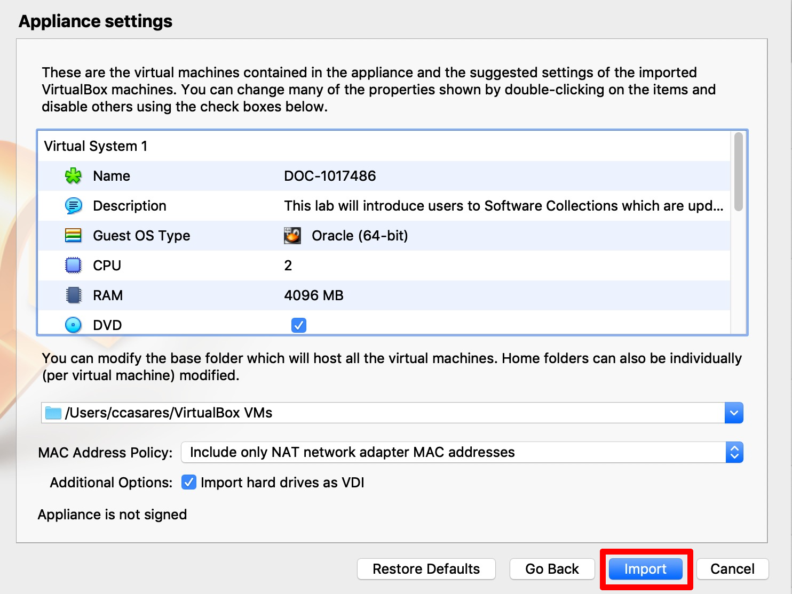

5. The process will take several minutes:

  

6. Once imported, you will have a VM. Select the VM and then click **Settings**. Then select **Shared Folders** and click the add folder button. Use the drop down and add the folder that contains your txt file with your information from the previous labs. Make sure that **Auto-mount** is enabled. and select **OK**.

  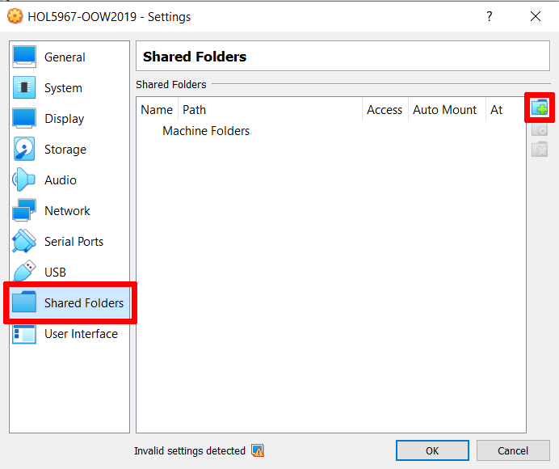

  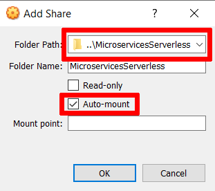

7. Start the VM by clicking the start button:

  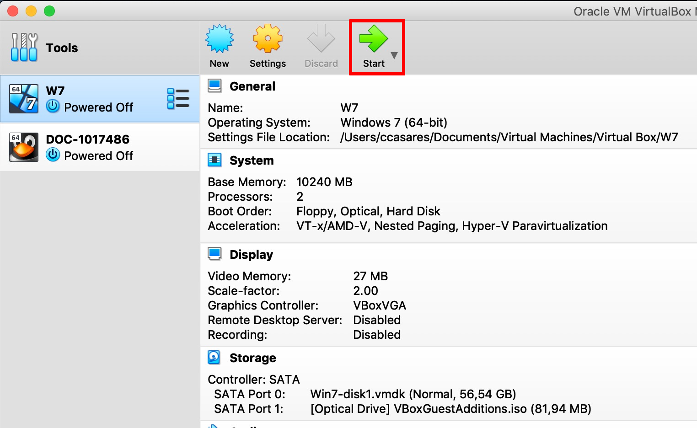

8. It should take some time to start the VM. Click enter and you should see the login screen.

  *NOTE: If you face any issue, please check that the Graphic Controller selected is VBoxSVGA as there are some issues in VirtualBox 6 if you use a different one.*

   

  *NOTE: You may encounter an issue stating "Implementation of the USB 2.0 controller not found!". To fix this issue you will need to select the virtual machine and then click Settings. Next select USB from the right side menu and make sure that "Enable USB Controller" is unselected. Then restart the VM.*

  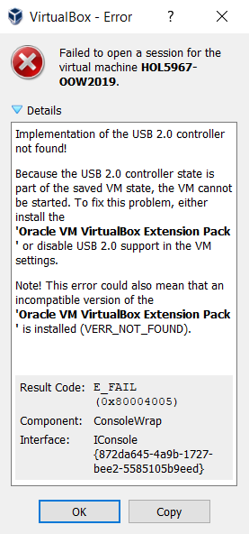

  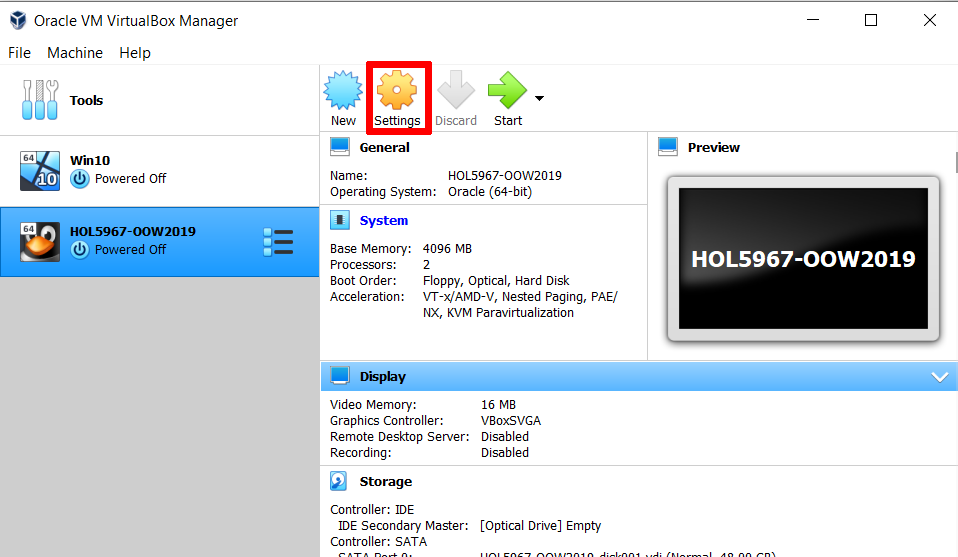

  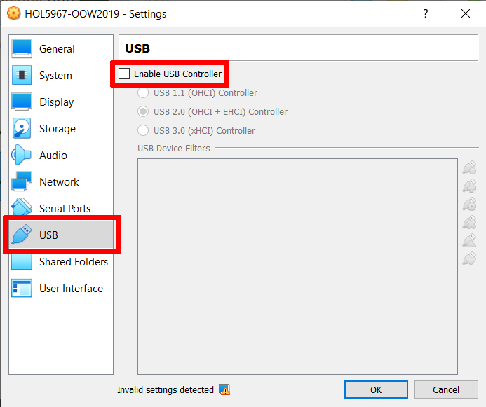

9. Click **Hand-On Lab User**. The password for the user is `oracle`.

  

### Configure `ocicli`

1. Once logged in, double click the mounted device and open the text file with information from the previous labs. You will now see the text file containing the information you will need to configure ocicli. You should also open Firefox and open this workshop and your oracle cloud account on the virtual machine.

  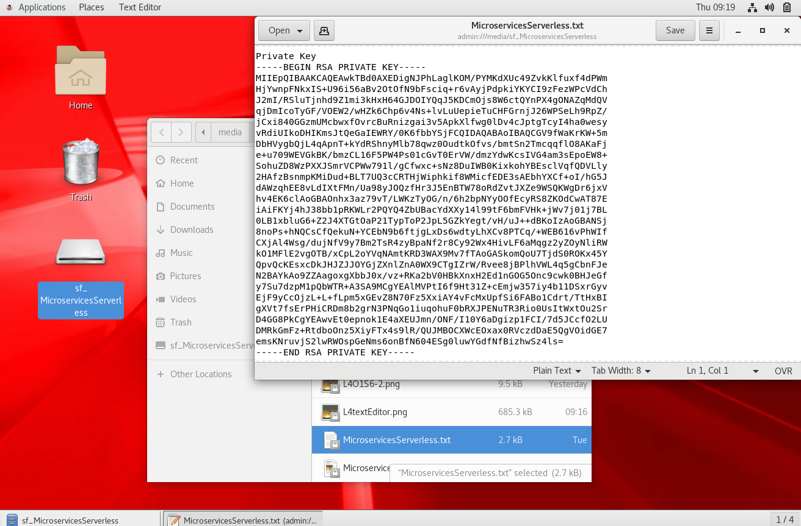

2. Open the text editor **Applications>Accessories>TextEditor**. Then copy the private key from your text file to a new blank text file. Last click save in the upper left corner and save in the directory holuser/.oci with the name private.pem. *You may need to create the folder named .oci*. 

  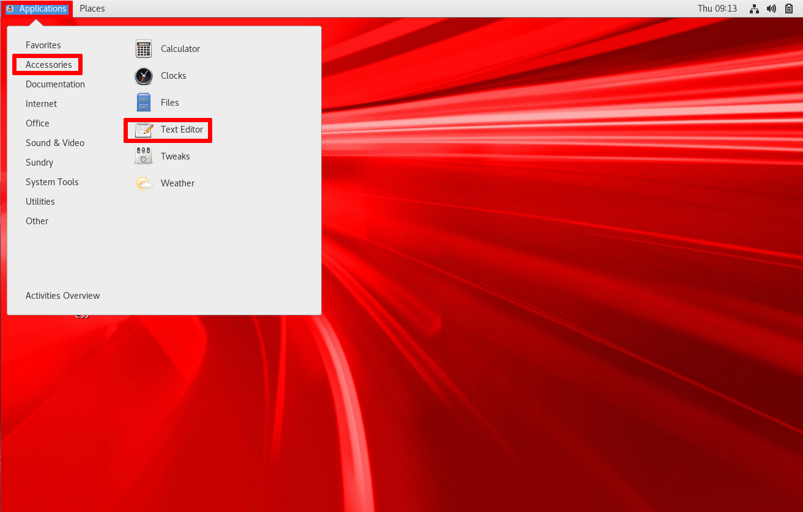

  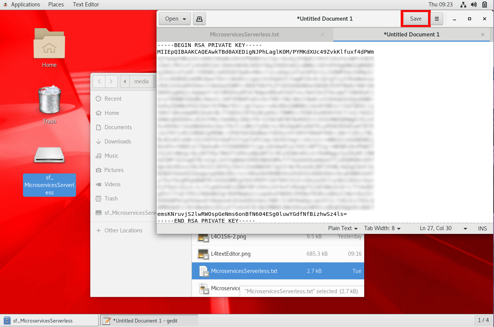

  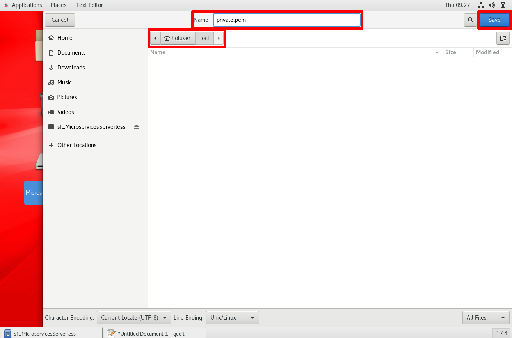

3. Once logged in, open a terminal window and execute the next command to configure ocicli.

  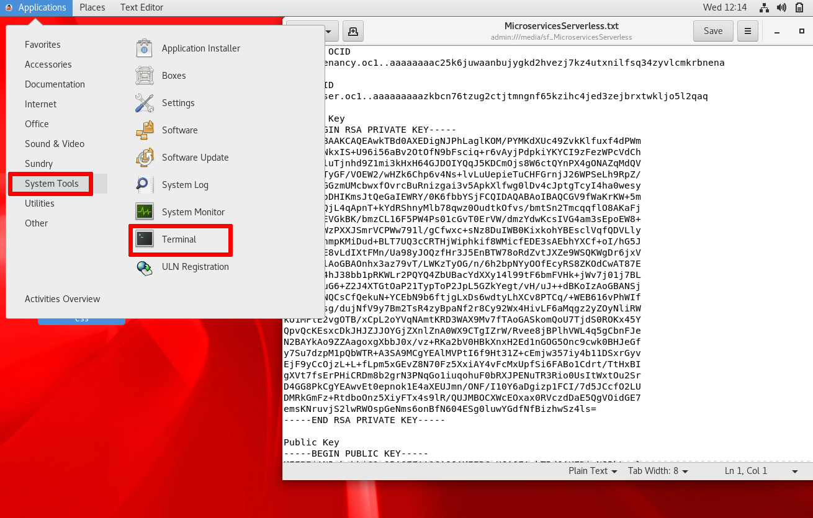

  	````
  	<copy>
	cd /
  	oci setup config
  	</copy>
  	````

  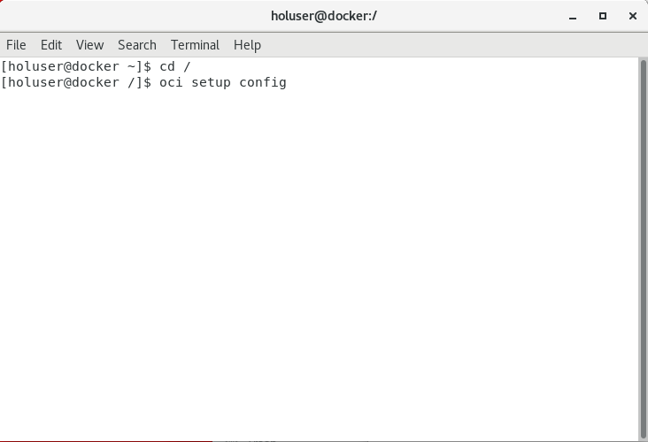

4. Keep the txt file with your OCI Tenancy parameters close as you will be asked for those parameters. When prompted to enter a location for your config press enter. When prompted for a user OCID copy and paste your user OCID from the text file. When prompted to enter a tenancy OCID copy and paste your tenancy OCID from the text file. When prompted for your region enter your region. If you do not know your region go to oracle cloud then click on manage regions and copy the region identifier from your home region.

  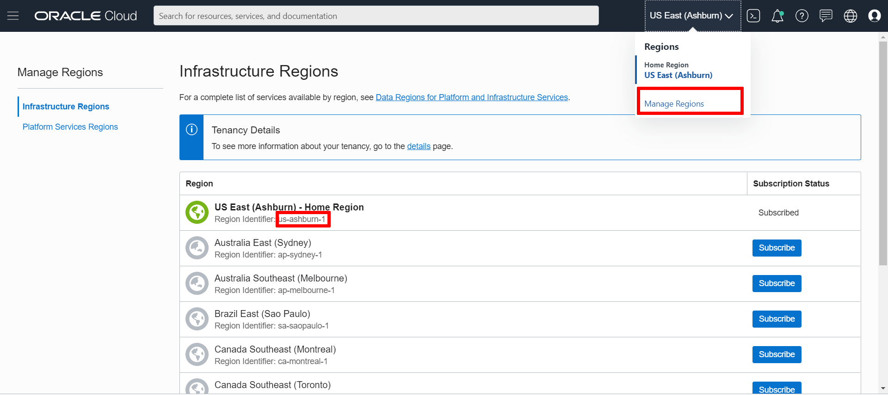

  

5. Decline to generate a new RSA key pair by typing `n` and hitting enter. When prompted for the location of your private key file enter the command below.

	```
  	<copy>
	/home/holuser/.oci/private.pem
	</copy>
  	````

  

6. Now let’s configure kubectl. Open a browser inside the virtual machine and access your cluster information page. Inside your cluster information page, click the “Access Cluster” button:

  

7. A popup window will appear providing you with the commands you have to run to configure kubectl to connect to the Kubernetes cluster just created. First run the command below.

  ```
  <copy>cd ~
  oci setup repair-file-permissions -–file /home/holouser/.oci/private.pem</copy>
  ```
  Select Local Access, then copy and paste the commands highlighted below from the popup window into the terminal.

  

8. Next you need to setup and configure the `kubectl` dashboard.
  Before you can open the dashboard you need to apply a file to kubernetes.
  ```
  <copy>kubectl apply -f https://raw.githubusercontent.com/kubernetes/dashboard/v2.0.1/aio/deploy/recommended.yaml</copy>
  ```
  Create an authorization token for the dashboard by running the following command

  ```
  <copy>kubectl -n kube-system describe secret $(kubectl -n kube-system get secret | grep oke-admin | awk '{print $1}')</copy>
  ```
  The output should be similar to the following.
  ```
  Name:         oke-admin-token-gwbp2
  Namespace:    kube-system
  Labels:       <none>
  Annotations:  kubernetes.io/service-account.name: oke-admin
                kubernetes.io/service-account.uid: xxxxxxxx-xxxx-xxxx-xxxxxxxxxxxx

  Type:   kubernetes.io/service-account-token

  Data
  ====
  ca.crt 1289 bytes
  namespace: 11 bytes
  token: eyJh_____--hDmSQ
  ```
  In the above example `eyJh_____--hDmSQ`(abbreviated for readability) is the authentification token. You will need this later to login to the kubernetes dashboard.

  Enter the following command to start the kubernetes dashboard.
  ```
  <copy>kubectl proxy</copy>
  ```
  Now copy the URL below into the browser in the virtual machine.
  ```
  <copy>http://localhost:8001/api/v1/namespaces/kubernetes-dashboard/services/https:kubernetes-dashboard:/proxy/</copy>
  ```

10. When prompted copy and paste the token from before into the web browser and click **SIGN IN**. Finally you are logged in to Kube Dashboard:

  

  

11. To enable Kubernetes to pull an image from Oracle Cloud Infrastructure Registry when deploying an application, you need to create a Kubernetes secret. The secret includes all the login details you would provide if you were manually logging in to Oracle Cloud Infrastructure Registry using the docker login command, including your auth token.

  First stop the dashboard by typing `Ctrl+c` into the terminal. Run kubectl command below after replacing the `UPPERCASE` portions. The `NAMESPACE` should be in your txt file. Your `USERNAME` is likely the email you used to create your oracle cloud account. You should have copied the `AUTHTOKEN` from the oracle cloud shell in Lab 1.

  ```
  <copy>kubectl create secret docker-registry ocirsecret --docker-server=fra.ocir.io --docker-username='NAMESPACE/USERNAME' --docker-password='AUTHTOKEN' --docker-email='USERNAME'</copy>
  ```

  

12. If you then go to Kubernetes Dashboard in your browser inside the VM and navigate to the **Secrets** menu under the **Config and Storage area**, you will see the secret you have just created:

  

**IMPORTANT NOTE:** Once you have completed this section, proceed to the [next lab](?lab=lab-5-import-developer-cloud-service).

## Option 2: Install the Front-end Client as a Docker image

1. If you have docker already installed in your laptop (ideally on Mac or Linux as Windows docker version may face some issues), open a terminal window and pull docker image associated to this hands-on-lab:

	````
	<copy>
	docker pull colivares1974/ociimage:hol5967
	</copy>
	````

  

2. Now create a folder in your local drive:

  Linux/MacOS:

	````
	<copy>
	mkdir -p ~/ociimage/tmp
	</copy>
	````

  or Windows:

	````
	c:\> <copy>md ociimage/tmp</copy>
	````

  

3. Launch Container while mounting the `ociimage` file:

	````
	<copy>
	docker run -it -p 8001:8001 -v ~/ociimage/tmp:/root/tmp colivares1974/ociimage:hol5967
	</copy>
	````

  

### Configure `ocicli`

Now let’s configure access to oci tenancy via ocicli with our tenancy details. info will be used by kubectl to configure a config file to access to Kubernetes cluster previously created. Then, to enable Kubernetes to pull an image from Oracle Cloud Infrastructure Registry when deploying our application, you need to create a Kubernetes secret. The secret includes all the login details you would provide if you were manually logging in to Oracle Cloud Infrastructure Registry using the docker login command, including your auth token. Finally we will launch Kubernetes proxy so that we can have access to Kubernetes Dashboard from a web browser.

1. Edit oci config file using. Modify config file with your tenancy details:

	````
	<copy>
	nano .oci/config
	</copy>
	````

  

2. Modify config file with your tenancy details(User OCID, Fingerprint, Tenancy OCID and Region). Keep path to private key in key\_file as it has already been loaded to that default path. When done press CTRL+o to save changes and CTRL+x to close nano editor:

  

3. Launch command to create a kubeconfig file modifying cluster-id and region with your tenancy details:

	````
	<copy>
	oci ce cluster create-kubeconfig --cluster-id <cluster-id> --file $HOME/.kube/config --region <region>
	</copy>
	````

  For example:

	````
	oci ce cluster create-kubeconfig --cluster-id ocid1.cluster.oc1.iad.aaaaaaaaafqtomjsmq3tszddmuyggyrtmqzdenzrmyygmzjzhc2dkoldgvst --file $HOME/.kube/config --region us-ashburn-1
	````

  

4. You can check details for config file created:

	````
	<copy>
	cat .kube/config
	</copy>
	````

  

5. To setup KUBECONFIG env variable, run next command:

	````
	<copy>
	export KUBECONFIG=$HOME/.kube/config
	</copy>
	````

6. Now let’s create Secret. You need to execute command below with your own tenancy credentials:

	````
	<copy>
	kubectl create secret docker-registry ocirsecret --docker-server=<region>.ocir.io --docker-username='<object_storage namespace>/<tenancy username>' --docker-password='<Auth Token>' --docker-email='<tenancy_username>'
	</copy>
	````

  For example:

	````
	kubectl create secret docker-registry ocirsecret --docker-server=iad.ocir.io --docker-username='idkmbiwb03s9/colivares1974@gmail.com' --docker-password='vm{wRs\>0d9DR4HedsAIY' --docker-email='colivares1974@gmail.com'
	````

  

  If successful, this line should appear as shown in the image above:

	````
	$ secret/ocirsecret created
	````

  You can proceed to the next lab.

## Want to Learn More?

* [Oracle VirtualBox Documentation](https://www.virtualbox.org/wiki/Documentation)
* [Docker Documentation](https://docs.docker.com/)

## Acknowledgements
* **Authors** -  Iván Postigo, Jesus Guerra, Carlos Olivares - Oracle Spain SE Team
* **Contributors** - Jaden McElvey, Technical Lead - Oracle LiveLabs Intern
* **Last Updated By/Date** - Tom McGinn, May 2020

## Need Help?
Please submit feedback or ask for help using our [LiveLabs Support Forum](https://community.oracle.com/tech/developers/categories/livelabsdiscussions). Please click the **Log In** button and login using your Oracle Account. Click the **Ask A Question** button to the left to start a *New Discussion* or *Ask a Question*.  Please include your workshop name and lab name.  You can also include screenshots and attach files.  Engage directly with the author of the workshop.

If you do not have an Oracle Account, click [here](https://profile.oracle.com/myprofile/account/create-account.jspx) to create one. Please include the workshop name and lab in your request.
