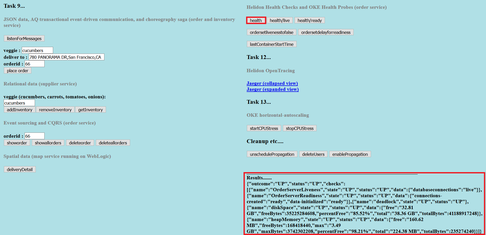
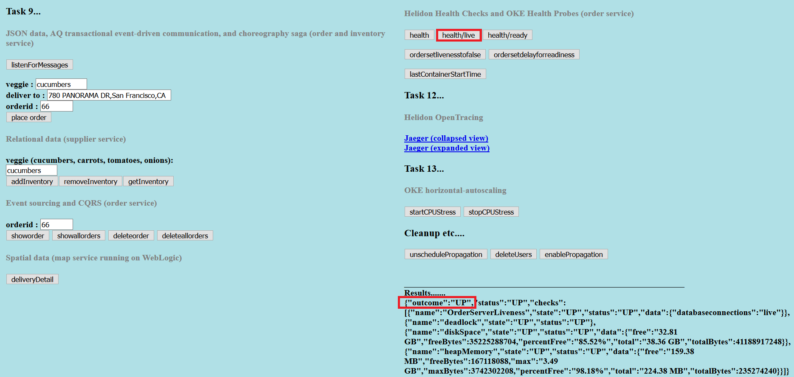
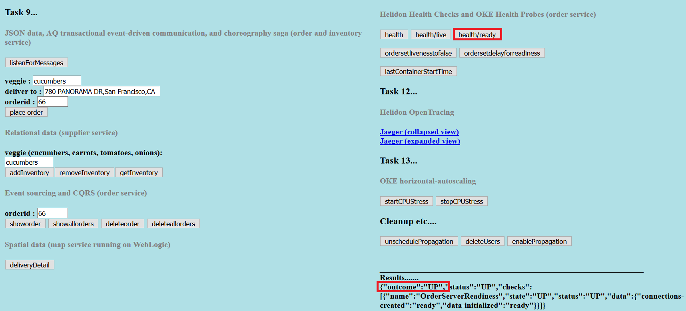
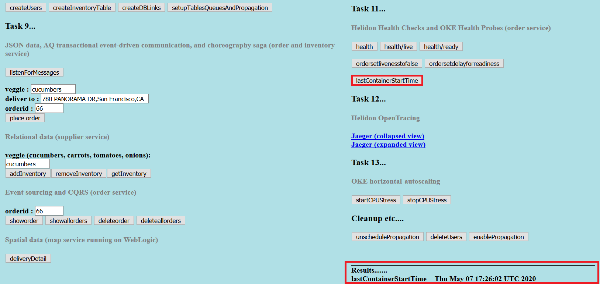
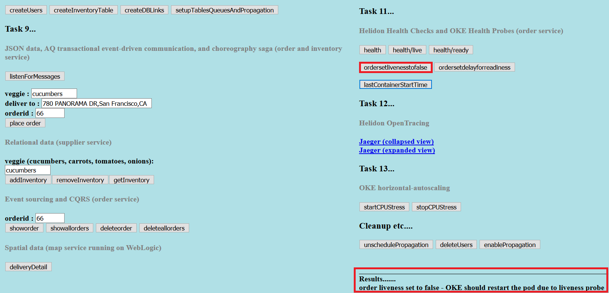
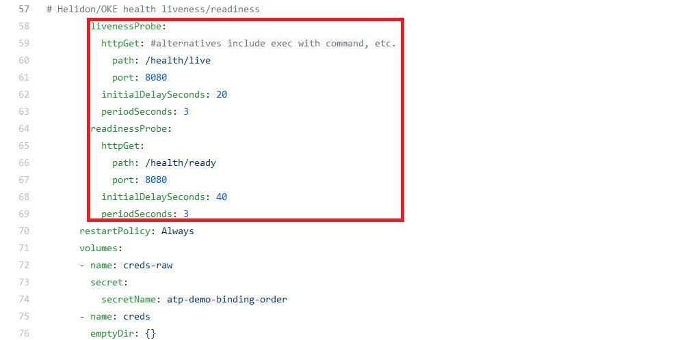
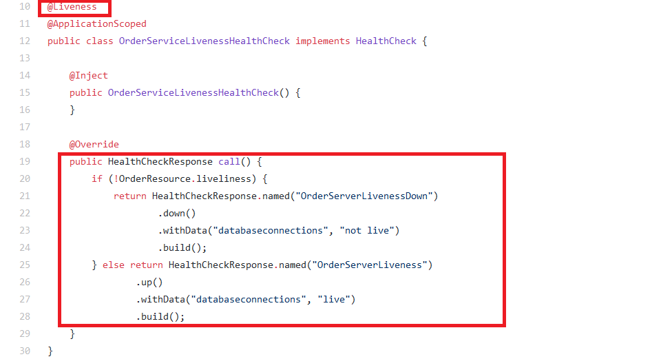
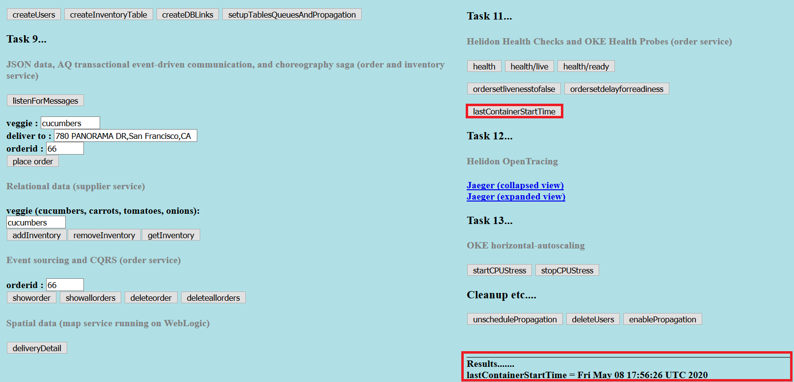
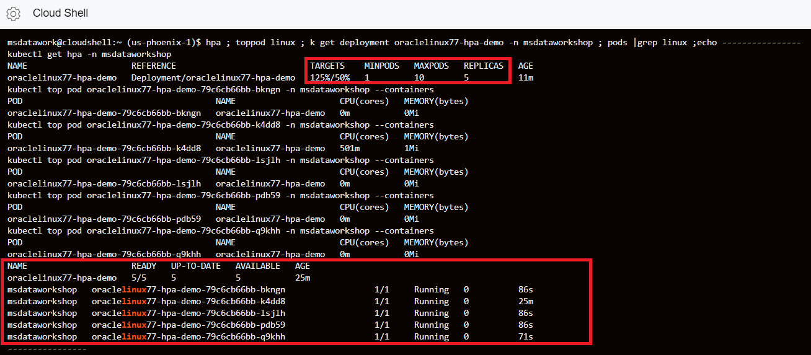

# Scaling Application Platform

## Introduction

This lab will show you how Helidon works with OKE health probes for liveness and
readiness. You will also monitor the microservices performance, perform
horizontal pod scaling and configure tracing with Jaeger.

### Objectives

- Measure health and readiness of microservices
- Monitor Microservices performance
- Implement horizontal scaling of OKE pod

### Prerequisite
This lab assumes you have already completed the following labs:
- Register for Free Tier
- Set up OCI, OKE, ATP and Cloud shell
- Set up Service broker and Messaging

## **STEP 1**: Measure health and readiness of microservices

1. Oracle Cloud Infrastructure Container Engine for Kubernetes (OKE) provides
    health probes which check a given container for its liveness (checking if
    the pod is up or down) and readiness (checking if the pod is ready to take
    requests or not). In this STEP you will see how the probes pick up the
    health that the Helidon microservice advertises. Open the frontend
    microservices home page. Click on “health” , “health/live” and
    “health/ready” buttons to see the information that is being captured by the
    health checks.

   

   The “health/live” result should show that the service is up.

   

   The “health/ready” result should show that the service is ready to receive
    requests, since all required connections have been created.

   

2. In order to observe how OKE will manage the pods, the microservice has been
    created with the possibility to set up the liveliness to “false”. Click
    **lastContainerStartTime** to check the age of the container.

   

3. Click the **ordersetlivenesstofalse** button, which will trigger the
    container to advertise that the service is not alive.

   

4. The OKE health probes check the advertised health metrics and if they are
    not healthy for a certain period, the infrastructure will reboot the pod.
    While the service is being restarted, lets see how the  mechanism works. The Order Helidon pom file is located in
    `$MSDATAWORKSHOP_LOCATION/order-helidon/pom.xml`. Observe the Helidon health
    dependencies.

   

5. The Kubernetes deployment yaml file also has liveness information. Open the
    yaml file located in
    `$MSDATAWORKSHOP_LOCATION/order-helidon/order-helidon-deployment.yaml`.
    Observe the parameter `livenessProbe`.

   

   The `livenessProbe` can be set up with different criteria, such as reading from a
file or an HTTP GET request. In this example the OKE health probe will use HTTP
GET to check the /health/live and /health/ready addresses every 3 seconds, to
see the liveness and readiness of the service.

6. The Java source code file shows how the liveness method is being calculated.
    Open the source code file located in
    `$MSDATAWORKSHOP_LOCATION/order-helidon/src/main/java/io/helidon/data/examples/OrderServiceLivenessHealthCheck.java`

   

   The method returns the down metric for health.

7. Go back to the frontend microservice front page and check the age of the
    container by clicking the **lastContainerStartTime** button. The time
    had now changed, reflecting that the pod was restarted.

   

## **STEP 2**: Implement horizontal scaling of OKE pod
Horizontal scaling is an important aspect for microservices architecture
    when it comes to providing application availability as the amount of
    workload or number of connections increases. In this example you will
    configure the OKE horizontal pod autoscaler. Horizontal pod autoscaler can
    be configured to check a certain advertised customer or standard metric.

1. Install the metric server first.

    ```
    <copy>cd $MSDATAWORKSHOP_LOCATION ; ./installMetricsServer.sh</copy>
    ```

2. Open the Cloud Shell and run the following command to deploy a simple Linux
    pod.

    ```
    <copy>kubectl run oraclelinux77-hpa-demo --image=phx.ocir.io/oraclegilsonmel/oraclelinux77-demo:latest --requests=cpu=200m --limits=cpu=500m tailf /dev/null -n msdataworkshop</copy>
    ```

   

   *Notice that the pod has request and limit CPU resource attributes.*

3. Check that the pod is running using the below command.

    ```
    <copy>pods | grep linux</copy>
    ```

   

4. Create a horizontal pod autoscaler for this container. Notice that this HPA
    will get triggered once CPU threshold exceeds 50%. Also the minimum number
    of pods is set to 1, while the maximum is 10.

    ```
    <copy>kubectl autoscale deployment oraclelinux77-hpa-demo --cpu-percent=50 --min=1 --max=10 -n msdataworkshop</copy>
    ```

   

5. Run the below command to get additional information about the HPA deployment
    and CPU utilization of the pod.

    ```
    <copy>hpa ; toppod linux ; k get deployment oraclelinux77-hpa-demo -n msdataworkshop ; pods | grep linux ;echo ----------------</copy>
    ```

   

6. Enter the pod, execute a command to stress the CPU.

    ```
    <copy>podshell linux</copy>
    ```

   

    ```
    <copy>stress --cpu 4 &</copy>
    ```

   

7. Use the `exit` command to leave the linux pod.

    ```
    <copy>exit</copy>
    ```

   

8. Execute the commands below to get additional information about the HPA and linux pods.

    ```
    <copy>hpa ; toppod linux ; k get deployment oraclelinux77-hpa-demo -n msdataworkshop ; pods | grep linux ;echo ----------------</copy>
    ```

    Notice that we currently have 5 pods deployed due to the stress test.

   

9. You can now delete the linux pods and HPA using the commands:

    ```
    <copy>k delete deployment oraclelinux77-hpa-demo -n msdataworkshop</copy>
    ```

   

    ```
    <copy>k delete hpa oraclelinux77-hpa-demo -n msdataworkshop</copy>
    ```

   

   This was a basic demonstration of horizontal autoscaling with microservices. It’s important to note that with the implementation of horizontal scaling the design of the application changes, as it needs to be able to handle the addition of replicas.

## Acknowledgements
* **Author** - Paul Parkinson, Dev Lead for Data and Transaction Processing, Oracle Microservices Platform, Helidon
* **Adapted for Cloud by** -  Nenad Jovicic, Enterprise Strategist, North America Technology Enterprise Architect Solution Engineering Team
* **Contributors** - Jaden McElvey, Technical Lead - Oracle LiveLabs Intern
* **Last Updated By/Date** - Tom McGinn, June 2020

## Need Help?
Please submit feedback or ask for help  using this [LiveLabs Support Forum](https://community.oracle.com/tech/developers/categories/building-microservices-with-oracle-converged-database). Please login using your Oracle Sign On and click the **Ask A Question** button to the left.  You can include screenshots and attach files.  Communicate directly with the authors and support contacts.  Include the *lab* and *step* in your request. 
