# Creating a Microservice and Web Frontend

## Introduction

Up until now we invoked our function from command line and via events. Time
for a Web Frontend.

Estimated Lab Time: 25 minutes

### Objectives

- Build a Web Frontend for our data using a serverless microservice
- Learn about different ways to search for data in the MySQL Document Store and via SQL
- Learn to modify data in the MySQL Document Store

## **STEP 1:** Understanding API Gateway

**API Gateway** provides public access to private APIs. It provides different
features like rate limiting or authentication to protect your application.

You find the **API Gateway** in the menu unter **Developer Services** right
below **Functions** we visited before.

  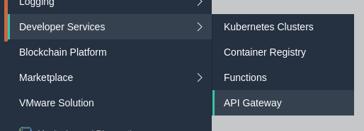

Our Setup already created a Gateway called **DemoApp**. Click on it. A single
Gateway can contain multiple Deployments. To find the Deployment the setup
generated click on **Deployments** in the Resources menu on the left and
click on the deployment *apideployment2020....*.

  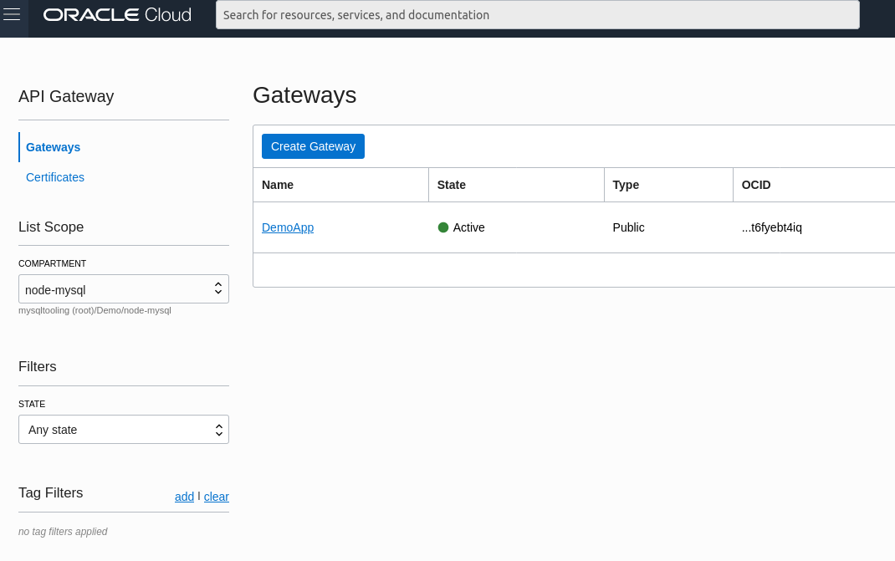

**Note: If `DemoApp` is not listed make sure that the `node-mysql` compartment is
selected in the box on the left!**

  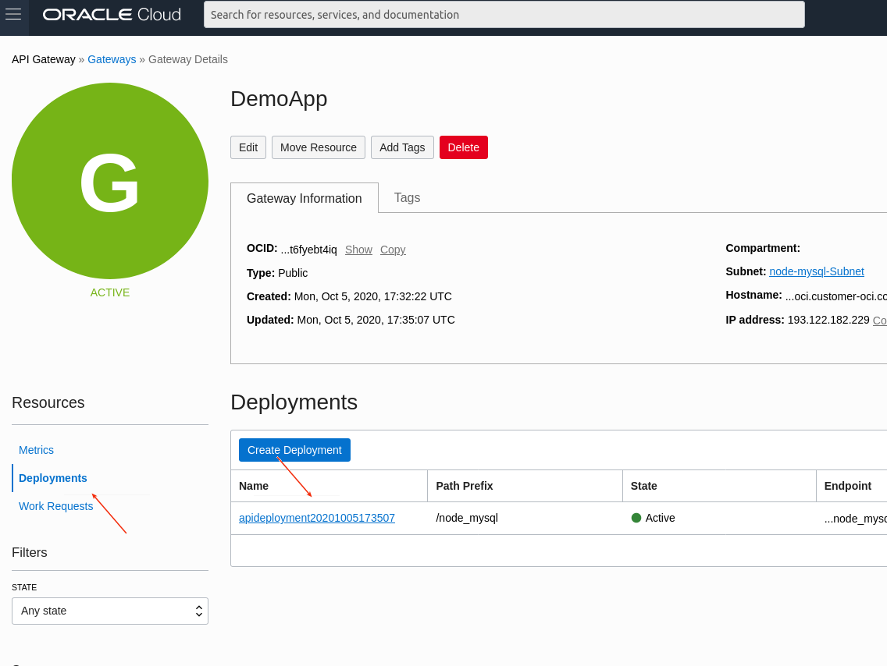

A Deployment is a set of routes from the frontend to a backend service.
Your Deployment's public Endpoint URL can be found on the Deployment page top
right.

In this deployment we have a pre-configured route. To see it click **Edit** and
then **Routes** on the left.

  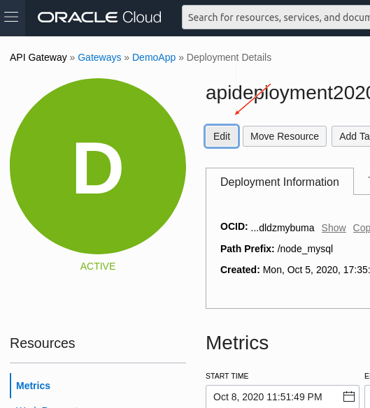

  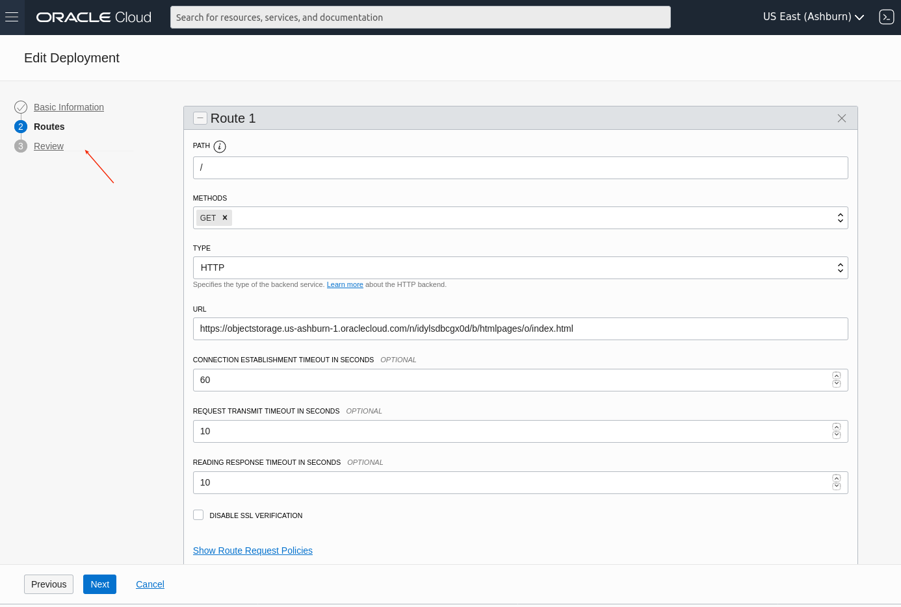

In there the path `/` is being forwarded to a file in the object storage. This
is what the `htmlpages` *Bucket* is for we saw while exploring the Object Store
in the previous Lab.

Alright, let's try it out. Click **Cancel** to go back and copy the Endpoint
URL, which looks like `https://bfds.....apigateway.us-ashburn-1.oci.customer-oci.com/node_mysql`
into a new browser tab. And ... you will get an JSON file with a 404 error.

Reason is that our route is called `/` so you have to append a `/` to the URL
after the `node_mysql`. Now a Website with two buttons should appear. If you
click those you'll receive errors as the services feeding data haven't been
provided yet. You can use your browser's "View Source" feature or download
the file from object store to look at our frontend's code. We won't go
through the code here in detail, but it should become obvious once we
put life into it by creating the backend service.

Time to create a new Function.

*Note: If you consider the URL ugly you could use your own domain name after
providing a TLS certificate. We will skip that here.*

## **STEP 2:** Our first Document Search

One task needed is to list the employees per state they are located in.
For serving the frontend a single function will be used. So let's create it,
just as before:

    [opc@compute ~]$ mkdir peopleService
    [opc@compute ~]$ cd peopleService
    [opc@compute peopleService]$ fn init --runtime node 
    Function boilerplate generated.
    func.yaml created.

Then install the dependencies:

    [opc@compute peopleService]$ npm install
    [opc@compute peopleService]$ npm install --save @mysql/xdevapi

    
This time this function is being used:

    const fdk = require('@fnproject/fdk');
    const mysqlx = require('@mysql/xdevapi');
    const date = require('./date');

    fdk.handle(async function(input, ctx) {
        const { config, headers } = ctx;

        const session = await mysqlx.getSession({
            host: config.mysql_host,
            port: config.mysql_port,
            user: config.mysql_user,
            password: config.mysql_pass,
        });
        const people = session.getSchema(config.mysql_schema).getCollection('people');

        try {
            if (headers['Fn-Http-H-X-Mode'][0] == 'state') {
                const result = await people
                    .find('city.state = :value')
                    .bind('value', headers['Fn-Http-H-X-Value'][0])
                    .execute();
                return result.fetchAll();
            } else {
                throw new Error(`Unknown mode ${headers['Fn-X-Mode'][0]}`);
            }
        } catch (err) {
            const hctx = ctx.httpGateway;
            hctx.statusCode = 500;
            return { success: false, err: err.message, stack: err.stack };
        } finally {
            session.close();
        }
    });

Just like the import Function it connects to MySQL using the configuration
provided. To keep number of different functions low it is prepared to handle
different *modes*. It then uses the X DevAPI's `find()` function to search
for documents showing the people from a given state.

For formatting of dates, we use a small helper, `date.js`:

    module.exports = () => {
        const d = new Date();
        let month = '' + (d.getMonth() + 1);
        let day = '' + d.getDate();
        const year = d.getFullYear();

        if (month.length < 2) {
            month = '0' + month;
        }
        if (day.length < 2) {
            day = '0' + day;
        }

        return [year, month, day].join('-');
    }

You can find the complete code in the `step3/peopleService` directory.

In case of an error the HTTP status code 500 is being used and an error
response send to the client.

Just like with the `import` service, this is deployed using the `fn`tool:

    [opc@compute peopleService]$ fn deploy --app DemoApp

*Note: Returning raw errors to a client can be a security issue. Raw errors
should be logged for debugging purpose.*

The function expects parameters to be provided as **HTTP Headers** in the Fn
call. How they'll get there we see, when configuring the route in the
API Gateway. So let's back into Console and open the Route configuration
in the deployment. In the bottom click **+Another Route**

Here we want to map from URLs like `.../state/AK`, `.../state/AL`, ... to
our function, while passing the *Mode* and the state's abbreviation as headers.

Set the **Path** of the new route to `/state/{name}`, which will map all the
states using a placeholder. Since this is for reading the **Method** is **GET**.
For calling our Function the **Type** is **Oracle Functions**, the **Application**
is **DemoApp** and the **Function** is **peopleService**, the service fucntion
we built and deployed above.

  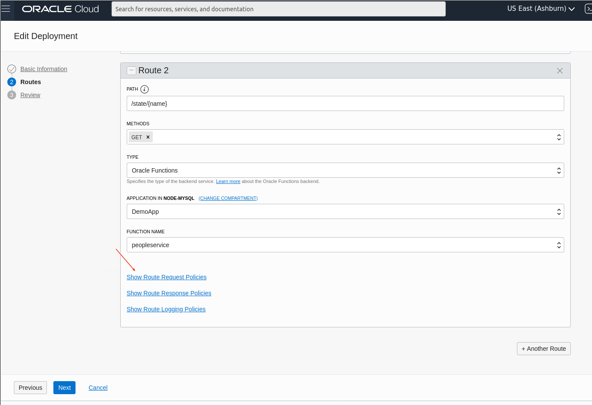

In order to set our extra **headers** click on **Show Route Request Policies**.
Be sure to pick **Request** and not Response.

A new panel will appear. Under **Header Transformations** click **Add**.

  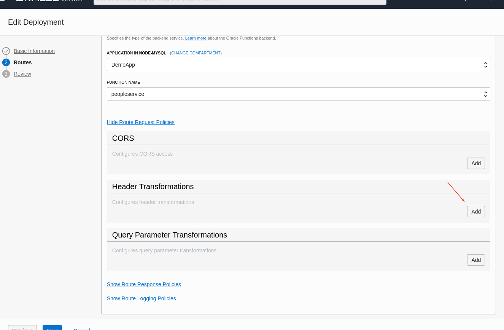

On the side an overlay will appear. In there pick the **Action** value **Set**
in order to set a header in the function request, for **Behavior** pick **Overwrite**.

The **Header Name** has to match the one we expect in our Function's code, **X-Value**.

As **Value** type `${request.path[name]}` and confirm by pressing enter, for
this field to be accepted. This takes the value from the placeholder of the
route's path we declared before.

Then click **+Another Transform** and repeat this for the **X-Mode** header and value **state**.

  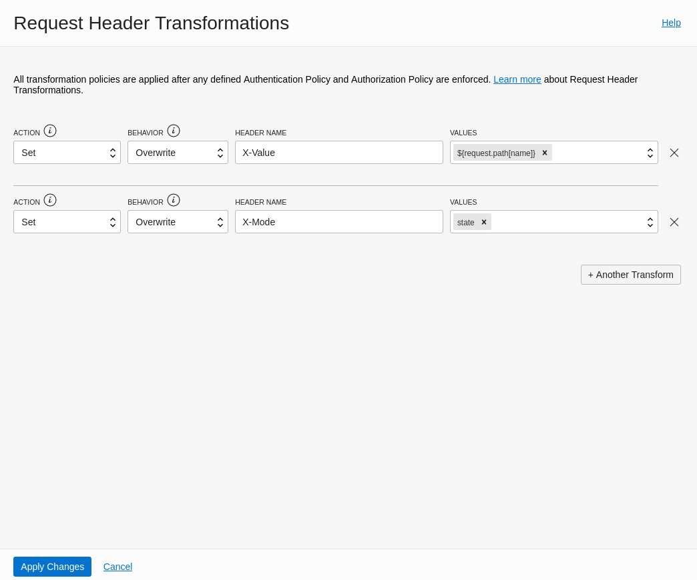

After clicking **Apply Changes** the panel in the main view updates.

  

Click **Next** to continue with the Wizard. On the following screen you can verify the route configuration.

  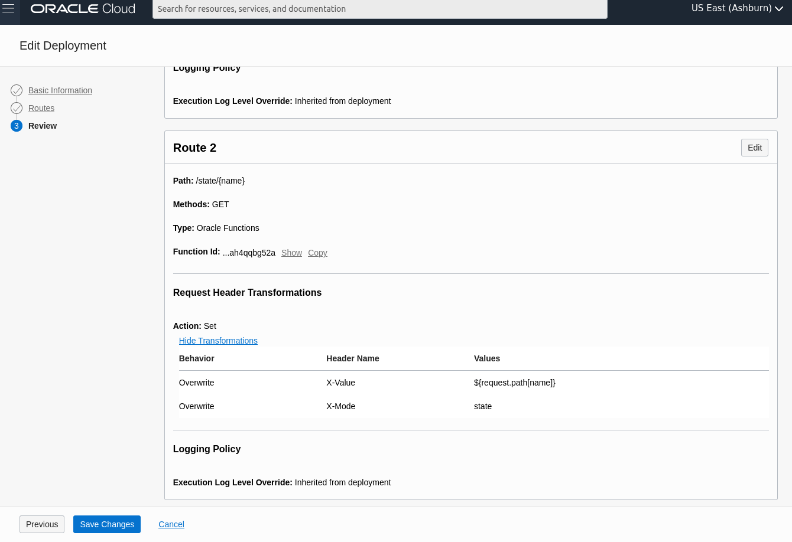

After clicking **Save Changes** you will be sent back to the Deployment Overview page and the changes
will be applied to the Gateway servers. Notifications on top right will notify you about the state.

  

Once the configuration is through you can retrieve the employee list from your browser by adding the
route's path and state abbreviation to your endpoint's URL. Something like
`https://bfds.....apigateway.us-ashburn-1.oci.customer-oci.com/node_mysql/state/FL`. This should
provide you with a JSON document containing a list of people and their details.
If you go back to the HTML page from our little application (URL in your browser ending with `node_mysql/`)
you can pick a state from the dropdown and click **Show people from state**, which should load a list.

Now you can explore the employees by state. Clicking on **Details** will show you the person's salary history.

Trying to rais a salary or searching by salary will lead to an error though. Let's add that search.

## **STEP 3:** Using SQL for Advanced Queries

Searching by state was relatively easy. A simple match on a specific element of the document
using a path. Searching the salary in this data structure is a bit more complex. Let's take a look
at the data again:

    {
        "_id": "00005f7b5b290000000000000067",
        "city": {
            "name": "Manokotak",
            "state": "AK"
        },
        "last_name": "Flever",
        "first_name": "Donny",
        "salary_history": [
            {
                "date": "2006-12-20",
                "salary": 350000
            },
	    ...
            {
                "date": "2019-06-15",
                "salary": 474397
            }
        ]
    }

There is an array with the salary history, which is ordered by date. Latest salary last. Thus we need to compare
the `salary` property of the array's last element with the search value.

Luckily we know a bit of SQL.

In SQL the `JSON_EXTRACT()` function is what we need for this. With a query like
`SELECT JSON_EXTRACT(doc, '$.salary_history[0].salary') FROM people` you could
retrieve the entry salary for each person. (If you try this query in MySQL Shell
you should add a `LIMIT` clause, else there are quite a few results)

Since we are not looking for the entry salary, but the current one we need one
thing more: The length of the array. This we get via `JSON_LENGTH(doc->'$.salary_history')`
(the `->` is a short form of `JSON_EXTRACT`) Since arrays in JavaScript are zero-indexed
we have to subtract one. Using `CONCAT` to build the path to the final element.

With a query like

    SELECT doc
      FROM ${config.mysql_schema}.people
     WHERE JSON_EXTRACT(doc,
                 CONCAT('$.salary_history[', JSON_LENGTH(doc->'$.salary_history')-1, '].salary')) > 550000

you get all people earning more than 550.000.

Since the X DevAPI, as part of the MySQL Document Store, combines document access and SQL
you can directly extend the peopleService we created in the previous step by using the query.

Add this `else if` block:

            } else if (headers['Fn-Http-H-X-Mode'][0] == 'salary') {
                const result = await session.sql(
                    `SELECT doc
                       FROM ${config.mysql_schema}.people
                      WHERE JSON_EXTRACT(doc,
                                 CONCAT('$.salary_history[', JSON_LENGTH(doc->'$.salary_history')-1, '].salary')
                            ) > ?`
                    ).bind(1*headers['Fn-Http-H-X-Value'][0]).execute();
                return result.fetchAll().map(row => row[0]);
            }

You can find the complete code in the `step4/peopleService` directory and apply using

    [opc@compute peopleService]$ fn deploy --app DemoApp

Again we have to add a route, just as before. This time for the **Path** `/income/{salary}`,
setting **X-Mode** to `salary` and **X-Value** to `${request.path[salary]}`.

  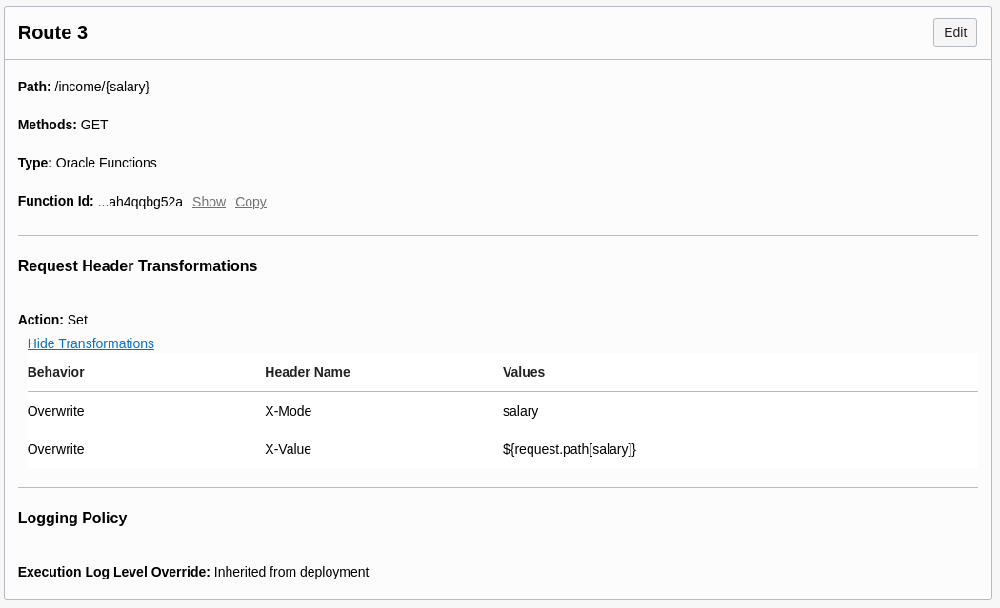

After applying this the search by salary should work and it's time to raise salaries.

## **STEP 4:** Updating Documents

After building a somewhat complex SQL query it's time to go back to a more simple approach using X DevAPI.

The choice we take here is using two steps. First we use `getOne()` to get the document referring to a single person
by their `_id`, from there we extract the old salary, apply the raise and then use X DevAPI's `arrayAppend` modification
to add the new value. As we are friendly, we also ensure it's a raise. As it might happen, that two users work on the
data at once we use a transaction to make sure there's no conflict.

This is the code we add to our `peopleService`:

            } else if (headers['Fn-Http-H-X-Mode'][0] == 'raisesalary') {
                const id = headers['Fn-Http-H-X-Id'][0];
                const raise = input.amount;
    
                if (raise <= 0) {
                    throw new Error(`We do only positive raises here! (Value: ${raise})`);
                }
    
               session.startTransaction();
               const old = await people.getOne(id);
               const oldSalary = old.salary_history[old.salary_history.length - 1].salary;
               const newEntry = { salary: oldSalary + raise, date: date() };
     
               await people
                   .modify('_id = :id')
                   .arrayAppend('salary_history', newEntry)
                   .bind('id', id)
                   .execute();

               await session.commit();
               return { success: true, newEntry };
            }

You can find the complete code in the `step5/peopleService` directory and apply using

    [opc@compute peopleService]$ fn deploy --app DemoApp

Since this time the `amount` by which we raise, is sent as part of the HTTP request body, therefore we receive it as `input`.

When configuring the route also make sure to use the `PATCH`method. Other than that it is similar to previous cases:

| Setting     | Value            |
| ----------- | ---------------- |
| Path        | `/raise/{id}`    |
| Methods     |  PATCH           |
| Type        | Oracle Functions |
| Application | DemoApp          |
| Function    | peopleService    |

Request Header Transformations:

| Behavior  | Header Name | Value |
| --------- | ----------- | ----- |
| Overwrite | X-Mode      | `raisesalary`         |
| Overwrite | X-Id        | `${request.path[id]}` |

  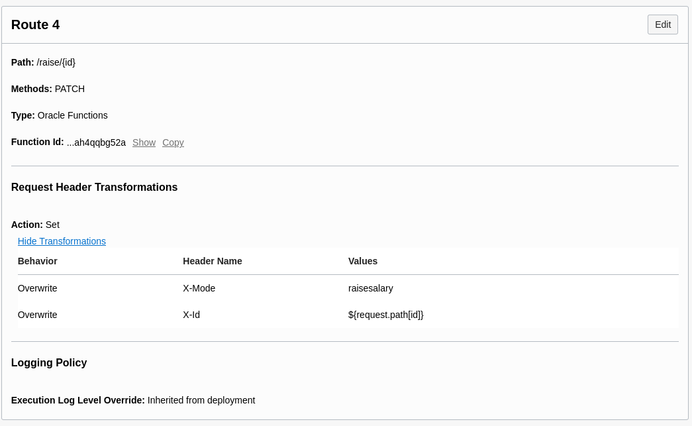

If all worked well, there shouldn't be a problem in happily raising salaries!

This concludes the main part of this Hands-on-Lab. In the next part we collected some ideas what you can do next.

## Acknowledgements

- **Authors/Contributors** - Johannes Schlüter
- **Last Updated By/Date** - Johannes Schlüter, October 2020
- **Workshop Expiration Date** - October, 2021

## Need Help?
Please submit feedback or ask for help using our [LiveLabs Support Forum](https://community.oracle.com/tech/developers/categories/livelabsdiscussions). Please click the **Log In** button and login using your Oracle Account. Click the **Ask A Question** button to the left to start a *New Discussion* or *Ask a Question*.  Please include your workshop name and lab name.  You can also include screenshots and attach files.  Engage directly with the author of the workshop.

If you do not have an Oracle Account, click [here](https://profile.oracle.com/myprofile/account/create-account.jspx) to create one. 

