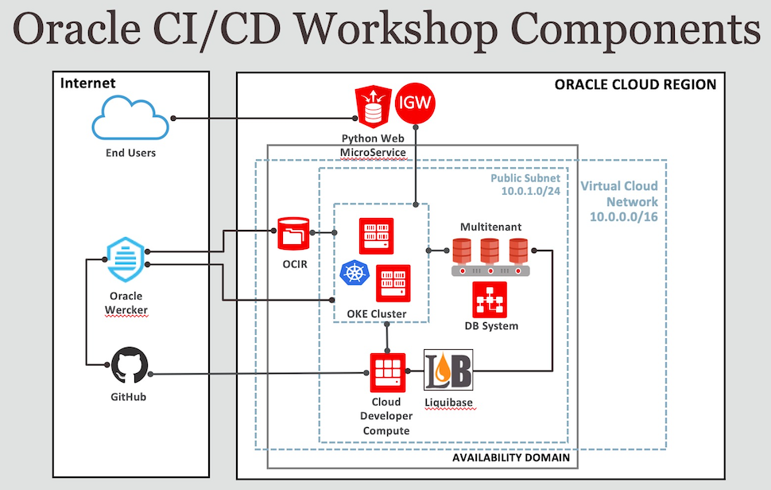

# Continuous Integration / Delivery / Deployment (CI/CD) Pipeline with Oracle Database and Python

## Workshop Overview

**Continuous Integration (CI)** refers to the practice of frequently merging new software using a single line of code we call master branch. **Continuous Delivery (CD)** refers to the release of packaged software, modules, or features in frequent cycles. Likewise, **Continuous Deployment (CD)** refers to the deployment these software packages/modules/features to a production platform in frequent cycles.

>**Note** : Even though there are two CDs in the title (CI/CD/CD), only one is used in the acronym (CI/CD).

At a very high level, a CI/CD pipeline usually consists of the following five main steps:

1. **Commit** — When a developer finishes the work on a small change to an application, the code is committed and merged to a central source code repository.
2. **Build** — The change is checked out and verified to make sure the software can be run by a computer. This steps includes all dependencies, based on what programming language, set of libraries, and platform are used.
3. **Automated tests** — The change is tested from multiple angles using unit tests written by developers and testing tools, to ensure the change works and that it doesn't break anything else.
4. **Deliver** — Release new changes, automatically prepared for a production deployment, and make them available to end users on software repository.
5. **Deploy** — The built version is deployed to pre-production, or even production environment.

The entire workflow, and all pipelines are fully automated. This automation auto-magically converts a single commit by a developer into an update to production a few hours later.

## Workshop Requirements

* Access to Oracle Cloud Infrastructure
    * Provided by the instructor for instructor-led workshops
* Access to a laptop or a desktop
    * Requires Microsoft Remote Desktop software
* Knowledge of Python is a plus but not required
* No previous knowledge of machine learning required

## Workshop Components

## Agenda

- **Lab 1 : Oracle Cloud Infrastructure (OCI)**
- **Lab 2 : GitHub Code Repository**
- **Lab 3 : Oracle Wercker CI Service**
- **Lab 4 : Oracle Database for Python**
- **Lab 5 : Push Docker Image to Registry (OCIR)**
- **Lab 6 : Deploy Python App on Container Cluster (OKE)**
- **Lab 7 : Oracle Database Changes in CI/CD Workflow**

## Access the Labs

- Use **Lab Contents** menu on your right to access the labs.
    - If the menu is not displayed, click the menu button  on the top right  make it visible.

- From the menu, click on the lab that you like to proceed with. For example, if you like to proceed to **Lab 1**, click **Lab 1 : Oracle Cloud Infrastructure (OCI)**.

- You may close the menu by clicking 

## Acknowledgements

- **Author** - Valentin Leonard Tabacaru
- **Last Updated By/Date** - Valentin Leonard Tabacaru, Principal Product Manager, DB Product Management, May 2020

## See an issue?
Please submit feedback using this [form](https://apexapps.oracle.com/pls/apex/f?p=133:1:::::P1_FEEDBACK:1). Please include the *workshop name*, *lab* and *step* in your request.  If you don't see the workshop name listed, please enter it manually. If you would like for us to follow up with you, enter your email in the *Feedback Comments* section.

