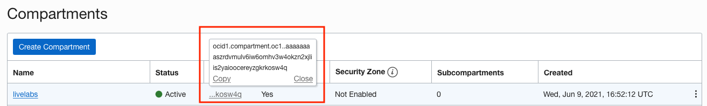
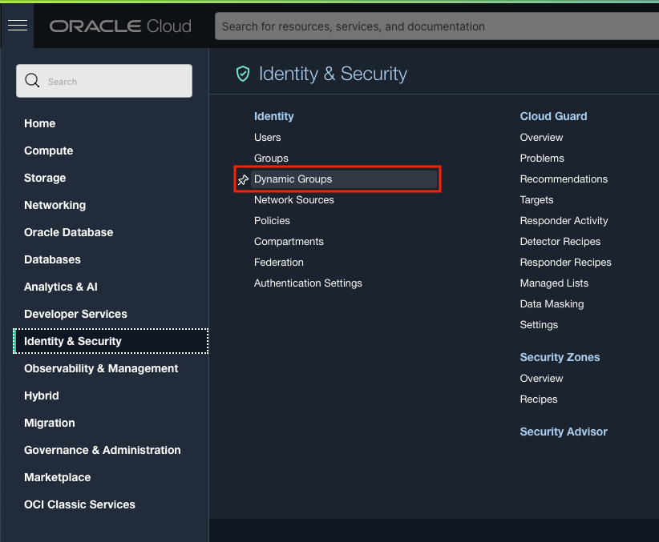
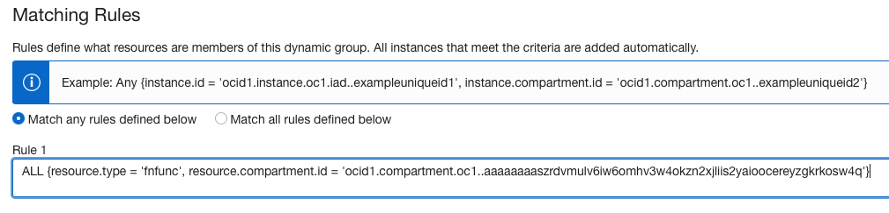
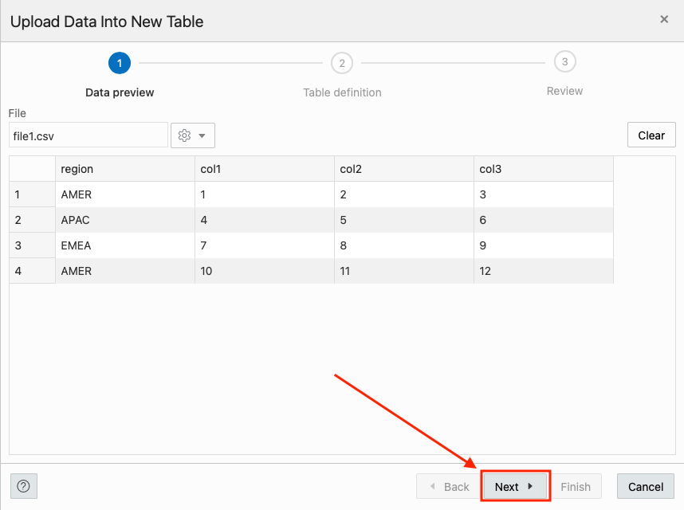
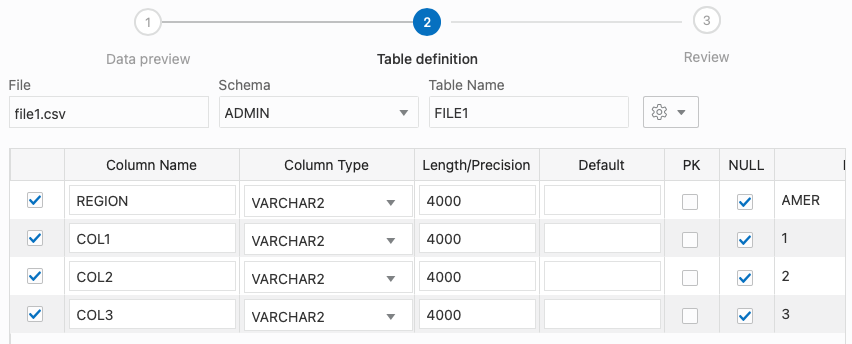
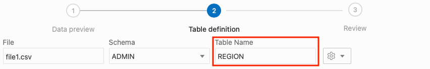
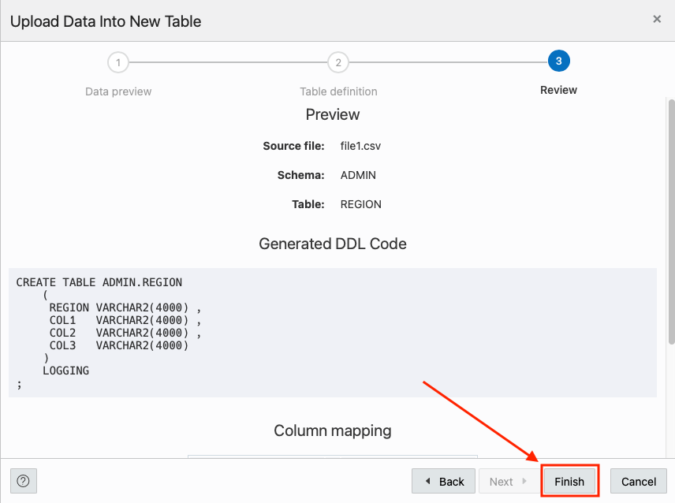
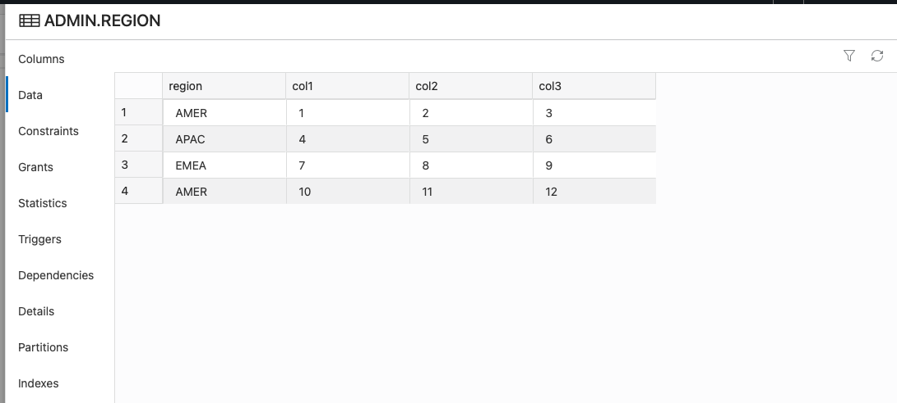
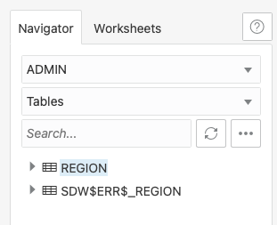
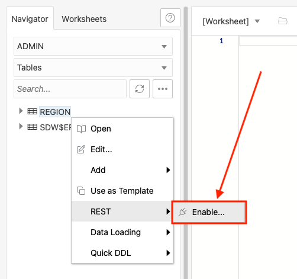

# Automatically load CSV data from Object Storage into an Autonomous Data Warehouse with Functions and Oracle REST Data Services

### Prerequisites

- The following lab requires an <a href="https://www.oracle.com/cloud/free/" target="\_blank">Oracle Cloud account</a>. You may use your own cloud account, a cloud account that you obtained through a trial, or a training account whose details were given to you by an Oracle instructor.
- This lab assumes you have successfully provisioned Oracle Autonomous database an connected to ADB with SQL Developer web.
- You have completed the setup lab.

## **STEP 1**: Setup OCI Permissions

For the Function we create to interact with the Object Store, we first have to create a Dynamic Group and some IAM policies.

## Get the Compartment OCID

Before we create some of the resources we need for functions, we need to record the OCID for compartment we are using. During the setups lab, we created a compartment. We need to go back to the compartments page (Identity & Security, then Compartments in the OCI web console menu) and find our livelabs compartment.

On the compartments page, find the OCID column and hover your mouse over the characters link in that row. You will see a pop up window with the OCID and a copy link. Click the copy link to copy the compartments OCID and paste it into a text editor for later reference.




### Create a Dynamic Group

Start off by creating a dynamic group. This group will be used with policy generation in the next step. More on Dynamic Groups can be found [here](https://docs.oracle.com/en-us/iaas/Content/Identity/Tasks/managingdynamicgroups.htm).

1. Use the OCI web console drop down menu and select Identity & Security, then Dynamic Groups.

    

2. On the Dynamic Groups page, click Create Dynamic Group

    

3. On the Create Dynamic Group page, set the following values:

    **Name:** functionsDynamicGroup

    

    **Description:** Dynamic Group for Functions

    

    **Matching Rules:** 
    
    The Match any rules defined below radio button is selected

    **Rule 1 text is:** 
    ```
    ALL {resource.type = 'fnfunc', resource.compartment.id = '**YOUR COMPARTMENT OCID**'}
    ```
    
    

4. Once your Create Dynamic Group page looks like the below image, click the **Create** button. (Remember, your OCID for the compartment will be different than the one in the image)

    

### Create IAM Policies

Allow dynamic-group <dynamic-group-name> to manage objects in compartment <compartment-name> where target.bucket.name=<input-bucket-name>
Allow dynamic-group <dynamic-group-name> to manage objects in compartment <compartment-name> where target.bucket.name=<processed-bucket-name>

Allow dynamic-group functions to manage objects in compartment Tools_PM
Allow dynamic-group functions to manage buckets in compartment Tools_PM
allow service objectstorage-eu-frankfurt-1 to manage object-family in tenancy

Service Permissions

Because Object Storage is a regional service, you must authorize the Object Storage service for each region carrying out copy operations on your behalf. For example, you might authorize the Object Storage service in region US East (Ashburn) to manage objects on your behalf. After you authorize the Object Storage service, you can copy an object stored in a US East (Ashburn) bucket to a bucket in another region.

To determine the region identifier value of an Oracle Cloud Infrastructure region, see Regions and Availability Domains.

For administrators:

To enable object copy, you must authorize the service to manage objects on your behalf:

    You can create a policy that authorizes the service in the specified region to manage Object Storage namespaces, buckets, and their associated objects in all compartments in the tenancy:

Allow service objectstorage-<region_identifier> to manage object-family in tenancy


## **STEP 2**: Prepare Database

1. After signing in as **admin** from the previous lab (connecting to Database Actions/SQL Developer Web), we end up on the overview page. Click the SQL tile.

    

**If this is your first time accessing the SQL Worksheet, you will be presented with a guided tour. Complete the tour or click the X in any tour popup window to quit the tour.**

2. We are now ready to load data into the database. For this task, we will use the Data Loading tab in the SQL Worksheet.

    

3. Start by clicking the Data Loading area; the center of the gray dotted-line box.

    

4. The Upload Data into New Table model will appear.

    

5. We are going to use some sample data to load data into the database and create a table at the same time. Start by downloading this file

    **(right-click and download the file with the following link)**

    [csv data](https://objectstorage.us-ashburn-1.oraclecloud.com/p/pp_oz_4cJpg26fUsPQYshv6G--X4TmAkpRKeFdZWzQ_XuG-eVCo3Ea3Mz1u4RxKI/n/c4u03/b/developer-library/o/csv_data.csv)

6. Once on your desktop, drag the file into the Upload Data into New Table model. You can also click the Select Files button and find where you downloaded it via your operating system's file browser.

    

7. The modal will then give you a preview of what the data will look like in an Oracle table. Go ahead and click the Next button on the bottom right of the modal.

    

8. On the following step of the data loading modal, we can see the name of the table we are going to create (CSV_DATA) as well as the column and data types for the table.

    

    Click Next on the bottom right of the modal when done looking at this step.

    

9. On the last step of the modal, we can see a review of the table name and source file

    

    the DDL (Data Definition Language) for creating the table

    

    and if you scroll down, the column mappings.

    

10. When you are done taking a look, click the Finish button in the lower right of the modal.

    

    The Data Loader will now process the file by creating a table and loading the CSV file data into that table. 

    

    Once its done, you will see a row in the Data Loading tab that indicates how many rows were uploaded, if any failed and the table name.

    

11. We can take a look at our newly created table and the data in it by using the navigator on the left of the SQL Worksheet. Just right click the table name and select Open from the pop up menu.

    

    In the slider that has come out from the right of the page, we can look at the data definition, triggers, constraints and even the data itself.

    

## **STEP 2:** Auto-REST Enable a Table

1. REST enabling a table couldn't be easier. To do this, find the table we just created named **CSV_DATA** in the navigator on the left of the SQL Worksheet.

    

2. Right click on the table name and select **REST** in the pop up menu then **Enable**.

    

3. The REST Enable Object slider will appear from the right side of the page. Keep the default values and when ready, click the **Enable** button in the lower right of the slider.

    

4. Thats it! Your table is REST enabled. We can work with the REST endpoints by using cURL commands that the SQL Worksheet can provide to us. To get to these endpoints, again right click the table name as we did in the previous step, select **REST**, then **cURL Command**.

    

    On the right of the page, we see the cURL for the table CSV_DATA side out panel.

    

5. Here we can work with the various REST endpoints. To try one, click the copy icon  for the **GET ALL** endpoint.

    

6. You can use this cURL command we just copied in the OCI Cloud Shell or on your local compute if cURL is installed. Here is the command running:

```
>curl --location \
'https://coolrestlab-adb21.adb.eu-frankfurt-1.oraclecloudapps.com/ords/admin/csv_data/'

{"items":[{"col1":"e40a9db6","col2":"1b","col3":"27531","links":[{"rel":"self","href":"https://coolrestlab-adb21.adb.eu-frankfurt-1.oraclecloudapps.com/
ords/admin/csv_data/AAAYuOAAAAAAF3%2FAAA"}]},{"col1":"6182c817","col2":"73","col3":"5355332","links":[{"rel":"self","href":"https://coolrestlab-adb21.adb.
eu-frankfurt-1.oraclecloudapps.com/ords/admin/csv_data/AAAYuOAAAAAAF3%2FAAB"}]},{"col1":"5ed9e437","col2":"d2","col3":"4834758","links":[{"rel":"self",
"href":"https://coolrestlab-adb21.adb.eu-frankfurt-1.oraclecloudapps.com/ords/admin/csv_data/AAAYuOAAAAAAF3%2FAAC"}]},{"col1":"d77868a1","col2":"64",
"col3":"2129797","links":[{"rel":"self","href":"https://coolrestlab-adb21.adb.eu-frankfurt-1.oraclecloudapps.com/ords/admin/csv_data/
AAAYuOAAAAAAF3%2FAAD"}]},{"col1":"09bfaa73","col2":"89","col3":"3294896","links":[{"rel":"self","href":"https://coolrestlab-adb21.adb.eu-frankfurt-1.
oraclecloudapps.com/ords/admin/csv_data/AAAYuOAAAAAAF3%2FAAE"}]},{"col1":"5054cca2","col2":"97","col3":"3474577","links":[{"rel":"self","href":"https://
coolrestlab-adb21.adb.eu-frankfurt-1.oraclecloudapps.com/ords/admin/csv_data/AAAYuOAAAAAAF3%2FAAF"}]},{"col1":"d20e9eb4","col2":"7c","col3":"2728720",
"links":[{"rel":"self","href":"https://coolrestlab-adb21.adb.eu-frankfurt-1.oraclecloudapps.com/ords/admin/csv_data/AAAYuOAAAAAAF3%2FAAG"}]}],
"hasMore":false,"limit":25,"offset":0,"count":7,"links":[{"rel":"self","href":"https://coolrestlab-adb21.adb.eu-frankfurt-1.oraclecloudapps.com/ords/
admin/csv_data/"},{"rel":"edit","href":"https://coolrestlab-adb21.adb.eu-frankfurt-1.oraclecloudapps.com/ords/admin/csv_data/"},{"rel":"describedby",
"href":"https://coolrestlab-adb21.adb.eu-frankfurt-1.oraclecloudapps.com/ords/admin/metadata-catalog/csv_data/"},{"rel":"first","href":"https://
coolrestlab-adb21.adb.eu-frankfurt-1.oraclecloudapps.com/ords/admin/csv_data/"}]}% 
```


log into DB Actions

SQL Worksheet

Create table

Auto-REST Table

Batch Load API Test

## Create and Deploy the Function

Review the following files in the current folder:

    the code of the function, func.py
    its dependencies, requirements.txt
    the function metadata, func.yaml

Deploy the function

In Cloud Shell, run the fn deploy command to build the function and its dependencies as a Docker image, push the image to OCIR, and deploy the function to Oracle Functions in your application.

fn -v deploy --app <app-name>

Set the function configuration values

The function requires several configuration variables to be set.

Use the fn CLI to set the config value:

fn config function <app-name> <function-name> ords-base-url <ORDS Base URL>
fn config function <app-name> <function-name> db-schema <DB schema>
fn config function <app-name> <function-name> db-user <DB user name>
fn config function <app-name> <function-name> dbpwd-cipher <DB encrypted password>
fn config function <app-name> <function-name> input-bucket <input bucket name>
fn config function <app-name> <function-name> processed-bucket <processed bucket name>

e.g.

fn config function myapp oci-adb-ords-runsql-python ords-base-url "https://xxxxxx-db123456.adb.us-region.oraclecloudapps.com/ords/"
fn config function myapp oci-adb-ords-runsql-python db-schema "admin"
fn config function myapp oci-adb-ords-runsql-python db-user "admin"
fn config function myapp oci-adb-ords-runsql-python dbpwd-cipher "xxxxxxxxx"
fn config function myapp oci-adb-ords-runsql-python input-bucket "input-bucket"
fn config function myapp oci-adb-ords-runsql-python processed-bucket "processed-bucket"

fn config function sql oci-load-file-into-adw-python ords_base_url "http://129.159.195.62:8080/ords/"
fn config function sql oci-load-file-into-adw-python db_schema "gary"
fn config function sql oci-load-file-into-adw-python db_user "gary"
fn config function sql oci-load-file-into-adw-python dbpwd_cipher "WElcome11##11"
fn config function sql oci-load-file-into-adw-python input_bucket "input-bucket"
fn config function sql oci-load-file-into-adw-python processed_bucket "processed-bucket"
fn config function sql oci-load-file-into-adw-python bucket_name "input-bucket"
fn config function sql oci-load-file-into-adw-python destination_bucket "processed-bucket"


## Create an Event rule

Let's configure a Cloud Event to trigger the function when files are dropped into your input bucket.

## Put it all together

Finally, let's test the workflow.


Upload one or all CSV files from the current folder to your input bucket. Let's imagine those files contains sales data from different regions of the world.

On the OCI console, navigate to Autonomous Data Warehouse and click on your database, click on Service Console, navigate to Development, and click on SQL Developer Web. Authenticate with your ADMIN username and password. Enter the following query in the worksheet of SQL Developer Web:

select count(*) from table_we_created;

You should see the data from the CSV files.