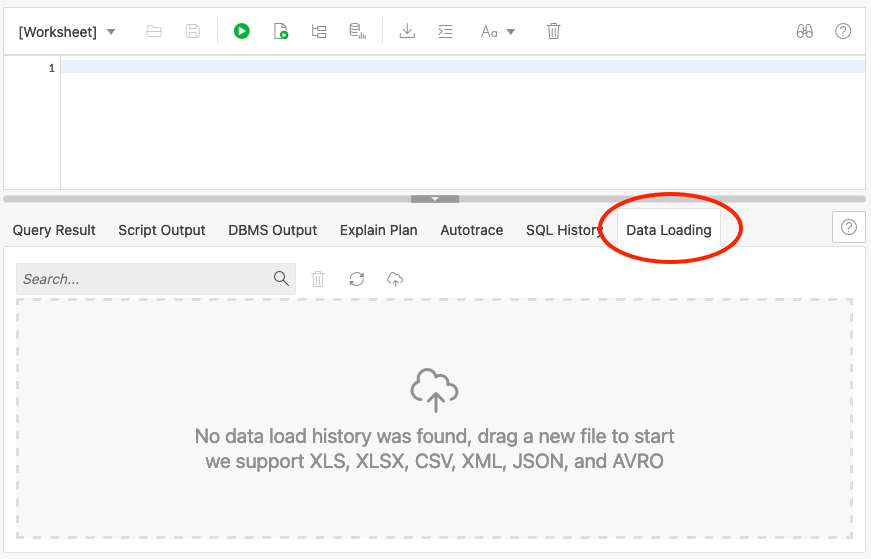
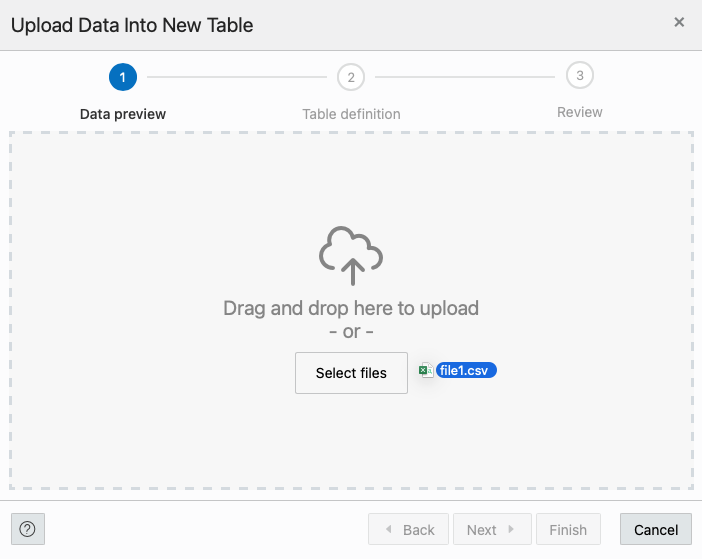
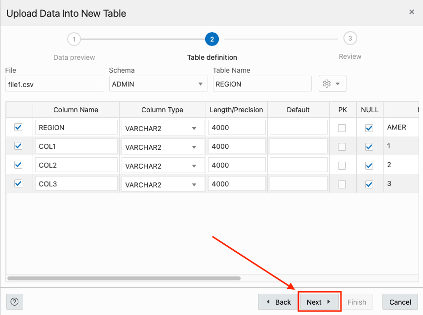
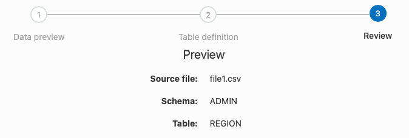
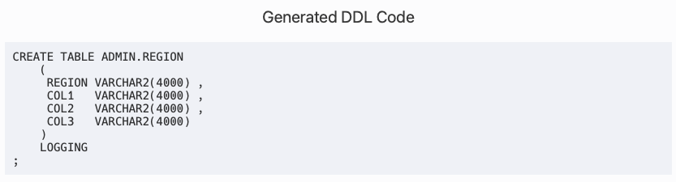
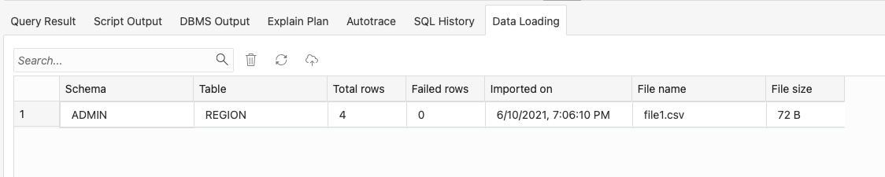
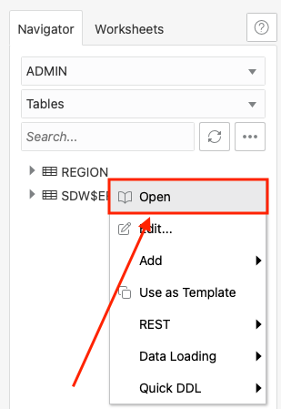
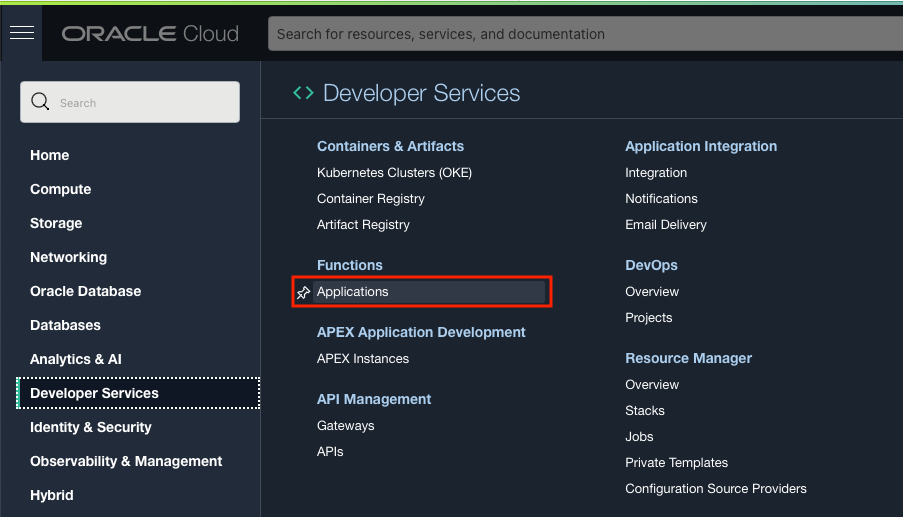

# Automatically load CSV data from Object Storage into an Autonomous Data Warehouse with Functions and Oracle REST Data Services

### Prerequisites

- The following lab requires an <a href="https://www.oracle.com/cloud/free/" target="\_blank">Oracle Cloud account</a>. You may use your own cloud account, a cloud account that you obtained through a trial, or a training account whose details were given to you by an Oracle instructor.
- You have completed the [setup steps](../setups/setups.md)(OCI permissions and database creation).


## **STEP 1**: Prepare the Database

1. Start by going to the details page of your autonomous database if not already there. Use the OCI web console drop down menu to go to **Oracle Database** and then **Autonomous Database**.

    

2. On the Autonomous Database page, find your **ORDS ADB** database in the list and left click on the Display Name

    

3. On the Autonomous Database Details page for our ORDS ADB database, click the **Tools** tab in the middle of the page

    

    then click the **Database Actions** button.

    

4. On the Database Actions page that was opened in a new browser tab/window, enter **admin** as the username. Then left click the **Next** button.

    

5. On the next page, enter the password you used to create the autonomous database in the setups part of the lab. Then left click the **Sign in** button.

    

6. After signing in as **admin**, we end up on the overview page. Click the **SQL** tile.

    

**If this is your first time accessing the SQL Worksheet, you will be presented with a guided tour. Complete the tour or click the X in any tour popup window to quit the tour.**

2. We are now ready to load data into the database. For this task, we will use the Data Loading tab in the SQL Worksheet.

    

3. Start by clicking the Data Loading area; the center of the gray dotted-line box.

    

4. The Upload Data into New Table model will appear.

    

5. We are going to use the same file we are going to run the automated load with so that the table definitions match. Use the following link to download the file:

    **(right-click and download the file with the following link)**

    [file1.csv](https://xxxxxx)

6. Once on your desktop, drag the file into the Upload Data into New Table model. You can also click the Select Files button and find where you downloaded it via your operating system's file browser.

    

7. The modal will then give you a preview of what the data will look like in an Oracle table. Go ahead and click the Next button on the bottom right of the modal.

    

8. On the following step of the data loading modal, we can see the name of the table we are going to create (FILE1) as well as the column and data types for the table.

    
    
9. Seeing our sample data deals with regional counts of ska shows, lets name the table **REGION**.

    
    
10. Click Next on the bottom right of the modal when done renaming the table.

    

11. On the last step of the modal, we can see a review of the table name (that we changed to REGION) and source file

    

    the DDL (Data Definition Language) for creating the table

    

    and if you scroll down, the column mappings.

    

10. When you are done taking a look, click the Finish button in the lower right of the modal.

    

    The Data Loader will now process the file by creating a table and loading the CSV file data into that table. 

    

    Once its done, you will see a row in the Data Loading tab that indicates how many rows were uploaded, if any failed and the table name.

    

11. We can take a look at our newly created table and the data in it by using the navigator on the left of the SQL Worksheet. Just right click the table name and select Open from the pop up menu.

    

    In the slider that has come out from the right of the page, we can look at the data definition, triggers, constraints and even the data itself.

    

## **STEP 2:** Auto-REST Enable a Table

1. REST enabling a table couldn't be easier. To do this, find the table we just created named **CSV_DATA** in the navigator on the left of the SQL Worksheet.

    

2. Right click on the table name and select **REST** in the pop up menu then **Enable**.

    

3. The REST Enable Object slider will appear from the right side of the page. Keep the default values and when ready, click the **Enable** button in the lower right of the slider.

    

    Thats it! Your table is REST enabled. 

## Create and Deploy the Function

We now need to create a function that will take the incoming file from Object Store and use the Batch Load API of the table we created that leverages the REST services available to us from ORDS. First, we need to make an Application to hold our function. 

With Oracle Functions, an application is:
    a logical grouping of functions
    a way to allocate and configure resources for all functions in the application
    a common context to store configuration variables that are available to all functions in the application
    a way to ensure function runtime isolation

1. Use the OCI web console drop down menu to go to **Developer Services** and then **Applications**.

    

2. On the **Applications** page, ensure that the **Compartment** is set to livelabs.

    

3. Now, click the **Create Application** button.

    

4. On the **New Application** slide out form, start by setting the **Name** to functionsApp.

    **Name:** functionsApp

    ````
    <copy>
    functionsApp
    </copy>
    ````
    

5. Use the **VNC in livelabs** dropdown to select our FunctionsVCN if not already selected. You can use the **Change Compartment** link if this did not default to using livelabs as the compartment.

    

6. Using the **Subnets in livelabs** dropdown, select **Public Subnet-FunctionsVCN(Regional)**. You can use the **Change Compartment** link if this did not default to using livelabs as the compartment.

    

7. When your **New Application** form looks like the below image

    

    click the **Create** button in the lower left of the slider.

    

8. With your application created, click on the **Name** in the Applications List

    

9. On the **Application Details** page, using the **Resources List** on the left side of the page, click **Getting Started**.

    

10. On the **Getting Started** page, ensure that **Cloud Shell Setup** is selected.

    

11. The next few steps will be using the **OCI Cloud Shell**. We can start a Cloud Shell session by clicking the **Launch Cloud Shell** button in the **Begin your Cloud Shell session** step on the **Getting Started** page.

    

    This will open the **OCI Cloud Shell** on the bottom of the page.

    

12. In the **Setup fn CLI on Cloud Shell** section, we will be copying and pasting many commands to use in the **OCI Cloud Shell** . Starting at **Step 2** copy and paste the first command 

https://www.oracle.com/webfolder/technetwork/tutorials/infographics/oci_functions_cloudshell_quickview/functions_quickview_top/functions_quickview/index.html

Review the following files in the current folder:

    the code of the function, func.py
    its dependencies, requirements.txt
    the function metadata, func.yaml

Deploy the function

In Cloud Shell, run the fn deploy command to build the function and its dependencies as a Docker image, push the image to OCIR, and deploy the function to Oracle Functions in your application.

fn -v deploy --app <app-name>

Set the function configuration values

The function requires several configuration variables to be set.

Use the fn CLI to set the config value:

fn config function <app-name> <function-name> ords-base-url <ORDS Base URL>
fn config function <app-name> <function-name> db-schema <DB schema>
fn config function <app-name> <function-name> db-user <DB user name>
fn config function <app-name> <function-name> dbpwd-cipher <DB encrypted password>
fn config function <app-name> <function-name> input-bucket <input bucket name>
fn config function <app-name> <function-name> processed-bucket <processed bucket name>

e.g.

fn config function myapp oci-adb-ords-runsql-python ords-base-url "https://xxxxxx-db123456.adb.us-region.oraclecloudapps.com/ords/"
fn config function myapp oci-adb-ords-runsql-python db-schema "admin"
fn config function myapp oci-adb-ords-runsql-python db-user "admin"
fn config function myapp oci-adb-ords-runsql-python dbpwd-cipher "xxxxxxxxx"
fn config function myapp oci-adb-ords-runsql-python input-bucket "input-bucket"
fn config function myapp oci-adb-ords-runsql-python processed-bucket "processed-bucket"

fn config function sql oci-load-file-into-adw-python ords_base_url "http://129.159.195.62:8080/ords/"
fn config function sql oci-load-file-into-adw-python db_schema "gary"
fn config function sql oci-load-file-into-adw-python db_user "gary"
fn config function sql oci-load-file-into-adw-python dbpwd_cipher "WElcome11##11"
fn config function sql oci-load-file-into-adw-python input_bucket "input-bucket"
fn config function sql oci-load-file-into-adw-python processed_bucket "processed-bucket"
fn config function sql oci-load-file-into-adw-python bucket_name "input-bucket"
fn config function sql oci-load-file-into-adw-python destination_bucket "processed-bucket"


## Create an Event rule

Let's configure a Cloud Event to trigger the function when files are dropped into your input bucket.

## Put it all together

Finally, let's test the workflow.


Upload one or all CSV files from the current folder to your input bucket. Let's imagine those files contains sales data from different regions of the world.

On the OCI console, navigate to Autonomous Data Warehouse and click on your database, click on Service Console, navigate to Development, and click on SQL Developer Web. Authenticate with your ADMIN username and password. Enter the following query in the worksheet of SQL Developer Web:

select count(*) from table_we_created;

You should see the data from the CSV files.