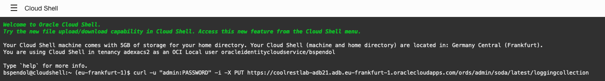

# Send Log Data to an Autonomous Database with Service Connector Hub

In this lab, you will create a service connector to move log data from the Logging service to an Autonomous Database using Functions and Oracle REST Data Services.

### Prerequisites

- The following lab requires an <a href="https://www.oracle.com/cloud/free/" target="\_blank">Oracle Cloud account</a>. You may use your own cloud account, a cloud account that you obtained through a trial, or a training account whose details were given to you by an Oracle instructor.
- This lab assumes you have successfully provisioned Oracle Autonomous database an connected to ADB with SQL Developer web.
- You have completed the user setups steps.

## **STEP 1:** Creating a Collection

**If this is your first time accessing the JSON Worksheet, you will be presented with a guided tour. Complete the tour or click the X in any tour popup window to quit the tour.**

### **Create a Collection using the Database Actions UI**

1. The first step here is to create a **collection** for our JSON Documents. We can do this two ways. The first method is to use the UI in Database Actions. We can start by selecting **JSON** in the **Database Actions Menu**.

    

2. On the JSON worksheet, left click the **Create Collection** button in the middle of the page.

    

3. Using the **New Collection** slider

    

    enter **airportdelayscollection** in the **Collection Name** field

    

4. When your **New Collection** slider looks like the below image, left click the **Create** button.

    

### **Create a Collection using the SODA for REST APIs**

1. We can create a collection with the **SODA for REST APIs** as well. To do this, open an **OCI Cloud Shell**. We can do this by clicking the Cloud Shell icon in the upper right of the OCI web console.

    

2. We can now use the **OCI Cloud Shell** that appears on the bottom of the OCI Web Console Page.

    

3. To use the SODA for REST APIs, we need to construct the URL. To start, we use cURL and pass in the username/password combination. Be sure to use the password that you set for our user back in the User Setups lab.

    ```
    curl -u "gary:PASSWORD"
    ```

    Also, we can add the -i which tells the cURL command to include the HTTP response headers in the output. This is helpful with debugging

    ```
    curl -u "gary:PASSWORD" -i
    ```

    next, this is going to create a collection, so we will use the **PUT HTTP method**. 

    ```
    curl -u "gary:PASSWORD" -i -X PUT
    ```

    Lastly, we will add the URL. The URL is built up with the hostname followed by ords, followed by our schema name gary

    ```
    https://coolrestlab-adb21.adb.eu-frankfurt-1.oraclecloudapps.com/ords/gary/
    ```

    then, add soda to indicate we want to use the SODA APIs followed by latest and the name of the collection airportdelayscollection. Your URL should look similar to the below one. (Your hostname will be different then this sample)

    ```
    https://coolrestlab-adb21.adb.eu-frankfurt-1.oraclecloudapps.com/ords/gary/soda/latest/airportdelayscollection
    ```

    And when we put it all together, we get the following:

    ```
    curl -u "gary:PASSWORD" -i -X PUT https://coolrestlab-adb21.adb.eu-frankfurt-1.oraclecloudapps.com/ords/gary/soda/latest/airportdelayscollection
    ```

4. We now can take this cURL command and run it in the OCI Cloud Shell. **REMEMBER to use your password in place of PASSWORD**

    

    ```
    curl -u "gary:PASSWORD" -i -X PUT https://coolrestlab-adb21.adb.eu-frankfurt-1.oraclecloudapps.com/ords/gary/soda/latest/airportdelayscollection
    HTTP/1.1 201 Created
    Date: Mon, 26 Apr 2021 15:53:46 GMT
    Content-Length: 0
    Connection: keep-alive
    X-Frame-Options: SAMEORIGIN
    Cache-Control: private,must-revalidate,max-age=0
    Location: https://coolrestlab-adb21.adb.eu-frankfurt-1.oraclecloudapps.com/ords/gary/soda/latest/airportdelayscollection/
    ```
    If the collection already exists, you will get a message similar to the following:

    ```
    HTTP/1.1 200 OK
    Date: Mon, 26 Apr 2021 16:07:38 GMT
    Content-Length: 0
    Connection: keep-alive
    X-Frame-Options: SAMEORIGIN
    Cache-Control: private,must-revalidate,max-age=0
    ```

## **STEP 2:** Create and Deploy a Function


use the app created in previous section

## **STEP 2:** Create a Service Connector


This section walks through creating a service connector using the Console. Your function must be deployed.

1. Open the navigation menu and click Analytics & AI. Under Messaging, click Service Connector Hub.

    

2. Choose the Compartment XXXXX.

    

3. Click Create Service Connector.

    

4. On the Create Service Connector page:

    Type a Connector Name such as "Send Logs to My Autonomous Database." Avoid entering confidential information.

    Select the Resource Compartment where you want to store the new service connector.

    Under Configure Service Connector, select your source and target services to move log data to a metric:

            Select Source: Logging

            Select Target: Functions

    Under Configure source connection, select a Compartment Name, Log Group, and Log.

    Under Configure target connection, select the Function Application and Function corresponding to the function you created using the function code sample.


5. If prompted to create a policy (required for access to create or update a service connector), click Create.

        
    
6. Click Create.


