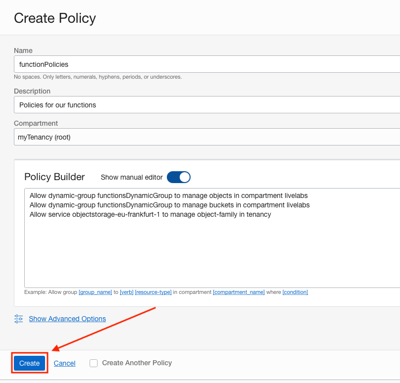

# Lab Setups

This part of the lab will guide you through some setups that have to happen before we can start the lab.

## **STEP 1**: Create a Compartment

We are going to create a **Compartment** for this lab so that our functions, logs, database and other OCI components reside in a single place.

1. To create a compartment, use the OCI web console drop down menu and select 

### Get the Compartment OCID

Before we create some of the resources we need for functions, we need to record the OCID for compartment we are using. During the setups lab, we created a compartment. We need to go back to the compartments page (Identity & Security, then Compartments in the OCI web console menu) and find our livelabs compartment.

On the compartments page, find the OCID column and hover your mouse over the characters link in that row. You will see a pop up window with the OCID and a copy link. Click the copy link to copy the compartments OCID and paste it into a text editor for later reference.


## **STEP 2**: Setup OCI Permissions

For the Function we create to interact with the Object Store, we first have to create a Dynamic Group and some IAM policies.


### Create a Dynamic Group

Start off by creating a dynamic group. This group will be used with policy generation in the next step. More on Dynamic Groups can be found [here](https://docs.oracle.com/en-us/iaas/Content/Identity/Tasks/managingdynamicgroups.htm).

1. Use the OCI web console drop down menu and select **Identity & Security**, then **Dynamic Groups**.

    

2. On the Dynamic Groups page, click **Create Dynamic Group**

    

3. On the Create Dynamic Group page, set the following values:

    **Name:** functionsDynamicGroup

    ````
    <copy>
    functionsDynamicGroup
    </copy>
    ````

    

    **Description:** Dynamic Group for Functions

    ````
    <copy>
    Dynamic Group for Functions
    </copy>
    ````

    

    **Matching Rules:** 
    
    The Match any rules defined below radio button is selected

    **Rule 1 text is:** 

    ````
    <copy>
    ALL {resource.type = 'fnfunc', resource.compartment.id = '**YOUR COMPARTMENT OCID**'}
    </copy>
    ````
    
    

4. Once your Create Dynamic Group page looks like the below image, click the **Create** button. (Remember, your OCID for the compartment will be different than the one in the image)

    

5. You will now be on the Dynamic Group Details page for the one we just created

    


### Create IAM Policies

Next, we need to associate our dynamic group to some policies so that it has the ability to use object store to see and process the CSV files as they come in.

1. Use the OCI web console menu to navigate to **Identity & Security**, then **Policies**

    

2. On the Policies page

    

    find the Compartment dropdown and select our root compartment if not already selected

    

3. Next, click the **Create Policy** button

    

4. On the Create Policy page, set the following values:

    **Name:** functionPolicies

    ````
    <copy>
    functionPolicies
    </copy>
    ````

    

    **Description:** Policies for our functions

    ````
    <copy>
    Policies for our functions
    </copy>
    ````

    

    **Compartment:** livelabs (Should be auto-selected)

    

5. Now in the Policy Builder, click the **Show manual editor** toggle switch

    

6. Copy and paste the following policy code into the text area. You will need to change the text **YOUR_REGION** to reflect the OCI region you are in. You can reference the documentation [here](https://docs.oracle.com/en-us/iaas/Content/General/Concepts/regions.htm) to find your **Region Identifier** to replace the **YOUR_REGION** text. For example, if we were in the Phoenix OCI region, the policy would be:
    ```
    Allow service objectstorage-us-phoenix-1 to manage object-family in tenancy
    ```
    Now copy and paste the following text and use the appropriate region.

    ````
    <copy>
    Allow dynamic-group functionsDynamicGroup to manage objects in compartment livelabs
    Allow dynamic-group functionsDynamicGroup to manage buckets in compartment livelabs
    Allow service objectstorage-YOUR_REGION to manage object-family in tenancy
    </copy>
    ````

    

7. When your Create Policy page looks like the below image (remember your region may be different than the one in the image), click the **Create** button.

    

8. You will be brought to the Policy Details page for the just created policy

    