# Lab Setups

This part of the lab will guide you through some setups that have to happen before we can start the lab.

## **SETUP 1**: Create a Compartment

We are going to create a **Compartment** for this lab so that our functions, logs, database and other OCI components reside in a single place.

1. To create a compartment, use the OCI web console drop down menu and select **Identity & Security**, then **Compartments**.

    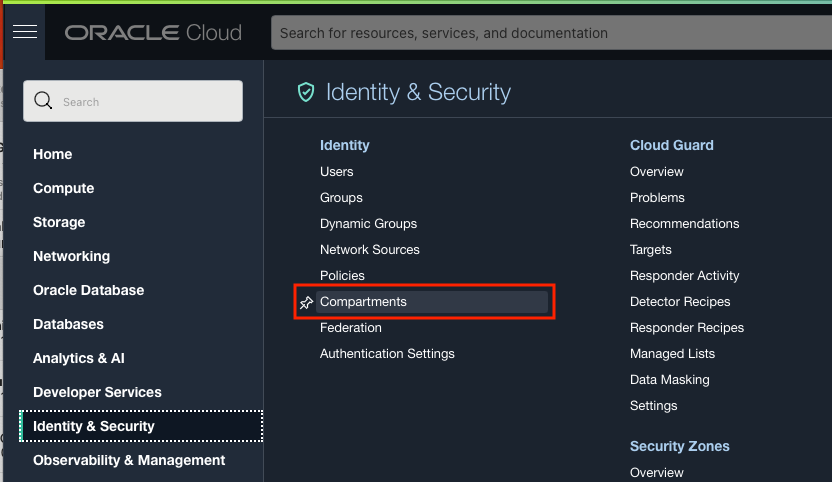

2. On the Compartments page, click the **Create Compartment** button.

    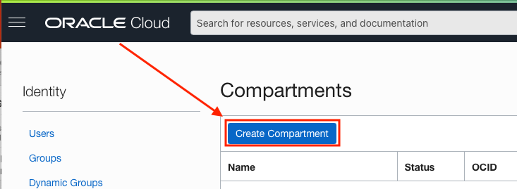

3. Using the **Create Compartment** modal, set the following values:

    **Name:** livelabs

    ````
    <copy>
    livelabs
    </copy>
    ````

    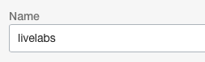

    **Description:** livelabs

    ````
    <copy>
    livelabs
    </copy>
    ````
    

    **Parent Compartment:** Use the root compartment (Should be auto-selected, your root compartment will be named different, but will have (root) after it)

    

4. When your Create Compartment modal looks like the following image (root compartment name will be different but have (root) after the name), click the **Create Compartment** button.

    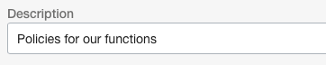

### Get the Compartment OCID

Before we create some of the resources we need for functions, we need to record the OCID for compartment we just created. Back on the compartments page, find the OCID column of the livelabs compartment we just created and hover your mouse over the characters link in that row. You will see a pop up window with the OCID and a copy link. Click the copy link to copy the compartments OCID and paste it into a text editor for later reference. 
**You may have to refresh the page to see the created compartment.**


## **SETUP 2**: Setup OCI Permissions

For the Function we create to interact with the Object Store, we first have to create a Dynamic Group and some IAM policies.


### Create a Dynamic Group

Start off by creating a dynamic group. This group will be used with policy generation in the next step. More on Dynamic Groups can be found [here](https://docs.oracle.com/en-us/iaas/Content/Identity/Tasks/managingdynamicgroups.htm).

1. Use the OCI web console drop down menu and select **Identity & Security**, then **Dynamic Groups**.

    

2. On the Dynamic Groups page, click **Create Dynamic Group**

    

3. On the Create Dynamic Group page, set the following values:

    **Name:** functionsDynamicGroup

    ````
    <copy>
    functionsDynamicGroup
    </copy>
    ````

    

    **Description:** Dynamic Group for Functions

    ````
    <copy>
    Dynamic Group for Functions
    </copy>
    ````

    

    **Matching Rules:** 
    
    The Match any rules defined below radio button is selected

    **Rule 1 text is:** 

    ````
    <copy>
    ALL {resource.type = 'fnfunc', resource.compartment.id = '**YOUR COMPARTMENT OCID**'}
    </copy>
    ````
    
    

4. Once your Create Dynamic Group page looks like the below image, click the **Create** button. (Remember, your OCID for the compartment will be different than the one in the image)

    

5. You will now be on the Dynamic Group Details page for the one we just created

    


### Create IAM Policies

Next, we need to associate our dynamic group to some policies so that it has the ability to use object store to see and process the CSV files as they come in.

1. Use the OCI web console menu to navigate to **Identity & Security**, then **Policies**

    

2. On the Policies page

    

    find the Compartment dropdown and select our root compartment if not already selected

    

3. Next, click the **Create Policy** button

    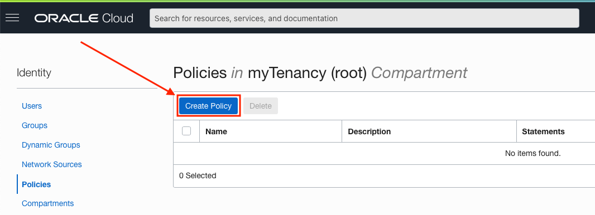

4. On the Create Policy page, set the following values:

    **Name:** functionPolicies

    ````
    <copy>
    functionPolicies
    </copy>
    ````

    

    **Description:** Policies for our functions

    ````
    <copy>
    Policies for our functions
    </copy>
    ````

    

    **Compartment:** livelabs (Should be auto-selected)

    

5. Now in the Policy Builder, click the **Show manual editor** toggle switch

    

6. Copy and paste the following policy code into the text area. You will need to change the text **YOUR_REGION** to reflect the OCI region you are in. You can reference the documentation [here](https://docs.oracle.com/en-us/iaas/Content/General/Concepts/regions.htm) to find your **Region Identifier** to replace the **YOUR_REGION** text. For example, if we were in the Phoenix OCI region, the policy would be:
    ```
    Allow service objectstorage-us-phoenix-1 to manage object-family in tenancy
    ```
    Now copy and paste the following text and use the appropriate region.

    ````
    <copy>
    Allow dynamic-group functionsDynamicGroup to manage objects in compartment livelabs
    Allow dynamic-group functionsDynamicGroup to manage buckets in compartment livelabs
    Allow service objectstorage-YOUR_REGION to manage object-family in tenancy
    </copy>
    ````

    

7. When your Create Policy page looks like the below image (remember your region may be different than the one in the image), click the **Create** button.

    

8. You will be brought to the Policy Details page for the just created policy

    

## **SETUP 3**: Create an Autonomous Database

1. Use the OCI web console drop down menu to go to **Oracle Database** and then **Autonomous Database**.

    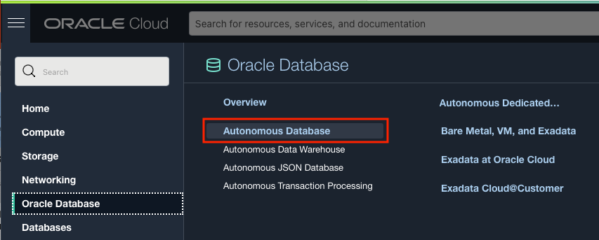

2. On the Autonomous Database page, change your compartment to the livelabs compartment using the **Compartment** dropdown on the left side of the page.

    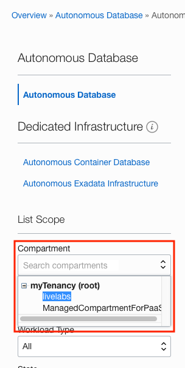

3. With the livelabs compartment selected, click the **Create Autonomous Database** button on the top of the page.

    


4. In the **Create Autonomous Database** page, we start in the **Provide basic information for the Autonomous Database** section. Here we can ensure our Compartment is livelabs and give our database a **Display Name**. We can use **ORDS ADB** as the Display Name.

    **Display Name:** ORDS ADB

    ````
    <copy>
    ORDS ADB
    </copy>
    ````
    

    For the **Database Name**, we can use **ORDSADB**.

      **Database Name:** ORDSADB

    ````
    <copy>
    ORDSADB
    </copy>
    ````
    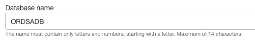  

    The **Provide basic information for the Autonomous Database** section should look like the following image:

     

5. For Database **Workload Type**, choose **Transaction Processing**.

   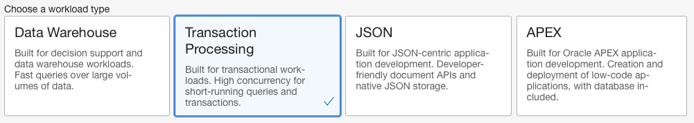  

6. In the **Deployment Type** section, choose **Shared Infrastructure** if not already selected for you.

   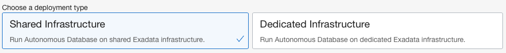  

7. Next we have the **Configure the database** section. Start here by clicking the **Always Free** toggle button so that it is switched to the right side as seen in the following image.

   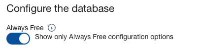  

8. Use the **Choose database version** dropdown to choose **21c** as the database version.

   

9. Your **Configure the database** section should look like the following image.

   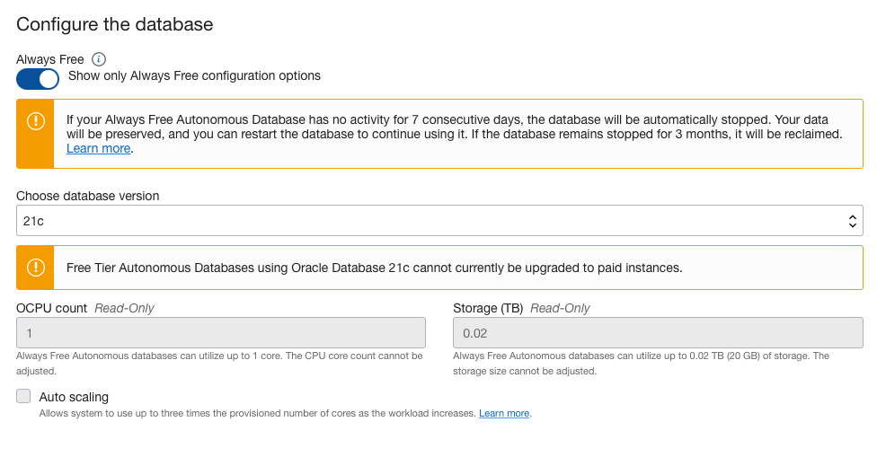

10. The next section is **Create administrator credentials**. Here, provide a password that conforms to the password complexity rules of:

    ```
    Password must be 12 to 30 characters and contain at least one uppercase letter, one lowercase letter, and one number.
    The password cannot contain the double quote (") character or the username "admin".
    ```

    If the password does conform to these rules and matches in both fields, the section should look like the following image.

   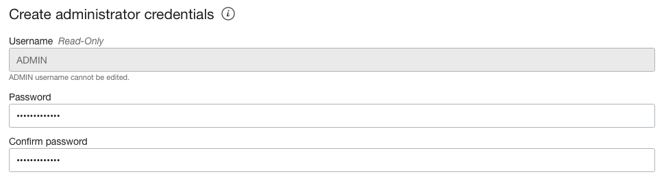

11. For the **Choose network access** section, select **Secure access from everywhere** if not already selected. Leave the **Configure access control rules** checkbox unchecked.

   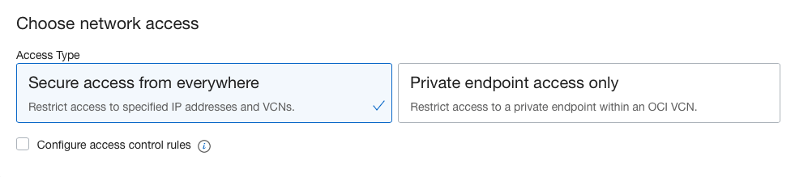

12. The **Choose a license type** section should default to **License Included**.

   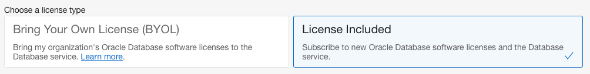

13. When the **Create Autonomous Database** is completely filled out, click the **Create Autonomous Database** button on the bottom left of the page.

   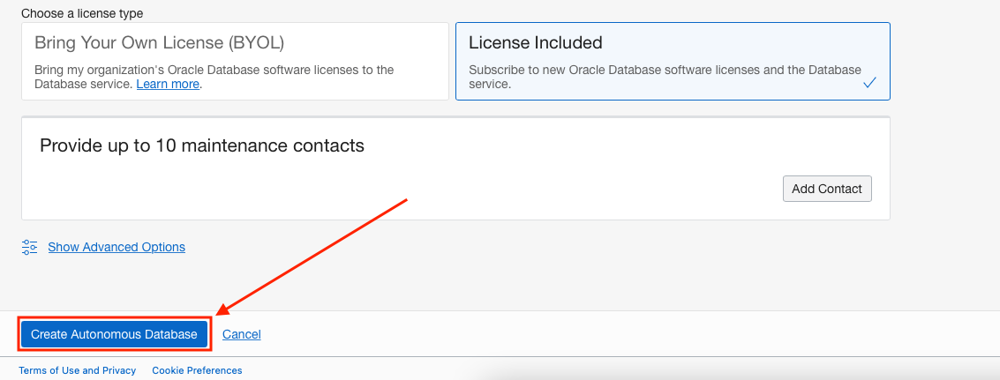

14. Your Autonomous Database should be done creating in just a few short minutes. 

Please move to the next section of the lab [Automatically load CSV data from Object Storage into an Autonomous Data Warehouse with Functions and Oracle REST Data Services](../csv-function/csv-function.md).

## Conclusion

In this section, you created a compartment, dynamic group a database and policies for the upcoming lab sections

## Acknowledgements

- **Author** - Jeff Smith, Distinguished Product Manager and Brian Spendolini, Trainee Product Manager
- **Last Updated By/Date** - Brian Spendolini, June 2021