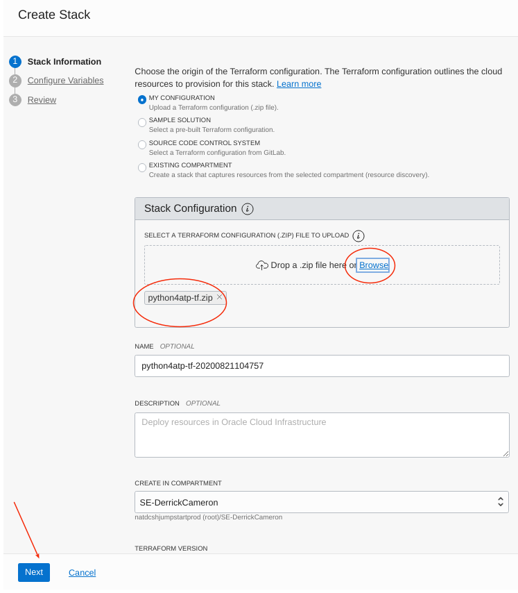
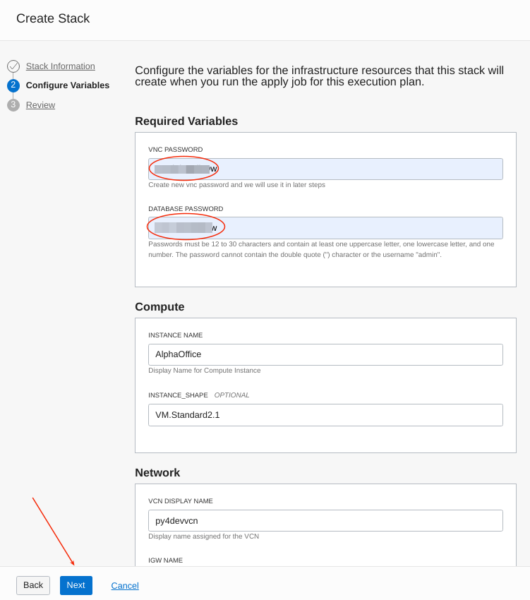
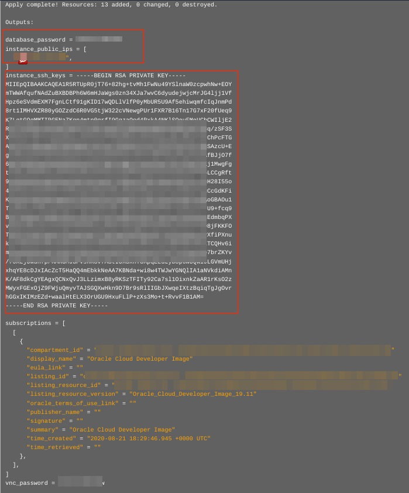

# Setup Cloud Environment

## Before You Begin
### Objectives
- Log into OCI tenancy.
- Setup your IAAS environment and create common components.
- Create a new Cloud Developer Image from Marketplace.
- Create an Autonomous Transaction Processing (ATP) Database.
- Load Data into your ATP Instance.

### Introduction

In Lab 1 (as Derek) you will initiate the Oracle cloud environment that you will use to create and deploy your microservices applications. This environment will be contained within a cloud Compartment, and communication within the Compartment will be via a Virtual Cloud Network (VCN). The Compartment and VCN will isolate and secure the overall environment. You will deploy two Oracle Cloud Services for this environment. An Oracle Cloud Developer Image will be used to develop and deploy your microservices code. The microservices will access data within an Autonomous Transaction Processing (ATP) Cloud Service.

To deploy these services, you will be using Terraform, a tool for building, changing, and versioning infrastructure safely and efficiently. It is an important tool for anyone looking to standardize IaaS (Infrastructure as a Service) within their organization.

*We recommend that you create a notes page to write down all of the credentials you will need.*

## **Step 1:** Prepare your terraform script for execution

Terraform provides a reusable process for creating infrastructure.  In some cases, like this one, you don't have to know anything about how the process works. You can deploy different pre-designed infrastructure designs for many different purposes, which frees up users to focus on their projects.  This will create your cloud resources (VCN, Compute Image, Autonomous Transaction Processing Instance, among other things).

1.  There are two options for running the the workshop labs.  One uses the always free services (compute and ATP) and the other uses non-free services.  You may wish to use the always free version, but if you are already using your always free version, or multiple users are running the workshop in a single tenancy you will need to use the non-free version.  Download either the [free terraform zip file](https://objectstorage.us-ashburn-1.oraclecloud.com/n/natdcshjumpstartprod/b/python4atp/o/python4atp-tf-free.zip) or the [non-free terraform zip file](https://objectstorage.us-ashburn-1.oraclecloud.com/n/natdcshjumpstartprod/b/python4atp/o/python4atp-tf.zip).

2. Log into the Oracle Cloud and on the OCI console, click on the hamburger menu upper left and scroll down to **Solutions and Platform**. Hover over **Resource Manager** and click on **Stacks**.

   

3. Make sure the **Compartment** on the left side says root. If not, then change it to root. Then, click **Create Stack**.

  

4. Click on **Browse** and find the zipped **python4atp-tf-free.zip** or **python4atp-tf.zip** file if using the non-free version. Then, you can give your **Stack** a name (or accept default). You can also give a description if you'd like, but it is not necessary. Then click **Next**.

  

5. There are two required variables - **VNC password** and **Database password**.  Enter these noting that the database password must confirm to rules noted on the screen.  All other variables are defaulted in.  **IF others are running this workshop at the same time in the same tenancy you also need to make the database name and the object storage bucket unique**.  Otherwise select Next.

  


8. Click **create**.  Note the screen will freeze for a few seconds before returning..be patient.

  

  

## **Step 2:** Create OCI Resources in Resource Manager

1. Now inside of the resource manager, hover over **Terraform Actions** and click on **Plan**.

  

2. You can give the plan a name, or keep the default. Then click on **Plan** to begin.

  

3. Wait for the plan to succeed.

  

4. Return to `Stacks` upper left, select your stack, and select **Terraform Actions** and click on **Apply**.

  

  

5. You can give the apply a name, or keep the default. You can leave the other settings the same. Then click on **Apply**.  **The apply may take several minutes. Please be patient.**

  

  

6.  The job will take several minutes.  When it is complete scroll to the bottom of the log and note the IP address of the compute instance (copy this) and the private key.  Although we will not need the private key in this workshop, if you do need to access the compute image with ssh you will need this key.

  

## **Step 3:** Prepare to Load Data

1. Generate an Auth Token.  Navigate to **Identity** > **Users**.  

  

2. Select the username of the current logged in userid (yours will be different from the screenshot). Save that name in your notes.

  

3. Select **Auth Tokens** on the left, and then **Generate Token**.  Create token **py4dev_token**.

  

  

4. Copy the token and save it in your notes.  If you lose this you can always generate more tokens.

  

5. [Download the database export file](https://objectstorage.us-ashburn-1.oraclecloud.com/n/natdcshjumpstartprod/b/python4atp/o/expdp_alpha.dmp).

6. Go back to the console, and click the **Menu icon** in the upper left corner to open the navigation menu. Under the **Core Infrastructure** section, select **Object Storage** then **Object Storage** .

  

7. Select the Compartment **python4dev**.  You may need to refresh your page to have this new compartment show up.  Your new Object Storage Bucket should show up in the list. Once it appears click on the `py4dev` bucket url to view the details.

  

8. Navigate to your object storage bucket and then click **Upload**.

  

9. Click **select files**, then select the **expdp\_alpha.dmp** for import into the database in the next steps.  Click **Open**, then **Upload Objects**.  When the upload is done close the window.

  

  

  

10. Now, select the icon on the far right to retrieve details from **expdp\_alpha.dmp**.

  

11. Copy the URI (don't download the object) and save it in your notes.

  

## **Step 4:** Log into SQL Developer and Load Data into userid Alpha.

1. Click the **Menu icon** in the upper left corner to open the navigation menu. Under the **Database** section, select **Autonomous Transaction Processing**.

  

2. Select the **AlphaOffice** Autonomus Transaction Processing Database.  Be sure to select the correct region, and the correct compartment.

  

3. Click **Service Console**.

  

4. Select `Development` and then `SQL Developer Web`

  

5. Log in with your **admin** userid and password (ATP useri/pw).

  

6. When you initially log in there are a number of guided tips.  You can go through these or optionally close the window.

  

7. We're now going to execute SQL to create a user and credential.  Enter the following commands.  Use the small arrow to execute.  The first is to create user **alpha**.
  ```
  <copy>create user alpha identified by "&lt;atp password&gt;";
  grant dwrole to alpha;</copy>
  ```

  

8. Create credential.  This is used by the ATP database to access the dmp file in Object Storage.  This is your cloud account userid and your token password (created in a previous step).  If your account is federated enter the full name including the identity provider.
  ```
  <copy>BEGIN
    DBMS_CLOUD.CREATE_CREDENTIAL(
      credential_name => 'py4dev_token',
      username => '&lt;cloud account userid&gt;',
      password => '&lt;token password&gt;'
    );
  END;
  /</copy>
  ```

  

9. Import the data.  Paste this into your worksheet window. **Be sure to update the object storage file location located between the dashed lines**.  
  ```
<copy>
set scan off
set serveroutput on
set escape off
DECLARE
    s varchar2(1000); 
    h1 number;
    errorvarchar varchar2(100):= 'ERROR';
    tryGetStatus number := 0;
begin
    h1 := dbms_datapump.open (operation => 'IMPORT', job_mode => 'SCHEMA', job_name => 'IMPALPHA', version => 'COMPATIBLE'); 
    tryGetStatus := 1;
    dbms_datapump.set_parameter(h1, 'TRACE', 167144-96) ; 
    dbms_datapump.metadata_transform(h1, 'DWCS_CVT_IOTS', 1); 
    dbms_datapump.metadata_transform(h1, 'DWCS_CVT_CONSTRAINTS', 1); 
    dbms_datapump.metadata_filter(h1, 'EXCLUDE_PATH_EXPR',         'IN ( ''CLUSTER'', ''CLUSTERING'', ''DB_LINK'' )'); 
    dbms_datapump.set_parallel(handle => h1, degree => 1); 
    dbms_datapump.add_file(handle => h1, filename => 'IMPORT-'||to_char(sysdate,'hh24_mi_ss')||'.LOG', directory => 'DATA_PUMP_DIR', filetype=>DBMS_DATAPUMP.KU$_FILE_TYPE_LOG_FILE); 
    dbms_datapump.set_parameter(handle => h1, name => 'KEEP_MASTER', value => 1); 
    dbms_datapump.metadata_filter(handle => h1, name => 'SCHEMA_EXPR', value => 'IN(''ALPHA'')'); 
-----------------------------------------------------
    dbms_datapump.add_file(handle => h1, filename => '&lt;object storage file location&gt;', directory => 'PY4DEV_TOKEN', filetype => 5);
-----------------------------------------------------
    dbms_datapump.set_parameter(handle => h1, name => 'INCLUDE_METADATA', value => 1); 
    dbms_datapump.set_parameter(handle => h1, name => 'DATA_ACCESS_METHOD', value => 'AUTOMATIC'); 
    dbms_datapump.set_parameter(handle => h1, name => 'SKIP_UNUSABLE_INDEXES', value => 0);
    dbms_datapump.start_job(handle => h1, skip_current => 0, abort_step => 0); 
    dbms_datapump.detach(handle => h1); 
    errorvarchar := 'NO_ERROR'; 
EXCEPTION
    WHEN OTHERS THEN
    BEGIN 
        IF ((errorvarchar = 'ERROR')AND(tryGetStatus=1)) THEN 
            DBMS_DATAPUMP.DETACH(h1);
        END IF;
    EXCEPTION 
    WHEN OTHERS THEN 
        NULL;
    END;
    RAISE;
END;
/</copy>
  ```

  

10. If your token was not created with the right information (eg password is wrong), you will get an error (invalid setting).  To correct this you need to either drop and re-create the credential or create a new credential with a new name, and then re-run this job **WITH A NEW JOB NAME**.  The current job name is **IMPALPHA** Located just below the **begin** statement.  If you create a new credential with a new name then update the credential in this code.

11. Next grant SQL Developer Web to user **alpha**.  Enter the following.
  ```
  <copy>BEGIN
    ORDS_ADMIN.ENABLE_SCHEMA(
      p_enabled => TRUE,
      p_schema => 'ALPHA',
      p_url_mapping_type => 'BASE_PATH',
      p_url_mapping_pattern => 'alpha',
      p_auto_rest_auth => TRUE
    );
    COMMIT;
  END;
  /</copy>
  ```

  

12. Change the **URL** and swap out **admin** with **alpha** and hit enter to log in as user **alpha**.

  

  

13. Note the tables that are now imported into user **alpha** on the left.  Final step is to insert spatial metadata into the **user\_sco\_geom\_metadata** view.  Enter the following.  **If you receive a message or error indicating the rows already exist ignore this and move on**.
  ```
  <copy>insert into user_sdo_geom_metadata select * from sdo_geom_metadata;</copy>
  ```

  

## **Step 5:** Connect to your Marketplace Developer Image

For more information about the Marketplace Developer Image [click here](https://cloudmarketplace.oracle.com/marketplace/en_US/listing/54030984).

1. You will connect to your VNC image using VNC.  If you don't already have vnc viewer you can download it [here](https://www.realvnc.com/en/connect/download/viewer/).

2. The IP address of the compute image is noted at the end of the stack apply job (previous step).  You can also obtain the IP address through the console (menu upper left - compute - select compute image).  Enter **&lt;your image IP&gt;:5901** into the browser and then press Enter.

  

3. Enter the **vncpasswd** and log in.  You will need to click through some screens initially.  Take the defaults.

  


Please proceed to the next lab.

## Acknowledgements

- **Authors/Contributors** - Derrick Cameron
- **Last Updated By/Date** - Kay Malcolm, April 2020
- **Workshop Expiration Date** - April 31, 2021

## Need Help?
Please submit feedback or ask for help using our [LiveLabs Support Forum](https://community.oracle.com/tech/developers/categories/livelabsdiscussions). Please click the **Log In** button and login using your Oracle Account. Click the **Ask A Question** button to the left to start a *New Discussion* or *Ask a Question*.  Please include your workshop name and lab name.  You can also include screenshots and attach files.  Engage directly with the author of the workshop.

If you do not have an Oracle Account, click [here](https://profile.oracle.com/myprofile/account/create-account.jspx) to create one. 

