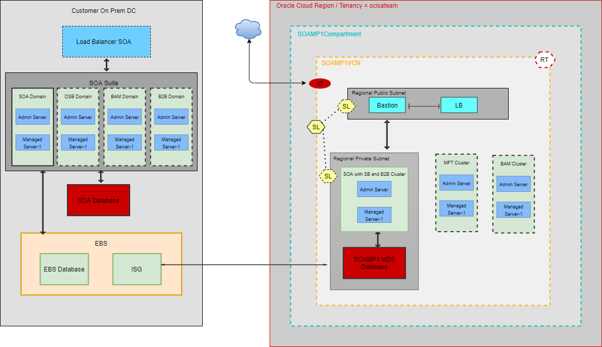

# Migrate SOA Suite On-premises to SOA Suite Marketplace on Oracle Cloud Infrastructure

## Introduction

This lab will walk you through the process of migrating an existing 'on-premises' SOA Suite to SOA Suite on Marketplace for Oracle Cloud Infrastructure. SOA Suite on Marketplace, SOA Cloud Service, and MFT Cloud Service support manual migration from on-premises to the cloud and side-by-side upgrade from one version to another (or an older instance to a newer instance in the same version) in the cloud. 

Attached below is a sample architecture of the final solution:

Estimated Lab Time: 80min to 240min depending on the path chosen.

### Objectives

*Perform the end-to-end migration of a local SOA suite to Oracle Cloud Infrastructure, provisioning SOA Suite on OCI with the Marketplace.*

In this lab, you will:
- Prepare a OCI tenancy with Network setup to use as the target 'SOA Suite Marketplace on OCI' environment
- Provision a demo environment to use as the target SOA 'on-premises' environment to be migrated
- Provision the required Application Database on OCI for SOAMP (both using public and private subnet)
- Provision a new target SOA Suite Instance on OCI with the Marketplace (both using public and private subnet)
- Migrate the source SOA Suite On-prmises to target SOA Suite on OCI Marketplace

**Note:** This lab will showcase only migration of one applicatoin/project, for complete migration of SOA oprem to SOAMP kindly take a reference from `Documentation Reference` section below.

### Prerequisites

*In order to run this workshop you need:*

* A Mac OS X, Windows or Linux machine
* A private/public SSH key-pair
* Firefox browser
* An OCI account
* Prerequisites for Migration and Side-by-Side Upgrade :-
  Before migration or side-by-side upgrade, ensure the following:

* For SOA Suite on Marketplace, the source on-premises version for migration to the cloud is 11.1.1.7 or later. The source version for side-by-side upgrade in the cloud is 12.2.1.4, as Oracle SOA Suite on Marketplace supports only 12.2.1.4.

* For SOA Cloud Service and MFT Cloud Service, the source on-premises version for migration to the cloud is 11.1.1.7 or later. The source version for side-by-side upgrade in the cloud is 12.1.3 or later.

* For SOA Cloud Service and MFT Cloud Service, it is assumed that disaster recovery is not configured for the source environment. Note that appropriate changes have to be made to the instructions if disaster recovery is configured.

* For SOA Suite on Marketplace and SOA Cloud Service, it is assumed that the production environment has a load balancer. Otherwise, the steps have to be modified and adapted accordingly.

You may proceed to the next lab.

## Documentation Reference

[here]https://docs.oracle.com/en/cloud/paas/soa-cloud/liftshift/migration-side-side-upgrade-soa-mp.html#GUID-6F77D620-0962-43A4-A503-A70E706C3D02

## Acknowledgements

 - **Author** - Akshay Saxena, September 2020
 - **Last Updated By/Date** - Akshay Saxena, September 2020

## See an issue?
Please submit feedback using this [form](https://apexapps.oracle.com/pls/apex/f?p=133:1:::::P1_FEEDBACK:1). Please include the *workshop name*, *lab* and *step* in your request.  If you don't see the workshop name listed, please enter it manually. If you would like for us to follow up with you, enter your email in the *Feedback Comments* section.
