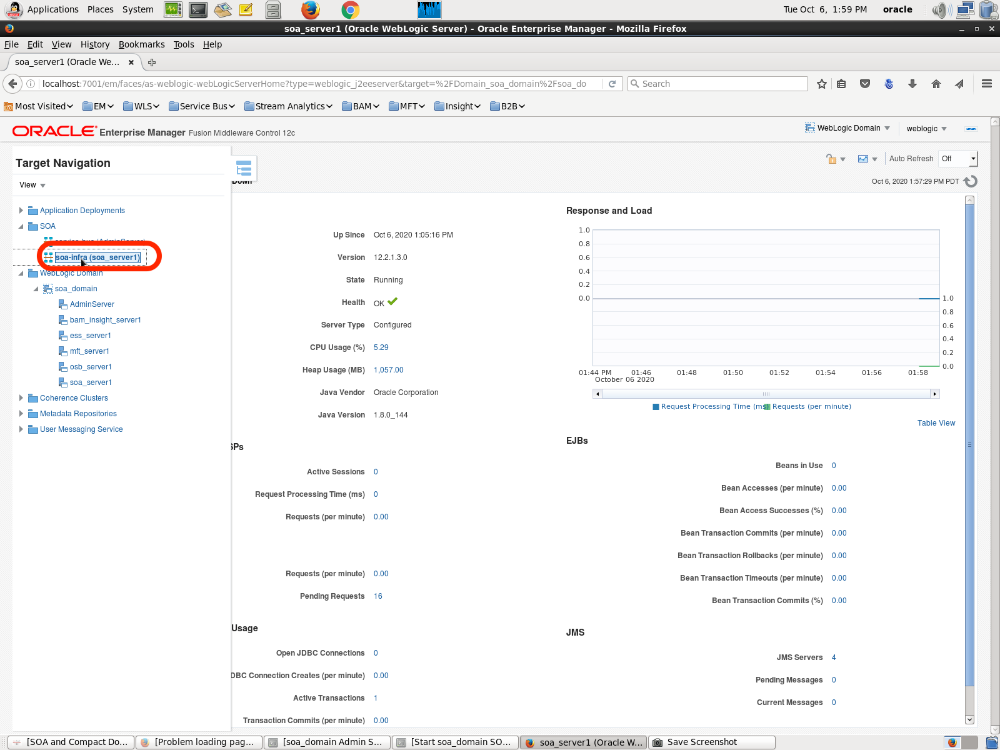

# Migrating the SOA domain

## Introduction: 

Migrating a SOA domain is equivalent to re-deploying the applications and resources to a new domain and infrastructure.
After you have prepared your source and target environments for the migration, you can transition your production system from old deployment to new deployment.

We'll use manual process to migrate the domain from on-premises and re-deploy it on OCI.

**Deploying, Undeploying, and Redeploying SOA Composite Applications**
Oracle SOA Suite uses the SCA standard as a way to assemble service components into a SOA composite application. You can deploy, undeploy, and redeploy SOA composite applications.

SOA composite applications consist of the following:

Service components such as Oracle Mediator for routing, BPEL processes for orchestration, human tasks for workflow approvals, business rules for designing business decisions, and complex event processing for queries of event streams

Binding components (services and references) for connecting SOA composite applications to external services, applications, and technologies

These components are assembled together into a SOA composite application. This application is a single unit of deployment that greatly simplifies the management and lifecycle of SOA applications.

Estimated Lab Time: 45 min

### About Product/Technologies

You can use Fusion Middleware Control, Oracle JDeveloper, or the command line to deploy, undeploy, or redeploy a SOA application.

Migration with manual process consists in 3 steps:

- Discover the source domain, and generate a **model** file of the topology, resources and applications, a **variable** file with required credentials, and an **archive** file with the application binaries.

- Edit the the **model** file and **variable** file to target the new infrastructure on OCI.

- Copy the files to the target Admin Server, and **update** the clean domain on OCI with the applications and resources discovered on-premises.

### Objectives

In this lab, you will:

- Discover the source SOA Suite Environment and test the source code
- Prepare Your Source for Migration/Side-by-Side Upgrade    
- Prepare Your Target Environment
- Test Your Target Environment
- Transition from Old Deployment to New Deployment
- Reconfigure Configuration Parameters and Tune in Oracle SOA Suite on Marketplace
- Check migration was successful by testing your code in SOAMP

### Prerequisites

To run this lab, you need to:

- Have setup the demo 'on-premises' environment to use as the source domain to migrate
- Have deployed a SOA on OCI domain using the marketplace
- (optional) SOAP UI for unit test the code

## **STEP 1:** Discover the source SOA Suite Environment and test the source code

### Using the local 'on-premises' environment:

1. Start SOA 12.2.1.3 VM, wait until it is succesfully started and then check all the required applications.

2. Click on `SOA and Comapct Domain` on the VM desktop and run `Start soa_domain Admin Server` and `Start soa_domain SOA Server` one by one in sequence.

3. Once the domains are started open mozilla web browser and select `http://localhost:7001/em'
to open the EM console, use `usename:weblogic`  , `password:welcome1`
    

   
4. Now click on top right button and go to `SOA_Domain -> SOA -> SOA-Infra` and click on `Deployed Composites`

5. Now search the composite `IWSProj3[1.0]` which we are using for migration in this lab.

6. For unit testing as per the code we need to place any .xml file in /tmp/soa/out folder or you can create the same folder structure.

7. Place or create any `xyz.xml` file under the mentioned folder or create the same folder structure

### Using the demo Workshop Marketplace image

1. Go to the OCI console and to your SOA local marketplace instance open the instanc using RDP.
Connect to the RDP from your local machine using `Public_IP` and user `opc` 
you need to click on `SOA and Compact Domain` on the VM desktop and run `Start soa_domain Admin Server` and `Start soa_domain SOA Server` one by one in sequence.

Once the domains are started open mozilla web browser and select `http://localhost:7001/em'
to open the EM console, use `usename:weblogic`  , `password:welcome1

2. Click on `SOA and Comapct Domain` on the VM desktop and run `Start soa_domain Admin Server` and `Start soa_domain SOA Server` one by one in sequence.

3. Once the domains are started open mozilla web browser and select `http://localhost:7001/em'
to open the EM console, use `usename:weblogic`  , `password:welcome1`
    

   
4. Now click on top right button and go to `SOA_Domain -> SOA -> SOA-Infra` and click on `Deployed Composites`

5. Now search the composite `IWSProj3[1.0]` which we are using for migration in this lab.

6. For unit testing as per the code we need to place any .xml file in /tmp/soa/out folder or you can create the same folder structure.

7. Place or create any `xyz.xml` file under the mentioned folder or create the same folder structure

## **STEP 2:** Prepare Your Source for Migration/Side-by-Side Upgrade

You have to migrate the Integrated Development Environment (IDE) projects and export or capture needed artifacts from the source environment to prepare your source for migration//side-by-side upgrade

Migrate IDE projects (11G or 12c) to the 12c IDE that matches the Oracle SOA Suite on Marketplace version ,i.e. 12.2.1.4 for SOA.

### Using the local 'on-premises' environment:

1. Open the Jdeveleoper 12.2.1.3 and select `IWSApplication` and open the Project 'IWSProj3` and click on deploy

2. Select `Generate SAR File` and click `Next` button

3. Review and click `Next` button

4. Review and click `Finish` button

5. Let the code build successfully 

6. Open your Jdeveloper 12.2.1.4 and create a new SOA Application (with same application name as source Jdev `IWSApplication`)

7. Name you default project and click `Next` button

8. Select `Empty Composite` and click `Finish` button

9. Click on `File -> Import`

10. Select `SOA Archive Into SOA Project` and click `OK` button

11. Name the project as same as in source environmant `IWSProj3` and click `Next` button

12. Click on `Browse` button and go to the location where you have deployed your Jdeveloper 12.2.1.3 project on step 4 (usually the location is`C:\JDeveloper\mywork\IWSApplication\IWSProj3\Deploy`)and select the 'sca_IWSProj3.jar' and click on `Next` button

13. Review and click on `Finish` button 

14. Let the 12.2.1.3 code migrate to Jdev 12.2.1.4 

15. Repeat the steps 1  2 , 3 , 4 to deploy the code as `SAR File` with 12.2.1.4 version

### Using the demo Workshop Marketplace image

1. You have to repeat the same steps as `local on-premises' environment` as the Jdeveleoper 12.2.1.3 and Jdeveloper 12.2.1.4 are present on the desktop of the local SOA environment marketplace RDP.

## **STEP 3:** Prepare Your Target Environment

Prepare your target environment by importing or recreating all the configurations of your source. This will ensure successful deployment of the target Oracle SOA Suite on Marketplace instance.

1. Connect to your SOAMP compute instance using putty (as you have learned in Lab 4 ## **STEP 3:** Connect your FMW Console URL's of Private SOA Instance using Bastion Host through Putty.)

  
## **STEP 4:** Test Your Target Environment

## **STEP 5:** Transition from Old Deployment to New Deployment

## **STEP 6:** Reconfigure Configuration Parameters and Tune in Oracle SOA Suite on Marketplace

## **STEP 7:** Check migration was successful by testing your code in SOAMP

## Acknowledgements

 - **Author** - Akshay Saxena, September 2020
 - **Last Updated By/Date** - Akshay Saxena, September 2020

## See an issue?
Please submit feedback using this [form](https://apexapps.oracle.com/pls/apex/f?p=133:1:::::P1_FEEDBACK:1). Please include the *workshop name*, *lab* and *step* in your request.  If you don't see the workshop name listed, please enter it manually. If you would like for us to follow up with you, enter your email in the *Feedback Comments* section.
