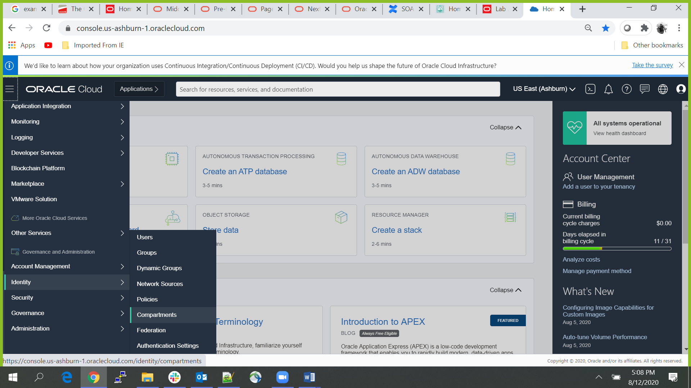
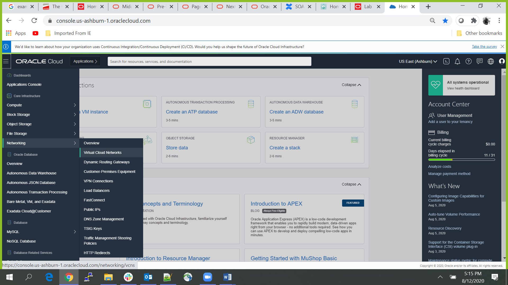
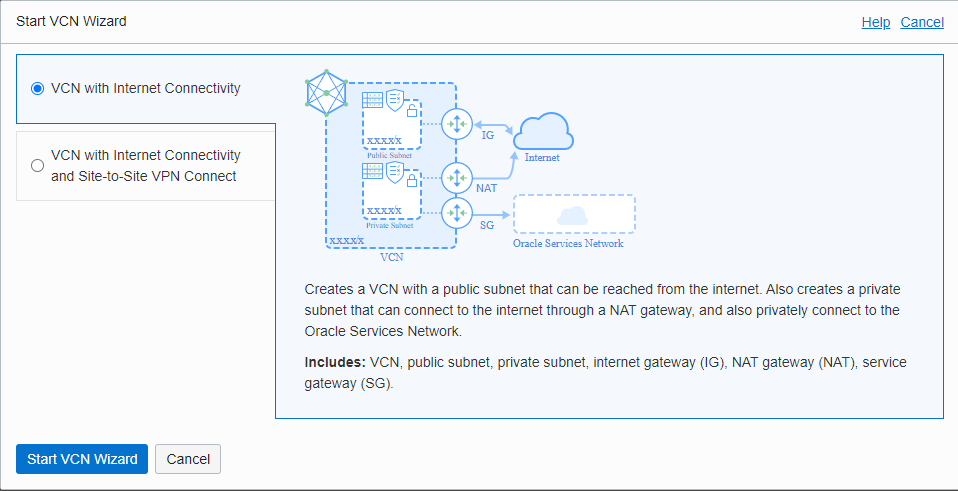
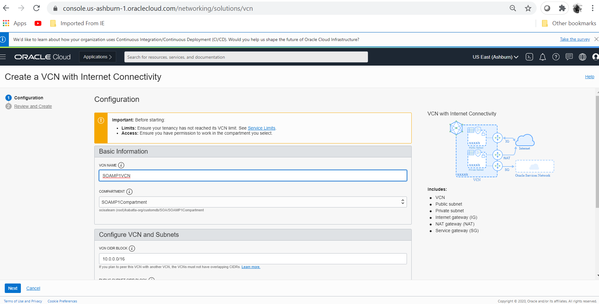
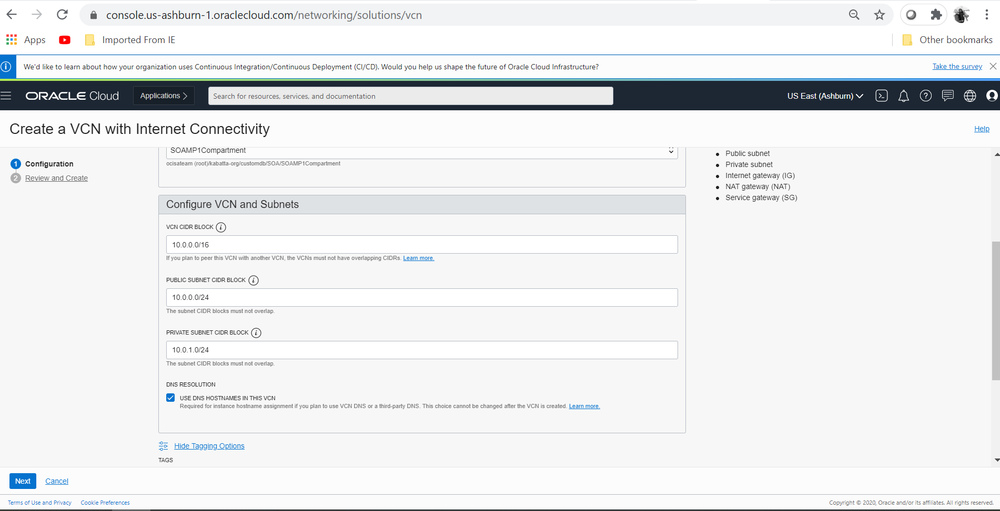
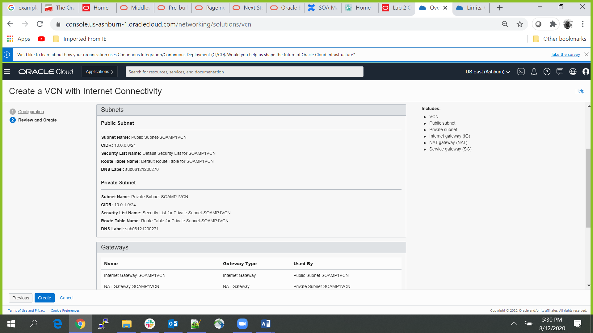
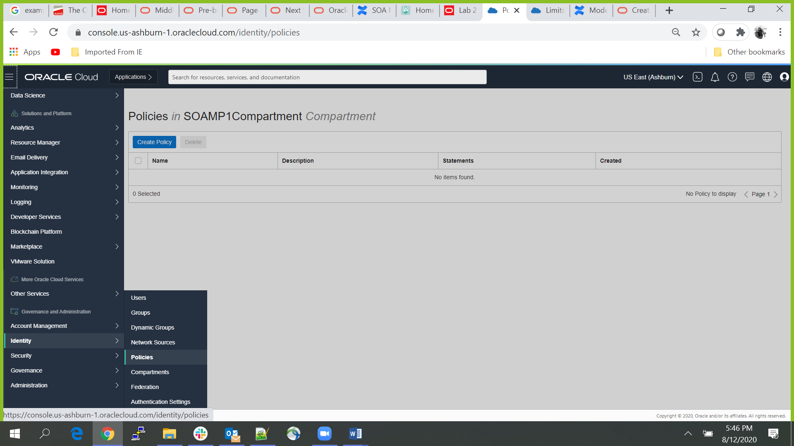
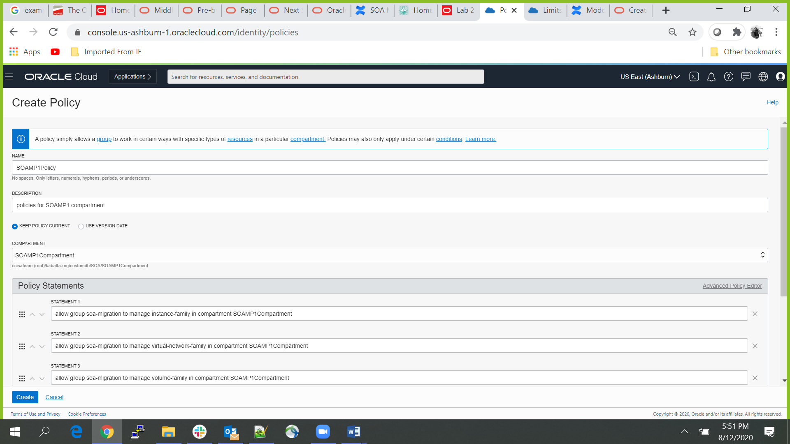

# Network setup

## Introduction: 

This lab with guide you through how to setup Compartments and Virtual Cloud Network (VCN) with the required policies for cloud environment (tenancy)
Estimated Lab Time: 20 min

### Objectives

In this lab you will:

- Create a Compartment
- Create a VCN with private and public subnets

## **STEP 1:** Create the Compartment

Before we can provision the Application Database (SOADB), we need to provision a **Compartment** where we can setup the Network Layer ,or you can take details of already created **Compartment** from your network administrator.

1. Go to the menu button on the top left and select **Identity -> Compartment** .

  

2. Click on **Create Compartment** , after providing all the required details and make sure you have relevant permissions from your OCI Administrator to create the **Compartment**.

  

## **STEP 2:** Create the VCN

We need to provision a **VCN** by choosing **Start VCN Wizard** with preconfigured **public subnet** and **private subnet** with appropriate **Security Lists** to open up the required ports:

1. Go to the menu button and go to **Networking -> Virtual Cloud Networks**.

  

2. Click on **Create VCN** button and then select **VCN with Internet Connectivity** and click on **Start VCN Wizard** button.

  

3. Provide the VCN NAME and select the Compartment which you have created earlier.

  

4. Select the default values for Configure VCN and Subnets unless you have been provided by specific CIDR range from your Network Administrator to use, then click on **Next** button.

  

5. Review all the **VCN** ,**Subnet** ,**Gateway**, **Security List** and **Route Table** details and then click on **Create** button.
Here you can see stack has created two subnets which we we'll use later for creating DB and SOA instance:-
A **Private Subnet** with its security list **Security List For Private Subnet-SOAMP1VCN**,
A **Public Subnet** with it's security lists **Default Security List for SOAMP1VCN**

  

## **STEP 3:** Create the Policies (Optional)

We need to create the **Policies** i.e. A document that specifies who can access which resources, and how. Access is granted at the group and compartment level, which means you can write a policy that gives a group a specific type of access within a specific compartment, or to the tenancy itself.

1. Go to the menu button and select **Identity -> Policies** anf then click on **Create Policy** button.

  

2. Select the compartment which you have created previously and then provide reuired details and add below policy statement one by one, and then click on **Create** button.

allow group soa-migration to manage instance-family in compartment SOAMP1Compartment
allow group soa-migration to manage virtual-network-family in compartment SOAMP1Compartment
allow group soa-migration to manage volume-family in compartment SOAMP1Compartment
allow group soa-migration to use database-family in compartment SOAMP1Compartment
allow group soa-migration to use autonomous-database-family in compartment SOAMP1Compartment

  

## Acknowledgements

 - **Author** - Akshay Saxena, September 2020
 - **Last Updated By/Date** - Akshay Saxena, Septemebr 2020

## See an issue?
Please submit feedback using this [form](https://apexapps.oracle.com/pls/apex/f?p=133:1:::::P1_FEEDBACK:1). Please include the *workshop name*, *lab* and *step* in your request.  If you don't see the workshop name listed, please enter it manually. If you would like for us to follow up with you, enter your email in the *Feedback Comments* section.
