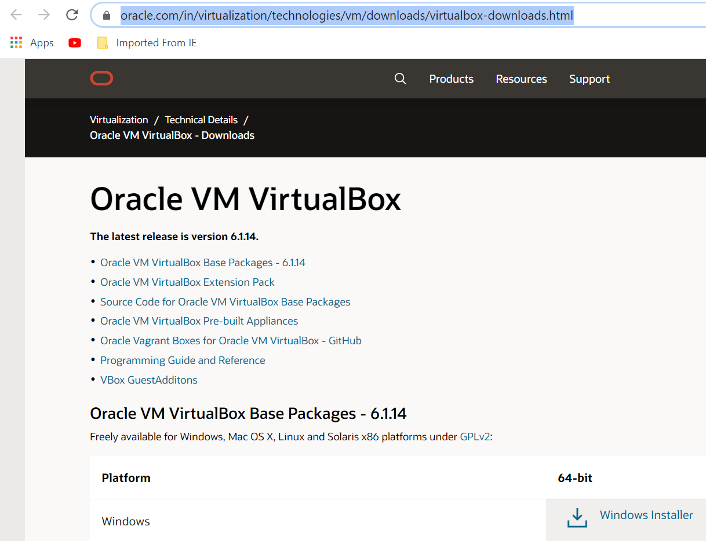
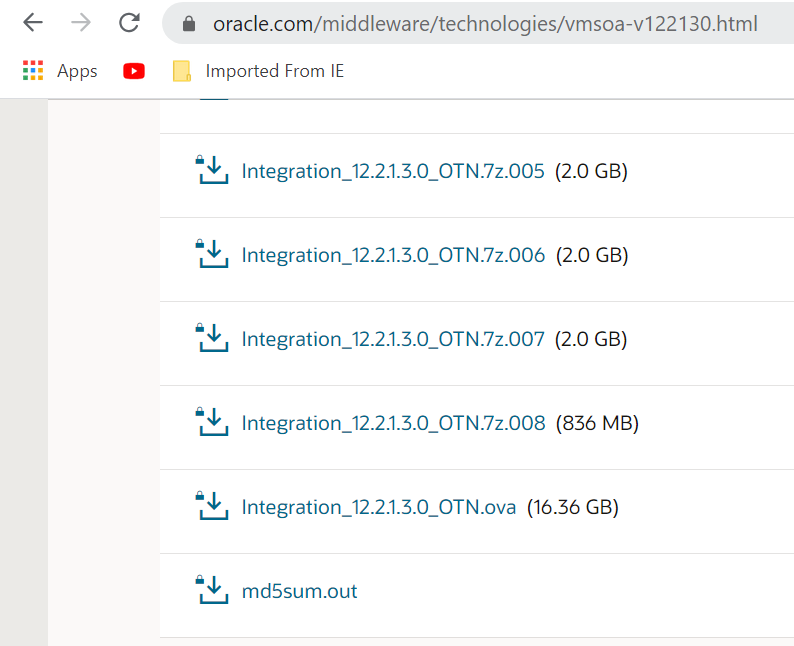
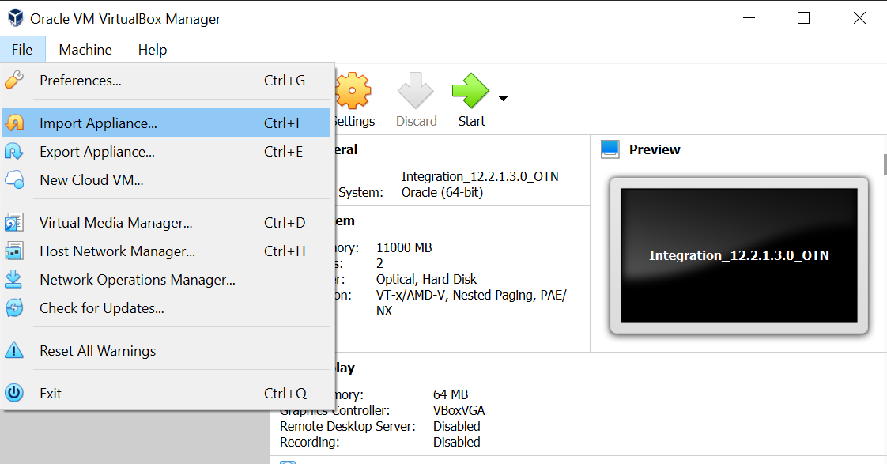
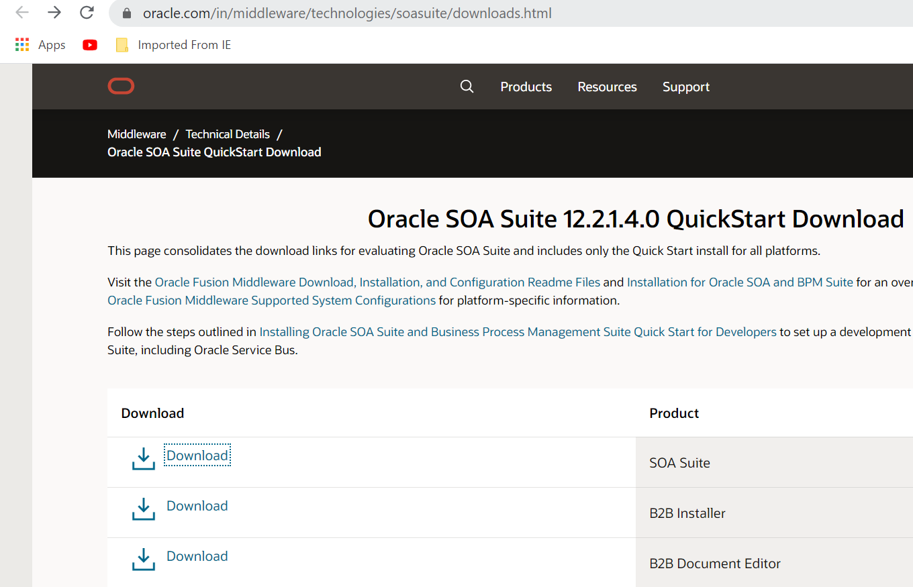
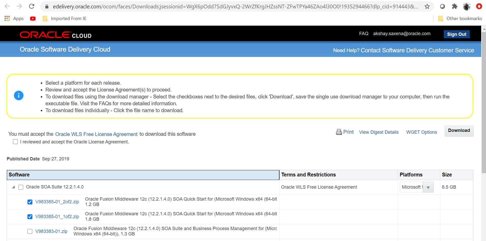

# Setup a local (on-premises) environment using Docker

## Introduction: 

This lab will walk you through setting up a local SOA Suite environment to simulate an established on-premises environment, using **Oracle VM Virtual Box** on your local machine. 

At the end of this lab, you will have a local environment running with an Oracle SOA Suite 12.2.1.3 VM and a SOA Suite 12.2.1.4 quick start with Jdev 12.2.1.4.

Estimated Lab Time: 30 min

### Objectives

In this lab you will:

- Install the Oracle VM Virtual Box
- Download the SOA Suite 12.2.1.3 .ova windows file.
- Startup Oracle VM Virtual Box demo environment
- Prepare your VM box with downloaded soa suite 12.2.1.3 .ova file
- Install the SOA Suite 12.2.1.4 quick start on your local machine

### Prerequisites

To run this lab, you will need :
- oracle account to download the files from OTN
- 25 GB Storage
- minimum 16 GB RAM

## **STEPS:**

### **On Windows**

*Make sure you followed the installation instructions to setup the VM*

1. Install the Oracle VM Virtual Box, 
go to below site :
download the installer `Windows`  `Windows Installer`

[here](https://www.oracle.com/in/virtualization/technologies/vm/downloads/virtualbox-downloads.html)

2. Download the SOA Suite 12.2.1.3 .ova windows file,
go to below site :
download the file `Integration_12.2.1.3.0_OTN.ova (16.36 GB)`

[here](https://www.oracle.com/middleware/technologies/vmsoa-v122130.html)

**Note:** you can choose installer platform accordig to your system for ex: Mac ubantu , linux ,e,t,c

3. Start Oracle VM Virtual Box demo environment and prepare your VM box with downloaded soa suite 12.2.1.3 .ova file
go to **File -> Import Appliance**,
and then select the `Integration_12.2.1.3.0_OTN.ova` file and then click on next

4. once the import is successfull , click on Start button to start your SOA 12.2.1.3 environment. 
default username: oracle / root
password: oracle

5. Install the SOA Suite 12.2.1.4 quick start on your local machine,
go to   `Download` button in front of `SOA Suite` product

[here](https://www.oracle.com/in/middleware/technologies/soasuite/downloads.html)

6. select only `V983385-01_1of2.zip` `V983385-01_2of2.zip` as we are using only SOA Quick Start for this lab.
and select your platform and click on download.

7. check both the SOA Suite versions 
SOA Suite 12.2.1.3 VM and SOA Suite 12.2.1.4 local installation are working properly and j developer for both the versions are working fine.

## Acknowledgements

 - **Author** - Akshay Saxena, September 2020
 - **Last Updated By/Date** - Akshay Saxena, September 2020

## See an issue?
Please submit feedback using this [form](https://apexapps.oracle.com/pls/apex/f?p=133:1:::::P1_FEEDBACK:1). Please include the *workshop name*, *lab* and *step* in your request.  If you don't see the workshop name listed, please enter it manually. If you would like for us to follow up with you, enter your email in the *Feedback Comments* section.
