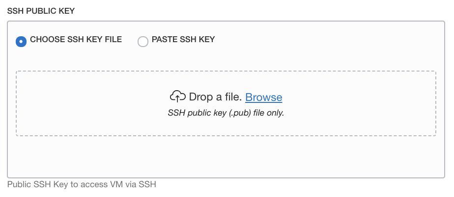

# Setup an 'on-premises' environment using the workshop image.

## Introduction: 

This lab walks you through setting up an environment to simulate an established SOA 12.2.1.3 on-premises environment, using a Compute instance on OCI deployed through the marketplace. 

At the end of this lab, you will have a simulated 'on-premises' environment running with an Oracle SOA Suite 12.2.1.3 VM , containng Database 12c , WebLogic Server 12c and SOA Suite 12.2.1.4 Quick Start setup to use Jdeveloper 12.2.1.4 for changing the versions of code from 12.2.1.3 to 12.2.1.4 which is mandatory for the SOAMP 12.2.1.4 migration .

Estimated Lab Time: 15 min

### Objectives

In this lab you will:

- Launch a demo Marketplace image
- Check that the services are up and running

### Prerequisites

For this lab you need:

- A compute instance with 4 OCPUs available to run the image.

## **STEP 1:** Launch the Workshop Marketplace stack

- Navigate to [Workshop Environment Marketplace Stack](https://cloudmarketplace.oracle.com/marketplace/listing/84694612)

1. Click **Get App**

  

2. Select OCI Region and Sign in to your Oracle Cloud Infrastructure Account

  

3. Choose a compartment, for this lab we have used `SOAMP1Compartment` but you can choose your own compartment

  

4. Accept the Terms and Conditions and click **Launch**

  

5. Click **Next** or if you want can provide  name and description (optional)

  

6. Paste your **SSH public key**

   To connect to the SOA servers via SSH, you need to provide a public key the server will use to identify your computer.

  

   `ssh-rsa AAAAB3NzaC1yc2EAAAADAQABAAABAQCDECqTo6JfSGWkXfF6pkMBySZWt1jfDU0
   lAzgTDVfgTaR8YVS7d6sYVv9pU8dohqUZN7jPdbbeDCfm8EiCZMNkdB8Zbyn29P
   COV192DKWd2hzYnr6jbVrbdwp7Izqap9G5nocvZ1KtE5g9HEmqVRFg4RPSeMmY/
   hInaRNRAB73fZNglqnVtkrju0sUoDcRPYskrIc4QpRv2luTTC4Byjsz0cULXsuz
   z4k8suaGFVsxfANuriiKOpDXktMXNkYPb8ymm5UCi4ywHd5uv3wqhqkCdBPPeyI
   lm6dTfDGrLrUQUhjHhVGEaPazYCk0k/M3BWQCfu9t63t4WnBIOU3xrPf9`

   
   **Note:** you can use the example above as the key: it is a different public key which is useless without the corresponding private key, and you will not be able to access your resources on OCI), so you need the cooresponding .ppk file also.

7. Click **Next** and then **Create**

  

  

It will take about 1 to 2 minutes to create the stack. 

8. When the job finishes, you can find the Public IP address of the instance at the bottom of the logs, or in the **Output** area. Make a note of this information.

  

## **STEP 2:**  Check the local environment is up and running

*It will take another 4 to 5 minutes for all the services to come online.*

Connect to the RDP from your local machine using `Public_IP` and user `opc` 
you need to click on `SOA and Compact Domain` on the VM desktop and run `Start soa_domain Admin Server` and `Start soa_domain SOA Server` one by one in sequence.

Once the domains are started open mozilla web browser and select `http://localhost:7001/em'
to open the EM console, use `usename:weblogic`  , `password:welcome1`

## Acknowledgements

 - **Author** - Akshay Saxena, September 2020
 - **Last Updated By/Date** - Akshay Saxena, September 2020

## See an issue?
Please submit feedback using this [form](https://apexapps.oracle.com/pls/apex/f?p=133:1:::::P1_FEEDBACK:1). Please include the *workshop name*, *lab* and *step* in your request.  If you don't see the workshop name listed, please enter it manually. If you would like for us to follow up with you, enter your email in the *Feedback Comments* section.
