# Provision the Application Database on OCI with DBaaS

## Introduction: 

This lab with guide you through provisioning a Application Database

Estimated Lab Time: 30-35 min including ~25-30 min provisioning time.

### Objectives

In this lab you will:

- Provision the Application Database as a Database VM.


## **STEP 1:** Provision the Database System

1. Go to **Database -> Bare Metal, VM and Exadata**

  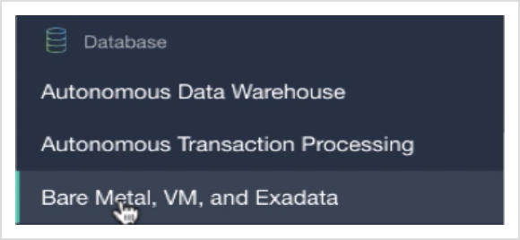

2. Click **Create DB System**

  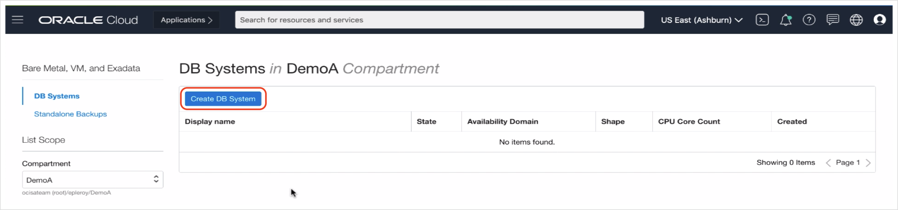

3. Make sure you are in the **Compartment** where you created the DB subnet, and name your **Database System**

  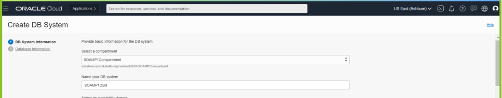

4. Select an Availability Domain or keep the default, keep the default **Virtual Machine** and select a **Shape** that is available.

  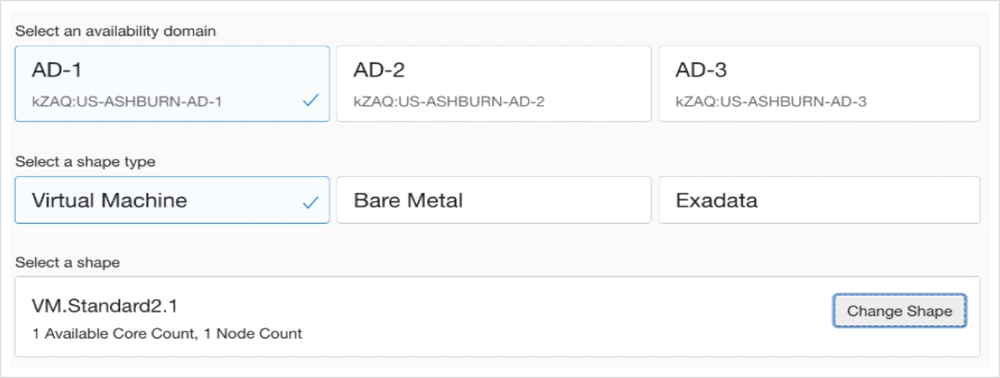

5. Keep the defaults for **Total node count** and **Database Edition**

  

6. Select **Logical Volume Manager** 

  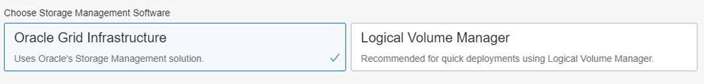

7. Keep defaults for **Storage**

  

8. **Upload** the **SSH public key** created earlier during prerequisites
or you can copy below public key

    The key created by me can be found in the folder `./ssh-keys/key-pair/publicKey.pub`

    **ssh-rsa AAAAB3NzaC1yc2EAAAADAQABAAABAQCDECqTo6JfSGWkXfF6
    pkMBySZWt1jfDU0lAzgTDVfgTaR8YVS7d6sYVv9pU8dohqUZN7jPdbbe
    DCfm8EiCZMNkdB8Zbyn29PCOV192DKWd2hzYnr6jbVrbdwp7Izqap9G5
    nocvZ1KtE5g9HEmqVRFg4RPSeMmY/hInaRNRAB73fZNglqnVtkrju0sU
    oDcRPYskrIc4QpRv2luTTC4Byjsz0cULXsuzz4k8suaGFVsxfANuriiK
    OpDXktMXNkYPb8ymm5UCi4ywHd5uv3wqhqkCdBPPeyIlm6dTfDGrLrUQ
    UhjHhVGEaPazYCk0k/M3BWQCfu9t63t4WnBIOU3xrPf9**

    If using the marketplace image, just use the **Paste SSH Keys** and get the key  inside the 'on-premises' environment with:

  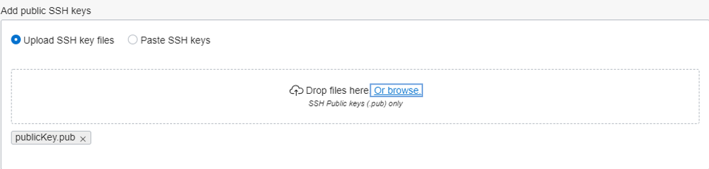

9. Keep the default **License Included**

  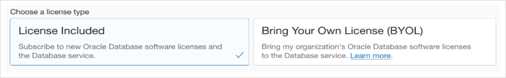

10. Select the **Virtual cloud network** `SOAMP1VCN`, the **Client subnet** `Private Subnet-SOAMP1VCN(regional)` and set a **Hostname prefix** of `soamp2db`

  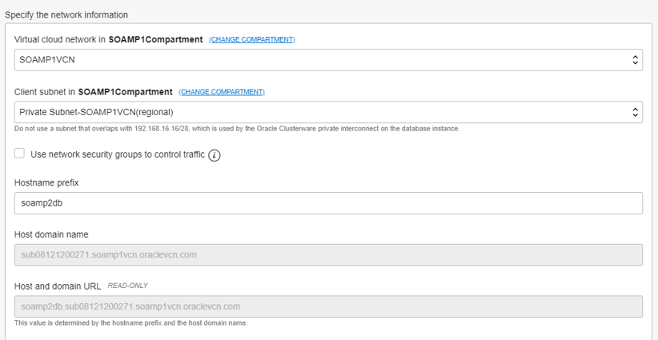

11. Click **Next**

12. Name the Database `SOAMP2DB` or like the database on-premises (required for proper migration)

13. Select the **Database version** `12.2`

14. Name the **PDB** `PDB1` or as it is on premises

15. Enter and confirm the **SYS Database password** or as it is on-premises: 

you can create your own password followed all instructions or you can copy below

    ```
    <copy>
    WELcome##123
    </copy>
    ```

  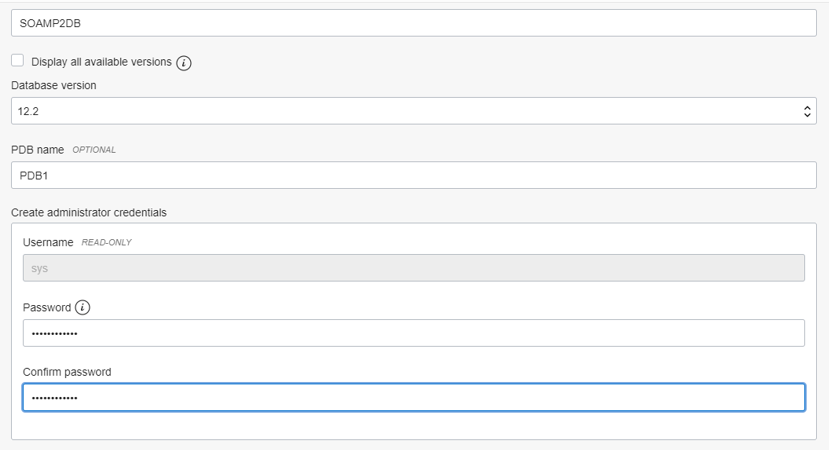

16. Keep the default of **Transaction Processing** for **Workload type** and **Backup**, or optionally you can select **Enable automatic backups** for the period of `60 days` and scheduling `Anytime` and click **Create DB System**

  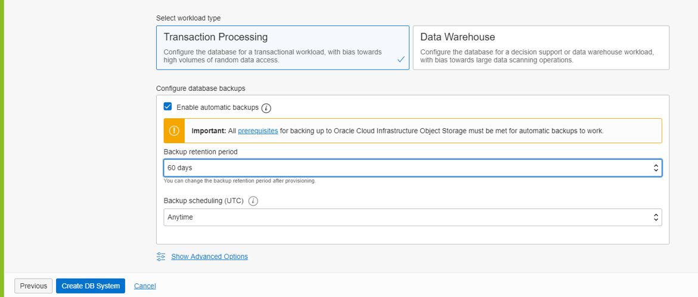

This will usually take up to 40 minutes to provision,
you have to wait until the sttus changes from `provisioning` to `Available`.

  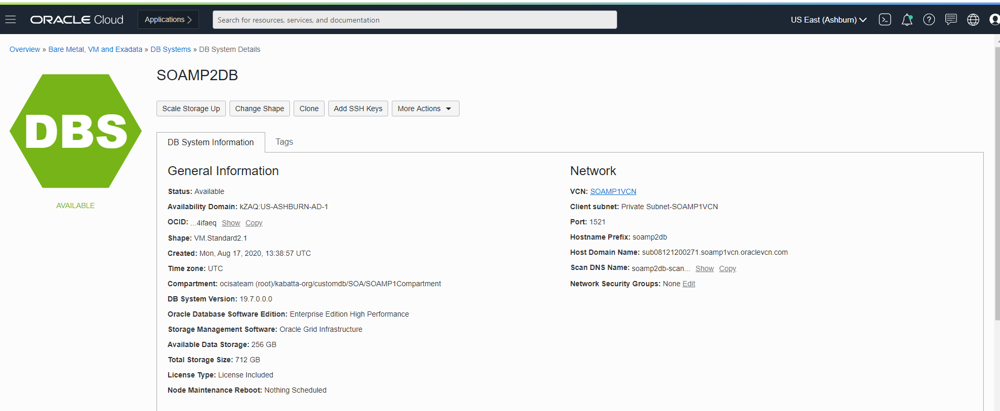

To save some time, you can proceed to starting the`Lab 1 Option A: Setup an on-premises environment with the Workshop Marketplace stack` lab to setup the source SOA on-premimse environment while the DB is provisioning if you wish, however you will need the DB fully provisioned and you will need to gather the DB information before you can start the SOAMP instance provisioning.

## Acknowledgements

 - **Author** - Akshay Saxena, September 2020
 - **Last Updated By/Date** - Akshay Saxena, September 2020

## See an issue?
Please submit feedback using this [form](https://apexapps.oracle.com/pls/apex/f?p=133:1:::::P1_FEEDBACK:1). Please include the *workshop name*, *lab* and *step* in your request.  If you don't see the workshop name listed, please enter it manually. If you would like for us to follow up with you, enter your email in the *Feedback Comments* section.
