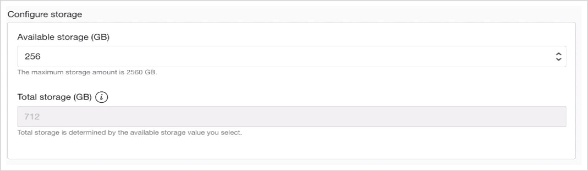

# Provision the Application Database on OCI with DBaaS

## Introduction: 

This lab with guide you through provisioning a Application Database

Estimated Lab Time: 30-35 min including ~25-30 min provisioning time.

### Objectives

In this lab you will:

- Provision the Application Database as a Database VM.
- Create a Security List with proper ports open


## **STEP 1:** Provision the Database System

1. Go to **Database -> Bare Metal, VM and Exadata**

  

2. Click **Create DB System**

  

3. Make sure you are in the **Compartment** where you created the DB subnet, and name your **Database System**

  

4. Select an Availability Domain or keep the default, keep the default **Virtual Machine** and select a **Shape** that is available.

  

5. Keep the defaults for **Total node count** and **Database Edition**

  

6. Select **Logical Volume Manager** 

  

7. Keep defaults for **Storage**

  

8. **Upload** the **SSH public key** created earlier during prerequisites
or you can copy below public key

    The key created by me can be found in the folder `./ssh-keys/key-pair/publicKey.pub`

    **ssh-rsa AAAAB3NzaC1yc2EAAAADAQABAAABAQCDECqTo6JfSGWkXfF6
    pkMBySZWt1jfDU0lAzgTDVfgTaR8YVS7d6sYVv9pU8dohqUZN7jPdbbe
    DCfm8EiCZMNkdB8Zbyn29PCOV192DKWd2hzYnr6jbVrbdwp7Izqap9G5
    nocvZ1KtE5g9HEmqVRFg4RPSeMmY/hInaRNRAB73fZNglqnVtkrju0sU
    oDcRPYskrIc4QpRv2luTTC4Byjsz0cULXsuzz4k8suaGFVsxfANuriiK
    OpDXktMXNkYPb8ymm5UCi4ywHd5uv3wqhqkCdBPPeyIlm6dTfDGrLrUQ
    UhjHhVGEaPazYCk0k/M3BWQCfu9t63t4WnBIOU3xrPf9**

    If using the marketplace image, just use the **Paste SSH Keys** and get the key  inside the 'on-premises' environment with:

  

9. Keep the default **License Included**

  

10. Select the **Virtual cloud network** `SOAMP1VCN`, the **Client subnet** `Private Subnet-SOAMP1VCN(regional)` and set a **Hostname prefix** of `soamp2db`

  

11. Click **Next**

12. Name the Database `SOAMP2DB`

13. Select the **Database version** `12.2`

14. Name the **PDB** `PDB1`

15. Enter and confirm the **SYS Database password**: 

    you can create your own password followed all instructions or you can copy below

    ```
    <copy>
    WELcome##123
    </copy>
    ```

  

16. Keep the default of **Transaction Processing** for **Workload type** and **Backup**

17. Optionally you can select **Enable automatic backups** for the period of `60 days` and scheduling `Anytime` and 

  

18. Click **Create DB System**

  This will usually take up to 40 minutes to provision.

  


## **STEP 2:** Create a Security List for the database and SOA subnet

Before we can provision the SOAMP Instance, we need to provision a **private subnet** for the **SOA Instance** with appropriate **Security Lists** to open up the required ports: 

  - port 1521 for the database
  - port 22 for SSH
  - 7001-7004 for SOA weblogic
  - 9001-9004 for weblogic internal ports

In this section we will create a Security List for the SOA subnet to be able to reach the Database subnet on port 1521 (the Oracle Database default port), SSH port 22 and weblogic ports 7001-7004 , 9001-9004 to communicate to SOA instance.

1. Go to **Networking -> Virtual Cloud Networks**

  

2. Select the VCN you created earlier (`SOAMP1VCN`)

3. Click **Security Lists**

  

4. Click **Security List for Private Subnet-SOAMP1VCN** 

  

5. Click on **Add Ingress Rules**

6. Add the ingress rules below to allow all the WebLogic port and allow accessing the DB ports.

  


## **STEP 3:** Check the status of the database provisioning

Before you can proceed to the next lab, you need to check that the DB has been fully provisioned

1. Go to **Oracle Databases -> BM, VM, Exadata**

2. Make sure you are in the correct Compartment.

3. Check the status of the database is `Available` or wait until it is before proceeding to the next lab.

  

You may proceed to the next lab.

## Acknowledgements

 - **Author** - Akshay Saxena, September 2020
 - **Last Updated By/Date** - Akshay Saxena, September 2020

## See an issue?
Please submit feedback using this [form](https://apexapps.oracle.com/pls/apex/f?p=133:1:::::P1_FEEDBACK:1). Please include the *workshop name*, *lab* and *step* in your request.  If you don't see the workshop name listed, please enter it manually. If you would like for us to follow up with you, enter your email in the *Feedback Comments* section.
