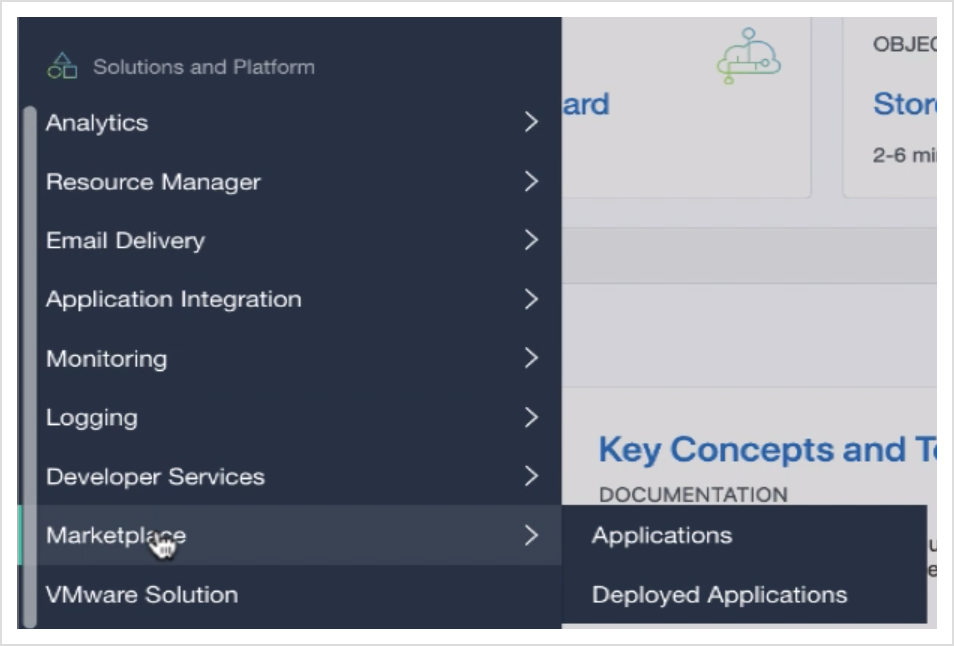

# Provision SOA Suite Marketplace on Oracle Cloud Infrastructure

## Introduction

This lab walks you through provisioning the SOA Suite Infrastructure by leveraging the OCI Marketplace image. 

Estimated Lab Time: 40 min

### Objectives

In this lab you will:

- Provision SOA Server on Oracle Cloud Infrastructure via the Marketplace offering
- Gather information for further steps
- Connect your FMW Console URL's of Private SOA Instance using Bastion Host through Putty

### Prerequisites

For this lab, you need to have prepared the OCI tenancy with:

- Putty
- SSH Public-Private Key pair
- WinSCP (optional)

## **STEP 1:** Provision the stack through the Marketplace

1. Go to **Solutions and Platforms -> Marketplace -> Applications**

  

2. In the search input, type "`soa`". For this lab, we'll use the **Oracle SOA Suite (BYOL)**

   

3. Make sure you are in the **Compartment** you want to use, use the **default WebLogic version** available, accept the License agreement and click **Launch the Stack**

   

4. **Name** the stack and click **Next**

   

5. **Enter** a **Resource Name Prefix**.

  It will be used to prefix the name of all the resources (domain, managed servers, admin server, cluster, machines...)

  The next steps in this workshop assumes the resource name prefix is `SOAMP2`, so it is highly recommended to use this name.

6. **Select** a **Service Type**.

   In a real world situation, choose a service type according to your requirement. for this workshop we are using **SOA with SB & B2B Cluster**.

7. **Select** a **Shape**.

   In a real world situation, choose a shape appropriate to handle the load of a single managed server. Since we're using a trial account, choose the **VM.Standard.E2.1** shape, the **VM.Standard.2.1** shape or a suitable shape that is available in your tenancy.

   To check shape availability, you can go to **Governance -> Limits and Quotas** in another tab, and verify you have a specific shape available

8. **SSH key**

   To connect to the WebLogic servers via SSH, you need to provide a public key the server will use to identify your computer. 

  

   use the same **SSH PUBLIC KEY** which you have used during  DB provisioning (or else you can use your own public-private key pair)

    **ssh-rsa AAAAB3NzaC1yc2EAAAADAQABAAABAQCDECqTo6JfSGWkXfF6
    pkMBySZWt1jfDU0lAzgTDVfgTaR8YVS7d6sYVv9pU8dohqUZN7jPdbbe
    DCfm8EiCZMNkdB8Zbyn29PCOV192DKWd2hzYnr6jbVrbdwp7Izqap9G5
    nocvZ1KtE5g9HEmqVRFg4RPSeMmY/hInaRNRAB73fZNglqnVtkrju0sU
    oDcRPYskrIc4QpRv2luTTC4Byjsz0cULXsuzz4k8suaGFVsxfANuriiK
    OpDXktMXNkYPb8ymm5UCi4ywHd5uv3wqhqkCdBPPeyIlm6dTfDGrLrUQ
    UhjHhVGEaPazYCk0k/M3BWQCfu9t63t4WnBIOU3xrPf9**
    
    **Note:** you can use your own public-private key pair or Do not use the example above as the key unless without the corresponding private key, and you will not be able to access your resources on OCI)

9. **Select** an **Availability Domain**

10. **Select** a **Node count**. In this lab, we'll provision `1` node.

11. We'll keep the **WebLogic Server Admin User Name** as the default of `weblogic`

12. Provide password of your choice or you can use the below which we have used for this lab `WELcome##123`

13. In the **WebLogic Network** section, make sure you are in the proper compartment for this lab we have used `SOAMP1Compartment`
 
14. For **VIRTUAL CLOUD NETWORK STRATERGY** Select `Use Existing VCN`

15. Select **EXISTING NETWORK** as `SOAMP1VCN`

16. Select **SUBNET STRATERGY** as `Use Existing Subnet`
   
17. Select **SUBNET COMPARTMENT** as `SOAMP1Compartment` 

  

**Note:** You can keep different compartments for your Network and Instances , but make sure you have used the same subnet for SOA where your DB has deployed, For this Lab we are using same comaprtment for all the configurations.

18. Select **SUBNET TYPE** as `Use Private Subnet` 

19. Select **SUBNET SPAN** as `Regional Subnet`

20. Select **EXISTING SUBNET** as `Private Subnet-SOAMP1VCN(Regional)`

21. Select **EXISTING SUBNET FOR BASTION HOST** as `Public Subnet-SOAMP1VCN(Regional)`

  

**Note:** Since we are choosing private subnet for SOA instance we need a bastion host in public subnet (using public IP which is the gateway to SOA instance for the external world) to connect internally to the private IP of SOA Instance , bastion host wouldn't be required if we use public subnet for SOA instance as it will have a public IP to be commnubicated from eternal world.

22. Select **BASTION HOST SHAPE** as `VM Standard2.1`
or can Select `VM StandardE2.1` if working on trial instance

23. **Check** the **Provision Load Balancer** checkbox and Select **EXISTING SUBNET FOR LOAD BALANCER** as `Public Subnet-SOAMP1VCN(Regional)` and **LOAD BALANCER SHAPE** as `400Mbps`

  

24. Select **DATABASE STRATERGY** as `Database Systems`

25. Select **DB SYSTEM COMPARTENT** as `SOAMP1VCNCompartment`

**Note:** Since we already have created DB for SOA, we should choose the compartment where we have provision the DB and check if we are able to see the DB instance  

26. Select the below details:
**DB SYSTEM** as `SOAMP2DB`,
**DB HOME IN THE DB SYSTEM** from drop down,
**DB IN THE DB SYSTEM** as `SOAMP2DB` and
**PDB** as `PDB1`

27. Select **DATABASE ADMINISTRATOR** as `SYS`

28. Select **DATABASE ADMINISTRATOR PASSWORD** as `WELcome##123`

**Note:**  provide the same credentials which you have used earlier to create DB, for this lab we have used above credentials for DB.

29. **Check** the checkbox for **SERVICE INSTANCE ADVANCED CONFIGURATION**
   Here you can see all the default ports, which we will keep as-is.

  

30. In this same **Advanced** section, **check** the checkbox to **DEPLOY SAMPLE APPLICATION**: since we can reuse the service to migrate from onprem to soamp.

  

31. Once you got all the port details then go to the main menu and open VCN in new tab (open link in new tab) then go to **VCN -> SOAMP1VCN -> Security Lists -> Security List for Private Subnet-SOAMP1VCN** 

32. Click on **Add Ingress Rules** and add below ingress rules to allow all the WebLogic port and allow accessing the DB ports.

33. Click **Next** and then verify all the details and click **Create**

  

34. The stack will get provisioned using the **Resource Manager**. This may take 7-15min.

  

Once the stack is provisioned, you can find the information regarding the URL and IP of the WebLogic Admin server in the logs, or in the **Outputs** left-side menu. 

## **STEP 2:** Gather the necessary SOA stack information

  

1. Make a note of the **FMW Console** , **Service Consoles** and the **Weblogic administration Console** for later use.

2. Make a note of the **Load Balancer IP** for later use.

**Note:** You can not copy/paste the **FMW Console** URL in your browser yet as it has a private IP, you need to connect the bastion host public IP through putty and ssh the private IP of SOA instance and then create a tunnel till your local machine and then you can explore the provisioned SOA domain. You should find that there are few applications in **deployments** and a data sources in the **service->datasources** menu

## **STEP 3:** Connect your FMW Console URL's of Private SOA Instance using Bastion Host through Putty.

1. Once the stack is completed check if the SOA compute node is successfully created under compute instance go to 
**Main menu -> Compute -> Instances**

  

2. You should see the public IP of the **SOAMP3-bastion-instance** as `193.xxx.xxx.xx` and can see private IP of **SOAMP3-soa-0** on the right side of the page when you click on the instance as `10.x.x.x`

   

**Note:** you must be see the different public and private IP's as those are unique for everyone, kindly use those and not the above one which we have used for this lab.

3. open **putty** app , and put the public IP of bastion host in the **Host Name (or IP address)** as `193.xxx.xxx.xx` (put your bastion host public IP) and put **Port** as `22`,and name the **Saved Sessions** which you can remember must put your private key at your bastion host so that you can ssh to your private SOA instance using putty

   

4. go to **Connection -> SSH -> Auth** and browse the .ppk key (corresponding to the public key you have used while Provisioning SOAMP) 

   

5. then go to **Connection -> Data** and put **Auto login username** as `OPC` (which is defualt for all the oracle compute instances)

6. then go to **Connection -> SSH -> Tunnels**
create a tunnel from your local to bastion host to Private SOA Instance, So that you can access FMW Url’s at your local machine
put **Source port** as `7002`
    **Destination** as `10.x.x.x:7002` (put your soa instance private IP)
and then click **Add** button

7. Now you can save all the details in the session and click on **Open** button, and make sure your are not on VPN while login to putty

8.Now place your private key in home location of your bastion host,
it is mandatory to connect to your soa instance private IP

**Note:** you can use either use **WinSCP** to copy the privateKey (.ppk is different form privateKey) in your bastion host or you can use `vim` command to create a file and write the privateKey content and then save.

   

9. Now try to access your Private SOA instance IP `10.x.x.x` using ssh command  `ssh -i privateKey opc@10.x.x.x` , now you can see you are logged in to your `opc@soamp3-soa-0` instance

10. > Once your SOA private instance is tunneled you can access or open web browser and paste local host links like :- 
`https://localhost:7002/console`  ,  `https://localhost:7002/em`
 Console Link (make sure you are not on VPN or Proxy and your putty session is active) 

and provide your WebLogic username password which you have provided during SOAMP provisioning and check if you are able to access all the links properly , for this lab `username : weblogic` and `password : WELcome##123` 

**Note:** For using other ports like B2B , SB , e.t.c you have to add the ingress rules in the Private Subnet Security Lists to access them from public Internet.

11. go to **SOA -> soa-infra** you can see some pre deployed example applications, and check the server health.

## Acknowledgements

 - **Author** - Akshay Saxena, September 2020
 - **Last Updated By/Date** - Akshay Saxena, September 2020

## See an issue?
Please submit feedback using this [form](https://apexapps.oracle.com/pls/apex/f?p=133:1:::::P1_FEEDBACK:1). Please include the *workshop name*, *lab* and *step* in your request.  If you don't see the workshop name listed, please enter it manually. If you would like for us to follow up with you, enter your email in the *Feedback Comments* section.
