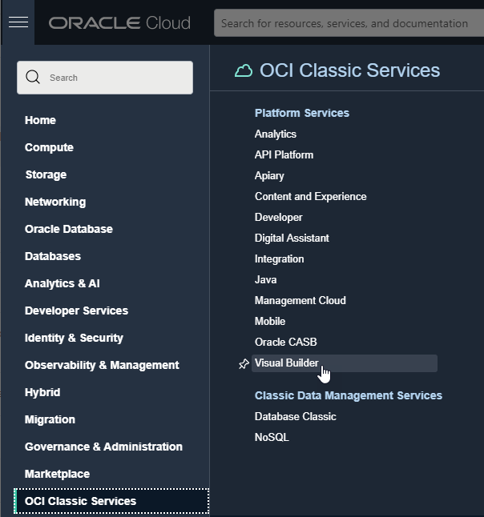

# Create an Instance of Oracle Visual Builder  

## Introduction

This lab walks you through the process of creating an instance of Visual Builder, assuming you don't already have one available to you.  If you do, you can skip this lab and move on to the next one.

Estimated Lab Time:  5 minutes

### Background

If you just created a new Cloud account following the instructions in Getting Started, you must wait at least 30 minutes before you attempt to create an instance of Visual Builder.  If you already had a Cloud account, you don't need to wait.  Either way, make sure you've signed in to the Oracle Cloud before proceeding.

## **STEP 1**: Create an Instance of Visual Builder

1.  On the Oracle Cloud Get Started page, click the menu in the upper left corner to display the services you can provision:

    

2.  Click **OCI Classic Services**, then select **Visual Builder**:

    

3.  On the Instances tab, click **Create Instance**:

    

4.  On the Create Instance page, fill in the information required.  Give your instance a unique name, one that is unlikely to be chosen by another user.  Be sure to select the Region nearest to your location.  Click **Next**.

    

5. Confirm your selections and click **Create**.

    When the instance has finished provisioning, you'll receive an email.  

5. From the menu on the Instances page, click **Open Visual Builder Home Page**.

  

  You're now in Visual Builder and can move on to the next lab.

## Acknowledgements
* **Author** - Sheryl Manoharan, Visual Builder User Assistance

* **Last Updated By/Date** - Sheryl Manoharan, May 2021
