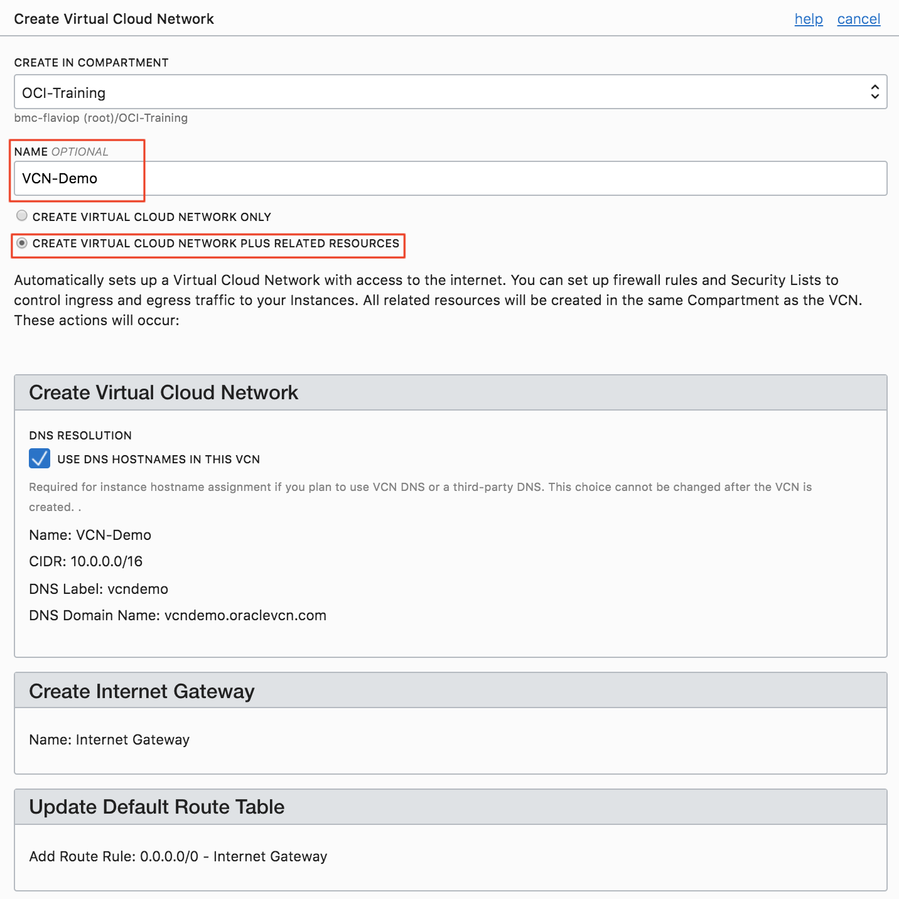
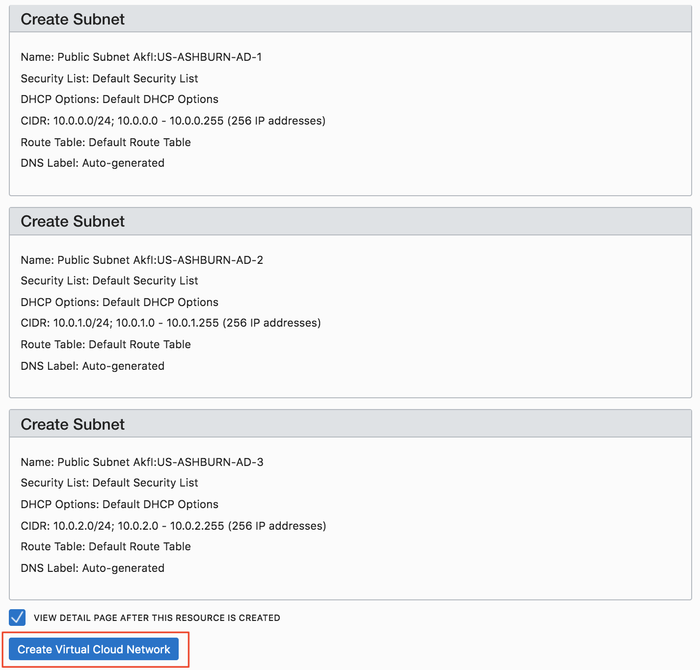
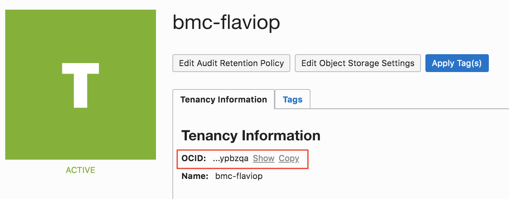
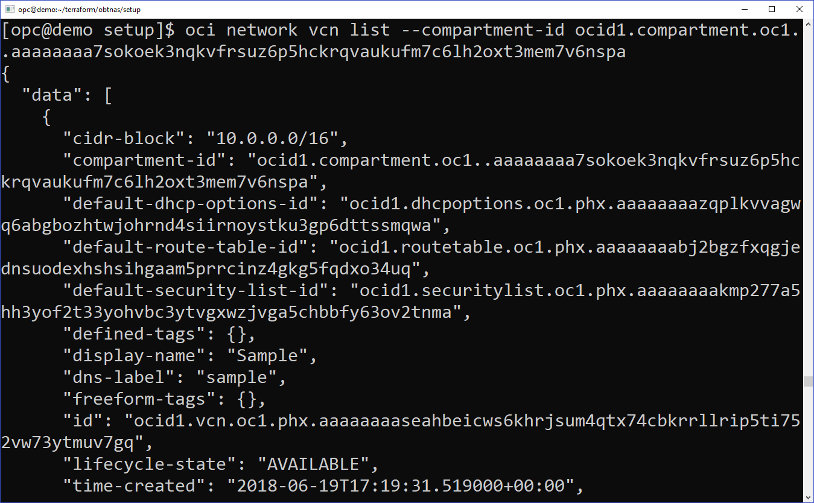
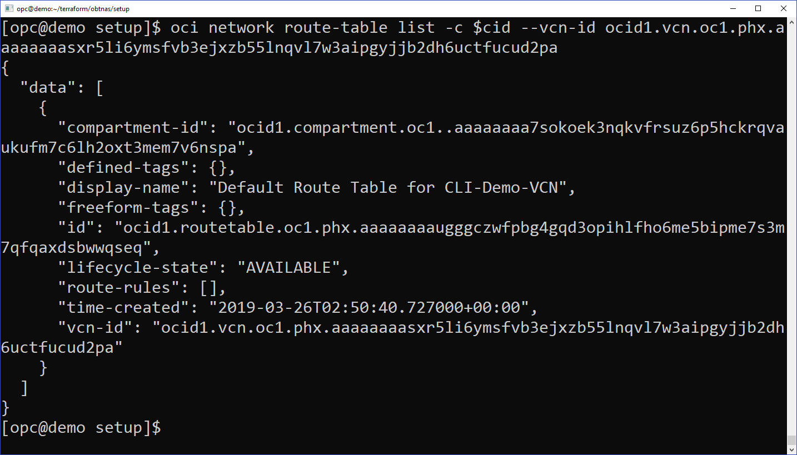
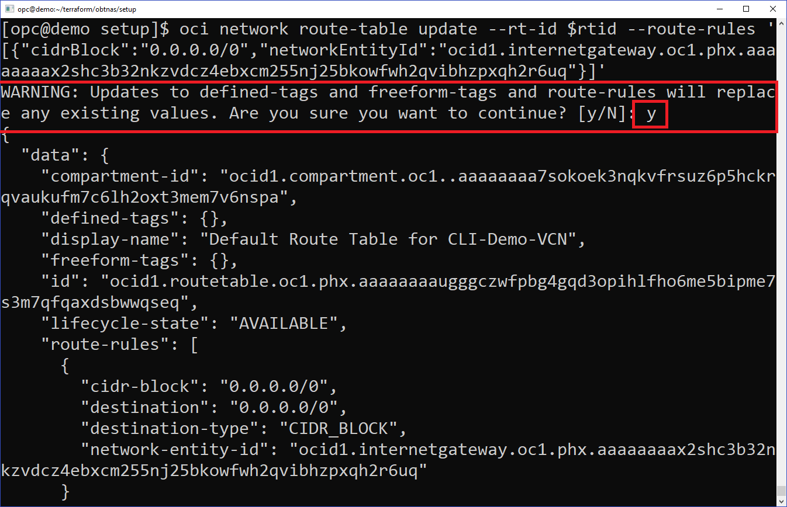

#  Getting started with the OCI Command Line Interface (CLI)

## Table of Contents

[Overview](#overview)

[Pre-Requisites](#pre-requisites)

[Practice 1: Sign in to OCI Console and create a VCN](#practice-1-sign-in-to-oci-console-and-create-a-vcn)

[Practice 2: Generate SSH keys, Create a Compute instance, and install OCI CLI](#practice-2-generate-ssh-keys,-create-a-compute-instance,-and-install-oci-cli)

[Practice 3: Upload API keys and verify functionality](#practice-3-upload-api-keys-and-verify-functionality)

[Practice 4: Create another VCN with one public subnet](#practice-4-create-another-vcn-with-one-public-subnet)

[Practice 5: Use QUERY to find Oracle Linux Image ID, then launch a compute instance](#practice-5-use-query-to-find-oracle-linux-image-id,-then-launch-a-compute-instance)

[Bonus Exercise: Use the CLI to create the rest of the VCN resources](#bonus-exercise-use-the-cli-to-create-the-rest-of-the-vcn-resources)

## Overview

Automation is a critical component when it comes to managing Cloud workloads at scale.  Although the OCI UI is user-friendly, many tasks may be repetitive and could further reduce an administrator's effort if they can be automated. The OCI Command Line Interface (CLI) is a toolkit developed in Python that is capable of performing almost any task that can be executed in the OCI UI.  The toolkit runs on Linux, Mac, and Windows, making it easy to write BASH or PowerShell scripts that perform a series of commands when executed.

This lab will walk you through installation and configuration of the CLI, along with the execution of several create, read, and terminate commands.  Upon completion of this lab you should have a good understanding of how to use the OCI CLI to automate common tasks in OCI.

## Pre-Requisites

- Oracle Cloud Infrastructure account credentials (User, Password, Tenant, and Compartment)
- [Create an SSH Key Pair](#create-an-ssh-key-pair)

## Recommended Learning Assets
1. OCI Training : https://cloud.oracle.com/en_US/iaas/training

2. Familiarity with OCI console: https://docs.us-phoenix-1.oraclecloud.com/Content/GSG/Concepts/console.htm

3. Overview of Networking: https://docs.us-phoenix-1.oraclecloud.com/Content/Network/Concepts/overview.htm

4. Familiarity with Compartments: https://docs.us-phoenix-1.oraclecloud.com/Content/GSG/Concepts/concepts.htm

5. Connecting to a compute instance: https://docs.us-phoenix-1.oraclecloud.com/Content/Compute/Tasks/accessinginstance.htm

## Practice-1: Sign in to OCI Console and create a VCN


**Note:** OCI UI is being updated thus some screenshots in the instructions might be different than actual UI

**Before You Begin**

- We recommend using Chrome or Edge as the broswer. Also set your browser zoom to 80%

1. Sign in using your tenant name, user name and password.

2. From the OCI Services menu, click **Virtual Cloud Network** under Networking and click **Create Virtual Cloud Network**

**NOTE:** Ensure the correct Compartment is selected under COMPARTMENT list


1. Fill out the dialog box:

   - **Create in Compartment:** Has the correct compartment
   - **Name:** Enter easy to re¬member name
   - **Create Virtual Cloud Network Plus Related Resources:** Select this option.
   -  Click **Create Virtual Cloud Network**
   -  Click **Close**




## Practice 2: Create a Compute instance and install OCI CLI

**Pre-requisites: Create SSH Key Pair**
[Create an SSH Key Pair](#create-an-ssh-key-pair)

1. Open the OCI console. From OCI services menu, mouse-over **Compute** and click **Instances**

2. Click Create Instance. Fill out the dialog box:

   - **Name:** Enter a name
   - **Availability Domain:** Select the first available domain.(usually AD1)
   - **Image Operating System:** For the image, we recommend using the Latest Oracle Linux available.
   - **Choose Instance Type:** Select Virtual Machine
   - **Choose Instance Shape:** Select VM.Standard.E2.1
   - **Configure Boot Volume:** Leave the default
   - **Add SSH Keys:** Choose ‘Paste SSH Keys’ and paste the Public Key saved earlier.
   - **Virtual Cloud Network Compartment:** Choose your compartment
   - **Virtual Cloud Network:** Select the VCN you created in the previous section.
   - **Subnet Compartment:** Choose your compartment.
   - **Subnet:** Choose the first Subnet
   - Clik **Create**

**NOTE:** If 'Service limit' error is displayed choose a different shape such as VM.Standard.E2.2 OR VM.Standard2.2


3. Wait for Instance to be in **Running** state. Connect via SSH tool of your choice.

4. Verify opc@<COMPUTE_INSTANCE_NAME> appears on the prompt

5. To install OCI CLI on the compute instance, Enter Command:


    `# bash -c "$(curl –L https://raw.githubusercontent.com/oracle/oci-cli/master/scripts/install/install.sh)"`

6.  When prompted for Install directory, Press Enter (choose default)

7. When prompted for ‘oci’ directory, Press Enter (choose default)

8.  When prompted for ‘Y/N’ for $Path, Enter Y, when prompted for path for rc file Press Enter (choose default)

9.  Check oci CLI installed version, Enter command:

    `# oci -v`

    

    **NOTE:** Version should be minimum 2.5.X (3/23/2019)

10.  Next we will configure OCI CLI. Enter command:

     `# oci setup config`

11. Press Enter when prompted for directory name to accept the default. You will be prompted to enter user OCID


12. Switch to OCI Console window, Click user icon (Top Right of OCI Console Window) and click **User Settings**. In User settings click **copy** next to OCID for your user name


13. Switch to the SSH terminal session and paste the user OCID using mouse/touch pad and press Enter. You will be prompted to Enter Tenancy OCID

14. Switch to OCI Console window, Click user icon (Top Right of OCI Console Window) and click your Tenancy name, copy the OCID as was done for user OCID. Also note down your region (in this example "us-ashburn-1")




16. Switch to the SSH terminal window and paste the tenancy OCID using mouse/touch pad and press Enter. You will be prompted to Enter your region.

17. Type your region and press Enter. Enter Y for ‘New
RSA key pair’. Press Enter and accept default options for directories. Press Enter when prompted for passphrase (i.e leave it empty)

18. In the SSH terminal session for second compute, Enter command:

     ```
     # cd /home/opc/.oci
     # ls
     ```
    
Verify the API key files and OCI CLI config files exist.

19. Enter command

    `# cat config`

and ensure fingerprint exists. Leave the git-bash session open as we will verify the
finger print in config file aginst OCI, once we upload api
keys next.

## Practice 3: Upload API keys and verify functionality

1. In the SSH terminal window enter command:

    `# cat /home/opc/.oci/oci_api_key_public.pem`

highlight the output, right click mouse/touchpad and click copy

2. Switch to OCI Console window, Click user icon (Top Right of OCI Console Window) and click User Settings. In User settings click **API Keys** and **Add Public Key**.

3. Paste the content of oci_api_key_public.pem copied earlier and click **Add**.

4. A new finger print will be generated. Switch to the SSH terminal session and type:

    `# cat /home/opc/.oci/config`

Compare the finger print in the output of config file to the one in OCI console window and make sure they match

**NOTE:** If multiple finger prints exist in OCI console window then identify your finger print by looking at the time stamp.

***We will now test the functionality of the CLI***

5. In the SSH terminal session, type the following command:

    `# oci iam availability-domain list`

   

    This will list all availability domains in the current region. Make note of one of the availability domain names.  It should look something like this ``nESu:PHX-AD-3``. You will use this in a future step.

6. Return to the OCI Console and navigate to **Identity** -> **Compartments**.  Retrieve the OCID of the assigned compartment.

2. Enter the following command to list VCN's:

    `# oci network vcn list --compartment-id <your compartment id>`

    

**NOTE:** It should return the details of the VCN you created at the start of this lab. If you encounter an error message, please contact the instructor.

**TIP:** You can create an environment variable for your compartment ID to avoid having to paste it each time.

`# export cid=<your compartment ocid>`

`# oci network vcn list --compartment-id $cid`


## Practice 4: Create another VCN with one public subnet

1. Create a new virtual cloud network with a unique CIDR block. You will need the OCID of your compartment.

    `# oci network vcn create --cidr-block 192.168.0.0/16 -c <your compartment OCID> --display-name CLI-Demo-VCN --dns-label clidemovcn`

    Record the ``id:`` of the resource after it is created.  You will need it in the upcoming steps.

2. Create a new security list

    `# oci network security-list create --display-name PubSub1 --vcn-id <your VCN OCID> -c $cid --egress-security-rules  '[{"destination": "0.0.0.0/0", "destination-type": "CIDR_BLOCK", "protocol": "all", "isStateless": false}]' --ingress-security-rules '[{"source": "0.0.0.0/0", "source-type": "CIDR_BLOCK", "protocol": 6, "isStateless": false, "tcp-options": {"destination-port-range": {"max": 80, "min": 80}}}]'`

    Make a note of the resource ``id:`` for use in the next step.

3. Create a public subnet.

    `# oci network subnet create --cidr-block 192.168.10.0/24 -c <your compartment OCID> --vcn-id <your VCN OCID> --security-list-ids '["<security list OCID from previous step>"]'`

    Record the ``id:`` of the resources after it is created.  You will need it in an upcoming step.

    **Note:** You have the option to specify up to 5 security lists and a custom route table.  In this case, we are only assigning one security list and allowing the system to automatically associate the default route table.

4. Create an Internet Gateway.  You will need the OCID of your VCN and Compartment.

    `# oci network internet-gateway create -c <your compartment OCID> --is-enabled true --vcn-id <your VCN OCID> --display-name DemoIGW`

    Make a note of the ``id:`` for this resource after it has been created.

5. Next, we will update the default route table with a route to the internet gateway.  First, you will need to locate the OCID of the default route table.

    `# oci network route-table list -c <your compartment OCID> --vcn-id <your VCN OCID>`

    

    Record the ``id:`` of the `Default Route Table`

6. Update the route table with a route to the internet gateway.

    `# oci network route-table update --rt-id <route table OCID> --route-rules '[{"cidrBlock":"0.0.0.0/0","networkEntityId":"<your Internet Gateway OCID"}]'`

    

    **Note:** When updating route tables or security lists you cannot insert a single rule.  You must ``update`` with the entire set of rules. The prompt shown in the screenshot above illustrates this point.


## Practice 5: Use QUERY to find Oracle Linux Image ID, then launch a compute instance

1. Use the CLI ``query`` command to retrieve the OCID for the latest Oracle Linux image.  Make a note of the image ID for future use.

    `# oci compute image list --compartment-id <your compartment OCID> --query 'data[?contains("display-name",`Oracle-Linux-7.6-20`)]|[0:1].["display-name",id]'`

    You may find more information on the Query command here: https://docs.cloud.oracle.com/iaas/Content/API/SDKDocs/cliusing.htm#ManagingCLIInputandOutput

2. Launch a compute instance with the following command.  We previously created a regional subnet because our command did not include a specific availability domain. For compute instances, we must specify an availability domain and subnet.

    You will need the following pieces of information:
   - Availability domain name
   - Subnet OCID
   - Valid compute shape (i.e. VM.Standard.E2.1)
   - Your public SSH key


    `# oci compute instance launch --availability-domain <your AD name> --display-name demo-instance --image-id <ID from previous step> --subnet-id <subnet OCID> --shape VM.Standard.E2.1 --assign-public-ip true --metadata '{"ssh_authorized_keys": "<your public ssh key here>"}'`

    Capture the ``id:`` of the compute instance launch output.

3. Check the status of the instances

    `# oci compute instance get --instance-id <the instance OCID> --query 'data."lifecycle-state"'`

4. Rerun the command every 30-60 seconds until the lifecycle-state is ``RUNNING``

***This completes the exercise for basic usage of the OCI CLI.***

## Bonus Exercise: Use the CLI to create the rest of the VCN resources

This section is optional and does not contain detailed instructions.  Instead, there are a series of objectives that you will complete on your own. Use the OCI CLI reference documentation for guidance.
https://docs.cloud.oracle.com/iaas/tools/oci-cli/latest/oci_cli_docs/index.html

1. Locate the public IP address of the instance using the CLI

    `# oci compute instance list-vnics --instance-id <instance OCID> | grep "ip.:"`
...ok, that is the last hint!

2. Attempt to connect via SSH.  Does it work? (hint: it should time out)

3. Use the CLI to create an ingress rule for SSH traffic in your custom security list.  Don't forget the ``oci network security-list update`` command requires you to pass all current and new rules.  If you just pass one rule, it will overwrite the existing rules.

4. Connect via SSH now. Is it working?

5. Create and attach a 50GB block volume to your instance.

6. Terminate / destroy all of the resources you created in this lab.  Hint: the order in which you delete the resources is very important.

***Congratulations! You have successfully completed Getting Started with OCI CLI lab.***

## Appendix A: Create an SSH key pair

**For Mac OS**
1. Open terminal Window
2. Type ``ssh-keygen`` at the prompt.
3. Press *enter* to accept default values
4. **Do not** assign a password for this exercise. (*note* you should always assign an SSH key password in production)
5. Type ``cat ~/.ssh/id_rsa.pub`` to retrieve your public key.  Save it for future use.
6. Begin the first exercise - [Practice 1: Sign in to OCI Console and create a VCN](#practice-1-sign-in-to-oci-console-and-create-a-vcn)

**For Windows: Using GitBash or Windows Subsystem for Linux (WSL)**
1. Open the terminal tool of your choice
2. Type ``ssh-keygen`` at the prompt.
3. Press *enter* to accept default values
4. **Do not** assign a password for this exercise. (*note* you should always assign an SSH key password in production)
5. Type ``cat ~/.ssh/id_rsa.pub`` to retrieve your public key.  Save it for future use.
6. Begin the first exercise - [Practice 1: Sign in to OCI Console and create a VCN](#practice-1-sign-in-to-oci-console-and-create-a-vcn)

**For Windows: Using PuttyGen**
1. Open PuttyGen
2. Click the [Generate] button
3. Move your mouse around the screen randomly until the progress bar reaches 100%
   
    

4. Click the [Save private key] button.  This file will *not* have an extension.

    


5. Save the public key (displayed in the text field) by copying it to the clipboard and saving it manually to a new text file.  Name the file id_rsa.pub

    **Note:** Sometimes PuttyGen does not save the public key in the correct format.  The text string displayed in the window is correct so we just copy/paste.

6. Begin the first exercise - [Practice 1: Sign in to OCI Console and create a VCN](#practice-1-sign-in-to-oci-console-and-create-a-vcn)
