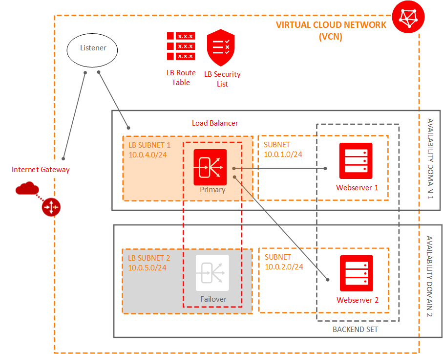

## Oracle Cloud Infrastructure Resource Manager Demo: Deploy Load Balancer
This simple example is designed to be used with the Resource Manager. As such, several variables typically needed using the CLI are omitted as they are now implicitly derived or provided by the Resource Manager (i.e., [Tenancy](https://docs.cloud.oracle.com/iaas/Content/GSG/Concepts/concepts.htm) OCID, [User](https://docs.cloud.oracle.com/iaas/Content/Identity/Concepts/overview.htm) OCID, fingerprints, etc.).

### Target Architecture
This example solution deploys the public Load Balancer (lb) on Oracle Cloud Infrastructure using Terraform as described exactly as in the [Getting Started with Load Balancing](https://docs.cloud.oracle.com/iaas/Content/GSG/Tasks/loadbalancing.htm) tutorial. For instance, the following resources are defined in the Terraform:

* An [Internet Gateway](https://docs.cloud.oracle.com/iaas/Content/Network/Concepts/overview.htm)
* A [Virtual Cloud Network](https://docs.cloud.oracle.com/iaas/Content/Network/Concepts/overview.htm) within a [Compartment](https://docs.cloud.oracle.com/iaas/Content/Identity/Concepts/overview.htm), in a single [Region](https://docs.cloud.oracle.com/iaas/Content/General/Concepts/regions.htm), across 2 [Availability Domain](https://docs.cloud.oracle.com/iaas/Content/General/Concepts/regions.htm)
* A [Load Balancer](https://docs.cloud.oracle.com/iaas/Content/Balance/Tasks/managingloadbalancer.htm) with a secondary failover load balancer and a [Listener](https://docs.cloud.oracle.com/iaas/Content/Balance/Tasks/managinglisteners.htm)
* Two [Backend Sets](https://docs.cloud.oracle.com/iaas/Content/Balance/Concepts/balanceoverview.htm) each with a single [Compute Instance](https://docs.cloud.oracle.com/iaas/Content/Compute/Concepts/computeoverview.htm) in separate private [Subnet](https://docs.cloud.oracle.com/iaas/Content/Network/Concepts/overview.htm) in different Availability Domains

#### Terraform Configuration Files
Note that Terraform loads these files in alphabetically order and, as they are declarative.
[`compute.tf`](compute.tf) 
:	Defines the Compute service resources

[`datasources.tf`](datasources.tf)
:	Defines the datasources used in the configuration

[`loadbalancer.tf`](provider.tf)
:	Defines the Load Balancer service resources

[`network.tf`](network.tf)
:	Creates a Virtual Cloud Network (VCN) , Internet Gateway (IGW) , Route Table (RT) , Security Group (SL) and Subnet (SN)

[`outputs.tf`](outputs.tf)
:	Defines the outputs of the configuration

[`variables.tf`](variables.tf)
:	Declares and evaluates the variables referenced across the other service files.

[`terraform.tfvars`](terraform.tfvars)
:  (Optional) Create a tfvars file for your variable value to run locally or outside of the Resource Manager.

[`userdata/*`](/userdata/bootstrap)
:	The user-data scripts that get injected into an instance on launch. More information on user-data scripts can be [found at the cloud-init project.](https://cloudinit.readthedocs.io/en/latest/topics/format.html)

### Run the example:
First, be certain you've created the necessary IAM policies. At a minimum, you will need a user that is an Administrator or, more preferably, a create a policy for a different user able to manage orm-stacks and orm-jobs.
For step-by-step instuctions, please read the [Resource Manager HOL](https://github.com/oracle/learning-library/tree/master/oci-library/DevOps/Resource_Manager/Resource_Manager_HOL.md). 

## Contributing

This project is open source. Oracle appreciates any contributions that are made by the open source community.

## License

Copyright (c) 2019, Oracle and/or its affiliates. All rights reserved.

This SDK and sample is dual licensed under the Universal Permissive License 1.0 and the Apache License 2.0.
Licensed under the Universal Permissive License 1.0 or Apache License 2.0.

See [LICENSE](/LICENSE.txt) for more details.
