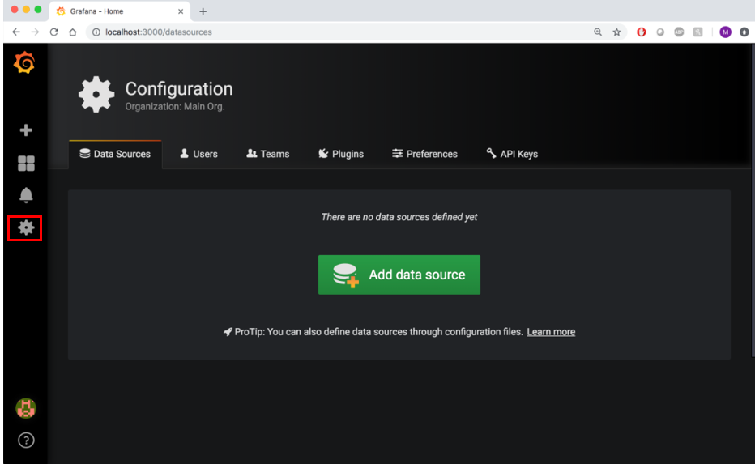
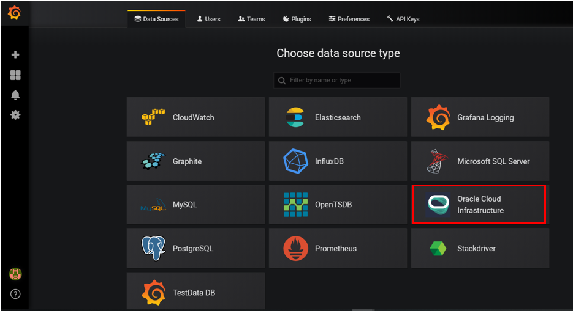
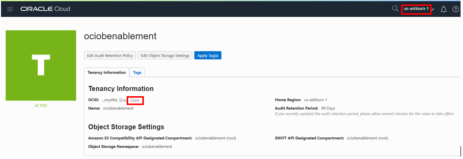
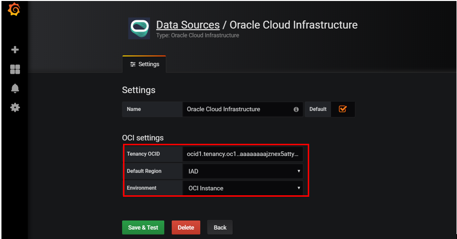
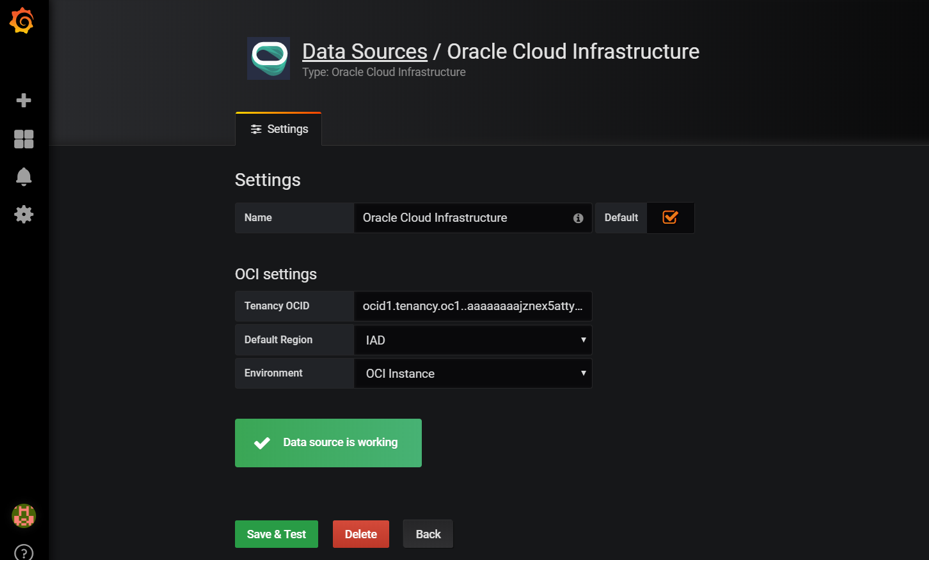
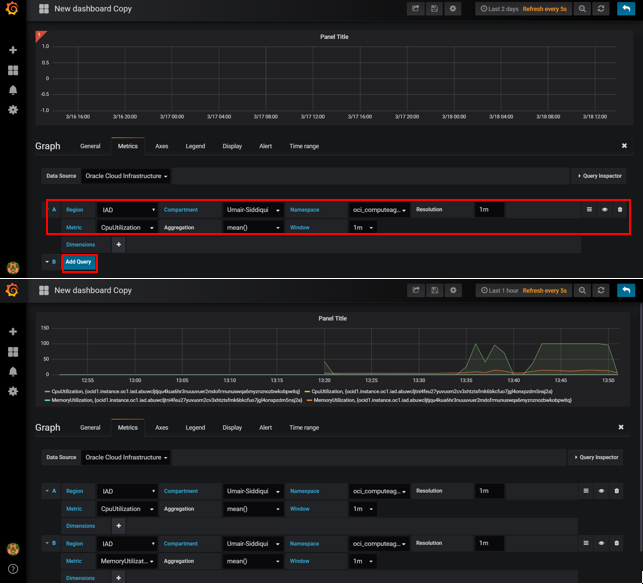

# Visualizing and monitoring compute instance using Grafana

## Table of Contents

[Overview](#overview)

[Prerequisites](#Prerequisites)

[Recommended Learning Assets](#recommended-learning-assets)

[Practice 1: Sign in to OCI Console and create VCN](#practice-1-sign-in-to-oci-console-and-create-vcn)

[Practice 2: Creat ssh keys, compute instance](#practice-2-creat-ssh-keys,-compute-instance)

[Practice 3: Install Grafana and stress tool on compute instance](#practice-3-install-grafana-and-stress-tool-on-compute-instance)

[Practice 4: Adjust Parameters in Grafana dashboard](#practice-4-adjust-parameters-in-grafana-dashboard)

[Practice 5: Delete the resources](#practice-5-delete-the-resources)


## Overview

In this lab we will create a compute instance, install a load generation and montoring application called Grafana. We will then generate load on CPU and memory and use Grafana to monitor this compute instance.

## Prerequisites

- Oracle Cloud Infrastructure account credentials (User, Password, Tenant, and Compartment)  

## Recommended Learning Assets

1. OCI Training : https://cloud.oracle.com/en_US/iaas/training

2. Familiarity with OCI console: https://docs.us-phoenix-1.oraclecloud.com/Content/GSG/Concepts/console.htm

3. Overview of Networking: https://docs.us-phoenix-1.oraclecloud.com/Content/Network/Concepts/overview.htm

4. Familiarity with Compartment: https://docs.us-phoenix-1.oraclecloud.com/Content/GSG/Concepts/concepts.htm

5. Connecting to a compute instance: https://docs.us-phoenix-1.oraclecloud.com/Content/Compute/Tasks/accessinginstance.htm

**Before You Begin**

- We recommend using Chrome or Edge as the broswer. Also set your browser zoom to 80%

## Practice-1: Sign in to OCI Console and create VCN

* **Tenant Name:** {{Cloud Tenant}}
* **User Name:** {{User Name}}
* **Password:** {{Password}}
* **Compartment:**{{Compartment}}

**Note:** OCI UI is being updated thus some screenshots in the instructions might be different than actual UI

1. Sign in using your tenant name, user name and password.

2. Once signed in select the compartment assigned to you from drop down menu on left part of the screen

3. From the OCI Services menu,click **Virtual Cloud Network** under Networking and click **Create Virtual Cloud Network**

**NOTE:** Ensure the correct Compartment is selected under COMPARTMENT list


4. Fill out the dialog box:

- **Create in Compartment:** Has the correct compartment

- **Name:** Enter easy to re¬member name

- **Create Virtual Cloud Network Plus Related Resources:** Select this option.

- Click **Create Virtual Cloud Network**

- Click **Close**


              
## Practice 2: Creat ssh keys, compute instance

1. Click the Apps icon in the toolbar and select  Git-Bash to open a terminal window.


2. Enter command 
```
ssh-keygen
```
**HINT:** You can swap between OCI window, 
git-bash sessions and any other application (Notepad, etc.) by clicking the Switch Window icon 


3. Press Enter When asked for ‘Enter File in which to save the key’, ‘Created Directory, ‘Enter passphrase’, and ‘Enter Passphrase again.


4. You should now have the Public and Private keys:

/C/Users/ PhotonUser/.ssh/id_rsa (Private Key)

/C/Users/PhotonUser/.ssh/id_rsa.pub (Public Key)

**NOTE:** id_rsa.pub will be used to create 
Compute instance and id_rsa to connect via SSH into compute instance.

**HINT:** Enter command 
```
cd /C/Users/PhotonUser/.ssh (No Spaces) 
```
and then 
```
ls 
```
to verify the two files exist. 

5. In git-bash Enter command  
```
cat /C/Users/PhotonUser/.ssh/id_rsa.pub
```
 , highlight the key and copy 


6. Click the apps icon, launch notepad and paste the key in Notepad (as backup)


7. Switch to the OCI console. From OCI servies menu, Click **Instances** under **Compute** 

8. Click Create Instance. Fill out the dialog box:

- **Name:** Enter a name 

- **Availability Domain:** Select availability domain

- **Image Operating System:** For the image, we recommend using the Latest Oracle Linux available.

- **Choose Instance Type:** Select Virtual Machine

- **Choose Instance Shape:** Select VM shape

- **Configure Boot Volume:** Leave the default

- **Add SSH Keys:** Choose ‘Paste SSH Keys’ and paste the Public Key saved earlier.

- **Virtual Cloud Network Compartment:** Choose your compartment

- **Virtual Cloud Network:** Select the VCN you created in the previous section. 

- **Subnet Compartment:** Choose your compartment. 

- **Subnet:** Choose the first Subnet

9. Click **Create**

**NOTE:** If 'Service limit' error is displayed choose a different shape such as VM.Standard.E2.2 OR VM.Standard2.2 OR choose a different AD


10. Wait for Instance to be in **Running** state. In git-bash Enter Command:
```
 cd /C/Users/PhotonUser/.ssh
```
11. Enter **ls** and verify id_rsa file exists

12. Enter command 
```
ssh -i id_rsa_user opc@129.213.63.223 -L 3000:localhost:3000
```
**NOTE:** User name is opc. This will enable port forwarding on local host which is needed to access Grafana dash board later on

**HINT:** If ‘Permission denied error’ is seen, ensure you are using ‘-i’ in the ssh command

13. Enter ‘Yes’ when prompted for security message


 
14. Verify opc@<COMPUTE_INSTANCE_NAME> appears on the prompt

## Practice 3: Install Grafana and stress tool on compute instance

1. Switch to ssh session to compute install. Install Grafana, Enter Command:
```
sudo yum install https://dl.grafana.com/oss/release/grafana-5.4.2-1.x86_64.rpm
```

Enter **Y** when prompted


2. Install OCI Plugin, Enter Command:

```
sudo grafana-cli plugins install oci-datasource
```


3. We now need to set execute permission on one of the files, Enter command:

```
sudo chmod 555 /var/lib/grafana/plugins/oci-datasource/dist/oci-plugin_linux_amd64

```

4. Start Grafana server, Enter Command: 

```            
sudo systemctl start grafana-server
```

5. Now we will login to Grafana Console, Open a new Broswer tab and enter URL **http://localhost:3000** , You should see grafana console

User name and password are 'admin' 


6. Once logged in you will be asked to change the password or skip the step, click **skip** so the user name and password stays as admin


7. On the Home Dashboard click the gear icon on the left side of the page and click **Add data source**



8. Choose **Oracle Cloud Infrastructure** as your data source type



9. In the next screen you will be asked for some details of your OCI account. To get **Tenancy OCID** switch to OCI console window

10. Click the Human icon on top right corener and then your tenacy name


11. Click **copy** next to **OCID**. Also note down your region.



12. Switch to Grafana tab and paste the OCID in **Tenancy OCID**. Choose your region for **Default Region**(IAD if us-ashburn, PHX if us-phoneix1, LHR if London etc). All region codes are listed at https://docs.cloud.oracle.com/iaas/Content/General/Concepts/regions.htm.
Choose **OCI Instance** for Enviornment.



13. Click **Save & Test** and verify **Data source is working** message is displayed



14. Click **+** sign and then **Dashboard** to create a new dash board. Click **Graph**


15. Click **Panel Title** and then **Edit** to add metrics to the dashboard


16. Choose the appropriate fields;
- Region: IAD if us-ashburn, PHX if us-phoneix1, LHR if London etc). All region codes are listed at https://docs.cloud.oracle.com/iaas/Content/General/Concepts/regions.htm.

 - Compartment: Choose your compartment
 - Namespace: oci_computeagent
 - Metric: CpuUtilization

17. Click **Add Query** to add a second Query
 - Compartment: Choose your compartment
 - Namespace: oci_computeagent
 - Metric: MemoryUtilization



18. Switch to ssh session to compute instance and install tool called **stress**. We will use this tool to stress the CPU and Memory of the compute instance. Enter Command:
```
sudo yum install stress
```

19. Now generate traffic, Enter Command:

```
sudo stress --cpu 5 --io 12 --vm 5 --vm-bytes 256M --timeout 600s
```

**We have nwo completed our setup with a compute instance and installed and execetued a tool to stress the CPU and Memory. Next we will monitor observe Grafana dash board for this compute instance**

## Practice 4: Adjust Parameters in Grafana dashboard

1. Switch to Grafana dash board, you should observe the CPU utilization and Memory utilization grpah changing. You can adjust parameters such as Time period and refresh rate as shown below


**We have now completed Grafana setup and can monitor the utilization of parameters on the compute instance. Next we will delete the resources we created**


## Practice 5: Delete the resources

1. Switch to  OCI console window

2. If your Compute instance is not displayed, From OCI services menu Click **Instances** under **Compute**

3. Locate compute instance, Click Action icon and then **Terminat** 


4. Make sure Permanently delete the attached Boot Volume is checked, Click Terminate Instance. Wait for instance to fully Terminate


5. From OCI services menu Click **Virtual Cloud Networks** under Networking, list of all VCNs will 
appear.

6. Locate your VCN , Click Action icon and then **Terminate**. Click **Delete All** in the Confirmation window. Click **Close** once VCN is deleted


7. From OCI services menu Click **Networking**, then **Public IPs**,locate the Reserved Public IP you created. Click Action icon and then **Terminate**


***Congratulations! You have successfully completed the lab. ***

