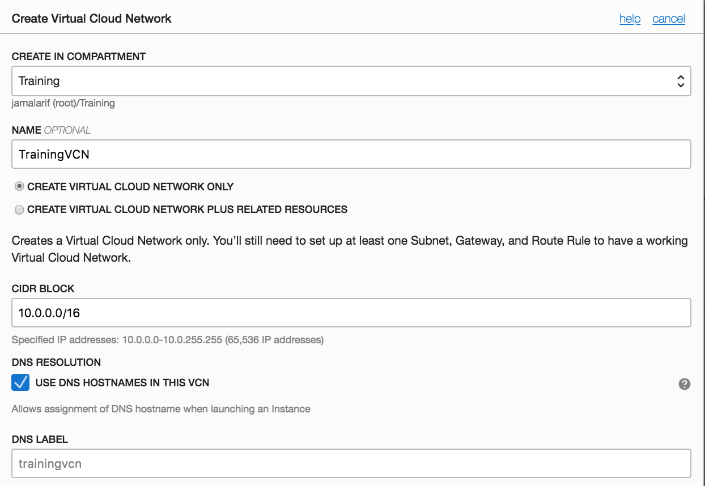
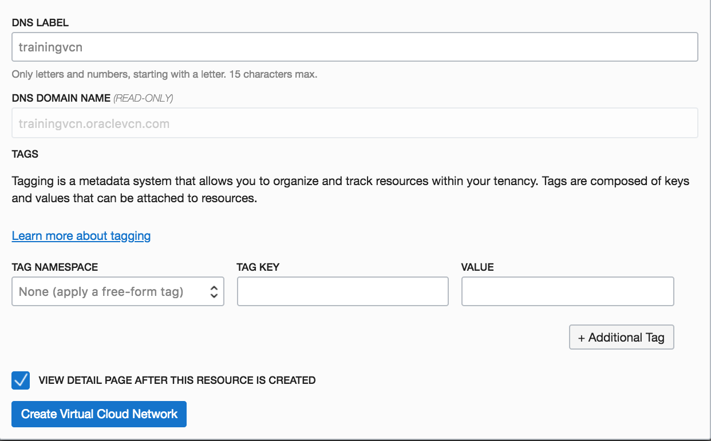
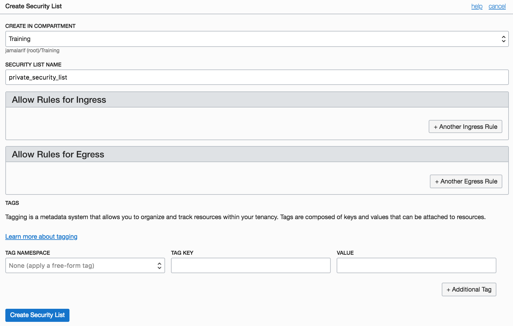
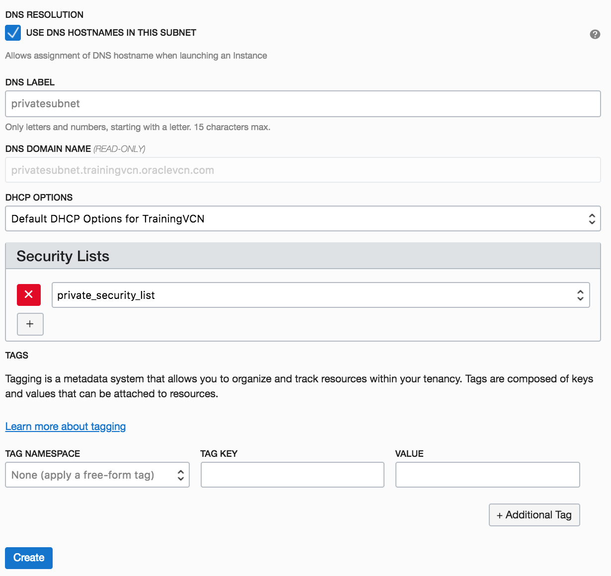
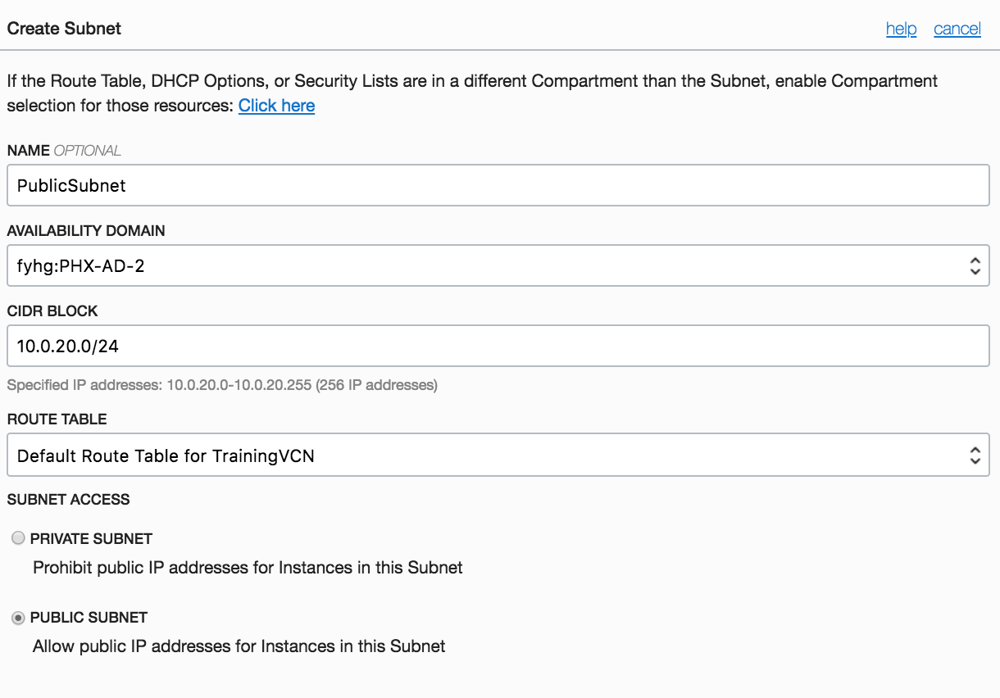
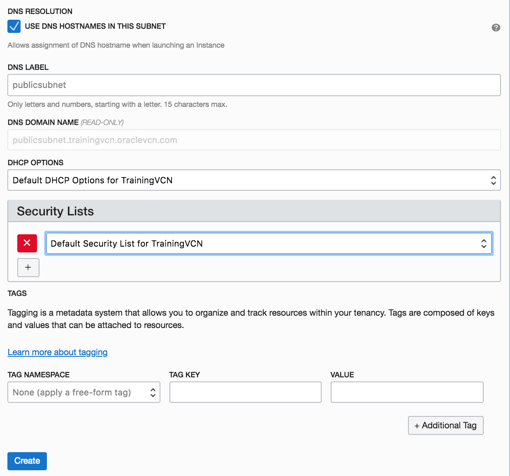

# NAT Gateway


## Table of Contents

[Overview](#overview)

[Pre-Requisites](#pre-requisites)

[Practice 1: Creating Virtual Cloud Network with Public and Private Subnets](#practice-1-creating-virtual-cloud-networks-with-public-and-private-subnets)

[Practice 2: Create Instances](#practice-2-create-instances)

[Practice 3: Configuring NAT Gateway](#practice-3-configuring-nat-gateway)

[Summary](#summary)

## Overview

Oracle Cloud Infrastructure allows you to create a Virtual Cloud Network (VCN) which functions as an extended datacenter in the cloud. The virtual networking primitives offered by the platform give you full flexibility to build a network that meets complex enterprise requirements. You can use any address range for your VCN, segment into subnets, configure security lists and route tables. You can connect your VCN to your on-premises network through a Dynamic Routing Gateway (DRG) through IPSec connections over Internet or through FastConnect over private, dedicated connections.

One of the most common network design requirements is to secure private instances from being accessible from the Internet, while being
accessible only from the on-premises network or bastion hosts in public subnets. You can achieve this by launching the instances in a private subnet or by choosing to not assign a public IP address at launch. However, these backend instances may need access to the Internet for specific purposes like software updates or CRL verification. You may choose to route this traffic to your on-premises network through your Internet gateway, but that may add unwanted latency or cost.

With the recent enhancements on our virtual networking platform, you can now enable outbound Internet access from your private instances using a new feature ‘NAT Gateway’. A NAT  gateway gives cloud resources without public IP addresses access to the internet without exposing those resources to incoming internet connections.

[Pre-Requisites](#pre-requisites)

- Oracle Cloud Infrastructure account credentials (User, Password, and Tenant)
- Access to Oracle Cloud Infrastructure account

# Practice-1: Creating Virtual Cloud Network with Public and Private Subnets

In this exercise, we are going to create a VCN and its required resources.

1) In the web console, click **MENU** **Networking -> Virtual Cloud Networks**. 
Click **Create Virtual Cloud Network**.


2) In the dialog box, enter a **Name** *TrainingVCN* for your virtual
	cloud network and Select *Create Virtual Cloud Network Only*

	Choose a CIDR block - 10.0.0.0/16 and keep the remaining options 		as it is.

	Click - Create Virtual Cloud Network (This creates a VCN, and you can	see the details page of the created VCN.




Within this VCN, we will now create additional resources. 

3) Navigate to **Internet Gateways** on left side panel, and click on **Create Internet Gateway**. Provide a name and create an internet gateway. 


4) Navigate to Route tables and create a Route table for private subnets. We will attach this route table with private instances in private subnet. 
	
	Click **Create Route table** Don’t add any rule in it for now, we will add it later.


> An empty route will automatically appear in the UI. You may ignore  it, or click the red X to remove it.

5) Navigate to Security Lists on the left panel. And Create a Security
lists for Private subnets.

	Click on **Create Security List**, create a *private_security_list* Remove all ingress and egress rules for now. We will add them later



6) Navigate back to subnets, and create two subnets. One subnet will be a public subnet which will host our Bastion Host and have access to the internet. Second subnet will be our Private subnet and will host our private instances.

Create a Private Subnet.

  - Name: Private_Subnet
  - Availability Domain: \<Choose anyone among the three\>
  - CIDR Block: 10.0.10.0/24
  - Route table: **Private Route table**
  - Subnet : Private Subnet
  - DHCP Options : Default Dhcp options
  - Security List: **PrivateSecurityList**




Create a Public Subnet.

  - Name: Any name for your Subnet
  - Availability Domain: \<Choose anyone among the three\>
  - CIDR Block: 10.0.20.0/24
  - Route table: **Default Route table**
  - Subnet : Public Subnet
  - DHCP Options : Default Dhcp options
  - Security List: **Default Security List**




The two created subnets are 


In this exercise, you have created a VCN, a public subnet and a private subnet. Each subnet is associated with its private and public route tables and a security list.

Next we will add route table rules in the  default route table, edit the security list in the private subnet and create instances in each one of the subnet, and connect with them.


7) Navigate to **Route tables** of your VCN, and add a route table rule in **Default Route Table**

	Click on **Default Route Table**, and **Edit** 

	Target Type: Internet Gateway
	Compartment: *your compartment name*	
	Destination CIDR : 0.0.0.0/0
	Target Internet Gateway: *your internet gateway name*
	


8) Navigate to **Security Lists** of your VCN and edit the **private security list** This is the security list created and associated with your private subnets only. 

Click on **private security list** and Click on **Edit All Rules**. Add following rules. And **Save** them! 

**Ingress**
		
		Source CIDR : 10.0.20.0/24
		Source Type: CIDR
		Protocols: All Protocols

**Egress**
		
		Destination CIDR : 0.0.0.0/0
		Source Type: CIDR
		Protocols: All Protocols
		


	
Now you have added security list of private subnet to allow only ingress traffic from a public subnet. 

# Practice-2: Create Instances 

In this practice, you create instances in each of the two subnets in our
VCN. 

1) Navigate to the **MENU**  --> **Compute** --> **Instances**. Click on **Create Instance** 
		
		Name: Bastion Host
		Availability Domain: <Choose anyone among the three>
		Operation System: Oracle Linux 7.5 (use default)
		Instance Type: Virtual Machine
		Instance Shape: VM.Standard2.1 (Or Use the shape available in your tenancy)
		Boot Volume: Use default Boot Volume 46 GB
		SSH key: <use your ssh_key.pub here> 
		Virtual Cloud Network: TrainingVCN <Your VCN name>
		Subnet: <Your Public Subnet Name>

Click **Create**. 


>The page shows the detail of this Public Instance. Note down the Public IP from here. We will use the public IP to ssh into the instance. 


2) Create a private instance as well. Navigate to the **MENU**  --> **Compute** --> **Instances**. Click on **Create Instance** 
		
		Name: Private_Instance
		Availability Domain: <Choose anyone among the three>
		Operation System: Oracle Linux 7.5 (use default)
		Instance Type: Virtual Machine
		Instance Shape: VM.Standard2.1 (Or Use the shape available in your tenancy)
		Boot Volume: Use default Boot Volume 46 GB
		SSH key: <use your ssh_key.pub here> 
		Virtual Cloud Network: TrainingVCN <Your VCN name>
		Subnet: <Your Private Subnet Name>

Click **Create**. 


> The page shows the detail of this Private Instance. Note down the Private IP address from here. We will use the private IP to ssh into the instance via our bastion host (public instance). 

>NOTE: For following steps
>Mac OS/Linux: use a bash terminal 
> Windows: use GitBash


3) Lets connect to the instances that we launched. Let’s first ssh into our **Bastion Host** Since the instance is in a **public subnet**, and has a public IP address we can directly ssh into it with the same ssh keys we used to launch it. The default username is **opc**

```
ssh -i /pathtosshprivatekey/ opc@<Public IP of Bastion Host>
```


We need to connect to the **private instance** to check internet
connectivity with it. Since the instance has been launched in a private
subnet therefore doesn’t have any public IP address so we can’t directly ssh into the instance. However, we can ssh into our private  instance from our Public instance which is in the public subnet.

In Order to ssh into private instance we will use the ssh proxy command. This command allows us to “tunnel” through the bastion host to our private instance, while maintaining SSH keys locally on our laptop. Storing private SSH keys on a public server such as a Bastion host is not recommended.

```
$ ssh -t -o ProxyCommand='ssh -i /pathtosshprivatekey/ opc@<Bastion Host public IP> -W %h:%p %r' -i /pathtosshprivatekey/ opc@<private instance
IP>  
```


You are now connected to the Private instance and the bastion host. The bastion host is part of the public subnet and is connected to internet via the internet gateway. The Private instance is in a private subnet, with no public IP or public internet access. You can confirm access as show below. 


# Practice-3: Configuring NAT Gateway

In this exercise, we are going to configure a NAT Gateway in our VCN. After configuring the NAT Gateway, we will modify the route table for our private subnet so that private instances can now access internet via this NAT Gateway. 

1)  Navigate to the **MENU**  --> **Networking** --> **Virtual Cloud Network**. Click on **Training VCN** 

2) Inside your VCN, click on **NAT Gateway** --> **Create Nat Gateway**. 


		
	Provide a Name for Nat Gateway device. 
	Click *Create*
	*Close* the dialog box


    
3) Navigate to the **Route tables** --> **Private route table** --> ** Edit Route Rule** 

		Click *+Another Route Rule*
		Target Type: Nat Gateway
		Destination CIDR: 0.0.0.0/0
		Compartment: <Your Compartment>
		Target Type Name: Nat Gateway	


This route rule now sends all the traffic of the private subnet to nat gateway.A NAT gateway gives your private instance access to the internet without exposing it to incoming internet connections.

While still logged in the Private instance, test internet connectivity. As you can see below, it works now via the NAT Gateway device. 


## Summary

In this lab, you were able to create a private instance and provide internet access to that instance without providing any public IP to the instance. 
