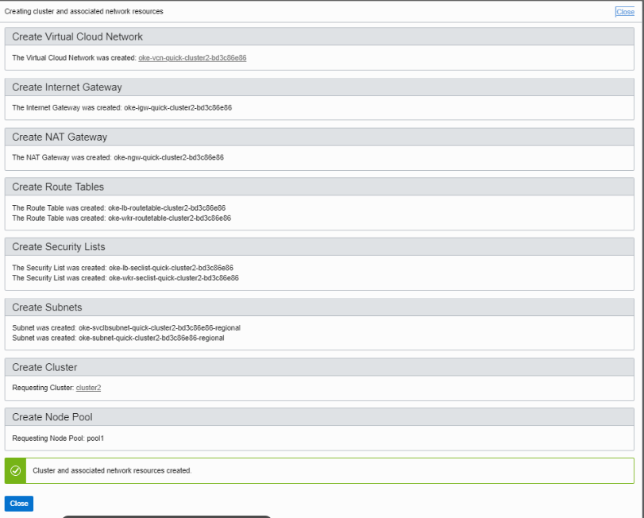
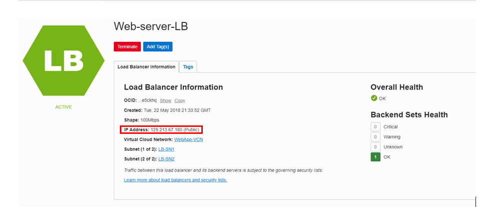

# Deploying Oracle Container Engine for Kubernetes

## Introduction

A Kubernetes cluster is a group of nodes. The nodes are the machines running applications. Each node can be a physical machine or a virtual machine. The node's capacity (its number of CPUs and amount of memory) is defined when the node is created. A cluster comprises:

- one or more master nodes (for high availability, typically there will be a number of master nodes)
- one or more worker nodes (sometimes known as minions)

A Kubernetes cluster can be organized into namespaces to divide the cluster's resources between multiple users. Initially, a cluster has the following namespaces:

- default, for resources with no other namespace
- kube-system, for resources created by the Kubernetes system
- kube-node-lease, for one lease object per node to help determine node availability
- kube-public, usually used for resources that have to be accessible across the cluster

Watch the video below for a demo of OKE on OCI

[](youtube:iKs3-4jPxbk)


Estimated time: 1 hour

### Objectives
- Create Kubernetes Cluster
- Deploy a sample app

### Lab Prerequisites
- Lab 1: Login to Oracle Cloud
- Lab 2: Create SSH Keys - Cloud Shell

- Recommended Browser - Chrome 

## Step 1: Create Kubernetes Cluster

1. From OCI Services menu, Click **Container Clusters (OKE)** under Developer Services.

    **No need to create any policies for OKE, all the policies are pre-configured**
        

2. Under **List Scope**, select the compartment in which you would like to create a cluster. 
        

3. Click **Create Cluster**. Choose **Quick Create** and click **Launch Workflow**. 

4. Fill out the dialog box:

      - NAME: Provide a name (oke-cluster in this example)
      - COMPARTMENT: Choose your compartment
      - CHOOSE VISIBILITY TYPE: Public
      - SHAPE: Choose a VM shape 
      - NUMBER OF NODES: 1
      - KUBERNETES DASHBOARD ENABLED: Make sure flag is checked

5. Click **Next** and Click "**Create Cluster**".

    **We now have a OKE cluster with 1 node and Virtual Cloud Network with all the necessary resources and configuration needed**

    


## Step 2: Check OCI CLI in Cloud Shell

OCI Command Line comes preinstalled in Oracle Cloud Shell.

1.  Check the installed version of OCI CLI.  Start up the Oracle Cloud Shell if it's not already running.
   
    ```
    <copy>
    oci -v
    </copy>
    ```
    to check OCI CLI version which should be 2.5.x or higher.


## Step 3: Install Kubectl

In this section we will install kubectl. You can use the Kubernetes command line tool kubectl to perform operations on a cluster you've created with Container Engine for Kubernetes.

1. Switch to git-bash window, Enter commands:
  
    ```
    <copy>
    mkdir -p $HOME/.kube
    </copy>
    ```
    ```
    <copy>
    cd $HOME/.kube
    </copy>
    ```

    ```
    <copy>
    curl -LO https://storage.googleapis.com/kubernetes-release/release/v1.15.0/bin/windows/amd64/kubectl.exe
    </copy>
    ```

    

2.  Wait for download to complete. Enter command 
    
    ```
    <copy>
    ls
    </copy>
    ```
    and verify kubectl.exe file exists.

## Step 4: Download get-kubeconfig.sh file and Initialize your environment

1. Switch to OCI console window and navigate to your cluster. In Cluster detail window, scroll down and click **Quick Start**, under **Resources**. 
Follow the steps under the **Quick Start** Section.
    

2. The **Quick Start** directions will direct you to copy and execute the following commands depicted below in your local terminal.

    

## Step 5: Deploying a Sample Nginx App on Cluster Using kubectl

1. In git bash window, change Directory to $HOME/.kube, Enter Command:
    ```
    <copy>
    cd $HOME/.kube
    </copy>
    ```

2. Create nginx deployment with three replicas,  Enter Command:
    ```
    <copy> 
    kubectl run nginx  --image=nginx --port=80 --replicas=3
    </copy>
    ```

3. Get Deployment data, Enter Command:
    ``` 
    <copy>
    kubectl get deployments
    </copy>
    ```

4. get PODs data, Enter command:
    ```
    <copy>
    kubectl get pods -o wide
    </copy>
    ```

    **NOTE:** You can see thse deployment using Kubernetes Dashboard under Deployment.

    

5.  Create a service to expose the application. The cluster is integrated with the OCI Cloud Controller Manager (CCM). As a result, creating a service of type --type=LoadBalancer will expose the pods to the Internet using an OCI Load Balancer.In git-bash window Enter command:
    ```
    <copy>
    kubectl expose deployment nginx --port=80 --type=LoadBalancer
    </copy>
    ```

6. Switch to OCI console window. From OCI Services menu Click **Load Balancers** under Networking. A new OCI LB should be getting  provisioned (This is due to the command above). 

    

7. Once Load Balancer is Active, Click Load Balancer name and from Load Balancer details page note down its IP address.

    

8. open a new browser tab and enter URL  http://`<Load-Balancer-Public-IP>` (http://129.213.76.26 in this example). The Nginx welcome screen should be displayed.

    


##  Step 6: Delete the resources

### Delete Kubernetes nodes

1. In git-bash window Enter command: 
    
    ```
    <copy>
    kubectl delete service nginx
    </copy>
    ```
    and then  
    ```
    <copy>
    kubectl delete deployments nginx
    </copy>
    ```

### Delete OKE Cluster

1. To navigate back to your OCI Console window, click **Container Clusters (OKE)** under **Developer Services**.

   

2. Navigate to your cluster. Click **Delete Cluster** and Click **Delete** in the confirmation window.


### Delete VCN

1. From OCI services menu Click **Virtual Cloud Networks** under Networking, list of all VCNs will appear.


2. Locate your VCN , Click Action icon and then **Terminate**. Click **Delete All** in the Confirmation window. Click **Close** once VCN is deleted.

    


### Delete API Key

1. To navigate to user settings, Click the **Profile** icon in the top right corner of the window. Then, select User Settings.
    

2. Scroll down to select **API Keys** under the **Resources** section. 

3. Click on Action icon and Click **Delete** to delete the API key.

    


## Acknowledgements
*Congratulations! You have successfully completed the lab.*

- **Author** - Flavio Pereira, Larry Beausoleil
- **Adapted by** -  Yaisah Granillo, Cloud Solution Engineer
- **Contributors** - LiveLabs QA Team (Arabella Yao, Product Manager Intern | Isa Kessinger, QA Intern)
- **Last Updated By/Date** - Isa Kessinger, July 2020

## See an issue?
Please submit feedback using this [form](https://apexapps.oracle.com/pls/apex/f?p=133:1:::::P1_FEEDBACK:1). Please include the *workshop name*, *lab* and *step* in your request.  If you don't see the workshop name listed, please enter it manually. If you would like for us to follow up with you, enter your email in the *Feedback Comments* section. 
