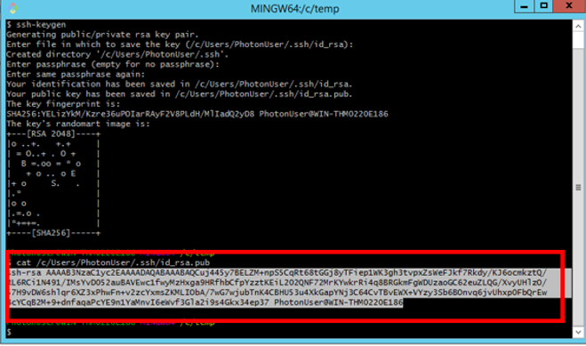
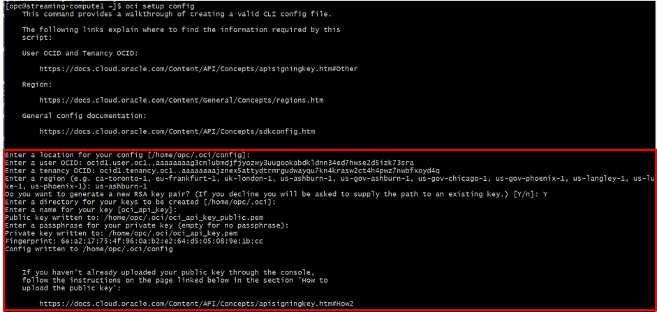
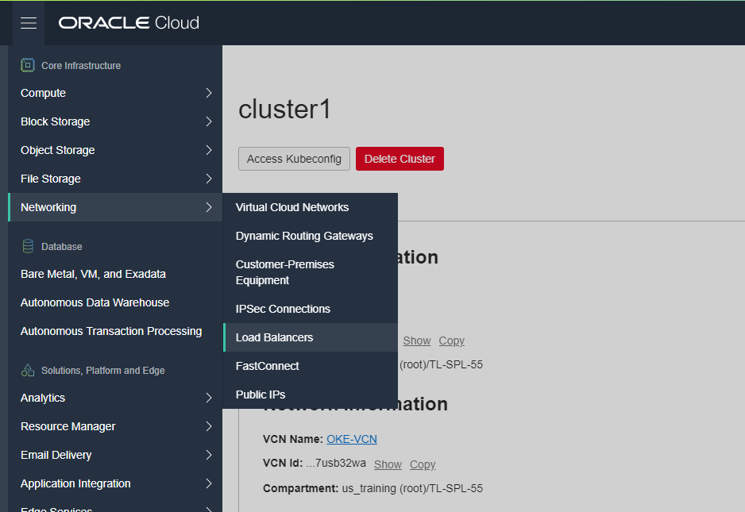
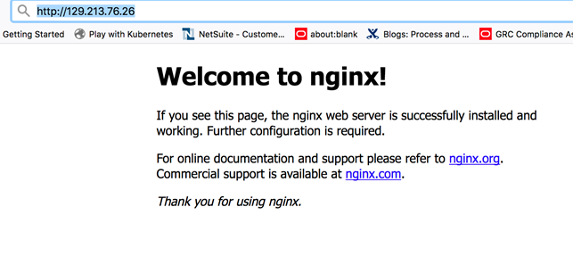

# Deploying Oracle Kubernetes Engine

## Introduction

Oracle Cloud Infrastructure Container Engine for Kubernetes is a fully-managed, scalable, and highly available service that you can use to deploy your containerized applications to the cloud. Use Container Engine for Kubernetes (sometimes abbreviated to just OKE) when your development team wants to reliably build, deploy, and manage cloud-native applications. You specify the compute resources that your applications require, and Container Engine for Kubernetes provisions them on Oracle Cloud Infrastructure in an existing OCI tenancy.

**Some Key points:**

*Recommended Browsers: Chrome, Edge*

- We recommend using Chrome or Edge as the broswer. Also set your browser zoom to 80%

- All screen shots are examples ONLY. Screen shots can be enlarged by Clicking on them

- Login credentials are provided later in the guide (scroll down). Every User MUST keep these credentials handy.

- Do NOT use compartment name and other data from screen shots.Only use  data(including compartment name) provided in the content section of the lab

- Mac OS Users should use ctrl+C / ctrl+V to copy and paste inside the OCI Console

- Login credentials are provided later in the guide (scroll down). Every User MUST keep these credentials handy.

    **Cloud Tenant Name**

    **User Name**

    **Password**

    **Compartment Name (Provided Later)**

    **Note:** OCI UI is being updated thus some screenshots in the instructions might be different than actual UI.

### Pre-Requisites

1. [OCI Training](https://cloud.oracle.com/en_US/iaas/training)

2. [Familiarity with OCI console](https://docs.us-phoenix-1.oraclecloud.com/Content/GSG/Concepts/console.htm)

3. [Overview of Networking](https://docs.us-phoenix-1.oraclecloud.com/Content/Network/Concepts/overview.htm)

4. [Familiarity with Compartment](https://docs.us-phoenix-1.oraclecloud.com/Content/GSG/Concepts/concepts.htm)

## Step 1: Sign in to OCI Console and create Kubernetes Cluster

* **Tenant Name:** {{Cloud Tenant}}
* **User Name:** {{User Name}}
* **Password:** {{Password}}
* **Compartment:**{{Compartment}}

1. Sign in using your tenant name, user name and password. Use the login option under **Oracle Cloud Infrastructure**.
    

2. From OCI Services menu, Click **Container Clusters (OKE)** under Developer Services.

    **No need to create any policies for OKE, all the policies are pre-configured**

3. Click **Create Cluster**. Choose **Quick Create** and click **Launch Workflow**. 

4. Fill out the dialog box:

      - NAME: Provide a name (oke-cluster in this example)
      - COMPARTMENT: Choose your compartment
      - CHOOSE VISIBILITY TYPE: Public
      - SHAPE: Choose a VM shape 
      - NUMBER OF NODES: 1
      - KUBERNETES DASHBOARD ENABLED: Make sure flag is checked

5. Click **Next** and Click "**Create Cluster**.

    **We now have a OKE cluster with 1 node and Virtual Cloud Network with all the necessary resources and configuration needed**

    


## Step 2: Install OCI CLI in your enviornment

1. Click the Apps icon in the toolbar and select Git-Bash to open a terminal window.

    


2. Enter command: 

    ```
    <copy>
    ssh-keygen
    </copy>
    ```

    **HINT:** You can swap between OCI window, 
    git-bash sessions and any other application (Notepad, etc.) by Clicking the Switch Window icon. 

    

3. Press Enter When asked for 'Enter File in which to save the key', 'Created Directory, 'Enter passphrase', and 'Enter Passphrase again.

    

4. You should now have the Public and Private keys:

    /C/Users/ PhotonUser/.ssh/id\_rsa (Private Key)

    /C/Users/PhotonUser/.ssh/id\_rsa.pub (Public Key)

    **NOTE:** id\_rsa.pub will be used to create 
    Compute instance and id\_rsa to connect via SSH into compute instance.

    **HINT:** Enter command 
    ```
    <copy>
    cd /C/Users/PhotonUser/.ssh (No Spaces) 
    </copy>
    ```
    and then 
    ```
    <copy>
    ls 
    </copy>
    ```
    to verify the two files exist. 

5. In git-bash Enter command  

    ```
    <copy>
    cat /C/Users/PhotonUser/.ssh/id_rsa.pub
    </copy>
    ```

    , highlight the key and copy 

    

6. Click the apps icon, launch notepad and paste the key in Notepad

    

7. Change directory to .oci, Enter command:

    ```
    <copy>
    cd ~/.oci
    </copy>
    ```

8.  Generate API keys, Enter commands:

    ```
    <copy>
    openssl genrsa -out oci_api_key.pem 2048
    </copy>
    ```

    **NOTE:** Type the command and do not copy/paste

    ```
    <copy>
    openssl rsa -pubout -in oci_api_key.pem -out oci_api_key_public.pem
    </copy>
    ```

    ```
    <copy>
    cat oci_api_key_public.pem
    </copy>
    ```

    ```
    <copy>
    openssl rsa -in ~/.oci/oci_api_key.pem -pubout -outform DER 2>/dev/null | openssl md5 -c | awk '{print $2}' > ~/.oci/oci_api_key_fingerprint
    </copy>
    ```

9.  We will now install OCI CLI.Switch to git-bash window, Enter Command:
    
    ```
    <copy>
    bash -c "$(curl -L https://raw.githubusercontent.com/oracle/oci-cli/master/scripts/install/install.sh)"
    </copy>
    ```

10. Accept the default (Press Enter) for Install directory Prompts.

11. Enter Y when prompted for **Modify Path**

12. Once installation is completed, Enter command:
   
    ```
    <copy>
    oci -v
    </copy>
    ```
    to check OCI CLI version which should be 2.5.x or higher.

13. In git bash window, Enter command:
   
    ```
    <copy>
    oci setup config
    </copy>
    ```

14. Accept the default location. For user OCI switch to OCI Console window. Click Human Icon and then your user name. In the user details page Click **copy** to copy the OCID. **Also note down your region name as shown in OCI Console window**. Paste the OCID in git bash.

    

15. Repeat the step to find tenancy OCID (Human icon followed by Clicking Tenancy Name). Paste the Tenancy OCID in ssh session to compute instance followed by providing your region name (us-ashburn-1, us-phoneix-1 etc).

16. When asked for **Do you want to generate a new RSA key pair?** answer **N**.

17.  When prompted for ‘Enter a location for your private key file’, Type the full directory path Of oci\_api\_key.pem file location and press Enter (~/.oci/oci\_api\_key.pem. For rest of questions accept default by pressing Enter. 

    

18. Now we need to upload  API key into our OCI account for authentication of API calls. To display the conent of API key Enter command:

    ```
    <copy>
    cat ~/.oci/oci_api_key_public.pem
    </copy>
    ```

19. Highligh and copy the content from ssh session. Switch to OCI Console, Click Human icon followed by your user name. In user details page Click **Add Public Key**. In the dialg box paste the public key content and Click **Add**.

    

    


## Step 3: Install Kubectl

In this section we will install kubectl. You can use the Kubernetes command line tool kubectl to perform operations on a cluster you've created with Container Engine for Kubernetes.

1. Switch to git-bash window, Enter commands:
  
    ```
    <copy>
    mkdir -p $HOME/.kube
    </copy>
    ```
    ```
    <copy>
    cd $HOME/.kube
    </copy>
    ```

    ```
    <copy>
    curl -LO https://storage.googleapis.com/kubernetes-release/release/v1.15.0/bin/windows/amd64/kubectl.exe
    </copy>
    ```

    

2.  Wait for download to complete. Enter command 
    
    ```
    <copy>
    ls
    </copy>
    ```
    and verify kubectl.exe file exists.

## Step 4: Download get-kubeconfig.sh file and Initialize your environment

1. Switch to OCI console window and navigate to your cluster. In Cluster detail window Click **Quick Start**, under **Resources**. 
Follow the steps under the **Quick Start** Section.

2. The Commands listed will need to be executed in your local terminal.

    

3. Next follow the instruction under **Access Kubernetes Dashboard** to access the dash board.


## Step 5: Deploying a Sample Nginx App on Cluster Using kubectl

1. In git bash window, change Directory to $HOME/.kube, Enter Command:
    ```
    <copy>
    cd $HOME/.kube
    </copy>
    ```

2. Create nginx deployment with three replicas,  Enter Command:
    ```
    <copy> 
    ./kubectl run nginx  --image=nginx --port=80 --replicas=3
    </copy>
    ```

3. Get Deployment data, Enter Command:
    ``` 
    <copy>
    ./kubectl get deployments
    </copy>
    ```

4. get PODs data, Enter command:
    ```
    <copy>
    ./kubectl get pods -o wide
    </copy>
    ```

    **NOTE:** You can see thse deployment using Kubernetes Dashboard under Deployment.

    

5.  Create a service to expose the application. The cluster is integrated with the OCI Cloud Controller Manager (CCM). As a result, creating a service of type --type=LoadBalancer will expose the pods to the Internet using an OCI Load Balancer.In git-bash window Enter command:
    ```
    <copy>
    ./kubectl expose deployment nginx --port=80 --type=LoadBalancer
    </copy>
    ```

6. Switch to OCI console window. From OCI Services menu Click **Load Balancers** under Networking. A new OCI LB should be getting  provisioned (This is due to the command above). 

    

7. Once Load Balancer is Active, Click Load Balancer name and from Load Balancer details page note down its IP address.

    

8. open a new browser tab and enter URL  http://`<Load-Balancer-Public-IP>` (http://129.213.76.26 in this example). Nginx Welcome screen should be displayed.

    


##  Step 6: Delete the resources

### Delete Kubernetes nodes

1. In git-bash window Enter command: 
    
    ```
    <copy>
    kubectl delete service nginx
    </copy>
    ```
    and then  
    ```
    <copy>
    kubectl delete deployments nginx
    </copy>
    ```

### Delete OKE Cluster

1. In OCI Console window navigate to your cluster and Click **Delete Cluster**, Click **Delete** in the confirmation window.


### Delete VCN

1. From OCI services menu Click **Virtual Cloud Networks** under Networking, list of all VCNs will appear.

2. Locate your VCN , Click Action icon and then **Terminate**. Click **Delete All** in the Confirmation window. Click **Close** once VCN is deleted.

    


### Delete API Key

1. Navigate to user settings. Click on Action icon and Click **Delete** to delete the API key.

    


## Acknowledgements
*Congratulations! You have successfully completed the lab.*

- **Author** - Flavio Pereira, Larry Beausoleil
- **Adapted by** -  Yaisah Granillo, Cloud Solution Engineer
- **Last Updated By/Date** - Yaisah Granillo, June 2020

See an issue?  Please open up a request [here](https://github.com/oracle/learning-library/issues).   Please include the workshop name and lab in your request. 
