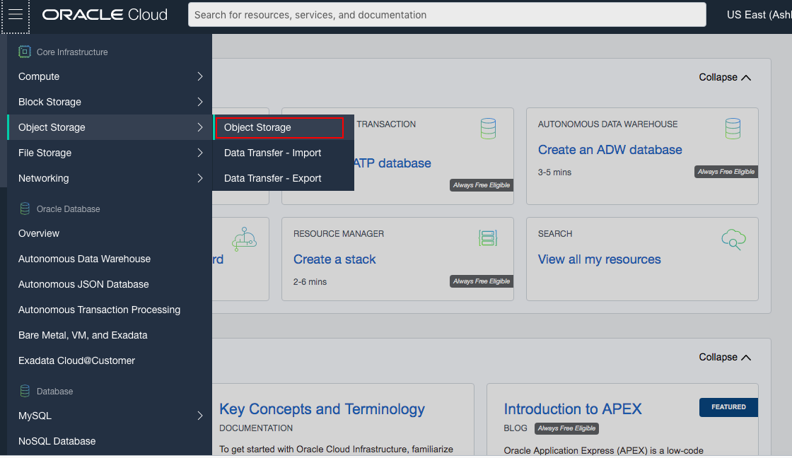
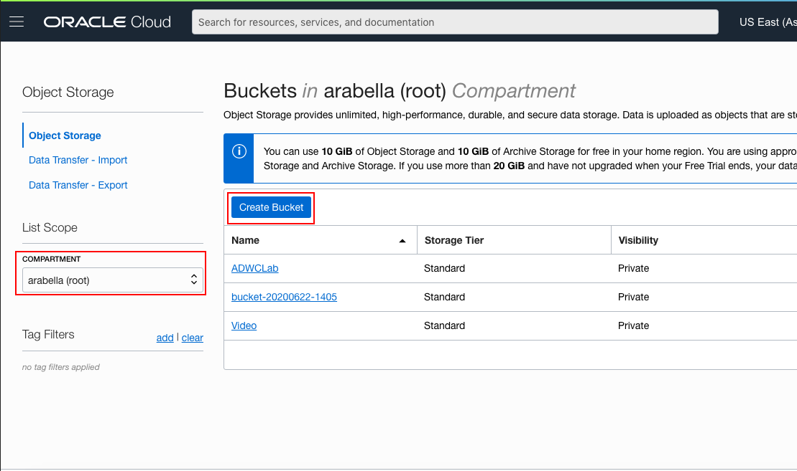
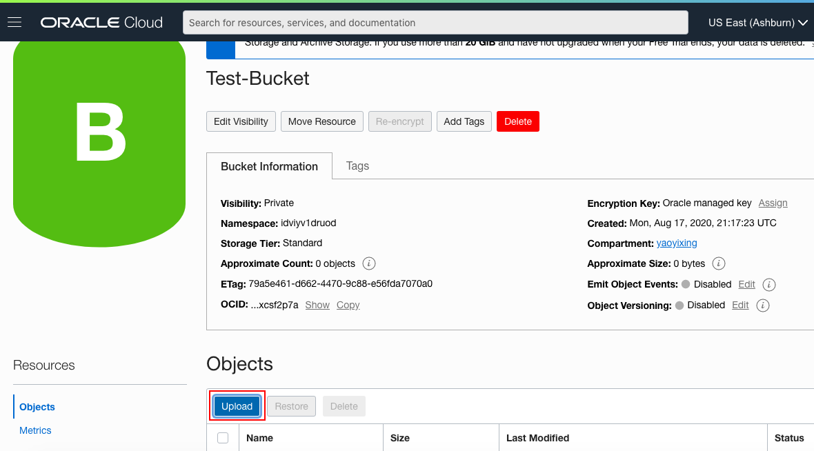
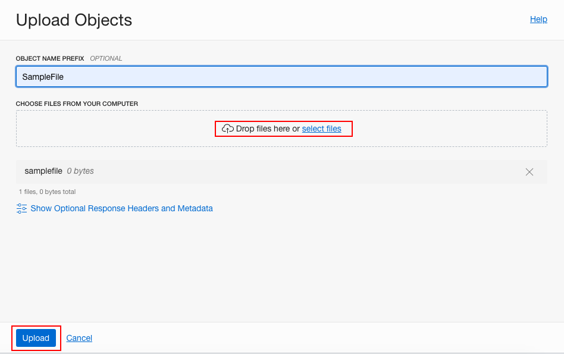
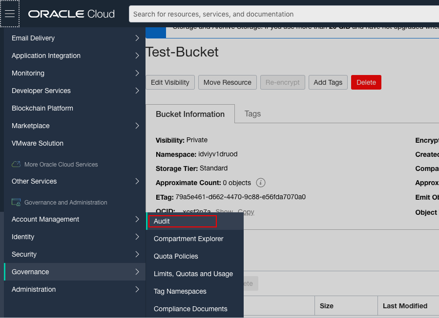

# OCI Audit Service

## Introduction

The Oracle Cloud Infrastructure Audit service automatically records calls to all supported Oracle Cloud Infrastructure public application programming interface (API) endpoints as log events. Currently, all services support logging by Audit. Object Storage service supports logging for bucket-related events, but not for object-related events. Log events recorded by the Audit service include API calls made by the Oracle Cloud Infrastructure Console, Command Line Interface (CLI), Software Development Kits (SDK), your own custom clients, or other Oracle Cloud Infrastructure services

Each log event includes a header ID, target resource(s), time stamp of the recorded event, request parameters, and response parameters. You can view events logged by the Audit service by using the Console, API, or the Java SDK. You can view events, copy the details of individual events, as well as analyze events or store them separately. Data from events can be used to perform diagnostics, track resource usage, monitor compliance, and collect security-related events.

The purpose of this lab is to give you an overview of the Audit Service and an example scenario to help you understand how the service works.


### Prerequisites

- Oracle Cloud Infrastructure account credentials (User, Password, Tenant, and Compartment)  

## **Step 1**: Sign in to OCI Console and Create Object Storage Bucket


1. Sign in using your tenant name, user name and password.

2. From the OCI Services menu, click **Object Storage**.

    

3. Select the compartment assigned to you from the drop down menu on the left part of the screen. Then select **Create Bucket**.

    

    **NOTE:** Ensure the correct Compartment is selected under COMPARTMENT list.

4. Fill out the dialog box:

      - **Bucket Name:** Provide a name (Test-Bucket in this lab)
      - **Storage Tier:**  STANDARD

5. Click **Create Bucket**.

## **Step 2**: Upload Object and Check Audit logs

1. Open a terminal window on your laptop.

2. Change directory to the Downloads folder Enter command:

    ```
    <copy>
    cd /c/Users/PhotonUser/Downloads/**
    </copy>
    ```
    

3. Create a sample file, Enter command:

    ```
    <copy>
    touch samplefile
    </copy>
    ```
    This should create a file by the name "samplefile" in the Downloads folder.

    

4. Switch to OCI window and click the Bucket Name.


5. Bucket detail window should be visible. Click **Upload**.

    


6. Select the sample file created earlier, then click **Upload** in the Dialog box.

    

7. In OCI services menu, Click **Audit** under **Governance**.

    

8. Scroll down or type the bucket name in Keyword section. You can choose other options such as dates and Request Action Type. For this lab we will leave them as default. Audit logs for the Storage bucket should be visible.

You have utilized OCI’s Audit service to extract events specific to Storage bucket created. Audit service can be used to monitor operations performed on OCI resources and can assist in trouble shooting your OCI environment.

## Acknowledgements
*Congratulations! You have successfully completed the lab.*

- **Author** - Flavio Pereira, Larry Beausoleil
- **Adapted by** -  Yaisah Granillo, Cloud Solution Engineer
- **Contributors** - Arabella Yao, Product Manager Intern, DB Product Management
- **Last Updated By/Date** - Kamryn Vinson, August 2020
