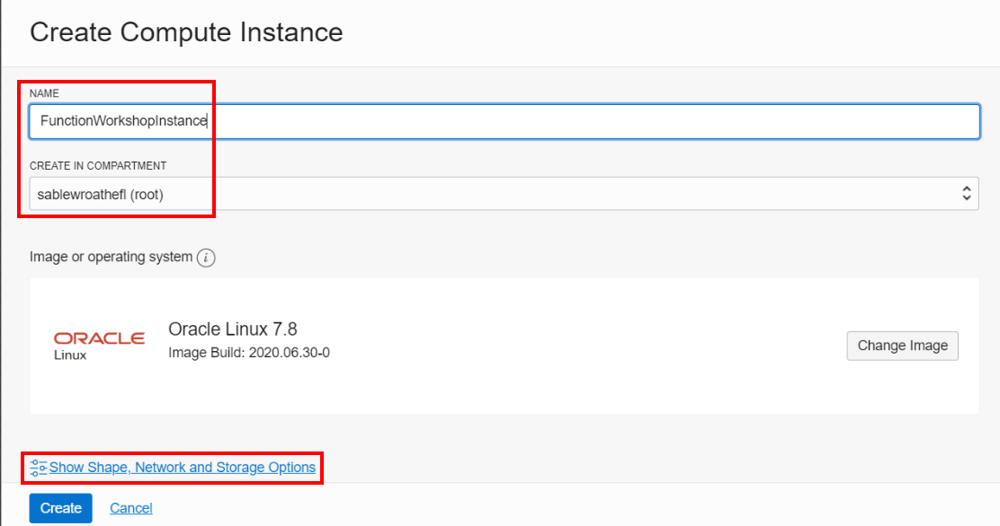
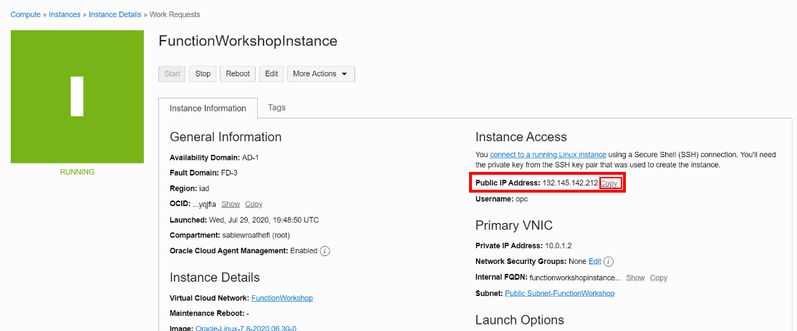
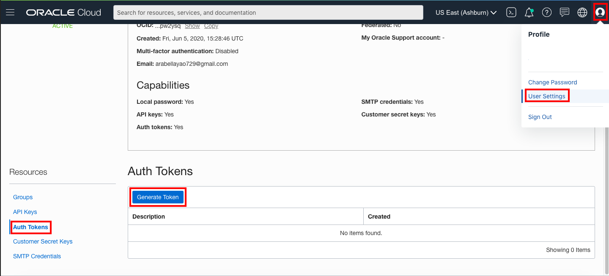

# Configuring and using Functions in OCI

## Introduction
Oracle Functions is a fully managed, highly scalable, on-demand, Functions-as-a-Service platform, built on enterprise-grade Oracle Cloud Infrastructure and powered by the Fn Project open source engine. Use Oracle Functions (sometimes abbreviated to just Functions) when you want to focus on writing code to meet business needs. You don't have to worry about the underlying infrastructure because Oracle Functions will ensure your app is highly-available, scalable, secure, and monitored. With Oracle Functions, you can deploy your code, call it directly or trigger it in response to events, and get billed only for the resources consumed during the execution.

Estimated Time: 75 minutes

### Prerequisites

1. [OCI Training](https://cloud.oracle.com/en_US/iaas/training)
2. [Familiarity with OCI console](https://docs.us-phoenix-1.oraclecloud.com/Content/GSG/Concepts/console.htm)
3. [Overview of Networking](https://docs.us-phoenix-1.oraclecloud.com/Content/Network/Concepts/overview.htm)
4. [Familiarity with Compartments](https://docs.us-phoenix-1.oraclecloud.com/Content/GSG/Concepts/concepts.htm)
5. [Connecting to a Compute Instance](https://docs.us-phoenix-1.oraclecloud.com/Content/Compute/Tasks/accessinginstance.htm)
6. Free Trial, LiveLabs or Paid Oracle Cloud account
7. Lab 1: Generate SSH Keys - Cloud Shell


## **Step 1**: Create a Virtual Cloud Network

1. From the OCI Services menu, click **Virtual Cloud Networks** under **Networking**. Select the compartment assigned to you from the drop down menu on the left side of the screen(you may need to scroll down to see the dropdown) and Click **Start VCN Wizard**.

    

    *NOTE: Ensure the correct Compartment is selected under COMPARTMENT list*

2. Choose **VCN with Internet Connectivity** and click **Start VCN Wizard**.

    

3. Fill out the dialog box:

    - **VCN Name**: Provide a name
    - **Compartment**: Ensure your compartment is selected
    - **VCN CIDR Block**: Provide a CIDR block (10.0.0.0/16)
    - **Public Subnet CIDR Block**: Provide a CIDR block (10.0.1.0/24)
    - **Private Subnet CIDR Block**: Provide a CIDR block (10.0.2.0/24)
    - Click **Next**

    

    

4. Verify all the information and  Click **Create**.

    

5. This will create a VCN with the following components.

    * VCN
    * Public subnet
    * Private subnet
    * Internet gateway (IG)
    * NAT gateway (NAT)
    * Service gateway (SG)

6. Click **View Virtual Cloud Network** to display your VCN details.

    

    

## **Step 2**: Create and Connect to a Compute Instances
1. Switch to the OCI console. From OCI services menu, Click **Instances** under **Compute**.

    

2. Click **Create Instance**. Enter a name for your instance and select the compartment you used earlier to create your VCN. Select **Show Shape, Network and Storage Options**.

    

    

    Leave **Image or Operating System** and **Availability Domain** as the default values.

    Scroll down to **Shape** and click **Change Shape**.

    

    Select **Virtual Machine** and **VM.Standard2.1**. Click **Select Shape**.

    

    Scroll down to the section labeled **Configure Networking** select the following.

    - **Virtual Cloud Network Compartment**: Choose the compartment you created your VCN in
    - **Virtual Cloud Network**: Choose the VCN you created in step 1
    - **Subnet Compartment:** Choose the compartment you created your VCN in
    - **Subnet:** Choose the Public Subnet under **Public Subnets**(it should be named `Public Subnet-NameOfVCN`)
    - **Use Network Security Groups to Control Traffic** : Leave un-checked
    - **Assign a Public IP Address**: Check this option

    

    - **Boot Volume:** Leave the default
    - **Add SSH Keys:** Choose 'Paste SSH Keys' and paste the Public Key you created in Cloud Shell earlier.

    *Ensure when you are pasting that you paste one line*

    

3. Click **Create**.

    *NOTE: If 'Service limit' error is displayed choose a different shape from VM.Standard2.1, VM.Standard.E2.1, VM.Standard1.1, VM.Standard.B1.1  OR choose a different AD.*

4.  Wait for the instance to have the **Running** status. Note down the Public IP of the instance. You will need this later.

    

5.  Launch the Cloud Shell if it is not running.  When running, enter the command below.

    ```
    <copy>cd ~/.ssh</copy>
    ```
6.  Enter **ls** and verify your key file exists.

    ```
    <copy>ls</copy>
    ```

7.  To ssh into the compute instance enter the following command replacing SSH-KEY-NAME with the name of your ssh key and replacing PUBLIC-IP-OF-COMPUTE1 with the IP address of the compute instance you created.

    *Note: Your SSH-KEY-NAME name should NOT end in .pub*

    ```
    <copy>
    ssh -i SSH-KEY-NAME opc@PUBLIC-IP-OF-COMPUTE-1
    </copy>
    ```
    *Note: User name is "opc".*

    *Note: If a "Permission denied error" is seen, ensure you are using '-i' in the ssh command. Also make sure that you correctly copied the name of your ssh key and the public IP of your compute instance.*

8.  Enter 'Yes' when prompted for security message.

    

9. Verify opc@`<COMPUTE_INSTANCE_NAME>` appears on the prompt.

    

## **Step 3**: Install and Configure OCI CLI
1. Install OCI CLI on the compute instance by entering the following command. When prompted for the install directory press enter(leave default). When prompted for the oci executable directory press enter(leave default). When prompted for the OCI script directory press enter(leave default). When prompted to install optional packages press enter(leave default). When prompted to update your $PATH enter `Y`.

    ```
    <copy>
    bash -c "$(curl –L https://raw.githubusercontent.com/oracle/oci-cli/master/scripts/install/install.sh)"
    </copy>
    ```

    

    

2. Check that OCI CLI is installed by entering the following command.

    ```
    <copy>
    oci -v
    </copy>
    ```
    *NOTE: Version should be minimum 2.5.X (3/23/2019)*

    

3. Next you will need to gather some information so that you can configure oci. First you will need your user OCID. Click the icon in the top right and click your username. Copy your user OCID. Record your OCID in a text file.
    

4. Next you will need to get your tenancy OCID. Click the icon in the top right and then your tenancy. Copy your tenancy OCID. Record your tenancy OCID because you will need it later.

    

5. Next you will need to get your region identifier. Click your region and then click manage regions. Then copy your region identifier and record it.

    

6. Next we will configure OCI CLI. Enter the following command.

    ```
    <copy>
    oci setup config
    </copy>
    ```

7. When prompted for a location for your config press enter to choose the default location. When prompted for your user OCID, tenancy OCID, and region ID enter the appropriate information. When asked if you want to generate a new RSA key pair enter `Y`. For all other prompts press enter to accept the default.

    

8. The `oci setup config` command also generated an API key. We will need to upload this API key into our OCI account for authentication of API calls.

    ```
    <copy>
    cat ~/.oci/oci_api_key_public.pem
    </copy>
    ```

9. Highlight and copy the content from the oracle cloud shell. Click the human icon followed by your user name. Then scroll down and click **API Keys**. In your user details page click **Add Public Key**. In the dialog box paste the public key content and click **Add**.

    

    

## **Step 4**: Install Docker

1. Next we need to generate an Auth token its an Oracle-generated token that you can use to authenticate with third-party APIs and Autonomous Database instance.

    In OCI console Click the user icon (top right)  then **User settings**. Under **Resources** Click **Auth Token**, then **Generate Token**. In the pop up window provide a description then click **Generate Token**.
    

2.  Click **Copy** and save the token in Notepad.

    *Note: Do not close the window without saving the token as it can not be retrieved later.*

3. Using your Cloud Shell, connected to your compute instance, install **yum-utils** with the following command.
    ```
    <copy>
    sudo yum install -y yum-utils device-mapper-persistent-data lvm2
    </copy>
    ```

    

4. Enter the following command to add the Docker repo.

    ```
    <copy>
    sudo yum-config-manager --add-repo https://download.docker.com/linux/centos/docker-ce.repo
    </copy>
    ```

    

5. Use nano or vi to edit the local `docker-ce.repo` file:

    ```
    <copy>nano /etc/yum.repos.d/docker-ce.repo</copy>
    ```

6. Replace the `baseurl` for `[docker-ce.repo]` with `https://download.docker.com/linux/centos/7/$basearch/stable`:

    

    Save the file.

7. Install the docker-engine:

    ```
    <copy>sudo yum install docker-engine -y</copy>
    ```

    

8. Enter the following command to enable Docker.

    ```
    <copy>
    sudo systemctl enable docker
    </copy>
    ```

    

9. Enter the following command to start Docker.

    ```
    <copy>
    sudo systemctl start docker
    </copy>
    ```

    

10. Enable the opc user to use Docker with the following command.

    ```
    <copy>
    sudo usermod -aG docker opc
    </copy>
    ```  

    

11. Docker is installed and the opc user is enabled to use Docker. Logout and log back in to the compute instance. Enter the following command.

    ```
    <copy>
    exit
    </copy>
    ```

    Ssh back in to the compute instance. Enter the following commands.

    ```
    <copy>
    cd ~/.ssh
    ssh -i SSH-KEY-NAME opc@PUBLIC-IP-OF-COMPUTE-1
    </copy>
    ```

    View Docker images.
    ```
    <copy>
    docker images
    </copy>
    ```

    

    Verify the docker version.
    ```
    <copy>
    docker version
    </copy>
    ```

    

    Launch the standard hello-world Docker image as a container.

    ```
    <copy>
    docker run hello-world
    </copy>
    ```

    

    You may want to minimize the oracle cloud shell for the next step, but don't close it because you will need it again later.

## **Step 5**: Create a Function Application

1. From the OCI services menu click **Policies** under **Identity**.

    

2. Make sure that the compartment you created your VCN in is selected and then click **Create Policy**.

    

3. Type "FunctionApplicationPolicies" into the name section and type "Allow functions to work" in the description section. Scroll down to the Policy statements section. Click the **+ Another Statement**.

    

    Copy and paste the following as your first policy statement.

    ```
    <copy>
    allow service FAAS to use virtual-network-family in tenancy
    </copy>
    ```

    Copy and paste the following as your second policy statement.

    ```
    <copy>
    allow service FAAS to read repos in tenancy
    </copy>
    ```

    Click **Create**.

    

    Verify that your policy has been added to the policy list.

    

4. Next we will create our first application.

5. From the OCI services menu click **Functions** under **Developer Services**.
    

6. Click **Create Application** and fill out the dialog box.

    - **NAME**: WorkshopFunctionApplication
    - **VCN in** : Choose the compartment where your VCN was created
    - **SUBNETS** : Choose your VCN's public subnet
    - **LOGGING POLICY**: None

    Click **Create**.

    

7. Scroll down and click on **Getting Started**.

    

    Scroll down until you see these commands.

    

## **Step 6**: Configure and Invoke a Function

1. Open the oracle cloud shell. If you are no longer connected to your instance use the following command to reconnect to your instance. Otherwise skip this command.

    ```
    <copy>
    cd ~/.ssh
    ssh -i SSH-KEY-NAME opc@PUBLIC-IP-OF-COMPUTE-1
    </copy>
    ```

2. Next we will install Fn CLI which is needed to execute function commands. Enter the command.
    ```
    <copy>
    curl -LSs https://raw.githubusercontent.com/fnproject/cli/master/install | sh
    </copy>
    ```

    

3. Confirm that the Fn CLI has been installed.
    ```
    <copy>
    fn version
    </copy>
    ```

    

4. Next create the new Fn Project CLI context. `CONTEXT-NAME` below can be a name that you can choose. For this workshop `CONTEXT-NAME` will be test-fn.

    ```
    <copy>
    fn create context CONTEXT-NAME --provider oracle
    </copy>
    ```
    

5. Specify that the Fn Project CLI is to use the new context.

    ```
    <copy>
    fn use context CONTEXT-NAME
    </copy>
    ```

    

6. Configure the new context with the api-url endpoint to use when calling the OCI API. Replace REGION-IDENTIFIER with your region identifier.

    ```
    <copy>
    fn update context api-url https://functions.REGION-IDENTIFIER.oraclecloud.com
    </copy>
    ```

    

    *For example: fn update context api-url https://functions.us-ashburn-1.oraclecloud.com*

7. Configure the new context with the name of the profile you've created for use with Oracle Functions.

    ```
    <copy>
    fn update context oracle.profile DEFAULT
    </copy>
    ```

    

8. Scroll down on the **Getting Started** section of your function application. Copy and paste command 3 into the oracle cloud shell.

    The command should be in the format of

    `fn update context oracle.compartment-id [COMPARTMENT-OCID]`.

    

    

9. Copy and paste command 4 into the oracle cloud shell.

    The command should be in the format of

    `fn update context registry [REGION-CODE].ocir.io/[TENANCY-NAMESPACE]/[YOUR-OCIR-REPO]`.

    `[YOUR-OCIR-REPO]` needs to be replaced with a name of your choosing. The name you choose needs to be all lowercase. For this workshop we will use `functionrepo`.

    *Note: [REGION-CODE] indicates the registry location. Region codes are listed at https://docs.cloud.oracle.com/iaas/Content/Registry/Concepts/registryprerequisites.htm#regional-availability*

    

    

10. Copy and paste command 6 into the oracle cloud shell.

    The command should be in the format of

    `docker login -u '[TENANCY-NAMESPACE]/[USERNAME]' [REGION-CODE].ocir.io`.

    *Note: If your tenancy is federated your username will be in the format of oracleidentitycloudservice/[USERNAME].*

    

    

11. When prompted for a password paste your auth token into the shell and press enter.

12. Next we will create our first function.

    ```
    <copy>
    fn init --runtime java hello-java
    </copy>
    ```
    A directory called **hello-java** is created, containing:

    * a function definition file called func.yaml*
    * a /src directory containing source files and directories for the hello-java function*
    * a Maven configuration file called pom.xml that specifies the dependencies required to compile the function*

    

13. Change the directory to the hello-java directory created in the previous step.

    ```
    <copy>
    cd hello-java
    </copy>
    ```

14. Enter the following command to build the function and its dependencies as a Docker image called hello-java, push the image to the specified Docker registry, and deploy the function to Oracle Functions.

    ```
    <copy>
    fn -v deploy --app WorkshopFunctionApplication
    </copy>
    ```

    

    *Note: You can also Confirm that the hello-java image has been pushed to Oracle Cloud Infrastructure Registry by logging in to the console. Under **Solutions and Platform**, go to **Developer Services** and click **Registry**.*

15.  Now lets invoke your first function. Enter the following command.

    ```
    <copy>
    fn invoke WorkshopFunctionApplication hello-java
    </copy>
    ```

16. Verify "Hello World!" message is displayed.

    

Congratulations! You've just created, deployed, and invoked your first function using Oracle Functions!

## **Step 7**: Delete the Resources
1. From the OCI services menu click **Instances** under **Compute**.

    

2. Locate the compute instance you created, click the action icon and then click **Terminate**.

    

3. Make sure **Permanently Delete the Attached Boot Volume** is checked. Click **Terminate Instance**. Wait for the instance to fully terminate.

    

4. From the OCI services menu click **Functions** under **Developer Services**.

    

5. Locate your function application and then click **Delete**.

    

6. When prompted follow the instructions and enter `DELETE NAME-OF-APPLICATION`.

    

7. From the OCI services menu click **Virtual Cloud Networks** under **Networking**, the list of all VCNs will appear.

    

8. Locate your VCN, click action icon and then click **Terminate**. Click **Terminate All** in the confirmation window. Click **Close** once the VCN is deleted.

    

    

Congratulations! You have successfully completed the lab.

## Acknowledgements

- **Author** - Flavio Pereira, Larry Beausoleil
- **Adapted by** -  Yaisah Granillo, Cloud Solution Engineer
- **Contributors**
    - Kallol Chaudhuri, Principal Technology Solutions Architect
    - Oracle LiveLabs QA Team (Jaden McElvey, Technical Lead | Arabella Yao, Product Manager Intern, DB Product Management)
- **Last Updated By/Date** - Tom McGinn, October 2020

## Need Help?
Please submit feedback or ask for help using our [LiveLabs Support Forum](https://community.oracle.com/tech/developers/categories/oracle-cloud-infrastructure-fundamentals). Please click the **Log In** button and login using your Oracle Account. Click the **Ask A Question** button to the left to start a *New Discussion* or *Ask a Question*.  Please include your workshop name and lab name.  You can also include screenshots and attach files.  Engage directly with the author of the workshop.

If you do not have an Oracle Account, click [here](https://profile.oracle.com/myprofile/account/create-account.jspx) to create one.
