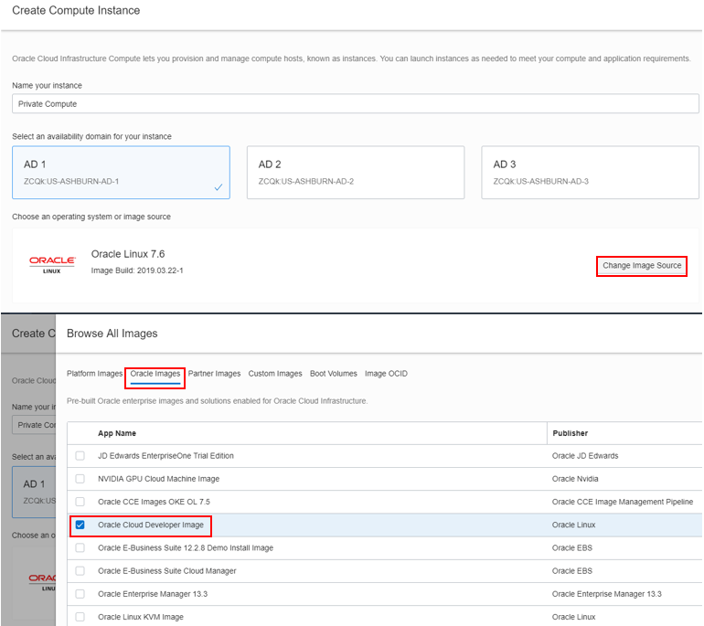
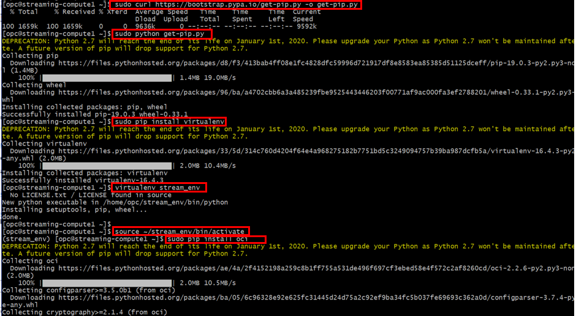

# Deploying OCI Streaming Service

## Introduction

In this lab, we will create a compute instance, download a script to configure streaming service, publish and consume messages. The Oracle Cloud Infrastructure Streaming service provides a fully managed, scalable, and durable storage solution for ingesting continuous, high-volume streams of data that you can consume and process in real time. Streaming can be used for messaging, ingesting high-volume data such as application logs, operational telemetry, web Click-stream data, or other use cases in which data is produced and processed continually and sequentially in a publish-subscribe messaging model.

## **Step 1**: Sign in to OCI Console and create VCN

**Note:** OCI UI is being updated thus some screenshots in the instructions might be different than actual UI.

1. Sign in using your tenant name, user name and password. Use the login option under **Oracle Cloud Infrastructure**.

    


2. From the OCI Services menu, Click **Virtual Cloud Networks** under Networking. Select the compartment assigned to you from the drop down menu on the left part of the screen under Networking and Click **Start VCN Wizard**.

    **NOTE:** Ensure the correct Compartment is selected under COMPARTMENT list.

3. Click **VCN with Internet Connectivity** and click **Start VCN Wizard**.

4. Fill out the dialog box:

     - **VCN NAME**: Provide a name
     - **COMPARTMENT**: Ensure your compartment is selected
     - **VCN CIDR BLOCK**: Provide a CIDR block (10.0.0.0/16)
     - **PUBLIC SUBNET CIDR BLOCK**: Provide a CIDR block (10.0.1.0/24)
     - **PRIVATE SUBNET CIDR BLOCK**: Provide a CIDR block (10.0.2.0/24)
     - Click **Next**

5. Verify all the information and  Click **Create**.

6. This will create a VCN with the following components.

    *VCN, Public subnet, Private subnet, Internet gateway (IG), NAT gateway (NAT), Service gateway (SG)*

7. Click **View Virtual Cloud Network** to display your VCN details.

## **Step 2**: Create compute instance

1. Go to the OCI console. From OCI services menu, under **Compute**, click **Instances**.

2. Click Create Instance. Fill out the dialog box:

      - **Name your instance**: Enter a name
      - **Choose an operating system or image source**: Click **Change Image Source**. In the new window, Click **Oracle Images** Choose **Oracle Cloud Developer Image**. Scroll down, Accept the Agreement and Click **Select Image**

        

      - **Availability Domain**: Select availability domain
      - **Instance Type**: Select Virtual Machine
      - **Instance Shape**: Select VM shape

      **Under Configure Networking**
      - **Virtual cloud network compartment**: Select your compartment
      - **Virtual cloud network**: Choose the VCN
      - **Subnet Compartment:** Choose your compartment.
      - **Subnet:** Choose the Public Subnet under **Public Subnets**
      - **Use network security groups to control traffic** : Leave un-checked
      - **Assign a public IP address**: Check this option

        

      - **Boot Volume:** Leave the default
      - **Add SSH Keys:** Choose **Paste SSH Keys** and paste the Public Key saved earlier.

3. Click **Create**.

4.  Wait for Instance to be in **Running** state. In Cloud Shell Terminal enter command:

    ```
    <copy>cd .ssh</copy>
    ```

5.  Enter **ls** and verify your SSH Key file exists.

6.  Enter command:
    ```
    <copy>bash</copy>
    ```
    ```
    <copy>ssh -i <sshkeyname> opc@<PUBLIC_IP_OF_COMPUTE></copy>
    ```

    **HINT:** If 'Permission denied error' is seen, ensure you are using '-i' in the ssh command. You MUST type the command, do NOT copy and paste ssh command.

7.  Enter 'yes' when prompted for security message.
     

8.  Verify opc@`<COMPUTE_INSTANCE_NAME>` appears on the prompt.

## **Step 3**: Download Script to configure Streaming service and Publish messages

1. In ssh session to compute instance, configure OCI CLI, Enter command:
    ```
    <copy>
    oci setup config
    </copy>
    ```

2. Accept the default directory location. For user's OCID switch to OCI Console window. Click Human Icon and then your user name. In the user details page Click **copy** to copy the OCID. **Also note down your region name as shown in OCI Console window**. Paste the OCID in ssh session.
     

3. Repeat the step to find tenancy OCID (Human icon followed by Clicking Tenancy Name). Paste the Tenancy OCID in ssh session to compute instance followed by providing your region name (us-ashburn-1, us-phoenix-1 etc).

4. When asked for **Do you want to generate a new RSA key pair?** answer Y. For the rest of the questions accept default by pressing Enter.
     

5. **oci setup config** also generated an API key. We will need to upload this API key into our OCI account for authentication of API calls. Switch to ssh session to compute instance, to display the conent of API key Enter command:

    ```
    <copy>
    cat ~/.oci/oci_api_key_public.pem
    </copy>
    ```

6. Hightligh and copy the content from ssh session. Switch to OCI Console, Click Human icon followed by your user name. In user details page Click **Add Public Key**. In the dialg box paste the public key content and Click **Add**.

     

     

7. Download and Install pip utility which will be used to install additional software. Enter command:

    ```
    <copy>
    sudo curl https://bootstrap.pypa.io/get-pip.py -o get-pip.py
    </copy>
    ```

    followed by

    ```
    <copy>
    sudo python get-pip.py
    </copy>
    ```

8. Install a virtual environment. This is being done so we have a clean environment to execute our python script that will create and publish messages to OCI streaming service. Enter command:

    ```
    <copy>
    sudo pip install virtualenv
    </copy>
    ```

9. Now create a virtual environment, Enter command:

    ```
    <copy>
    bash
    virtualenv <Environment_Name>
    </copy>
    ```
    For example **virtualenv stream\_env**.

    Now initialize the virtual environment, Enter command:

    **NOTE** : Below command assumes that the environment name is 'stream-env'

    ```
    <copy>
    cd /home/opc/stream_env/bin
    </copy>
    ```

    ```
    <copy>
    source ~/stream_env/bin/activate
    </copy>
    ```

10. Once your virtual environment is active, OCI can be installed using pip, Enter command:

    ```
    <copy>
    pip install oci
    </copy>
    ```

     

11. Now download the main script file though first we will remove the existing file, Enter Command:

    ```
    <copy>
    cd /home/opc
    </copy>
    ```

    ```
    <copy>
    rm stream_example.py
    </copy>
    ```

    ```
    <copy>
    wget https://objectstorage.us-ashburn-1.oraclecloud.com/p/7lS9G-yeYtB9bsUsW8cy813YjWgThlss2jed_DXKWcA/n/c4u03/b/oci-library/o/stream_example.py
    </copy>
    ```

12. Now download a dependent script file though first we will remove the existing file, Enter Command:

    ```
    <copy>
    cd /home/opc/stream_env/lib/python2.7/site-packages/oci/streaming/
    </copy>
    ```

    ```
    <copy>
    rm stream_admin_client_composite_operations.py
    </copy>
    ```

    ```
    <copy>
    wget https://objectstorage.us-ashburn-1.oraclecloud.com/p/t9ftcmjIBMusNuJ2GPQlXR7LrwHLTGGJqi80amvV0pE/n/c4u03/b/oci-library/o/stream_admin_client_composite_operations.py
    </copy>
    ```

13. Our setup is now ready. Before running the script switch to OCI Console window, from the main menu Click **Compartments** under **Identity**. Click your compartment name and copy the OCID of the compartment. (Just as was done for user OCID earlier).

14. Switch to ssh session and run the script, Enter command:

    ```
    <copy>
    bash
    python ~/stream_example.py <COMPARTMENT_OCID>
    </copy>
    ```

    For example :

    python ~/stream\_example.py ocid1.compartment.oc1..aaaaaaaada2gaukcqoagqoshxq2pyt6cdsj2mhnrz3p5nke33ljx2bp476wq

15. Follow the prompts of the script. The script will create Streaming service called **SdkExampleStream**. It will publish 100 messages, create 2 groups on the compute and read those messages. Finally it will delete the streaming service. **You will be prompted to hit enter after verifying each step**.

## **Step 4**: Delete the resources

1. Switch to OCI console window.

2. If your Compute instance is not displayed, From OCI services menu Click **Instances** under **Compute**.

3. Locate compute instance, Click Action icon and then **Terminate**.

     

4. Make sure Permanently delete the attached Boot Volume is checked, Click **Terminate Instance**. Wait for instance to fully Terminate.

     

5. From OCI services menu Click **Virtual Cloud Networks** under Networking, list of all VCNs will appear.

6. Locate your VCN , Click Action icon and then **Terminate**. Click **Terminate All** in the Confirmation window. Click **Close** once VCN is deleted.
     


## Acknowledgements
*Congratulations! You have successfully completed the lab.*

- **Author** - Flavio Pereira, Larry Beausoleil
- **Adapted by** -  Yaisah Granillo, Cloud Solution Engineer
- **Contributors** - Kamryn Vinson, QA Engineer Lead Intern | Arabella Yao, Product Manager Intern, DB Product Management
- **Last Updated By/Date** - Tom McGinn, August 2020
- **Valid through** - August 2021

## See an issue?
Please submit feedback using this [form](https://apexapps.oracle.com/pls/apex/f?p=133:1:::::P1_FEEDBACK:1). Please include the *workshop name*, *lab* and *step* in your request.  If you don't see the workshop name listed, please enter it manually. If you would like for us to follow up with you, enter your email in the *Feedback Comments* section.
