# Edge Services on OCI (DNS)

## Introduction

OCI DNS has advanced traffic management capabilities to steer DNS traffic across multiple public OCI instances and other private and 3rd party assets/endpoints. Traffic management supports comprehensive policies to provide intelligent responses to ensure high performance, scalability, and availability.

In this lab, we will learn how to use OCI DNS Traffic Management service to ensure high availability of your web applications through detection of endpoint health and diverting your traffic accordingly.

**Key points:**

*We recommend using Chrome or Edge as the browser. Also set your browser zoom to 80%.*

- All screen shots are examples ONLY.

- You will be asked to record some information during this workshop. It is recommended that you paste the information into a text file when prompted.


    **Note:** OCI UI is being updated thus some screenshots in the instructions might be different than actual UI

### Prerequisites

1. Oracle Cloud Infrastructure account credentials (User, Password, Tenant, and Compartment).
   
2. [OCI Training](https://cloud.oracle.com/en_US/iaas/training)

3. [Familiarity with OCI console](https://docs.us-phoenix-1.oraclecloud.com/Content/GSG/Concepts/console.htm)

4. [Overview of Networking](https://docs.us-phoenix-1.oraclecloud.com/Content/Network/Concepts/overview.htm)

5. [Familiarity with Compartment](https://docs.us-phoenix-1.oraclecloud.com/Content/GSG/Concepts/concepts.htm)

6. [Connecting to a compute instance](https://docs.us-phoenix-1.oraclecloud.com/Content/Compute/Tasks/accessinginstance.htm)


## Step 1: Sign in to OCI Console and create VCN


1. Sign in using your tenant name, user name and password. Use the login option under **Oracle Cloud Infrastructure**.
    


2. From the OCI Services menu, Click **Virtual Cloud Networks** under Networking. Select the compartment assigned to you from the drop down menu on the left part of the screen under Networking and Click **Start VCN Wizard**.

    **NOTE:** Ensure the correct Compartment is selected under COMPARTMENT list.

3. Click **VCN with Internet Connectivity** and click **Start VCN Wizard**.

4. Fill out the dialog box:

      - **VCN NAME**: Provide a name
      - **COMPARTMENT**: Ensure your compartment is selected
      - **VCN CIDR BLOCK**: Provide a CIDR block (10.0.0.0/16)
      - **PUBLIC SUBNET CIDR BLOCK**: Provide a CIDR block (10.0.1.0/24)
      - **PRIVATE SUBNET CIDR BLOCK**: Provide a CIDR block (10.0.2.0/24)
      - Click **Next**

5. Verify all the information and Click **Create**.

6. This will create a VCN with following components.

    *VCN, Public subnet, Private subnet, Internet gateway (IG), NAT gateway (NAT), Service gateway (SG)*

7. Click **View Virtual Cloud Network** to display your VCN details.         
              
8. We will open port 80 on this VCN to provide http access to app on the compute instance(to be installed later on). Click **Security List** and then **Default Security list for`<YOUR_VCN_NAME>`**.

    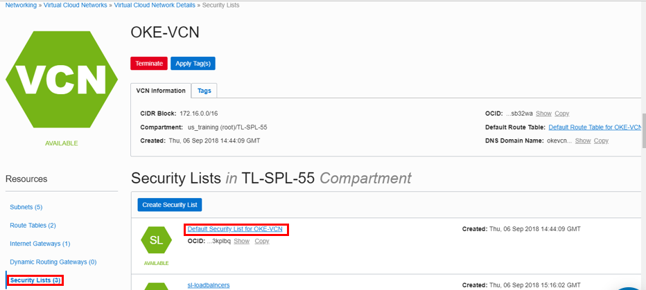

9. Click **Add Ingress Rule** under **Ingress Rules** and add below rule:

      - **Make sure STATELESS Flag in un-checked**
      - **SOURCE TYPE:** CIDR
      - **SOURCE CIDR:** 0.0.0.0/0
      - **IP PROTOCOL:** TCP
      - **SOURCE PORT RANGE:** ALL
      - **DESTINATION PORT RANGE:** 80

    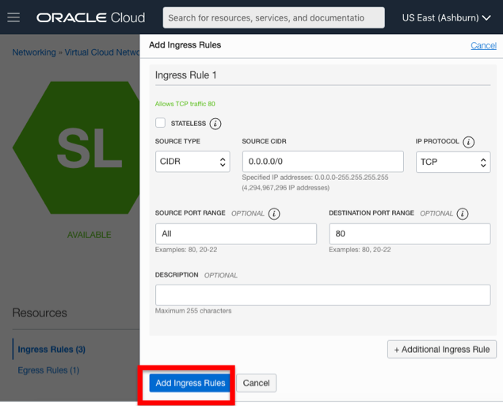

10. Click **Add Ingress Rule** at the bottom.

## Step 2: Create Public Private SSH Key Pair, two compute instances and install web server

1. In Cloud Shell Terminal enter command:
    ```
    <copy>
    ssh-keygen
    </copy>
    ```

3. Press Enter When asked for 'Enter File in which to save the key', 'Created Directory, 'Enter passphrase', and 'Enter Passphrase again.

    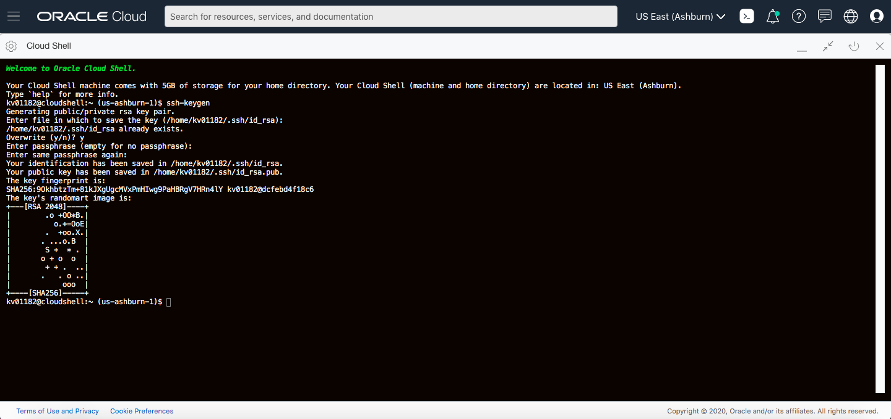

4. You should now have the Public and Private keys:

    /home/PhotonUser/.ssh/<sshkeyname\> (Private Key)

    /home/PhotonUser/.ssh/<sshkeyname\>.pub (Public Key)

    **NOTE:** The public key will be used to create 
    Compute instance and the private key will be used to connect via SSH into compute instance.

    **HINT:** Enter command 
    ```
    <copy>
    cd /home/PhotonUser/.ssh (No Spaces) 
    </copy>
    ```
    and then 
    ```
    <copy>
    ls 
    </copy>
    ```
    to verify the two files exist. 

5. In Cloud Shell Terminal Enter command  
    ```
    <copy>
    cat /home/PhotonUser/.ssh/<sshkeyname>.pub
    </copy>
    ```
    , highlight the key and copy 

    

6. Launch notepad and paste the key in Notepad (as backup).

7. Switch to the OCI console. From OCI services menu, Click **Instances** under **Compute**.

8. Click **Create Instance**. Enter a name for your instance and select the compartment you used earlier to create your VCN. Select Show **Shape, Network, and Storage Options.**

    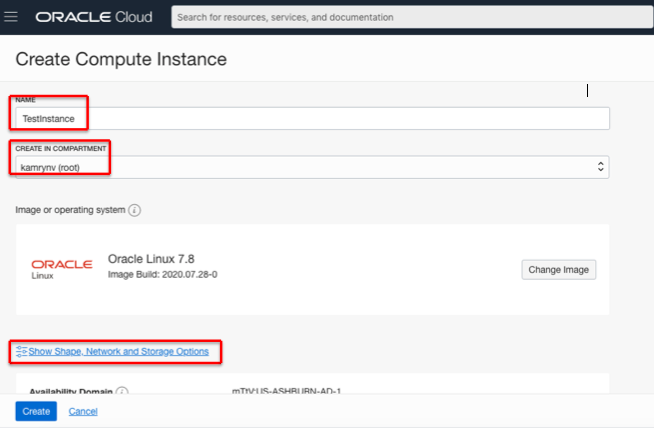

Leave **Image or Operating System** and **Availability Domain** as the default values.

Scroll down to **Shape** and click **Change Shape**.


Select **Virtual Machine** and **VM.Standard.E2.1**. Click **Select Shape**.

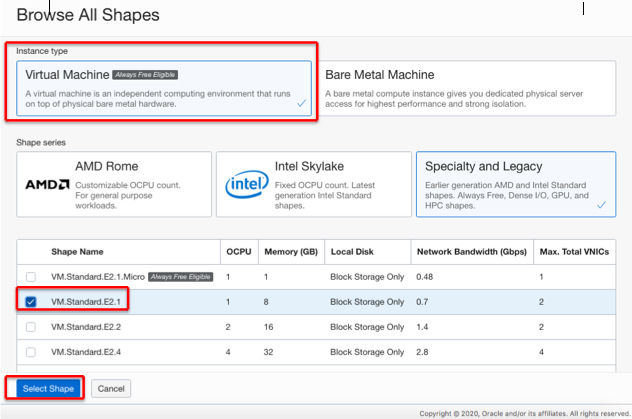

- Scroll down to the section labelled **Configure Networking** and select the following:

    - **Virtual Cloud Network Compartment**: Choose the compartment you created your VCN in
    - **Virtual Cloud Network**: Choose the VCN you created in step 1
    - **Subnet Compartment**: Choose the compartment you created your VCN in
    - **Subnet**: Choose the Public Subnet under **Public Subnets** (it should be named Public subnet-NameOfVCN) 
    - **Use Network Security Groups to Control Traffic**: Leave un-checked
    - **Assign a Public IP Address**: Check this option

    

    - **Boot Volume**: Leave the default
    - **Add SSH Keys**: Choose 'Paste SSH Keys' and paste the Public Key you created in Cloud Shell earlier.

    *Ensure when you are pasting that you paste one line*

8. Click **Create**.

    **NOTE:** If 'Service limit' error is displayed choose a different shape from VM.Standard2.1, VM.Standard.E2.1, VM.Standard1.1, VM.Standard.B1.1  OR choose a different AD

    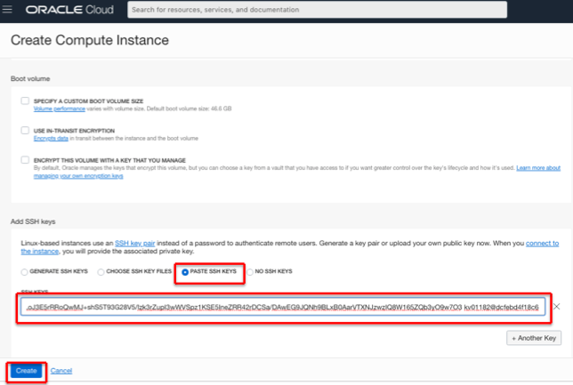

9. Repeat Steps to launch a second Compute instance and note down its public IP address.

10. Wait for Instances to be in **Running** state. In Cloud Shell Terminal Enter Command:
    
    ```
    <copy>
    cd /home/PhotonUser/.ssh
    </copy>
    ```
11. Enter **ls** and verify your ssh key file exists

12.  ssh to **first** compute instance. Enter command:
            
    ```
    <copy>
    bash
    ssh -i <sshkeyname> opc@<PUBLIC_IP_OF_COMPUTE>
    </copy>
    ```

    **HINT:** If 'Permission denied error' is seen, ensure you are using '-i' in the ssh command. You MUST type the command, do NOT copy and paste ssh command

13. Enter 'Yes' when prompted for security message.

    
 
14. Verify opc@`<COMPUTE_INSTANCE_NAME>` appears on the prompt

15. Launch a second window and connect via SSH into the second Compute instance (using the same steps as above. 

    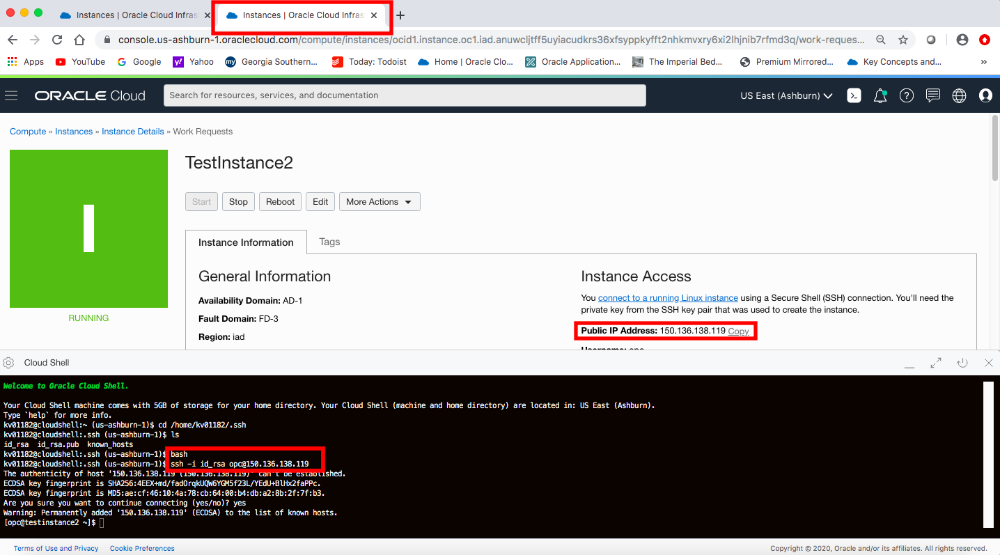

    **HINT:** Ensure to use the IP address of the second Compute instance in the SSH command.

16. Bring up  SSH session for the first Compute instance and install a Web server, Enter Commands: (Install Apache HTTP Server).
    ```
    <copy>
    sudo yum -y install httpd 
    </copy>
    ```
    ```
    <copy>
    sudo firewall-cmd --permanent  --add-port=80/tcp 
    </copy>
    ```
    (Open port 80 on the firewall to allow http and https traffic).

    **NOTE:** --add-port flag has no spaces.

    ```
    <copy>
    sudo firewall-cmd --reload 
    </copy>
    ```
    (Reload the firewall to activate the rules).

    ```
    <copy>
    sudo systemctl start httpd 
    </copy>
    ```
    (Start the web server).

    ```
    <copy>
    sudo su
    </copy> 
    ```
    (Change user privilege)

    ```
    <copy>
    echo 'WebServer1' >>/var/www/html/index.html
    </copy> 
    ```
    (create index.html file. The content of the file will be displayed when the web server is accessed.)

17. Bring up the SSH session for the second Compute instance and repeat commands:(Install Apache HTTP Server)

    ```
    <copy>
    sudo yum -y install httpd 
    </copy>
    ```
    ```
    <copy>
    sudo firewall-cmd --permanent  --add-port=80/tcp 
    </copy>
    ```
    (Open port 80 on the firewall to allow http and https traffic).

    **NOTE:** --add-port flag has no spaces.

    ```
    <copy>
    sudo firewall-cmd --reload 
    </copy>
    ```
    (Reload the firewall to activate the rules).

    ```
    <copy>
    sudo systemctl start httpd
    </copy>
    ```
    (Start the web server).

    ```
    <copy>
    sudo su
    </copy> 
    ```
    (Change user privilege)

    ```
    <copy>
    echo 'WebServer2' >>/var/www/html/index.html
    </copy> 
    ```
    (create index.html file. The content of the file will be displayed when the web server is accessed.)

    We now have two Compute instances with Web servers installed and a basis index.html file. 

    **Note down the Public IP addresses of both compute instances.**

## Step 3: Create Traffic Management Policy

We will now  create a global Failover traffic management policy for this web application, where we will use one of the two computes as primary and the second one as secondary

1. From OCI Services menu Click **Traffic Management Steering Policies** under **Networking**, then Click **Create Traffic Management Steering Policy**
    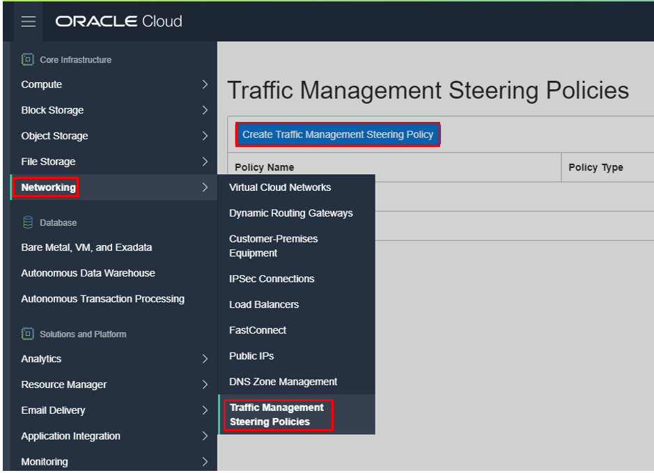

2. Fill out the dialog box:
      - **POLICY TYPE** : Failover
      - **POLICY NAME** : Provide a name
      - **POLICY TTL** : 30
      - **MAXIMUM ANSWER COUNT** : Leave as default

    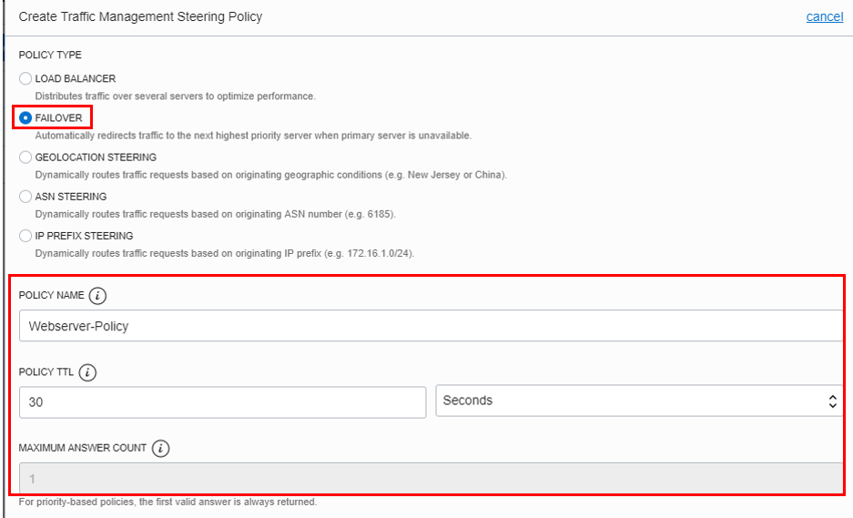

    **Answer Pool(s) will Create answer pools that will contain the records and will be provided as answers for DNS queries**

    **Answer Pool 1** 


    - **ANSWER POOL NAME** : Provide a name (such as Webserver1-Pool)
    - **NAME** : Provide a name (such as Webserver1)
    - **TYPE** : A
    - **RDATA** : IP address of first compute instance (first web server)

    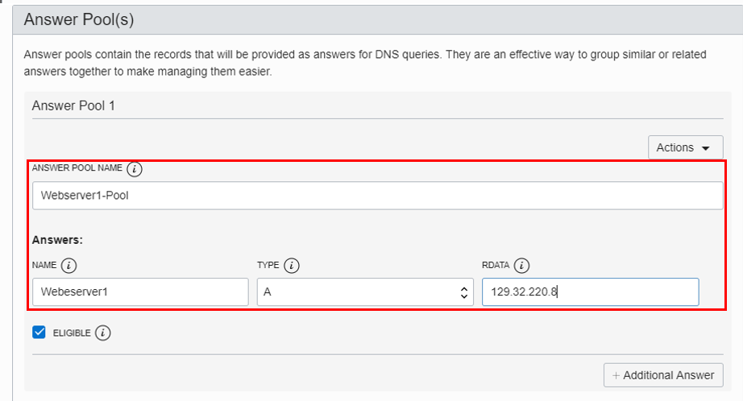

    **Answer Pool 2** 


    - **ANSWER POOL NAME** : Provide a name (such as Webserver2-Pool)
    - **NAME** : Provide a name (such as Webserver2)
    - **TYPE** : A
    - **RDATA** : IP address of second compute instance (second web server)


    **Pool Priority**


    - **Pool** : Choose Pool1 from drop down
    - **Pool** : Choose Pool2 from drop down

    


    **Attach Health Check**

    Click **Add new**

    - **Health Check Name** : HealthCheck-userX (replace x with your userID) 
    - **Interval**: 30 
    - **Protocol**: HTTP

    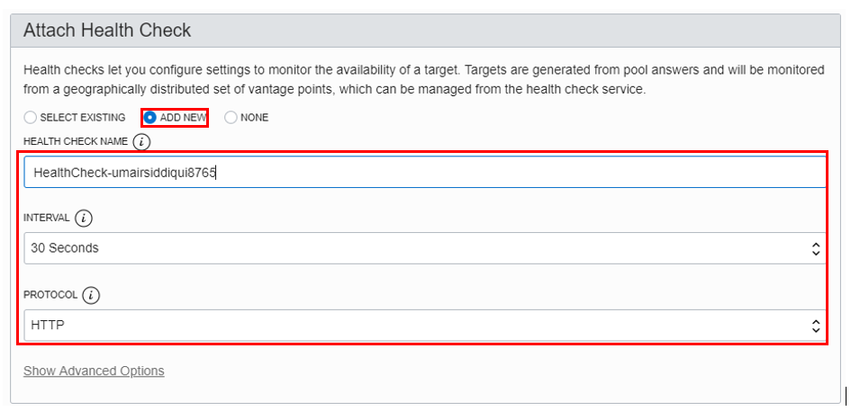


    **Attached Domain(s) (Optional)**

    *As part of this lab a Domain has already been created, all users need to do is create a sub domain. This sub domain must be the user name of the user*

    - **SUBDOMAIN** : Use your user name
    - **COMPARTMENT** : ocispl24(root)
    - **ZONE** : Use the drop down and choose **ocispl24.com**

3. Click **Create Policy**.

    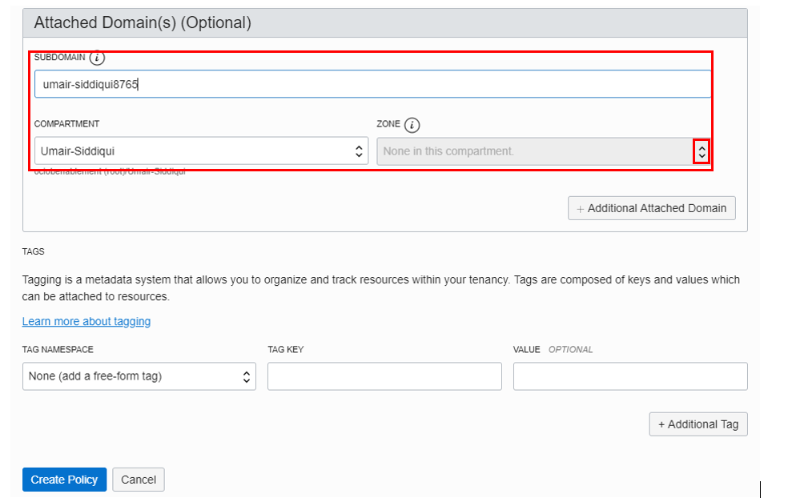

4. Once the Failover traffic policy is created, you are navigated to the details page of the policy.

    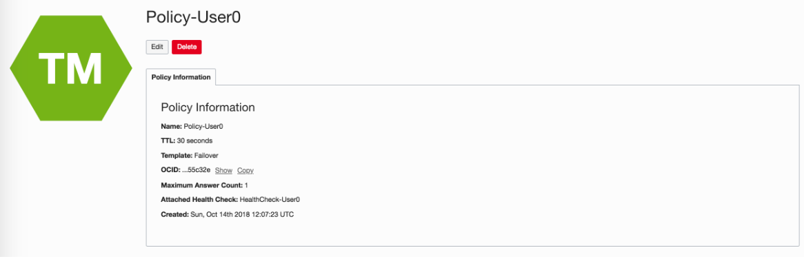

5. Once the health check runs after the interval specified in health check (30 seconds), the health status will update to show status of your webservers.

    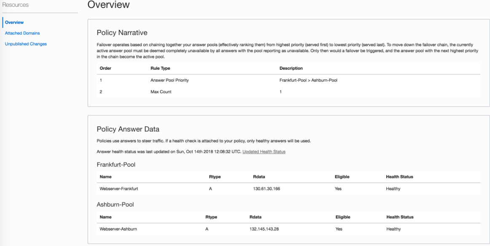

6. Launch a new browser tab, open up the domain specified in your traffic policy(for webserver1) and you will be directed to the webserver1.

    **http://`<YOUR_USER_NAME>`.ocispl24.com**

    **NOTE : `<YOUR_USER_NAME>` is what was specified as the sub domain**

7. You should see 'Webserver1' displayed in the browser window.

    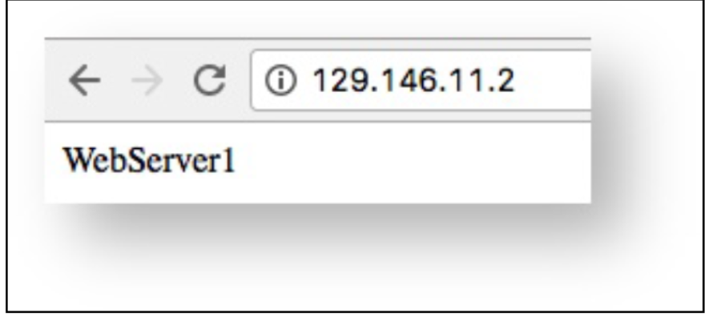

## Step 4: Failover Test for Traffic Management Policy

We will now do a failover test of the policy just created. We will STOP Webserver1 and test if the healt check is updated, and the traffic is diverted to webserver2.

1. Switch to OCI Console window and navigate to **Compute** under **Instances**.

2. Click on first compute (weberver1) name to display compute details page.

3. Click **Stop** to stop the first compute instance (webserver1).

4. In the **overview** section of the details page of your traffic policy, Click **Update Health Status**. It will show webserver1(first compute) is currently unhealthy. And as per the policy priority pools, the traffic will be directed to the webserver2 (compute2).

    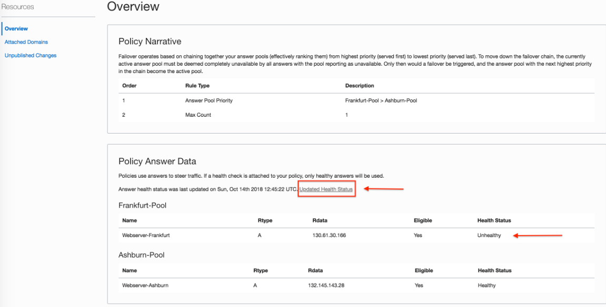

5. Switch to browser tab with **Webserver1** displayed, hit refresh and you will be directed to a webserver2.

6. We we will take a look at different options on the health check policy. From OCI services menu click **Health Checks** under **Monitoring**.

    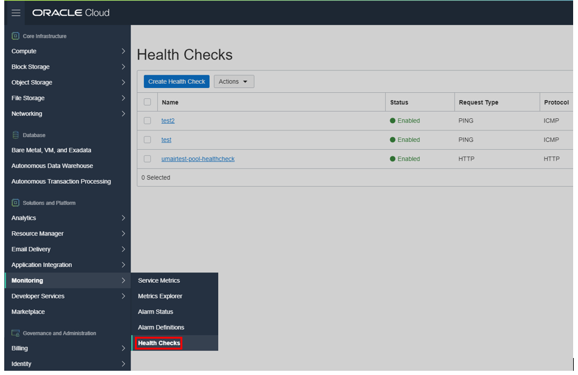

7. Click on the health check you created.

8. In the details panel, you can notice some key details.

      - Targets: define the end points
      - Vantage Points: Current vantage points for health check. They are automatically chosen here and can be modified based on your customers geographical area
      - History of Health Check results updated every 30 seconds interval 

    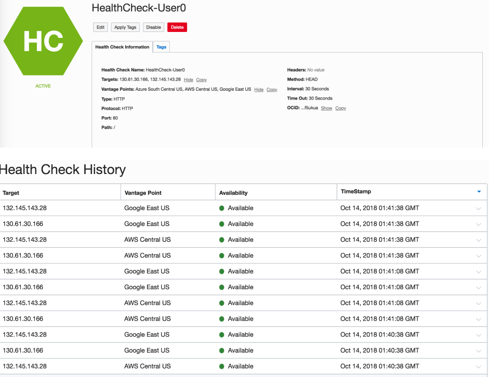

9. Click **Edit** to edit the vantage points of Health Check.

10. Change the vantage points from the drop down menu to any of the provided options.

    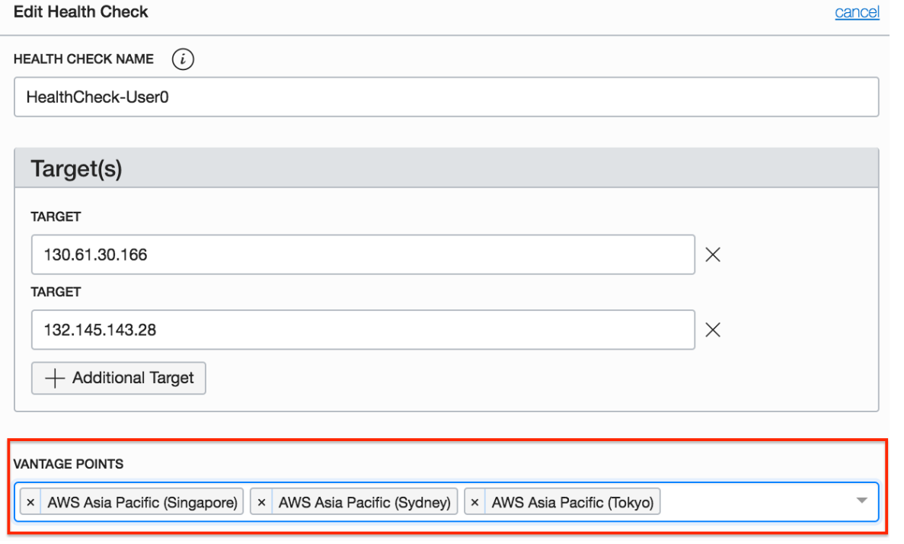

11. Once changed, you will notice the change on the details page.

    

12. Refresh the browser to see the health check history which now reflects Health Checks from selected Vantage Points.

    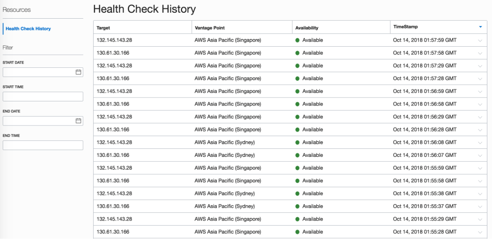


## Step 5: Delete the resources

1. Switch to  OCI console window.

2. If your Compute instance is not displayed, From OCI services menu Click **Instances** under **Compute**.

3. Locate first compute instance, Click Action icon and then **Terminate**. 

    

4. Make sure Permanently delete the attached Boot Volume is checked, Click Terminate Instance. Wait for instance to fully Terminate.

    

5. Repeat the step to delete second compute instance.

6. From OCI services menu Click **Virtual Cloud Networks** under Networking, list of all VCNs will 
appear.

7. Locate your VCN , Click Action icon and then **Terminate**. Click **Delete All** in the Confirmation window. Click **Close** once VCN is deleted.

    


    

8. Navigate to **Health Checks** page, click your Health Check name and in Health Check details page, Click **Delete**.


## Acknowledgements
*Congratulations! You have successfully completed the lab.*

- **Author** - Flavio Pereira, Larry Beausoleil
- **Adapted by** -  Yaisah Granillo, Cloud Solution Engineer
- **Contributors** - Kamryn Vinson, QA Engineer Lead
- **Last Updated By/Date** - Yaisah Granillo, June 2020

## Need Help?
Please submit feedback or ask for help using our [LiveLabs Support Forum](https://community.oracle.com/tech/developers/categories/oracle-cloud-infrastructure-fundamentals). Please click the **Log In** button and login using your Oracle Account. Click the **Ask A Question** button to the left to start a *New Discussion* or *Ask a Question*.  Please include your workshop name and lab name.  You can also include screenshots and attach files.  Engage directly with the author of the workshop.

If you do not have an Oracle Account, click [here](https://profile.oracle.com/myprofile/account/create-account.jspx) to create one.

