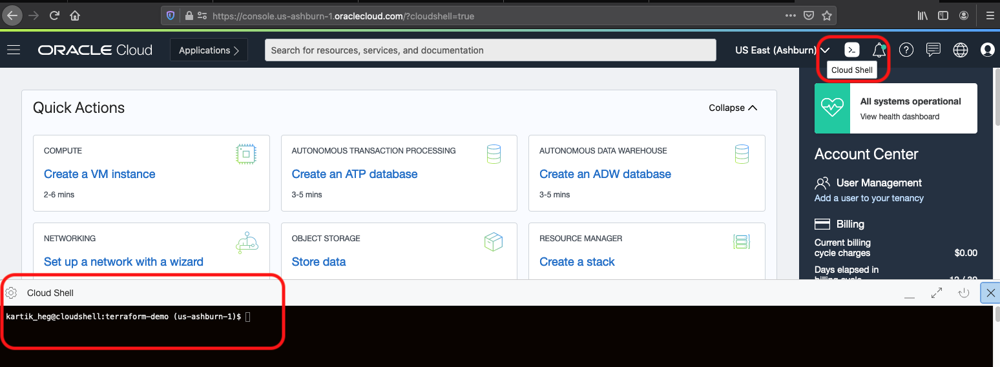
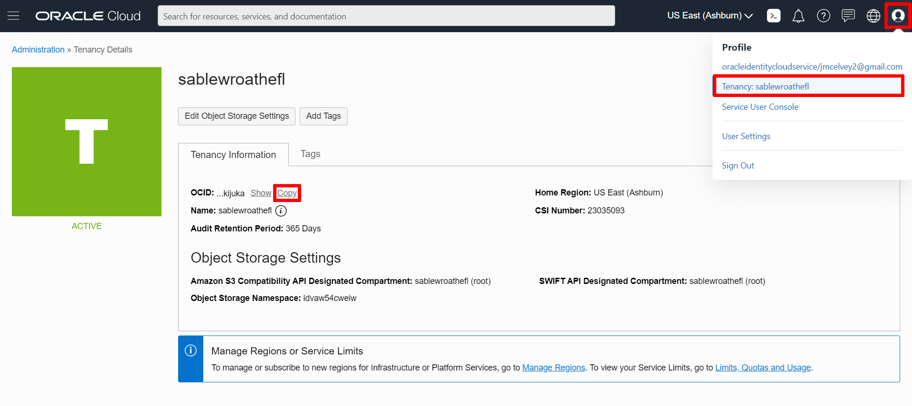
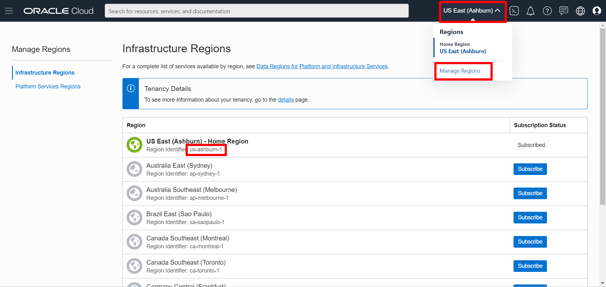
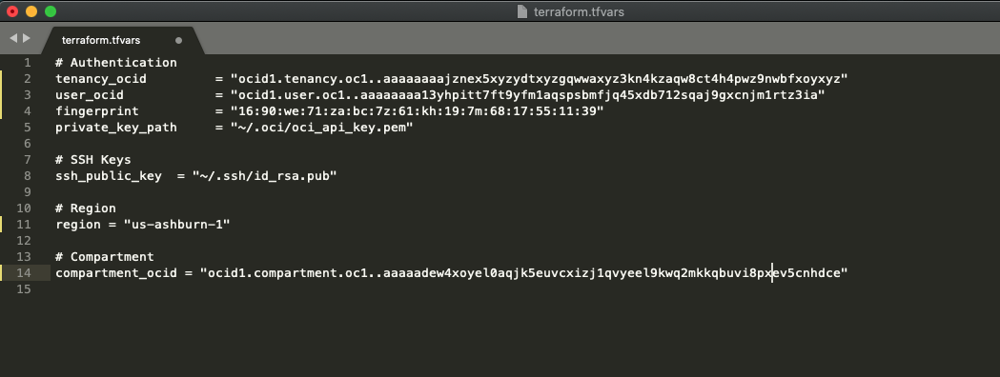
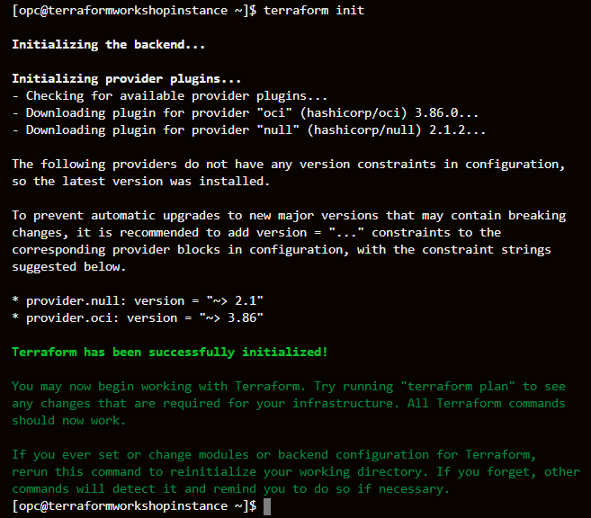
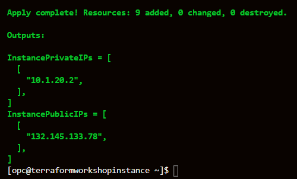
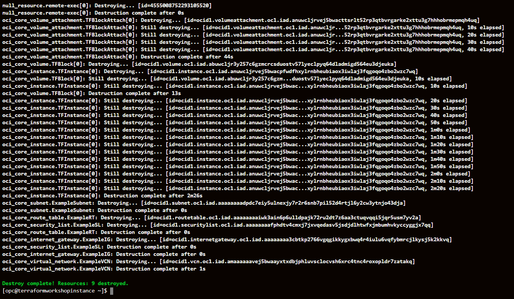

# Deploying Infrastructure Using Terraform

## Introduction
In this lab we will use pre-configured terraform scripts to deploy VCN, Subnet and Compute Instance. We will then delete all these infrastructure resources.

Estimated Time: 30-45 minutes

**Key points:**
- We recommend using Chrome or Edge as the browser.
- You will be asked to record some information during this workshop. It is recommended that you paste the information into a text file when prompted.

### Pre-Requisites

1. [OCI Training](https://cloud.oracle.com/en_US/iaas/training)
2. [Familiarity with OCI console](https://docs.us-phoenix-1.oraclecloud.com/Content/GSG/Concepts/console.htm)
3. [Overview of Networking](https://docs.us-phoenix-1.oraclecloud.com/Content/Network/Concepts/overview.htm)
4. [Familiarity with Compartment](https://docs.us-phoenix-1.oraclecloud.com/Content/GSG/Concepts/concepts.htm)
5. [Cloud Shell](https://docs.cloud.oracle.com/en-us/iaas/Content/API/Concepts/cloudshellintro.htm)

## **Step 1**: Access OCI Cloud Shell

1. From the OCI Console, click on the **cloud shell** icon as shown below. This should launch a cloud shell session for the user.

    

    *NOTE: Ensure the correct Compartment is selected under COMPARTMENT list*

2.  On the Cloud Shell, enter the command below to generate SSH keys to be used for later .

    ```
    ssh-keygen -t rsa
    ```

    *NOTE: Accept the default options when prompted for input after entering the command. Hit **Enter/Return** key to choose default option.*

3.  On the Cloud Shell, enter the command below to make sure **id_rsa** and **id_rsa.pub** keys are generated.

    ```
    cd .ssh
    ```
4.  Enter **ls** and verify your key files that will be used to access compute instance exists.

    ```
    ls
    ```

5. Next you will need to gather some information so that you can use it later while configuring terraform files. First you will need your user OCID. Go to your profile page by clicking the human icon in the top right and then your username. Then click the copy button to copy your user OCID. Record your OCID in a text for later use.

    

6. Next you will need to get your tenancy OCID. Click the human icon in the top right and then your tenancy. Then click the copy button to copy your tenancy OCID. Record your tenancy OCID for later use.

    

7. Next you will need to get your region identifier. Click your region and then click manage regions. Then copy your region identifier and record it.

    

8. Next we will generate API signing key to allow Terraform to authenticate with OCI. Enter the following command.

    ```
    oci setup config
    ```

9. When prompted for a location for your config press enter to choose the default location. When prompted for your user OCID, tenancy OCID, and region ID, enter the information you had saved in earlier steps. When asked if you want to generate a new RSA key pair enter `Y`. For all other prompts press enter to accept the default.

    

10. The `oci setup config` command also generated an API signing key. We will need to upload the public API key into our OCI account for authentication of API calls.

    ```
    cat ~/.oci/oci_api_key_public.pem
    ```

11. Highlight and copy the content from the oracle cloud shell. Click the human icon followed by your user name. Then scroll down and click **API Keys**. In your user details page click **Add Public Key**. In the dialog box paste the public key content and click **Add**. Make sure to copy the key generated after adding the public key.

    

    

## **Step 2**: Terraform configuration

1. Next, download the Terraform sample code. Enter the following command into the cloud shell.

    ```
    curl https://objectstorage.us-ashburn-1.oraclecloud.com/p/XXL2U0n_53VH8Rl9s3M0okgSRgxI41o9lcTkuk-cB5hA7L9tOma0YKKC54Btl0g9/n/ociobenablement/b/hol-labs/o/terraform-demo.zip -o terraform-demo.zip
    ```

    This will download the sample terraform zip file.

2. Next unzip the file:

    ```
    unzip terraform-demo.zip
    ```

3. We will need to modify **terraform.tfvars** file. Enter the following command.

    ```
    cd terraform-demo
    ```

4. Now edit the terraform.tfvars file. We will update these variables :- tenancy_ocid, user_ocid, fingerprint, region, compartment_ocid.

Make sure to have the values ready which was saved in earlier steps.

    ```
    vi terraform.tfvars
    ```

    Next, type **i** to edit and populate the values for the above variables.

    As you see these variables have blank values. Make sure to fill those up.

5. After updating the terraform.tfvars file the content will look like the image below.

    

    To save the file and exit, type **:wq!**.

6. Now initialize terraform with the following command.

    ```
    terraform init
    ```

    Verify successful initialization.

    

7. To see the deployment plan enter the following command.

    ```
    terraform plan
    ```

    This will provide details on what will be configured in OCI.

8. Finally apply the plan to create the infrastructure. Enter the following command.

    ```
    terraform apply
    ```

    *NOTE: You must type yes when prompted.*

    

9. This script will take some time to execute. You can switch to the OCI console and observe the creation of the VCN, Compute instance.

10. Finally, destroy the infrastructure that we created. Enter the following command.

    ```
    terraform destroy
    ```

    *NOTE: You must type yes when prompted.*

    You can switch to the OCI console and observe deletion of VCN, Compute instance.

    

    *Congratulations! You have successfully completed the lab.*

## Acknowledgements

- **Author** - Flavio Pereira, Larry Beausoleil
- **Adapted by** -  Yaisah Granillo, Cloud Solution Engineer
- **Contributors** - Jaden McElvey, Technical Lead - Oracle LiveLabs Intern
- **Last Updated By/Date** - Kamryn Vinson, August 2020

## Need Help?
Please submit feedback or ask for help using our [LiveLabs Support Forum](https://community.oracle.com/tech/developers/categories/resource-manager-terraform). Please click the **Log In** button and login using your Oracle Account. Click the **Ask A Question** button to the left to start a *New Discussion* or *Ask a Question*.  Please include your workshop name and lab name.  You can also include screenshots and attach files.  Engage directly with the author of the workshop.

If you do not have an Oracle Account, click [here](https://profile.oracle.com/myprofile/account/create-account.jspx) to create one.
