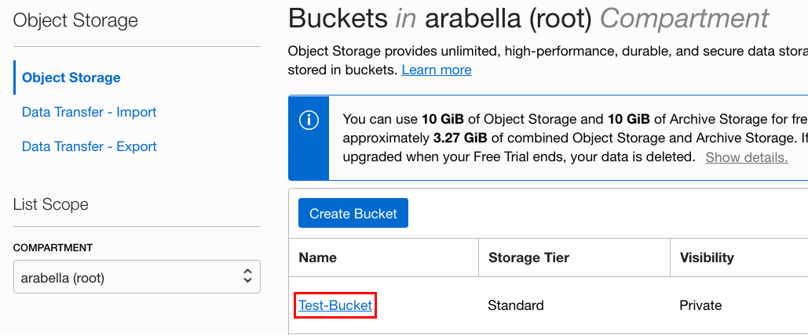
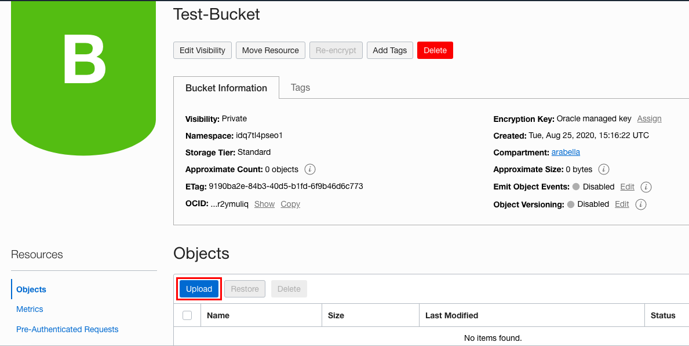
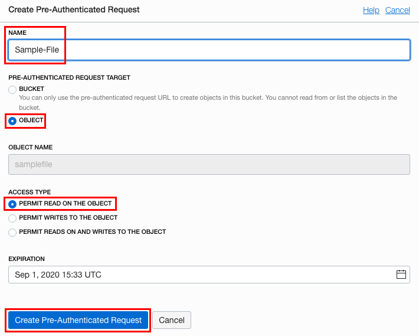

# Create an Object Storage Service

## Introduction

Oracle Cloud Infrastructure Object Storage service is an internet-scale, high-performance storage platform that offers reliable and cost-efficient data durability. The Object Storage service can store an unlimited amount of unstructured data of any content type, including analytic data and rich content, like images and videos.

With Object Storage, you can safely and securely store or retrieve data directly from the internet or from within the cloud platform. Object Storage offers multiple management interfaces that let you easily manage storage at scale.

Object Storage is a regional service and is not tied to any specific compute instance. You can access data from anywhere inside or outside the context of the Oracle Cloud Infrastructure

Estimated Lab Time: 15 minutes

**Object storage offers 2 tiers:**

1- Use Standard for data to which you need fast, immediate, and frequent access. Data accessibility and performance justifies a higher price point to store data in the Object Storage

2- Use Archive for data to which you seldom or rarely access, but that must be retained and preserved for long periods of time. The cost efficiency of the Archive Storage tier offsets the long lead time required to access the data

The purpose of this lab is to give you an overview of the Object Service and an example scenario to help you understand how the service works.

### Prerequisites

- Oracle Cloud Infrastructure account credentials (User, Password, Tenant, and Compartment)  
- We recommend using Chrome or Edge as the browser. Also set your browser zoom to 80%

## **STEP 1**: Sign in to OCI Console and Create Object Storage Bucket

1. Sign in using your tenant name, user name and password.

2. From the OCI Services menu, click **Object Storage**.
  

3. Click **Create Bucket**.
  
  **NOTE:** Ensure the correct Compartment is selected under COMPARTMENT list
  

4. Fill out the dialog box:

    - Bucket Name: Provide a name (Test-Bucket in this lab)
    - Storage Tier: STANDARD

5.  Click **Create Bucket**
  

## **STEP 2**: Upload Object and create pre authenticated link

1. **Windows**: Click the Apps icon in the toolbar and select Git-Bash to open a terminal window.

  

  Change directory to the Downloads folder Enter command:

    ```
    $ <copy>cd /c/Users/PhotonUser/Downloads/**</copy>
    ```

    

2. **Mac / Linux**: Open a terminal window and navigate to your home directory.

  Create a sample file, Enter command:

    ```
    <copy>touch samplefile</copy>
    ```

  This should create a file by the name "samplefile" in the current folder

3. Switch to OCI window and click the Bucket Name.
  

4. Bucket detail window should be visible. Click **Upload**
  

5. Click on *Upload* and then browse to where you created your *samplefile* moments ago.

6. Select the file, then click **Upload** in the Dialog box.

7. File should be visible under Objects. Click Action icon and click **Create Pre-Authenticated Request**. This will create a web link that can be used to access the object without requiring any additional authentication.

  

8. Fill out the dialog box:

    - NAME: Use an easy to remember name.
    - PRE AUTHENTICATION REQUEST TARGET: OBJECT
    - ACCESS TYPE: PERMIT READ ON THE OBJECT
    - EXPIRATION DATE/TIME: Specify link expiration date

9. Click **Create Pre-Authenticated Request**

  

10. Click **Copy** to copy the link

  **NOTE:** The link must be copied and saved once the window is closed the link can not be retrieved again.
  

11. Click **Close**

12. Open a new browser window and paste Pre-Authenticated link.
  

13.  An option to download the file will appear.

  **NOTE:** Do NOT download the file as due to space restrictions it is not allowed for the purpose of this lab.

  ***You have uploaded an object to Object Storage bucket, created a pre-authenticated link and successfully accessed the object. The Pre-Authenticated link can be shared with
  other users to provide them access to the object.
  Multiple objects of any size can be uploaded to the bucket and shared across teams/users.***

## Acknowledgements

- **Author** - Flavio Pereira, Larry Beausoleil
- **Adapted by** -  Tom McGinn, Database Product Management
- **Contributors** - Arabella Yao, Product Manager Intern, DB Product Management
- **Last Updated By/Date** - Kamryn Vinson, August 2020

## See an issue?
Please submit feedback using this [form](https://apexapps.oracle.com/pls/apex/f?p=133:1:::::P1_FEEDBACK:1). Please include the *workshop name*, *lab* and *step* in your request.  If you don't see the workshop name listed, please enter it manually. If you would like us to follow up with you, enter your email in the *Feedback Comments* section.
