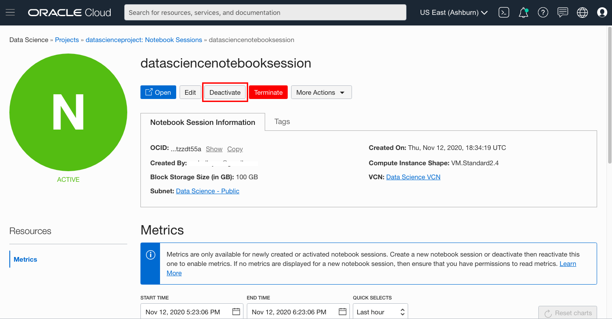
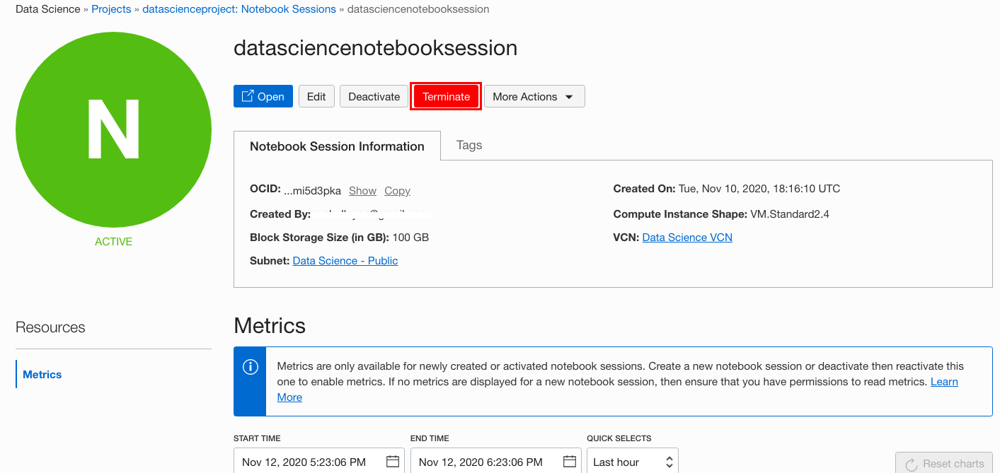

# Shutting Down a Notebook Session
## Introduction

When a notebook session is in an active state there is a boot volume, block storage, and compute attached to it. When the notebook is not being used it is possible to detach the computing resource and thus reduce costs. There are two methods for shutting down a notebook session. If a notebook session is deactivated, then the underlying computing resource is shut down and the boot volume and block storage are detached. However, the block storage, which is mounted at ``/home/datascience``, is persisted for later use. The boot volume is *not* persisted. Deactivated notebooks can be activated again and the block volume is automatically reattached. During activation, you can change the compute shape, increase the size of the block volume, change the VCN, and the subnet.

If the notebook session and its block storage are no longer needed, then the notebook session can be terminated. Terminating a notebook session releases the underlying compute, boot volume and block storage. Since the boot volume and block storage are not persisted, any data on these volumes will be lost. It is not possible to reactivate a terminated notebook session.

*Estimated Lab Time*: 10 minutes

### Objectives
In this lab, you:
* Learn the different methods of shutting down a notebook session.
* Understand the differences between deactivating and terminating a notebook session.
* Become familiar with the steps needed to deactivate and terminate notebook sessions.

### Prerequisites

* (Optional) An active notebook session that can be deactivated or terminated.

## Deactivating Notebook Sessions

Before deactivating a notebook session, save all your work to the attached block volume. Any data or files stored on the compute boot volume or held in memory are deleted when the notebook session is deactivated. The data and files saved on the block volume, which is mounted at ``/home/datascience``, are maintained while the notebook session is inactive. Access to the block volume is restored when the notebook session is activated.

1. [Login to the OCI Console](https://www.oracle.com/cloud/sign-in.html).
1. Open the navigation menu.
1. Under **Data and AI**, click **Data Science**, and then click **Projects**.
    
1. Select the compartment for the project.
1. Click the name of the project to contain the notebook session to open the Projects page.
    
1. Click the name of the notebook session to open the Notebook Session page.
    
1. Click **Deactivate**.
    

1. Click **Deactivate** to confirm the deactivation. The status changes to **Updating** and then **Inactive**.
    

## Terminating Notebook Sessions

To keep the file changes in a notebook session’s boot volume and attached block volume, you must back them up before the notebook session is terminated. For example, copy the files to an object storage bucket, or commit and push changes to a Git repository outside the notebook session. Otherwise, all file changes in the notebook session’s boot volume and attached block volume are deleted.

1. [Login to the OCI Console](https://www.oracle.com/cloud/sign-in.html).
1. Open the navigation menu.
1. Under **Data and AI**, select **Data Science**, and then click **Projects**.
    

1. Select the compartment for the project.
1. Click the name of the project to contain the notebook session and open the Projects page.
    

1. Click the name of the notebook session and open the Notebook Session page.
    

1. Click **Terminate**.
    

1. Click **Terminate** to confirm the termination. The status changes to **Deleting** and then **Deleted**.
    

**Congratulations, you have successfully completed the workshop!**

## Acknowledgements

* **Author**: [John Peach](https://www.linkedin.com/in/jpeach/), Principal Data Scientist
* **Last Updated By/Date**:
    * [Jean-Rene Gauthier](https://www.linkedin.com/in/jr-gauthier/), Sr. Principal Product Data Scientist, January 2021

## Need Help?
Please submit feedback or ask for help using our [LiveLabs Support Forum](https://community.oracle.com/tech/developers/categories/data-science). Please click the **Log In** button and login using your Oracle Account. Click the **Ask A Question** button to the left to start a *New Discussion* or *Ask a Question*.  Please include your workshop name and lab name.  You can also include screenshots and attach files.  Engage directly with the author of the workshop.

If you do not have an Oracle Account, click [here](https://profile.oracle.com/myprofile/account/create-account.jspx) to create one.
