# Run Faceswap

## Introduction

Now that we have prepared our compute instance (see Lab 4), we can go ahead and run Faceswap. In the lab, you will learn to copy your training data to the compute instance, extract the faces from the training data, train the GAN with the extracted faces and to convert your video with the swapped face.

Estimated workshop time: 60 minutes (exluding model training)

### Objectives

- Copy your training data (photos or videos with the faces you want to swap) to the compute instance
- [Extract](https://forum.faceswap.dev/viewtopic.php?f=25&t=27) the faces from the photos or videos
- [Train](https://forum.faceswap.dev/viewtopic.php?f=27&t=146) the GAN with the extracted faces
- [Convert](https://forum.faceswap.dev/viewtopic.php?f=24&t=1083) and swap face A in your source video with face B

### What Do You Need?

- Complete Lab 1 to Lab 4

## **Step 1:** Connect to the VNC Desktop

1.  Create a SSH tunnel to the VNC server using the following command (where private-key is your private OpenSSH key and public_ip the private IP address from your Ubuntu compute instance):

```
<copy>ssh -i private-key ubuntu@public_ip -C -L 5901:127.0.0.1:5901</copy>
```

2. Connect to **127.0.0.1:5901** using your VNC client.
   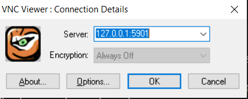

3. When prompted for password, enter the password created during the VNC server configuration.
   

Your remote Ubuntu desktop will open up.
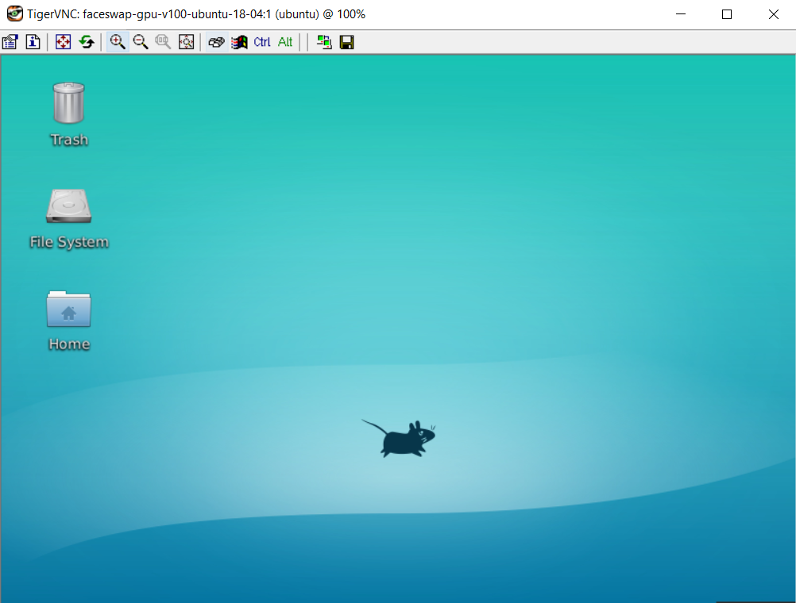

## **Step 2:** Open Faceswap on the VNC Desktop

1.  Open a terminal by right-clicking on the desktop and selecting **Open Terminal here**.
    

    The terminal will open up on your VNC desktop.

    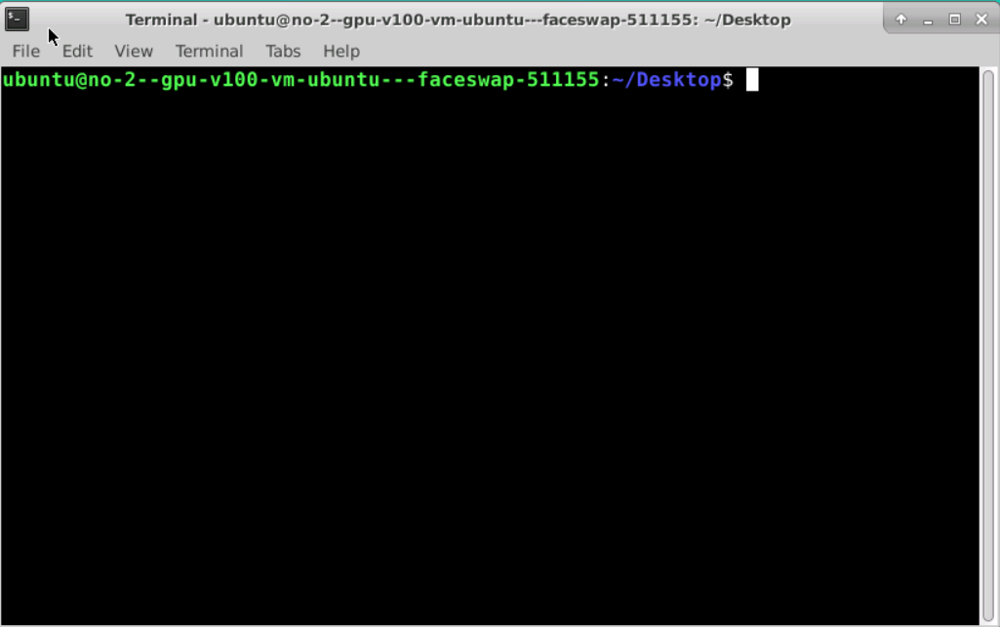

If it is not possible to open a terminal, run the following commands in the terminal on your local machine.

```
<copy>sudo apt remove gnome-terminal</copy>
```

```
<copy>sudo apt install gnome-terminal</copy>
```

2. Navigate to your faceswap folder.

```
<copy>cd cd ../faceswap/</copy>
```

Launch the Faceswap GUI by executing the following command:

```
<copy>bash faceswap_gui_launcher.sh</copy>
```

The Faceswap GUI opens up.

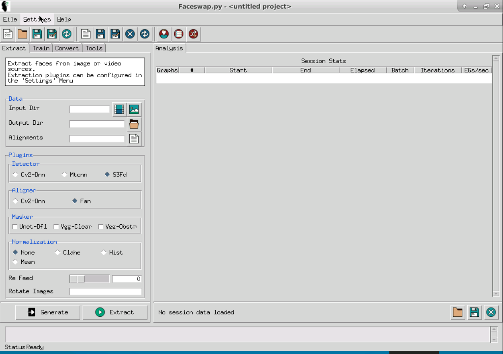

## **Step 3:** Copy your training data to the compute instance

To train the Faceswap GAN, you need to provide pictures or a video of person A and person B from who you want to swap faces. In this example, we will copy two videos from person A and person B from our local machine to the remote Ubuntu instance using WinSCP.

1. Download and install [WinSCP](https://winscp.net/eng/download.php) on your local machine.

2. Open WinSCP on your local machine and open the folder with the videos on the left side.F
   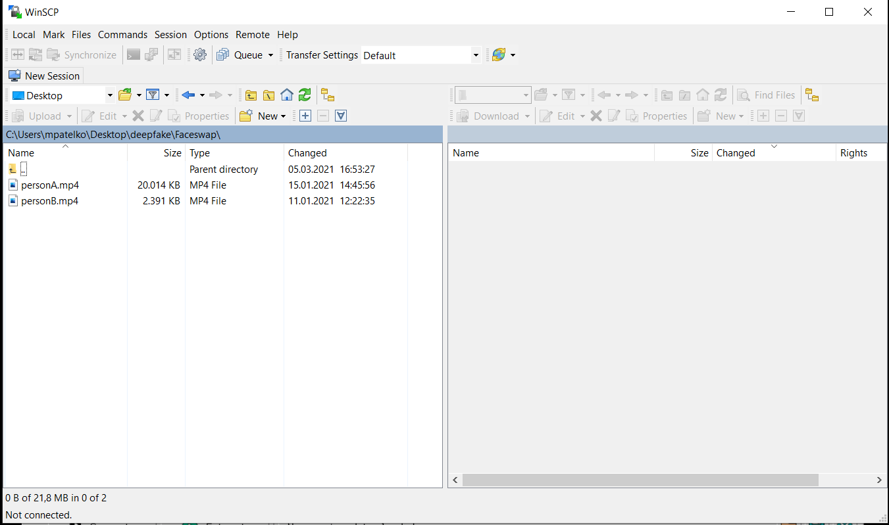

3. Click on **New Site**. A new window will pop up.
   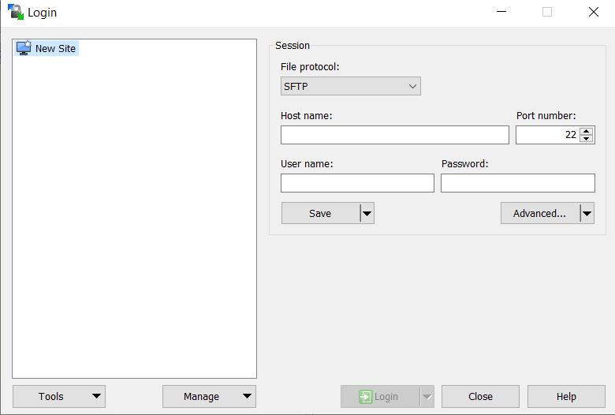

4. Fill in the the _IP address_ of your instance in **hostname** field and _Ubuntu_ in the **user name** field as shown below.
   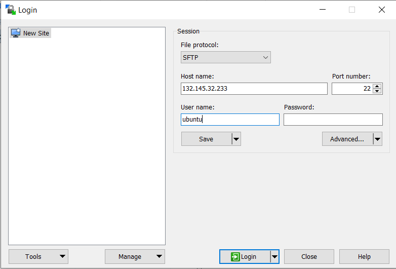
5. Click on the **Advanced...** button.
6. Click on **Authentication** under **SSH** on the left part of the window.
7. Click on the three dots and select your SSH private key file in your folder as shown below.
   
8. Click **OK**
9. Click **Login**
10. A warning screen pops up. Click **Yes**.
    
11. You can see your local files folder on the left and your remote files folder on the right part of the WinSCP tool.
    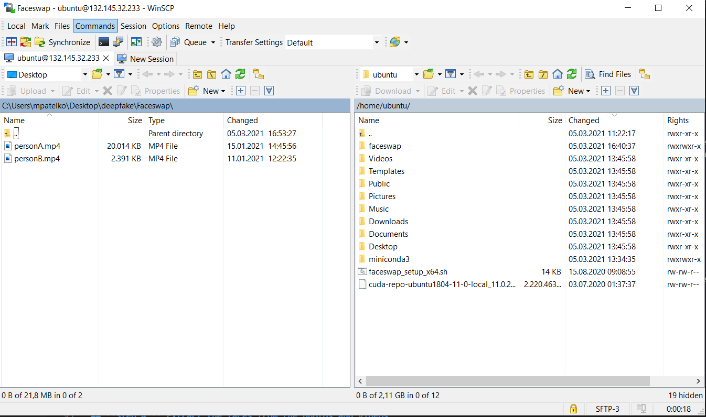
12. Create the folder **src** in your remote folder by right clicking in the field on the right side, selecting **New -> Directory** and typing the name of your folder **src**.
13. Select your two videos on the left side (local machine) and drag them to the **src** folder on the right side (remote machine).

## **Step 4:** Extract the faces from the photos and videos

The first step, is to extract the faces from video A and video B.

1. In the Faceswap GUI, select the **Extract** tab.

2. In the **Data** field, you see **Input Dir** where you can either select the directory where your input video or input images are located. We will select an input video by clicking on the video button (first one, left) and selecting the input video from person A from our **src** folder, we just created and populated in step 3.

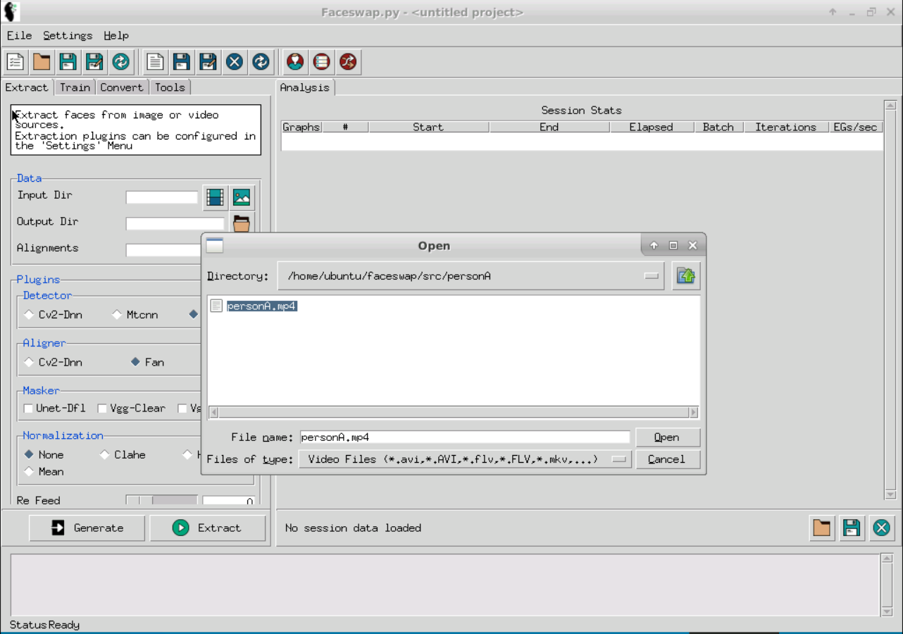

**Note:** If you extract faces from input images, make sure you have between 1000 and 10.000 images.

3. Click on the folder button next to **Output Dir**. Choose the folder, where the extracted face images of the source video will be saved. You can call the directory e.g. _faceswap/faces/personA_ and click on **OK**.

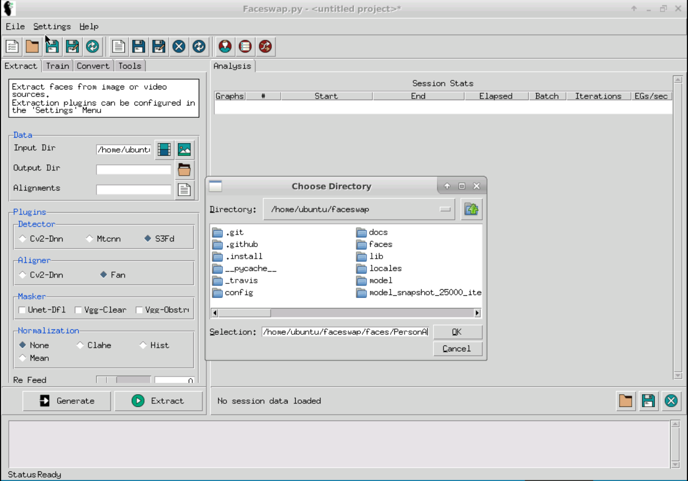

4. Optional: If you want to read more about the extraction plugins and make use of them, please visit the [Faceswap Extraction Guide](https://forum.faceswap.dev/viewtopic.php?t=27). In this example, we will stick with the default plugins.

5. Click on the **Extract**.
   You will see the extracted faces from the video in the **Preview** tab on the right.
   In the bottom field, you see the state of the Python extraction script, e.g. the initialized plugins, found images, detected faces and in case there are errors.

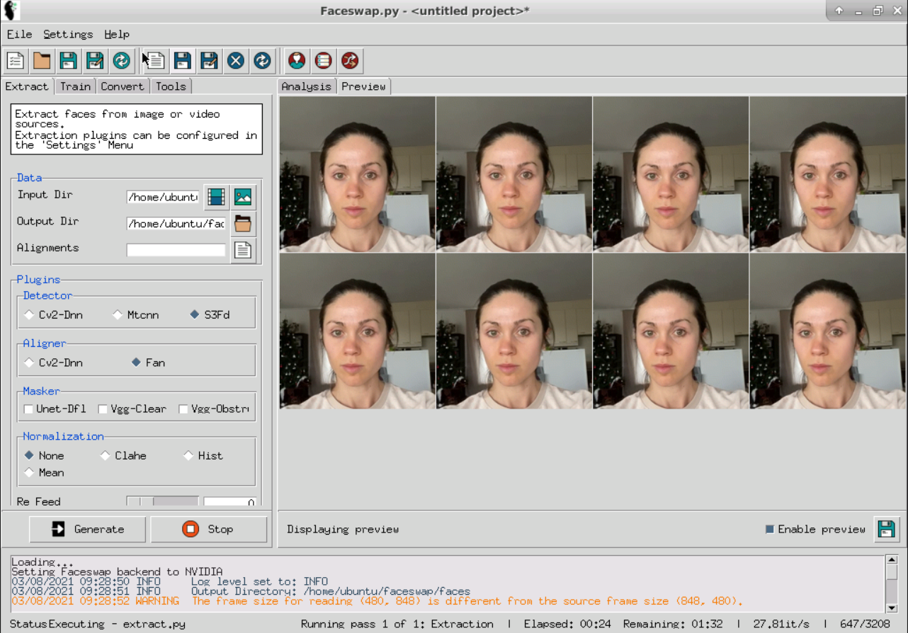

6. Repeat 1.-5. from **step 4** for the face extraction of person B.

7. Optional: In case you do not want to make use of the GUI, you can execute the face extraction in the terminal with the following command (only adjust the input & output directories and plugins, in case you wish to make use of other plugins):

```
   <copy>/home/ubuntu/miniconda3/envs/faceswap/bin/python /home/ubuntu/faceswap/faceswap.py extract -i /home/ubuntu/faceswap/src/personA/personA.mp4 -o /home/ubuntu/faceswap/faces/personA -D s3fd -A fan -nm none -rf 0 -min 0 -l 0.4 -sz 512 -een 1 -si 0 -L INFO</copy>
```

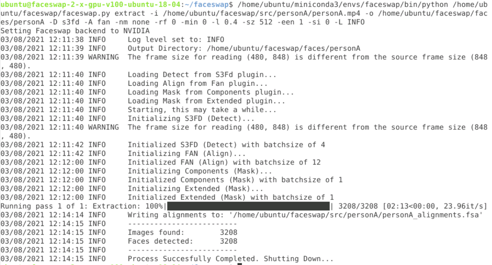

## **Step 5:** Train the GAN

Now that we have extracted the faces for person A and person B from the videos, we can train the Faceswap GAN.

1. In the Faceswap GUI, select the **Train** tab.

2. In the **Faces** field, you see **Input A** where you select the directory of the extracted faces of person A (in our case _faceswap/faces/personA_).

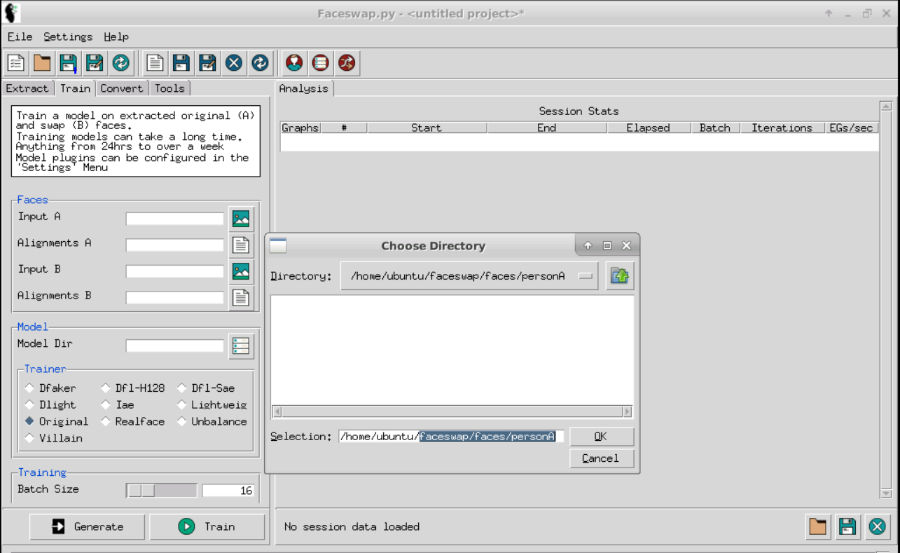

3. Below, you see the row **Alignments A**. The alignments file holds information about all the faces it finds in each frame, specifically where the face is, and where the point landmarks are (e.g. eyes, nose, lips). It is created during the extraction phase and is stored in the source folder of the video of person A. Click on the file button and select the alignments file for person A in the **src** folder as shown below.

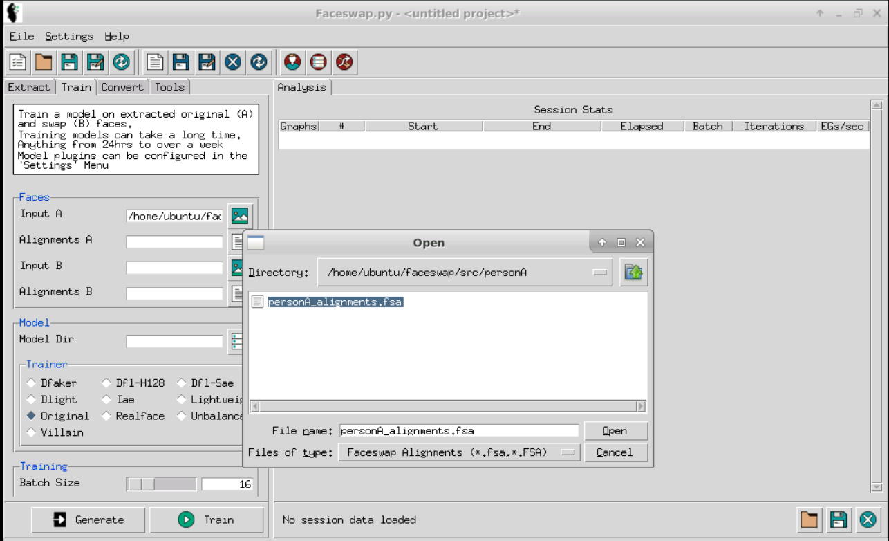

4. Repeat points 1. and 2. for person B.

5. In the **Model** field, click on folder button next to **Model Dir**. Choose the folder, where the training model will be saved. You can call the directory e.g. _faceswap/model_ and click on **OK**.

6. Optional: If you want to read more about the Trainer, or "Data Augmentation" options and make use of them, please visit the [Faceswap Training Guide](https://forum.faceswap.dev/viewtopic.php?f=27&t=146). In this example, we will stick with the default plugins.

7. Click on the **Train** button to start the training.

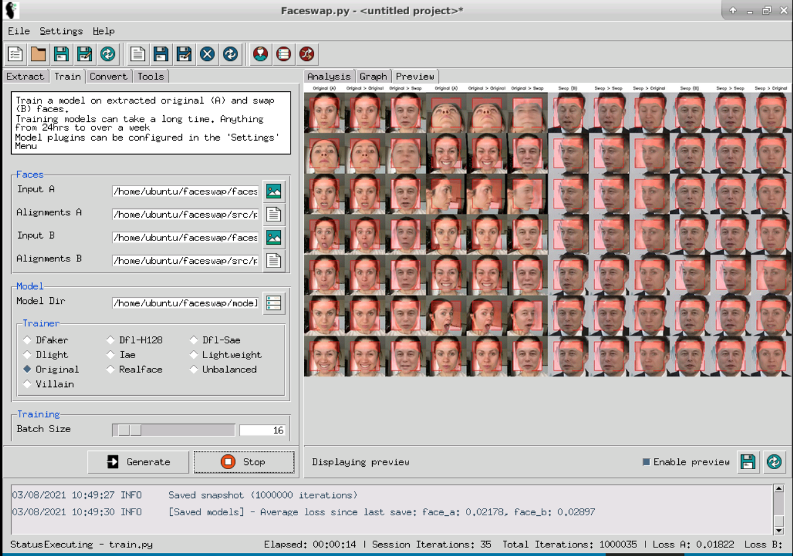

In the **Preview** tab on the right, you will see the swapped faces in the video frames from person A and person B.

The **Graph** tab contains a graph that shows loss over time. It updates every time the model saves, but can be refreshed by hitting the "Refresh" button. For every batch of faces fed into the model, the GAN will look at the face it has attempted to recreate and compare it to the actual face that was fed in. Based on how well it thinks it has done, it will give itself a score (the loss value).

8. Optional: In case you do not want to make use of the GUI, you can execute the model training in the terminal with the following command (only adjust the input directories, alignments files, model directory and trainer option in case you wish to make use of another trainer option):

```
   <copy>/home/ubuntu/miniconda3/envs/faceswap/bin/python /home/ubuntu/faceswap/faceswap.py train -A /home/ubuntu/faceswap/faces/personA -ala /home/ubuntu/faceswap/src/personA/personA_alignments.fsa -B /home/ubuntu/faceswap/faces/personB -alb /home/ubuntu/faceswap/src/personB/personB_alignments.fsa -m /home/ubuntu/faceswap/model -t original -bs 16 -it 1000000 -s 250 -ss 25000 -ps 100 -L INFO</copy>
```

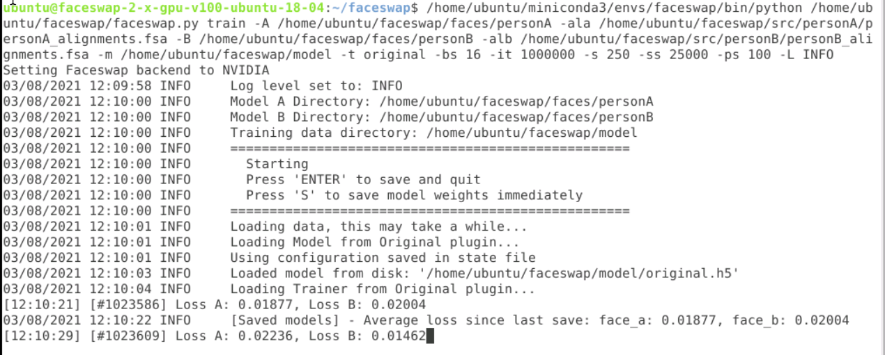

The best way to know if a model has finished training is to watch the previews. Ultimately these show what the actual swap will look like. You can also check the loss values. The closer the loss values are to zero, the higher the probability of a finished training.

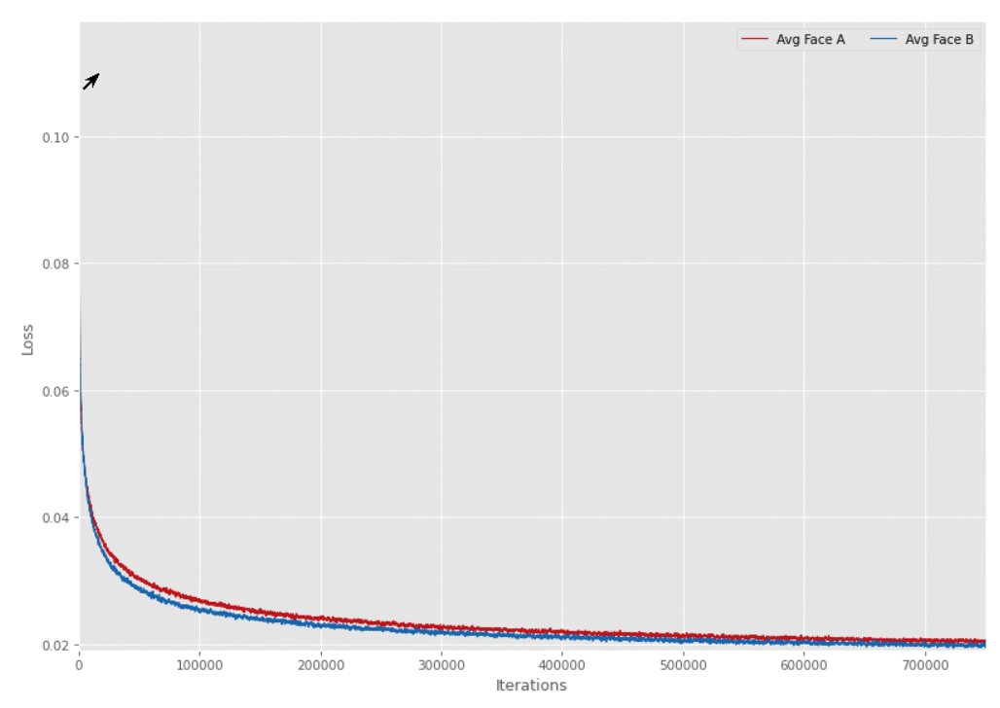

In the **Analysis** tab, you can check the value _EGs/sec_ in the last column which will give you the number of faces processed through the model per second. The more powerful your (GPU) cores are, the higher the _EGs/sec_ will be and the faster the model will converge.

9. Check the GPU usage during training with the nvidia-smi command.
   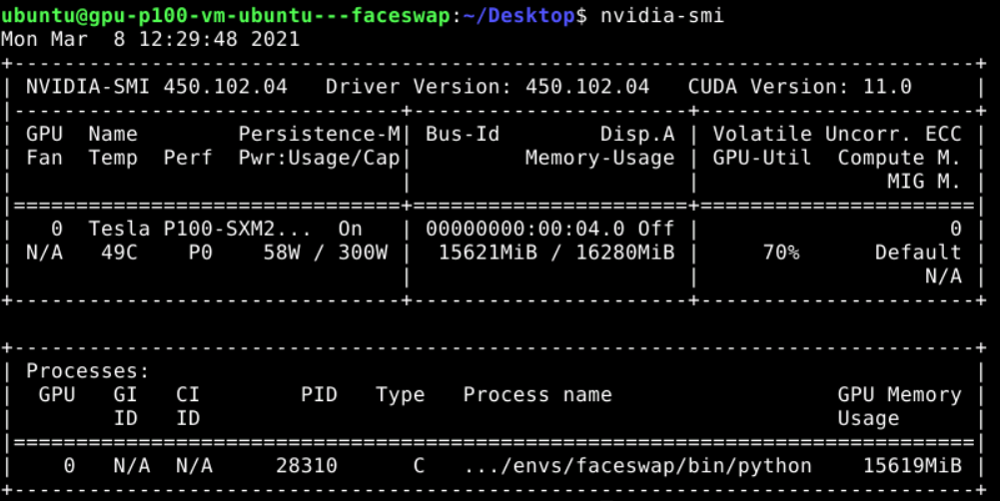

   It will show you the volatile GPU utilization.

10. Optional: It is possible to boost the application performance by increasing GPU core and memory clock rates. Please visit the Nvidia blog post about [Nvidia GPU boost](https://developer.nvidia.com/blog/increase-performance-gpu-boost-k80-autoboost/) for more information.

## **Step 6:** Convert your video with the swapped face

If your training is finished, you can convert your video and swap face A in your source video with face B.

1. In the Faceswap GUI, select the **Convert** tab.

2. In the **Data** field, you see the **Input Dir** where you select the directory where your input video is located with the person from who you want to swap the face. In our case, the input video is stored under _/faceswap/src/personA_

3. Click on the folder button next to **Output Dir**. Choose the folder, where the output video will be saved. You can call the directory e.g. _/faceswap/outputvideo_ and click on **OK**.

4. Click on the file button next to **Alignments** and choose the alignments file from the person from who you want to swap the face (in our case, that is person A). If the alignments file is in the same directory as the **Input Dir**, you can leave it blank.

5. Optional: The **Reference Video** is only required if you are converting from images to video. In our case, we will leave it blank.

6. In the **Model** field, click on folder button next to **Model Dir**. Choose the folder, where the training model is saved. In our case, that is the directory _faceswap/model_. Click on **OK**.

7. Click **Convert**.

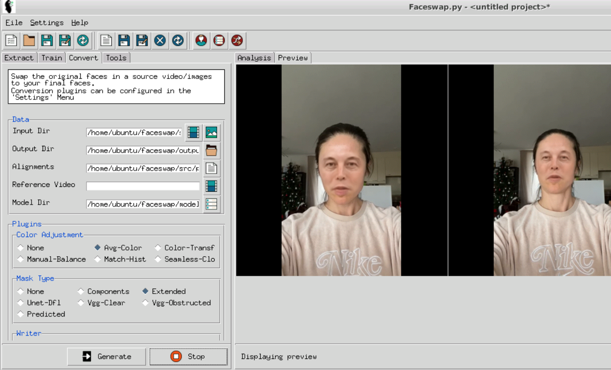

8. Optional: In case you do not want to make use of the GUI, you can do the conversion in the terminal with the following command (only adjust the input & output directories, alignments file, model directory and plugins, in case you wish to make use of other plugins):

```
   <copy>/home/ubuntu/miniconda3/envs/faceswap/bin/python /home/ubuntu/faceswap/faceswap.py convert -i /home/ubuntu/faceswap/src/personA/personA.mp4 -o /home/ubuntu/faceswap/outputvideo -al /home/ubuntu/faceswap/src/personA/personA_alignments.fsa -m /home/ubuntu/faceswap/model -c avg-color -M extended -w opencv -osc 100 -l 0.4 -j 0 -L INFO</copy>
```

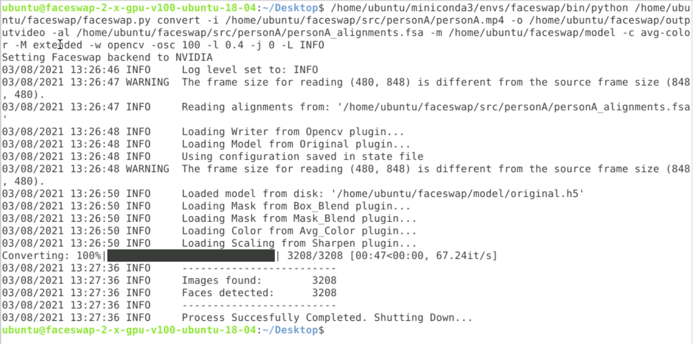

9. In the directory _/faceswap/outputvideo_ you will find the frames of the input video of person A with the swapped face of person B.
   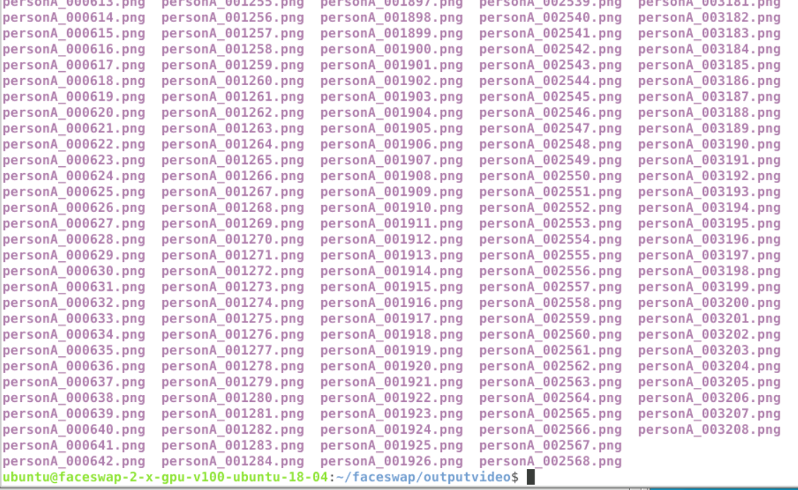

   We will use the ffmpeg to construct a video from the single frames.

   Let's install ffmpeg first.

   ```
   <copy>sudo apt install ffmpeg</copy>
   ```

   Now we can construct a video with ffmpeg to combine the single frames into a video where we will loop through all the personA frames contained om the _outputvideo_ directory where _%nd_ stands for a a sequential n-digit number. In our case n=6.

   ```
   <copy>ffmpeg -i personA_%6d.png -c:v libx264 -vf "fps=25,format=yuv420p" output.mp4</copy>
   ```

10. Watch the [output video](https://www.youtube.com/watch?v=b-uKJ89QSnE)

## **Acknowledgements**

- **Created By/Date** - Maria Patelkou, HPC Solution Architect, Oracle Proposal to Production programme, March 2021
- **Last Updated By/Date** - Maria Patelkou, HPC Solution Architect, Oracle Proposal to Production programme, March 2021

## Need Help?

Please submit feedback or ask for help using our [LiveLabs Support Forum](https://community.oracle.com/tech/developers/categories/livelabsdiscussions). Please click the **Log In** button and login using your Oracle Account. Click the **Ask A Question** button to the left to start a _New Discussion_ or _Ask a Question_. Please include your workshop name and lab name. You can also include screenshots and attach files. Engage directly with the author of the workshop.

If you do not have an Oracle Account, click [here](https://profile.oracle.com/myprofile/account/create-account.jspx) to create one.
