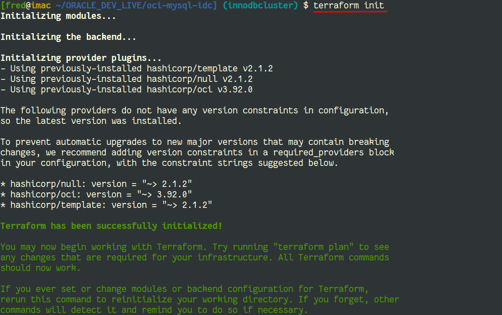
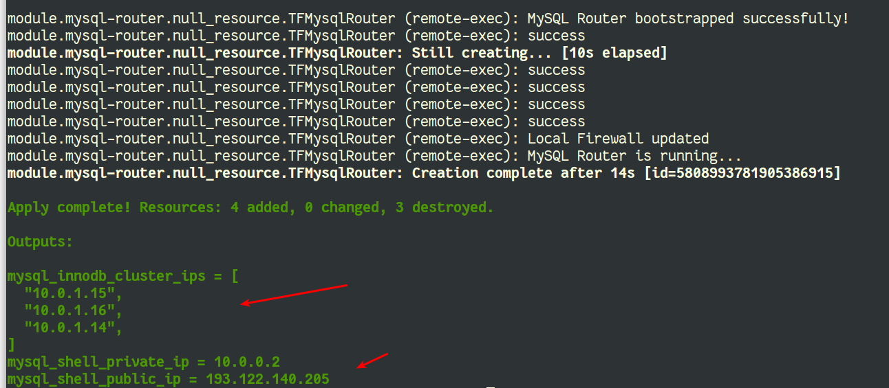

# Terraform - Deployment

## Introduction

In this lab, you will deploy your infrastructure code to Oracle Cloud.

Estimated Lab Time: 5 minutes

## **STEP 1**: Environment Initialization 

The `terraform init` command is used to initialize a working directory containing Terraform configuration files. 
This is the first command that should be run after writing a new Terraform configuration or cloning an existing one from version control. 

💡 It is safe to run this command multiple times.


```
$ terraform init
```



⚠️ verify that you are in the correct directory (the one cloned from GitHub where you created the `terraform.tfvars` file.

## **STEP 2**: Execution Plan

The `terraform plan` command is used to create an execution plan. Terraform will determine what actions are necessary to achieve the desired 
state specified in the configuration files. In our case, a VCN, gateways, compute instances, firewall rules, ... all should be planned:

```
$ terraform plan
```


💡 You can see how many operations are required: new resources, changed resources and resource to destroy.

## **STEP 3**: Deployment

It's finally time to deploy our code to Oracle Cloud Infrastructure. We use `terraform apply`, this is the command used to apply the changes required to reach 
the desired state of the configuration (see `terraform plan`).

```
$ terraform apply
``` 



💡 While the deployment is happening, you can verify in OCI Dashboard, the creation of the compute instances:


## Acknowledgements

- **Author** - [Frédéric Descamps](https://lefred.be)
- **Last Updated By/Date** - Frédéric Descamps, September 2020

## See an issue?
Please submit feedback using this [form](https://apexapps.oracle.com/pls/apex/f?p=133:1:::::P1_FEEDBACK:1). Please include the *workshop name*, *lab* and *step* in your request.  If you don't see the workshop name listed, please enter it manually. If you would like us to follow up with you, enter your email in the *Feedback Comments* section. 