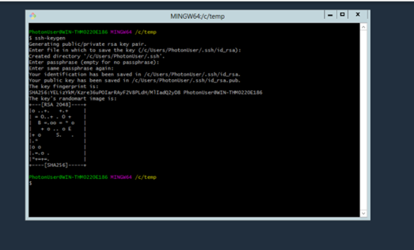
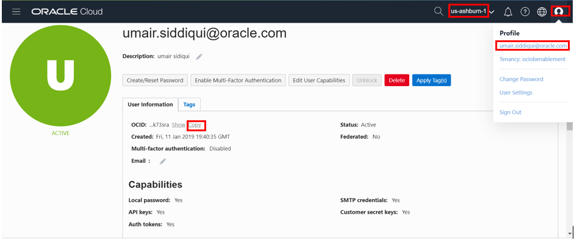
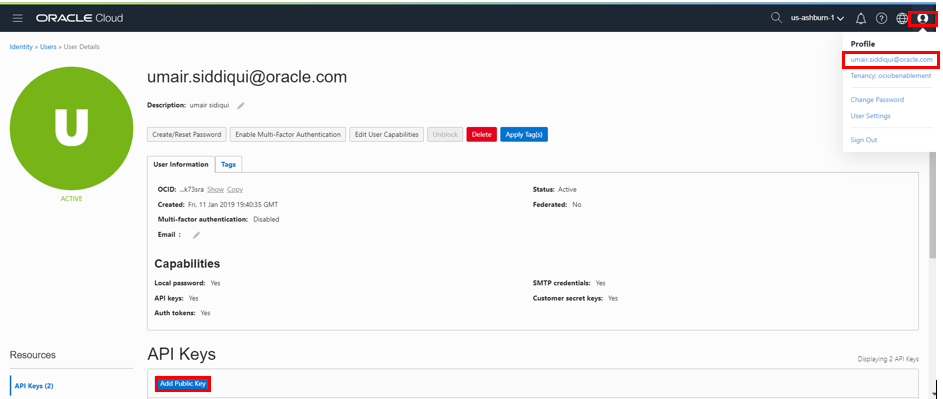

#  Using Service Gateway 

## Introduction

If you're a typical Oracle Cloud Infrastructure customer, you may have resources in your virtual cloud network (VCN) that need to access the Oracle Cloud Infrastructure Object Storage service, which has publicly addressable endpoints. Until now, you could use either public subnets or a NAT instance, with an internet gateway in your VCN to access the service. However, you might not have wanted to use these options because of privacy, security, or operational concerns.

Service Gateway alleviates the preceding concerns by enabling the following functions:

- Private connectivity between your VCNs and Object Storage: You can add a service gateway to a VCN and use the VCN's private address space to access Object Storage without exposing the instances to the public internet. You don't need a public subnet, NAT instance, or internet gateway in your VCN. 

- Enhanced security for your Object Storage buckets: You can limit access to Object Storage buckets from an authorized VCN or from a specific range of IP addresses within the subnet. You can add  conditional references to VCN and IP addresses in IAM policies, which can only be satisfied when you initiate connections through a service gateway 


**Some Key points:**

*We recommend using Chrome or Edge as the broswer. Also set your browser zoom to 80%*

- All screen shots are examples ONLY. Screen shots can be enlarged by Clicking on them

- Login credentials are provided later in the guide (scroll down). Every User MUST keep these credentials handy.

- Do NOT use compartment name and other data from screen shots.Only use  data(including compartment name) provided in the content section of the lab

- Mac OS Users should use ctrl+C / ctrl+V to copy and paste inside the OCI Console

- Login credentials are provided later in the guide (scroll down). Every User MUST keep these credentials handy.

    **Cloud Tenant Name**

    **User Name**

    **Password**

    **Compartment Name (Provided Later)**

    **Note:** OCI UI is being updated thus some screenshots in the instructions might be different than actual UI.

### Pre-Requisites

1. Oracle Cloud Infrastructure account credentials (User, Password, Tenant, and Compartment).
   
2. [OCI Training](https://cloud.oracle.com/en_US/iaas/training)

3. [Familiarity with OCI console](https://docs.us-phoenix-1.oraclecloud.com/Content/GSG/Concepts/console.htm)

4. [Overview of Networking](https://docs.us-phoenix-1.oraclecloud.com/Content/Network/Concepts/overview.htm)

5. [Familiarity with Compartment](https://docs.us-phoenix-1.oraclecloud.com/Content/GSG/Concepts/concepts.htm)

6. [Connecting to a compute instance](https://docs.us-phoenix-1.oraclecloud.com/Content/Compute/Tasks/accessinginstance.htm)

## Step 1: Sign in to OCI Console create Object Storage Bucket and VCN

* **Tenant Name:** {{Cloud Tenant}}
* **User Name:** {{User Name}}
* **Password:** {{Password}}
* **Compartment:**{{Compartment}}

1. Sign in using your tenant name, user name and password. Use the login option under **Oracle Cloud Infrastructure**.

    

2. From the OCI Services menu, Click **Object Storage**.

    

3. Ensure correct Compartment (Left side of the OCI console).

4. Click **Create Bucket**, Fill out the dialog box:

      - Bucket Name: Provide a name
      - Storage Tier: STANDARD 
      - Encryption: ENCRYPT USING ORACLE-MANAGED KEYS

5.  Click **Create Bucket**.

6. Click the Apps icon in the toolbar and select Git-Bash to open a terminal window.

    

7. Change directory to the Downloads folder Enter command:

    ```
    <copy>
    $ cd /c/Users/PhotonUser/Downloads/
    </copy>
    ```

    

8. Create a sample file, Enter command:

    ```
    <copy>
    touch samplefile
    </copy>
    ```
    This should create a file by the name "samplefile" in the Downloads folder.

9. Switch to OCI window and Click the Bucket Name.

    **HINT:** You can swap between OCI window and any other application(git-bash etc) by Clicking switch window.

    

10. Bucket detail window should be visible. Click **Upload Object**.

    

11. Click on **Upload Object**. Fill out the dialog box:


    - OBJECT NAME PREFIX: Provide a Prefix (Optional)
    - CHOOSE FILES FROM YOUR COMPUTER: Click **Select File** and then browse to the location where 'Sample File' was created

12. Select the file, then Click **Upload Object** in the Dialog box.

13. File should be visible under Objects.

14. From the OCI Services menu,Click **Virtual Cloud Networks** under Networking. Select the compartment assigned to you from drop down menu on left part of the screen under Networking and Click **Start VCN Wizard**.

    **NOTE:** Ensure the correct Compartment is selected under COMPARTMENT list.

15. Click **VCN with Internet Connectivity** and click **Start Workflow**.

16. Fill out the dialog box:

    - **VCN NAME**: Provide a name
    - **COMPARTMENT**: Ensure your compartment is selected
    - **VCN CIDR BLOCK**: Provide a CIDR block (10.0.0.0/16)
    - **PUBLIC SUBNET CIDR BLOCK**: Provide a CIDR block (10.0.1.0/24)
    - **PRIVATE SUBNET CIDR BLOCK**: Provide a CIDR block (10.0.2.0/24)
    - Click **Next**

17. Verify all the information and  Click **Create**.

18. This will create a VCN with followig components.

    *VCN, Public subnet, Private subnet, Internet gateway (IG), NAT gateway (NAT), Service gateway (SG)*

19. Click **View Virtual Cloud Network** to display your VCN details.
             
20. Click **Create Subnet**. Fill out the dialog box:

    - **Name**: Enter a name
    - **Subnet Type**: Regional
    - **CIDR Block**: Enter 10.0.5.0/24 
    - **Route Table**: Select the Default Route Table

    **NOTE:** For Prodcution deployment we strongly recommend Creating a seperate route table.        


    - **Subnet access**: select Private Subnet.
    - **DHCP Options**: Select the default.
    - **Security Lists**: Select the Default Security List 

    **NOTE:** For Prodcution deployment we strongly recommendCreating a seperate security list.

20. Leave all other options as default, Click **Create Subnet**.

    

## Step 2: Create ssh keys, Create two Compute instances with OCI CLI pre installed

1. Click the Apps icon in the toolbar and select  Git-Bash to open a terminal window.

    

2. Enter command 
    ```
    <copy>
    ssh-keygen
    </copy>
    ```
    **HINT:** You can swap between OCI window, 
    git-bash sessions and any other application (Notepad, etc.) by Clicking the Switch Window icon 

    

3. Press Enter When asked for 'Enter File in which to save the key', 'Created Directory, 'Enter passphrase', and 'Enter Passphrase again.

    

4. You should now have the Public and Private keys:

    /C/Users/ PhotonUser/.ssh/id_rsa (Private Key)

    /C/Users/PhotonUser/.ssh/id_rsa.pub (Public Key)

    **NOTE:** id\_rsa.pub will be used to create 
    Compute instance and id\_rsa to connect via SSH into compute instance.

    **HINT:** Enter command 
    ```
    <copy>
    cd /C/Users/PhotonUser/.ssh (No Spaces) 
    </copy>
    ```
    and then 
    ```
    <copy>
    ls 
    </copy>
    ```
    to verify the two files exist. 

5. In git-bash Enter command  

    ```
    <copy>
    cat /C/Users/PhotonUser/.ssh/id_rsa.pub
    </copy>
    ```

    , highlight the key and copy 

    

6. Click the apps icon, launch notepad and paste the key in Notepad (as backup)

    

7. Switch to the OCI console. From OCI services menu, Click **Instances** under **Compute**.

8. Click **Create Instance**. Fill out the dialog box:

      - **Name your instance**: Enter a name 
      - **Choose an operating system or image source**: Click **Change Image Source**. In the new window, Click **Oracle Images** Choose **Oracle Cloud Developer Image**. Scroll down, Accept the Agreement and Click **Select Image**

          

      - **Availability Domain**: Select availability domain
      - **Instance Type**: Select Virtual Machine 
      - **Instance Shape**: Select VM shape 

      **Under Configure Networking**
      - **Virtual cloud network compartment**: Select your compartment
      - **Virtual cloud network**: Choose the VCN 
      - **Subnet Compartment:** Choose your compartment. 
      - **Subnet:** Choose the Public Subnet under **Public Subnets** 
      - **Use network security groups to control traffic** : Leave un-checked
      - **Assign a public IP address**: Check this option

          

      - **Boot Volume:** Leave the default
      - **Add SSH Keys:** Choose 'Paste SSH Keys' and paste the Public Key saved earlier.

9. Click **Create**.

    

10. Note down the Public IP address of compute instance.

11.  Create a second compute instance following steps previsouly outlined. Click **Instances** under Compute.

12. Click **Create Instance**. Fill out the dialog box:

    - **Name:** Enter a name 
    - **Image Operating System:** Click **Change Image Source**. In the new window, Click **Oracle Images** Choose **Oracle Cloud Developer Image**. Scroll down, Accept the Agreement and Click **Select Image**

        

    - **Availability Domain**: Select availability domain
    - **Instance Type**: Select Virtual Machine 
    - **Instance Shape**: Select VM shape 

    **Under Configure Networking**
    - **Virtual cloud network compartment**: Select your compartment
    - **Virtual cloud network**: Choose the VCN 
    - **Subnet Compartment:** Choose your compartment. 
    - **Subnet:** Choose the Private Subnet under **Private Subnets** 
    - **Use network security groups to control traffic** : Leave un-checked
    - **Boot Volume:** Leave the default
    - **Add SSH Keys:** Choose 'Paste SSH Keys' and paste the Public Key saved earlier.

13. Click **Create**.

    **NOTE:** If 'Service limit' error is displayed choose a different shape such as VM.Standard.E2.2 OR VM.Standard2.2

14. Once the instance is in Running state, Click **Instance name** and note down its **Private IP address**

    

15. In Order to ssh into private instance we will use the ssh proxy command. This command allows us to “tunnel” through the bastion host to our private instance. Storing private SSH keys on a public server such as a Bastion host(First Compute instance) is not recommended.

16. Ensure you have both the Public IP of first compute and Private IP of second compute. In git-bash window ensure you are in **/C/Users/PhotonUser/.ssh** directory. Enter Command:

    ```
    <copy>
    bash 
    ssh -t -o ProxyCommand='ssh -i <SSH_Private_Key_Name> opc@<FIRST_COMPUTE_PUBLIC_IP> -W %h:%p %r' -i <SSH_Private_Key_Name> opc@<SECOND_COMPUTE_PRIVATE_IP>
    </copy>
    ```

    

17. Enter Yes at Security Prompt.

18. Check oci CLI installed version, Enter command:
    ```
    <copy>
    oci -v
    </copy>
    ```
    **NOTE:** Version shoudl be minimum 2.4.2X

    

19. Next we will configure OCI CLI. Enter command: 
    ```
    <copy>
    oci setup config
    </copy>
    ```

20. Accept the default directory location. For user OCI switch to OCI Console window. Click Human Icon and then your user name. In the user details page Click **copy** to copy the OCID. **Also note down your region name as shown in OCI Console window**. Paste the OCID in ssh session.

    

21. Repeat the step to find tenancy OCID (Human icon followed by Clicking Tenancy Name). Paste the Tenancy OCID in ssh session to compute instance followe by providing your region name (us-ashburn-1, us-phoneix-1 etc).

22. When asked for **Do you want to generate a new RSA key pair?** answer Y. For the rest of the question accept default by pressing Enter.

    

## Step 3: Upload API keys, and verify functionality

1. **oci setup config** also generated an API key. We will need to upload this API key into our OCI account for authentication of API calls. Switch to ssh session to compute instance, to display the conent of API key Enter command :

    ```
    <copy>
    cat ~/.oci/oci_api_key_public.pem
    </copy>
    ```

2. Hightligh and copy the content from ssh session. Switch to OCI Console, Click Human icon followe by your user name. In user details page Click **Add Public Key**. In the dialg box paste the public key content and Click **Add**.

    

    

3. A new finger print will be generated. Switch to git-bash window and enter command
    ```
    <copy>
    cat /home/opc/.oci/config
    </copy>
    ```
    Compare the finger print in the output of config file to 
    the one in OCI console window and make sure they match.

    ***We will now upload an object to object storage and access it from second compute instance. This download will use the Public IP of Compute Instance***

4. Switch back to OCI Console window and navigate to your Object Storage bucket details page. Note down the name space and object storage name

    

5. Switch to git-bash window (ssh session to second compute instance) and download samplefile. Enter command:

    ```
    <copy>
    `bash
    oci os object get --namespace <NAME_SPACE> --bucket-name <BUCKET_NAME> --name samplefile --file ./
    </copy>
    ```

    **HINT:** In this example the command will be:
    oci os object get --namespace us_training --bucket-name
    Service-Gateway-Bucket --name samplefile --file ./samplefile

    

6. No output will be displayed and no file will be downloaded. Enter Ctrl+C to terminate the command. Enter command 

    ```
    <copy>
    ls
    </copy>
    ```
    and verify samplefile was not downloaded.

    **Since there is no Public IP on the second compute instance it can not access Object storage. Next will initialize the route table and re-download the file.** 

7. Switch to OCI console. From OCI services menu Click **Virtual Cloud Networks** under Networking. Locate your VCN and Click the VCN name to display VCN details. 

8. Click **Route tables**, and Click **Default Route Table for `<VCN_NAME>`**. 

    

9. Click **Add Route Rules**. Fill out the dialog box:

    - **TARGET TYPE:**  Service Gateway
    - **DESTINATION SERVICE:** OCI IAD-ObjectStorage
    - **COMPARTMENT:** Choose the assigned compartment
    - **TARGET SERVICE GATEWAY:** Choose the service Gateway created earlier.

10.  Click **Add Route Rules**, new route entry should be created.

    

11. In Your VCN , Click **Security Lists**, then **Default Security List for `<VCN_NAME>`** . Click **Add Egress Rules**.

12. Add following Egress rule; Ensure to leave STATELESS flag un-checked.

    - **DESTINATION TYPE:** Service
    - **DESTINATION SERVICE:** OCI IAD Object Storage
    - **SOURCE PORT RANGE:** ALL
    - **DESTINATION PORT RANGE:** ALL

    

13. Click **Add Egress Rules**.

14. Switch to git-bash window (with ssh to second compute instance).

15. Re-enter download command:
    ```
    <copy>
    bash
    oci os object get --namespace <NAME_SPACE> --bucket-name<BUCKET_NAME> --name samplefile --file ./
    </copy>
    ```

    

Using Servie Gateway, compute instance was able to access Object stored in Object Storage. This was done using the private backbone network of OCI rather than public internet.

##  Step 4: Delete the resources
**NOTE:**  As a practice user will need to figure out any errors encountered during deletion of resources.

1. Switch to  OCI console window.

2. If your Compute instance is not displayed, From OCI services menu Click **Instances** under **Compute**.

3. Locate compute instance, Click Action icon and then **Terminate**.

    

4. Make sure Permanently delete the attached Boot Volume is checked, Click Terminate Instance. Wait for instance to fully Terminate.

    

5. Repeat steps to delete the second compute instance.

6. From OCI services menu Click **Virtual Cloud Networks** under Networking, list of all VCNs will appear.

7. Locate your VCN , Click Action icon and then **Terminate**. Click **Delete All** in the Confirmation window. Click **Close** once VCN is deleted.

    

8. From OCI services menu navigate to **OBject Storage**. Click your bucket name. Under **Objects** your file should be visible. Click the Action icon (3 vertical dots) and click **Delete** to delete the object.

9. Once the Object is deleted, click **Delete** to delete the bucket.

## Acknowledgements
*Congratulations! You have successfully completed the lab.*

- **Author** - Flavio Pereira, Larry Beausoleil
- **Adapted by** -  Yaisah Granillo, Cloud Solution Engineer
- **Last Updated By/Date** - Yaisah Granillo, June 2020

## See an issue?
Please submit feedback using this [form](https://apexapps.oracle.com/pls/apex/f?p=133:1:::::P1_FEEDBACK:1). Please include the *workshop name*, *lab* and *step* in your request.  If you don't see the workshop name listed, please enter it manually. If you would like for us to follow up with you, enter your email in the *Feedback Comments* section. 

