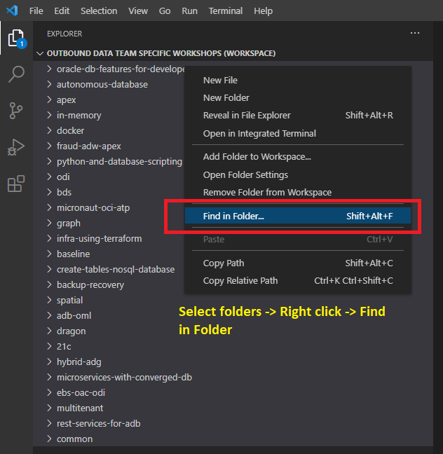
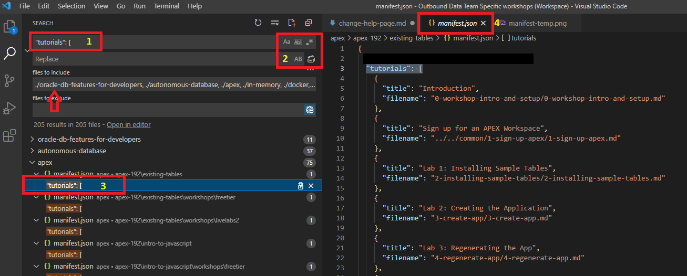
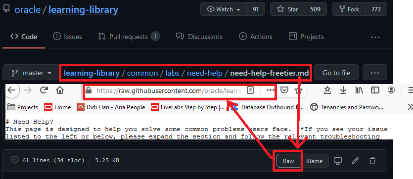
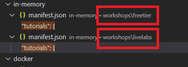
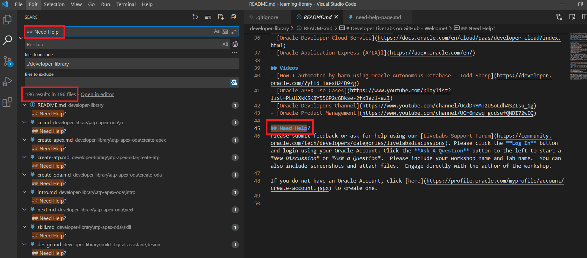
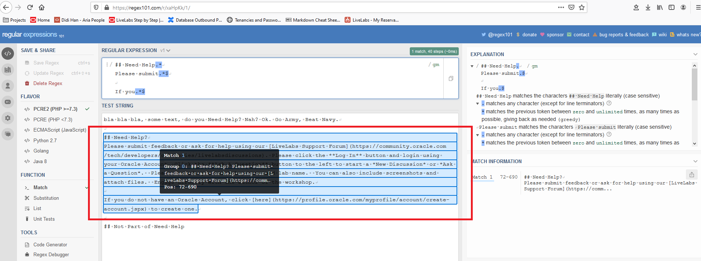
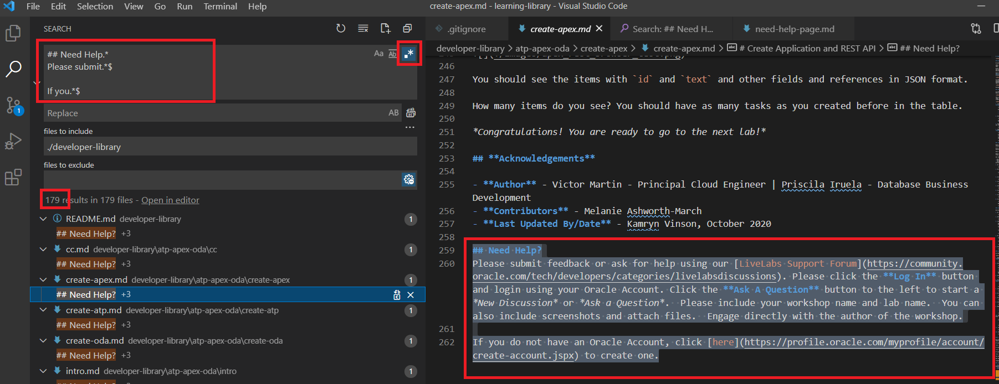

# Changing Over to the Need Help Lab and Button                               

## Introduction

[](youtube:fkKxokdf7I0)

This page will walk you through implementing a common help lab page and help button.


Converting to the help lab pages will allow you to only have to edit 1 or 2 Markdowns to change the help sections for all your workshops. 

Implementing the help button will allow users to quickly construct an email pre-filled to direct toward the given address, as well as a pre-filled subject line that describes the workshop they are sending the email from.

## **STEP 1:** Adding a Help Button

[](youtube:grvsGwSkylg)

***NOTE: You will want to do this concurrently with Step 2 to save time!***

This is the result we want. The button bring up a pre-populated email directed toward your support inbox.


1. To do this, just add the following string to the manifest.json file of the workshop. Customize the **email address** to point toward your team's dedicated support inbox. Make sure this address is in all lowercase to save your team from case sensitivity heartbreak in the future.

    ````
        <copy>"help": "support-inbox-address@oracle.com", </copy>
    ````
    

    Insert the line before "tutorials", don't forget the comma afterwards!

2. If you've set up your workspace on VSC to only list workshop your team is responsible for, you can do a simple "search in folder" to easily access a list of all manifests in your workshops!
    
    

3. Box 1: type in "tutorials": [, which every workshop manifest has in order to display the array of labs, you can get a list of all the instances it found. Which happens to be 1 in every manifest file.
    
    ````
        <copy>"tutorials": [ </copy>
    ````
    

4. Box 2: has options for search strictness, regular expressions, and replace all. We'll be using regex later on to help delete the old "Need Help?" sections.

5. Box 3: click on each result will bring up the corresponding file (Box 4) for easy editing! Don't forget to save and double check your work!
    
6. If you want to, you can use replace all to quickly and easily add your email support button string from #1. To do so, just add that string followed by the "tutorial": [ that you were searching for. 

    ````
        <copy>"help": "support-inbox-address@oracle.com",
        "tutorials": [ </copy>
    ````

7. If you used replace all, I'd recommend you run another search with a loose top parameter to see if someone accidentally added two instances of the help button. Another team could have updated the manifest, you never know. 

    ````
        <copy>@oracle.com",
        "help": "support-inbox-address@oracle.com",</copy>
    ````


## **STEP 2:** Add Your "Need Help?" Lab Page to Every Workshop Using an Absolute Path 

[](youtube:YXXzJmYBs1g)

***NOTE: This assumes you have already created a Markdown file your team has decided to use to add to every one of your team's workshops. This file, or multiple files if your team decides to create different files for "freetier" and "livelabs", needs to be merged to Oracle's learning library in order to get the absolute path to add to each manifest (unless you want the path to point to another repository). Navigate to this page on github and click raw to get the url for your absolute path.***




This is the result we want, to add a help tab on the left side situated with the labs.


The database team's help pages can be found below. We recommend you have seperate pages for "freetier" and "livelabs" to provide more focused support.

[Database Need Help github Pages](https://github.com/oracle/learning-library/tree/master/common/labs/need-help)


1. To add your help page, we just need to add another entry to the "tutorials" lab array in the manifest.json files. We recommend inserting it at the end so that your help page is the last lab entry. Your "filename" link should point toward the link of your team's help pages. Don't forgot to change the link depending on the manifest location to their respective "freetier" or "livelabs" help pages if applicable. 

    

***TIP: Follow #2-5 in the previous step! Doing this concurrently with Step 1 will save some time. Don't forget your can check the filepath of the manifest file in the consolidated search results.***



## **STEP 3:** Deleting Instances of the Old "Need Help?" Sections in Every Markdown

[](youtube:_N3CHyrJxMk)

This sounds like an arduous task, but we can simplify it a lot by using the "search in folder" function mentioned in previous steps in conjunction with regular expressions and replace all!

***NOTE: It's ALWAYS best to double check your work and commit often so you can revert changes that don't work without losing all your work. Replace all is a dangerous function and could wind up causing you to work harder if you're not careful.  If your team doesn't have too many instances to delete, it may be easier to replace them manually. Sometimes the juice is just not worth the squeeze.***

1. You should first and foremost find out how many instance you are trying to delete. We can get this number by searching for **"## Need Help"**. You should **write down this number** and make sure you've reached it by the end of your replacements or it's a clear indication that something went wrong. In this example, we found ***196*** occurrences. If your team uses some other header for your help section, use your own variations.

    ````
        <copy>## Need Help</copy>
    ````

    

2. From here, your approach can vary. I recommend copying an example of text you want to replace to a regex resource like regex101.com to capture as broad of a search criteria as possible WITHOUT over or under matching.

    

3. Copy your newly created regex string and paste it in the search bar. As you can see, this search criteria only captured ***179 of the 196*** total instances of the need help section.  Before you hit that replace all button, confirm that your regex isn't too broad, so it won't delete any information or labs that might follow after the help section. Also confirm that it's not too narrow, so it won't leave extraneous text behind that will be require even more work to remove. 

    ````
    <copy>## Need Help.*
    Please submit.*$

    If you.*$</copy>
    ````
    


4. If you're confident, then go ahead and replace all to delete the instances. Then search the broad **"## Need Help"** string to start the process over again with a new parameter to regex search for until you've caught all occurrences. 

