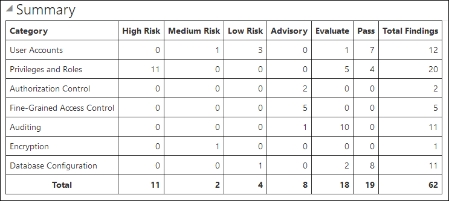
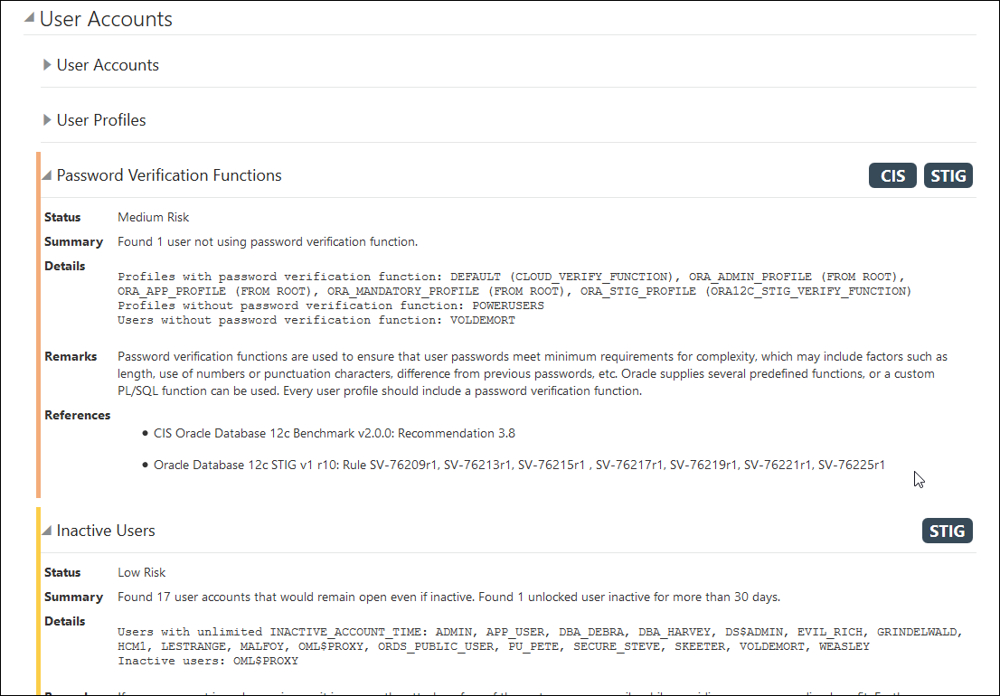
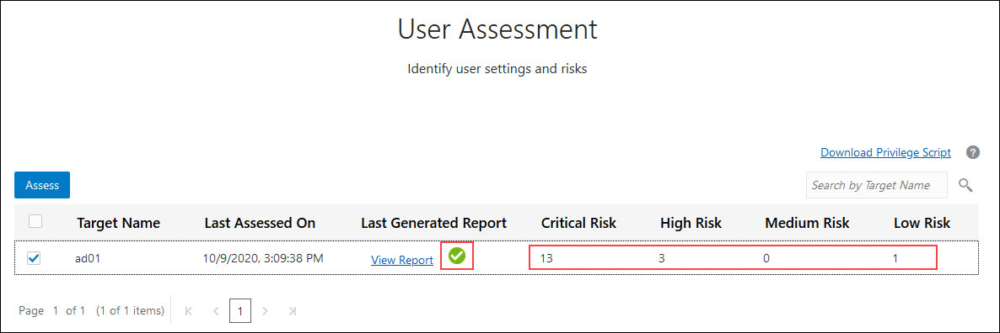
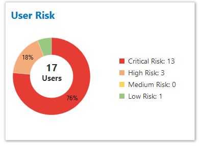
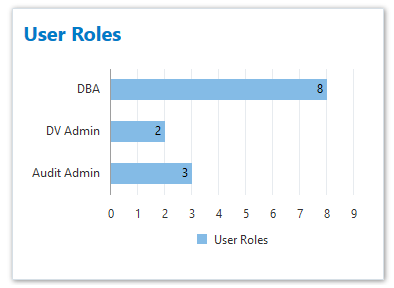
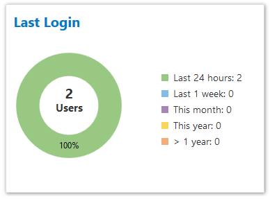
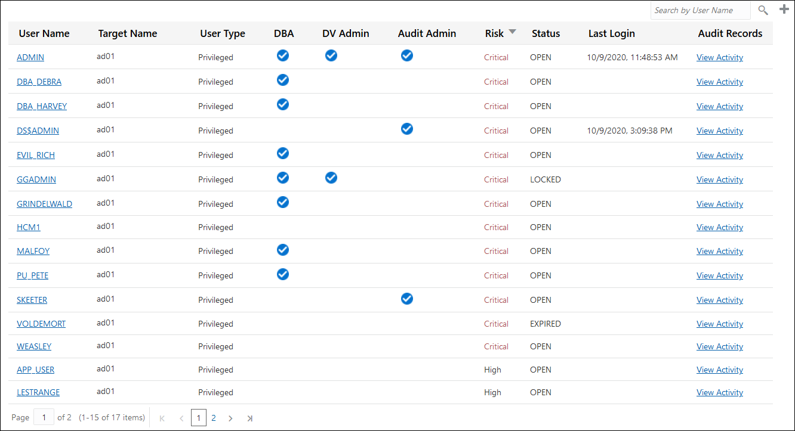
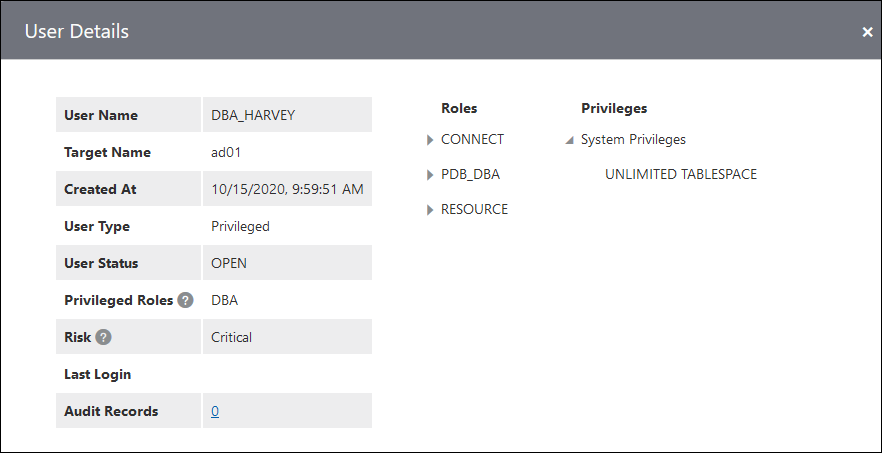
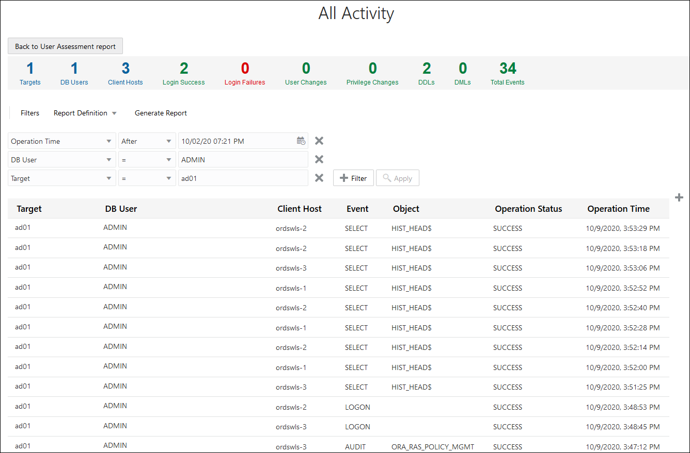

# Assess Database Configurations and Users

## Introduction
This lab shows you how to assess database configurations and users in your Autonomous Database by using the Security Assessment and User Assessment features in Oracle Data Safe.

Estimated Lab Time: 20 minutes

### Objectives

In this lab, you'll:

- Sign in to the Oracle Data Safe Console
- Schedule and run a Security Assessment job against your database
- Analyze the security assessment results
- Run a User Assessment job against your database
- Analyze the user assessment results

### Prerequisites

To complete this lab, you need to have the following:

- An Oracle Cloud account
- Access to an Autonomous Database, sample data for Oracle Data Safe loaded into the database, and the Activity Auditing feature enabled on the database
- Access to an Oracle Data Safe service
- Privileges to use the Activity Auditing feature on your database
- Audit collection started on your target database in Oracle Data Safe.

### Assumptions

- You have a browser tab signed in to the Oracle Cloud Infrastructure Console. If not, please refer to the [Prerequisites](?lab=prerequisites) for this workshop.

- You completed the following labs in this workshop:

    - [Provision and Register and Autonomous Database](?lab=lab-1-provision-register-autonomous)
    - [Provision Audit and Alert Policies](?lab=lab-2-provision-audit-alert-policies)

- Your data values will be different than those shown in the screenshots in this lab.

## **STEP 1**: Sign in to the Oracle Data Safe Console

1. If you are already signed in to the Oracle Data Safe Console, click the **Oracle Data Safe** tab in your browser.

2. If you are not signed in to the Oracle Data Safe Console, do the following:

    a) Click the browser tab named **Oracle Cloud Infrastructure**, and sign in to the Console if needed.

    b) From the navigation menu, select **Data Safe**. The **Overview** page for the Oracle Data Safe service is displayed.

    c) Click **Service Console**. The **Home** tab in the Oracle Data Safe Console is displayed.

## **STEP 2**: Schedule and run a Security Assessment job against your database

You can use Security Assessment to evaluate the current security state of your target databases and receive recommendations on how to mitigate the identified risks.

1. Click the **Home** tab, and then click the **Security Assessment** tab.

2. On the **Security Assessment** page, select the check box for your target database, and then click **Schedule Periodic Assessment**.

  

3. In the **Schedule Assessment** dialog box, configure the schedule for every Sunday at 11:00 PM:

    a) From the **Schedule Type** drop-down list, select **Weekly**.

    b) From the **Every** drop-down list, select **Sunday**.

    c) In the **At** field, click the **Select Time** button. Select **11:00 PM**, and then click **OK**.

    d) Click **Update Schedule**. A confirmation messages states that the scheduled periodic job is successful.

    

4. Deselect the check box for the target database, and select it again.

5. Click **Assess Now**.

6. Wait approximately one minute for the assessment to finish.

7. When the job is finished, review the counts for high risk, medium risk, and low risk findings. The job generates a **Comprehensive Assessment** report.

  

## **STEP 3**: Analyze the security assessment results

1. To view the **Comprehensive Assessment** report, in the **Last Generated Report** column, click **View Report**. The **Comprehensive Assessment** report is displayed.

  At the top of the report, you can view the following:

    - Target database name, when the database was assessed, and the database version
    - The total number of findings per risk level (**High Risk**, **Medium Risk**, **Low Risk**, **Advisory**, **Evaluate**, and **Pass**). These totals give you an idea of how secure your database is. The risk levels are color coded to make them easier to identify.
    - The total number of findings for **Security Controls**, **User Security**, and **Security Configurations**. These are high level categories in the report.

  

2. Expand the **Summary** category (if needed).

    - Here you can view a table that compares the number of findings for each category in the report, and counts the number of findings per risk level. These values help you to identify areas that need attention.

    

3. Expand **User Accounts** to view the list of findings that pertain to user accounts.

4. Expand the subcategories and review the findings.

    - You can find more information on the identified risk and how to mitigate it in the **Details** and **Remarks** sections of each risk.
    - On the right, indicators show whether a finding is recommended by the Center for Internet Security (**CIS**), European Union's General Data Protection Regulation (**GDPR**), and/or Security Technical Implementation Guide (**STIG**). These indications make it easy for you to identify the recommended security controls.

    

5. Collapse **User Accounts** and expand **Privileges and Roles**. Review the list of findings.

6. Scroll down and expand other categories. Each category lists related findings about your database and how you can make changes to improve its security.

7. To filter the findings by risk level, scroll to the top of the report, and click a risk level.

    - Each filter is a toggle. For example, if you click **Medium Risk**, only medium risk findings are displayed in the report. If you click **Medium Risk** again, the filter is removed.

## **STEP 4**: Run a User Assessment job against a target database

You can use the User Assessment feature to identify user settings and user risks on your target databases.

1. Click the **Home** tab, and then click the **User Assessment** tab.

2. On the **User Assessment** page, select the check box for your target database, and then click **Assess**.

  

3. Wait a moment for the assessment to finish. The assessment takes approximately 10 seconds.

## **STEP 5**: Analyze the user assessment results

1. When the user assessment is completed, observe the following on the **User Assessment** page:
    - A green check mark is displayed in the **Last Generated Report** column.

    - The page is updated to show the number of **Critical Risk**, **High Risk**, **Medium Risk**, and **Low Risk** users.

    

2. In the **Last Generated Report** column, click **View Report**. The **Users** page is displayed.

3. Review the four charts. You can click the small circles below the charts to navigate between the charts.

    - The **User Risk** chart shows you the number and percentage of users who are **Critical Risk**, **High Risk**, **Medium Risk**, and **Low Risk**.

    

    - The **User Roles** chart shows you the number of users with the **DBA**, **DV Admin**, and **Audit Admin** roles.

    

    - The **Last Password Change** chart shows you the number and percentage of users who changed their passwords within the last 30 days, within the last 30-90 days, and 90 days ago or more.

    

    - The **Last Login** chart shows you the number and percentage of users that signed in to the database within the last 24 hours, within the last week, within the current month, within the current year, and a year ago or more.

    

4. Review the table below the charts. This table lets you quickly identify critical and high risk users, such as DBAs, DV Admins, and Audit Admins.

  

5. To view details for a user, click any user's name. The **User Details** dialog box shows you the following information:

    - The date and time the user was created
    - The user type (for example, Privileged)
    - The user status (for example, OPEN)
    - The privileged roles for the user (for example, DBA, DV Admin, Audit Admin)
    - The risk level for the user (for example, Critical)
    - The last date and time the user logged in to the target database
    - The number of audit records collected for the user
    - The roles and privileges granted to the user

    You can position your cursor over the question marks next to **Privileged Roles** and **Risk** to view more details about the values for these fields. The following screenshot shows you details for the `DBA_HARVEY` user.
    

6. To view audit records for the `admin` user, do the following:

    - Identify the row for the `ADMIN` user.

    - Scroll to the right.

    - In the **Audit Records** column for the `ADMIN` user, click **View Activity**.

  

7. Examine the **All Activity** report for the `ADMIN` user. This report is automatically filtered to show you the audit records for the past week, for the `ADMIN` user, and for your target database.

  

8. At the top of the report, view the totals for **Targets**, **DB Users**, **Client Hosts**, **Login Success**, **Login Failures**, **User Changes**, **Privilege Changes**, **DDLs**, **DMLs**, and **Total Events**.

9. View the **Event** column in the table. It shows you the types of activities performed, for example, LOGON, AUDIT, CREATE AUDIT POLICY, and so on.

10. At the bottom of the page, click the page numbers to view more audit records.

11. At the top of the report, click **Back to User Assessment report**.

12. Identify an expired user, and then click **View Activity** for that user to view the user's audit records. The following example shows `VOLDEMORT` as expired.

  

13. If the user has no activity on the target database, there are no audit records displayed in the **All Activity** report. In this case, you might consider removing the user from the target database.

You may now proceed to the next lab.

## Learn More

* [User Assessment Overview](https://docs.cloud.oracle.com/en-us/iaas/data-safe/doc/user-assessment-overview.html)
* [Security Assessment Overview](https://docs.cloud.oracle.com/en-us/iaas/data-safe/doc/security-assessment-overview.html)

## Acknowledgements
* **Author** - Jody Glover, Principal User Assistance Developer, Database Development
* **Last Updated By/Date** - Jody Glover, December 14, 2020

## Need Help?
Please submit feedback or ask for help using our [Data Safe Community Support Forum]( https://community.oracle.com/tech/developers/categories/data-safe). Please click the **Log In** button and login using your Oracle Account. Click the **Ask A Question** button to the left to start a *New Discussion* or *Ask a Question*.  Please include your workshop name and lab name.  You can also include screenshots and attach files.  Engage directly with the author of the workshop.

If you do not have an Oracle Account, click [here](https://profile.oracle.com/myprofile/account/create-account.jspx) to create one.
