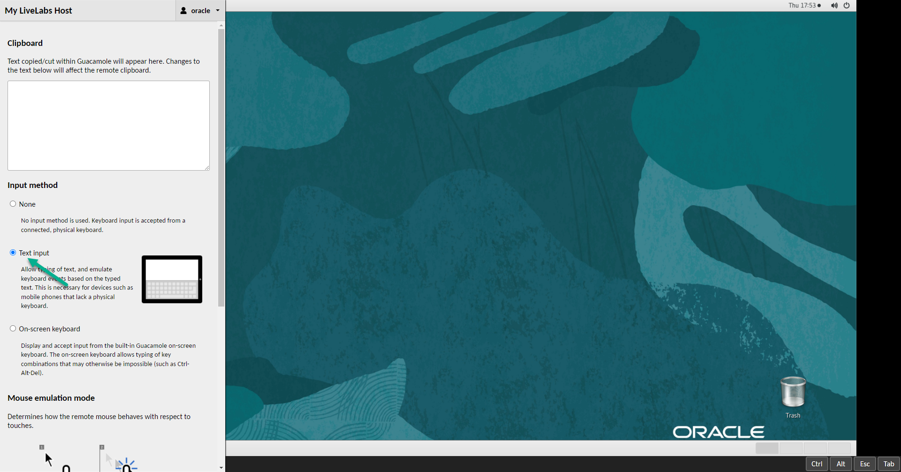
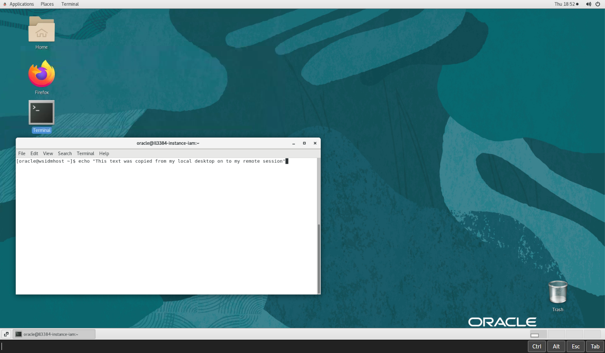

# Initialize the Environment

## Introduction

In this lab we will review and setup all components required to successfully upgrade IAM 11.1.2.3 to 12.2.1.4 version.  

*Estimated Lab Time*:  30 minutes

### Objectives
- Initialize the IAM 11.1.2.3 baseline workshop environment.

### Prerequisites
This lab assumes you have:
- A Paid or LiveLabs Oracle Cloud account
- SSH Private Key to access the host via SSH
- You have completed:
    - Lab: Generate SSH Keys (*Free-tier* and *Paid Tenants* only)
    - Lab: Prepare Setup (*Free-tier* and *Paid Tenants* only)
    - Lab: Environment Setup

## **STEP 1:** Access the Graphical Remote Desktop (Preferred)
For ease of execution of this workshop, your instance has been pre-configured for remote graphical desktop accessible using any modern browser on your laptop or workstation. Proceed as detailed below to login.

1. Launch your browser to the following URL

    ```
    <copy>http://[your instance public-ip address]:8080/guacamole</copy>
    ```

2. Provide login credentials

    ```
    Username: <copy>oracle</copy>
    ```
    ```
    Password: <copy>Guac.LiveLabs_</copy>
    ```

    

    *Note*: There is an underscore `_` character at the end of the password.

3. To launch *Firefox* browser or a *Terminal* client, click on respective icon on the desktop

    

## **STEP 2:**  Enable Copy/Paste from local to remote desktop (Guacamole clipboard)
During the execution of your labs you may need to copy text from your local PC/Mac to the Guacamole remote desktop, such as commands from the lab guide. While such direct copy/paste isn't supported as you will realize, you may proceed as indicated below to enable an alternative local-to-remote clipboard with Input Text Field.

1. From your remote desktop session, enter CTRL+ALT+SHIFT (*Windows*) or CTRL+CMD+SHIT (*Mac*)

2. Select *Text Input*

    

3. Notice the black Text Input field added at the bottom of your screen after you made the selection in the previous step. This is the field to paste any text copied from your local environment.

    

4. Test copy/pasting the text below. Prior to pasting ensure that the cursor has been placed at the location where the intended text is to be pasted, then right-click inside the black *Text Input* field and paste it

    ```
    <copy>echo "This text was copied from my local desktop on to my remote session"</copy>
    ```

    

## **STEP 3:** Open Workshop Guide from the Remote Desktop
LiveLabs workshop guides make an extensive use of *Click-to-Copy* function, providing convenient and effective way to quickly copy a predefined text or block of text without the need to first highlight it. This also help avoid mistakes that may occur when doing it manually such as copying extra or fewer characters than intended.

As a result, launching your workshop guide from the remote desktop will further enhance your experience. It will greatly help speed up your labs execution by removing the need to constantly switch between the guide from your local computer and the remote desktop, and minimize the need for the 3-steps *copy/paste/paste* described in *STEP 2* above.

1. From your remote desktop session, launch *Firefox*, browse to *LiveLabs* if not already opened, then click on *Sign In*

    ```
    <copy>http://bit.ly/golivelabs</copy>
    ```

    

2. Provide your login credentials and click on *Sign In*

    

3. Click on *My Reservations*

    

4. Click on *Launch Workshop*

    

5. Click on *-* next to *Workshop Details* and *Let's Get Started* to collapse

    

6. Click on *Open the workshop instructions in a new tab*

    

    

## **STEP 4:** Start Oracle IAM 11.1.2.3 Components

1.  From any of the terminal session started above, proceed as shown below to start all components as “*oracle*” user

    ```
    <copy>/u01/app/oracle/config/scripts/startall.sh</copy>
    ```

    

    ***Note:*** This will take between 20-30 minutes.

2. Launch *Firefox* from the remote desktop session and test the base installation by accessing the Identity Manager Admin Console:

    ```
    URL: <copy>http://wsidmhost.idm.oracle.com:7778/oim</copy>
    ```

    ```
    User: <copy>xelsysadm</copy>
    ```

    ```
    Password: <copy>IAMUpgrade12c##</copy>
    ```

    

    ***Note:*** Important URLs needed throughout the workshop have been bookmarked as you can see above under 3 groups. Documentation, Identity, and Access.

    
    

3. If for any reason you need to restart all processes you can use one of the following options:

    - Reboot the instance as user *opc* from the SSH terminal session you started using the SSH key (not the remote desktop session).

    ```
    <copy>sudo init 6</copy>
    ```

    - Restart processes

    ```
    <copy>/u01/app/oracle/config/scripts/stopall.sh</copy>
    ```
    ```
    <copy>systemctl restart oracle-database</copy>
    ```
    ```
    <copy>/u01/app/oracle/config/scripts/startall.sh</copy>
    ```

## **STEP 5:** Login to Host using SSH Key based authentication (Optional)
While all command line tasks included in this workshop can be performed from a terminal session from the remote desktop session as shown above, you can optionally use your preferred SSH client.

Refer to *Lab Environment Setup* for detailed instructions relevant to your SSH client type (e.g. Putty on Windows or Native such as terminal on Mac OS):
  - Authentication OS User - “*opc*”
  - Authentication method - *SSH RSA Key*
  - OS User – “*oracle*”.

1. First login as “*opc*” using your SSH Private Key

2. Then sudo to “*oracle*”. E.g.

    ```
    <copy>sudo su - oracle</copy>
    ```

You may now [proceed to the next lab](#next).

## Learn More
Use these links to get more information about Oracle Identity and Access Management:
- [Oracle Identity Management 12.2.1.4.0](https://docs.oracle.com/en/middleware/idm/suite/12.2.1.4/index.html).  

## Acknowledgements
* **Author** - Anbu Anbarasu, Director, Cloud Platform COE  
* **Contributors** -  Eric Pollard - Sustaining Engineering, Ajith Puthan - IAM Support, Rene Fontcha
* **Last Updated By/Date** - Rene Fontcha, LiveLabs Platform Lead, NA Technology, May 2021
